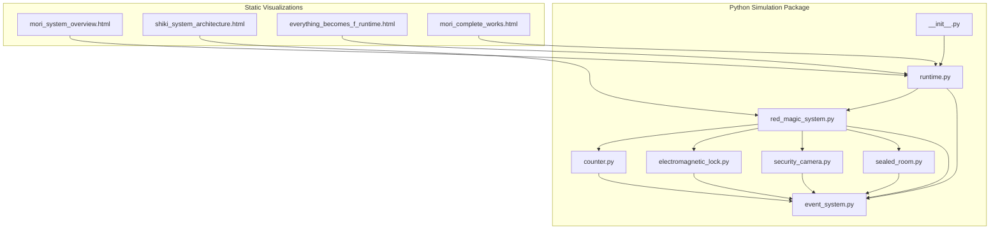
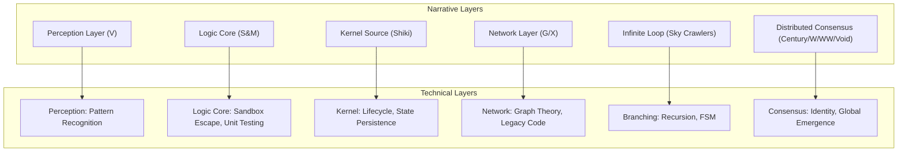
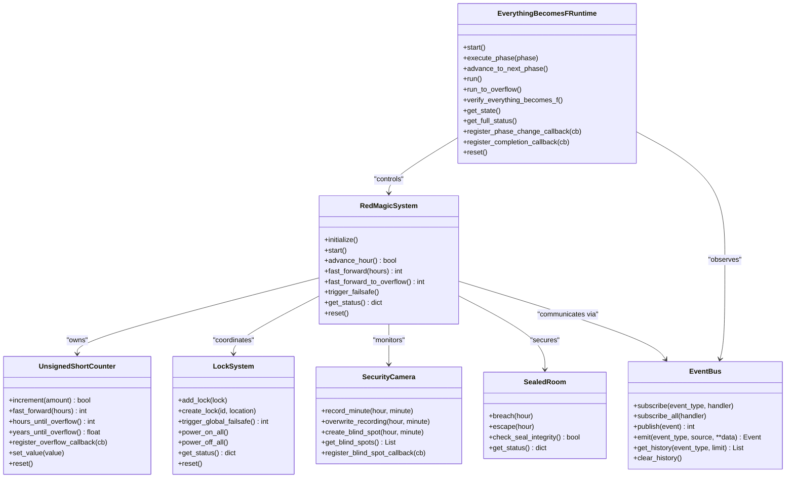
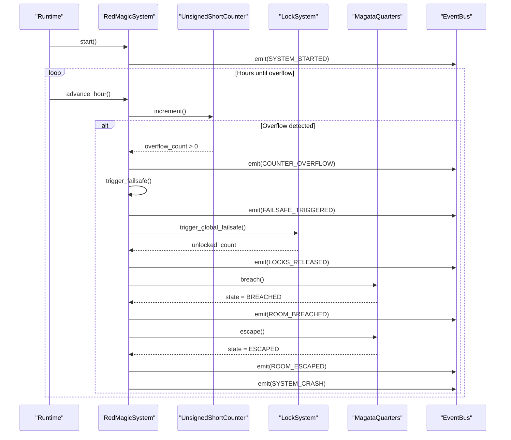
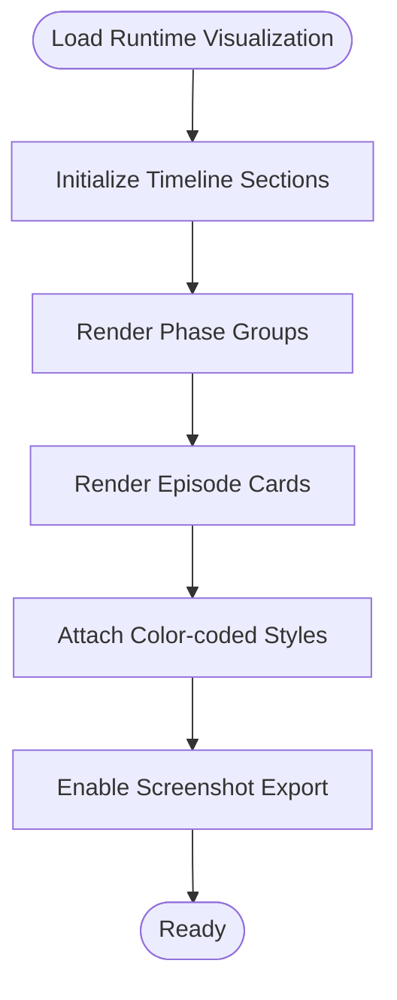
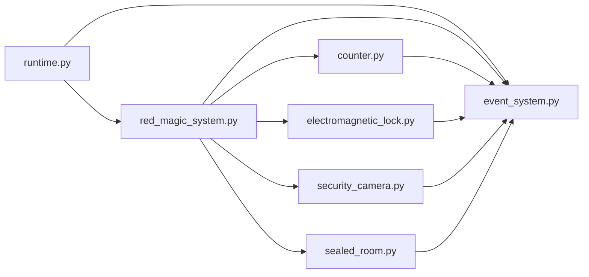

# Advanced Topics

<cite>
**Referenced Files in This Document**
- [mori_system_overview.html](file://mori_system_overview.html)
- [shiki_system_architecture.html](file://shiki/shiki_system_architecture.html)
- [everything_becomes_f_runtime.html](file://shiki/everything_becomes_f_runtime.html)
- [mori_complete_works.html](file://shiki/mori_complete_works.html)
- [__init__.py](file://everything_becomes_f/__init__.py)
- [runtime.py](file://everything_becomes_f/runtime.py)
- [red_magic_system.py](file://everything_becomes_f/red_magic_system.py)
- [counter.py](file://everything_becomes_f/counter.py)
- [electromagnetic_lock.py](file://everything_becomes_f/electromagnetic_lock.py)
- [security_camera.py](file://everything_becomes_f/security_camera.py)
- [sealed_room.py](file://everything_becomes_f/sealed_room.py)
- [event_system.py](file://everything_becomes_f/event_system.py)
</cite>

## Table of Contents
1. [Introduction](#introduction)
2. [Project Structure](#project-structure)
3. [Core Components](#core-components)
4. [Architecture Overview](#architecture-overview)
5. [Detailed Component Analysis](#detailed-component-analysis)
6. [Dependency Analysis](#dependency-analysis)
7. [Performance Considerations](#performance-considerations)
8. [Troubleshooting Guide](#troubleshooting-guide)
9. [Conclusion](#conclusion)
10. [Appendices](#appendices)

## Introduction
This document presents advanced topics for the Mori-universe project, focusing on the interdisciplinary synthesis of literary themes and computer science principles. It documents the cross-disciplinary methodology that maps narrative arcs to computational systems, and demonstrates how the runtime visualization and simulation components realize the “Everything Becomes F” escape mechanism. The guide targets researchers seeking conceptual frameworks and developers requiring technical depth, with consistent terminology spanning systems thinking, literary analysis, and cross-referencing methodologies.

## Project Structure
The Mori-universe project combines:
- Static HTML visualizations that map series and novels to system architecture and runtime phases
- A Python simulation package modeling the Red Magic security system, overflow-triggered escape, and event-driven orchestration
- Cross-references across series, books, and runtime phases to enable multi-perspective analysis

**Diagram sources**
- [mori_system_overview.html](file://mori_system_overview.html)
- [shiki_system_architecture.html](file://shiki/shiki_system_architecture.html)
- [everything_becomes_f_runtime.html](file://shiki/everything_becomes_f_runtime.html)
- [mori_complete_works.html](file://shiki/mori_complete_works.html)
- [__init__.py](file://everything_becomes_f/__init__.py)
- [runtime.py](file://everything_becomes_f/runtime.py)
- [red_magic_system.py](file://everything_becomes_f/red_magic_system.py)
- [counter.py](file://everything_becomes_f/counter.py)
- [electromagnetic_lock.py](file://everything_becomes_f/electromagnetic_lock.py)
- [security_camera.py](file://everything_becomes_f/security_camera.py)
- [sealed_room.py](file://everything_becomes_f/sealed_room.py)
- [event_system.py](file://everything_becomes_f/event_system.py)

**Section sources**
- [mori_system_overview.html](file://mori_system_overview.html)
- [shiki_system_architecture.html](file://shiki/shiki_system_architecture.html)
- [everything_becomes_f_runtime.html](file://shiki/everything_becomes_f_runtime.html)
- [mori_complete_works.html](file://shiki/mori_complete_works.html)
- [__init__.py](file://everything_becomes_f/__init__.py)

## Core Components
- System architecture mapping: The static pages map literary series and novels to system layers (perception, logic core, kernel, networking, branching, distributed consensus) and philosophical themes.
- Runtime simulation: The Python package models the Red Magic system, overflow-triggered failsafe, and event-driven orchestration.
- Visualization and navigation: Static HTML pages provide tabbed views, timelines, and screenshot export for runtime visualization.

Key implementation highlights:
- Phase enumeration and metadata connect novels’ color-named episodes to system lifecycle stages.
- Event bus decouples components and enables chain reactions mirroring narrative progression.
- Overflow detection and fast-forward mechanics simulate the 15-year confinement and escape.

**Section sources**
- [runtime.py](file://everything_becomes_f/runtime.py)
- [red_magic_system.py](file://everything_becomes_f/red_magic_system.py)
- [event_system.py](file://everything_becomes_f/event_system.py)
- [counter.py](file://everything_becomes_f/counter.py)
- [mori_system_overview.html](file://mori_system_overview.html)
- [shiki_system_architecture.html](file://shiki/shiki_system_architecture.html)
- [everything_becomes_f_runtime.html](file://shiki/everything_becomes_f_runtime.html)

## Architecture Overview
The system architecture blends narrative and technical layers:

**Diagram sources**
- [mori_system_overview.html](file://mori_system_overview.html)
- [shiki_system_architecture.html](file://shiki/shiki_system_architecture.html)

## Detailed Component Analysis

### Runtime Engine and Simulation
The runtime engine orchestrates phase-by-phase execution, fast-forwarding, and verification of the “Everything Becomes F” condition.

**Diagram sources**
- [runtime.py](file://everything_becomes_f/runtime.py)
- [red_magic_system.py](file://everything_becomes_f/red_magic_system.py)
- [counter.py](file://everything_becomes_f/counter.py)
- [electromagnetic_lock.py](file://everything_becomes_f/electromagnetic_lock.py)
- [security_camera.py](file://everything_becomes_f/security_camera.py)
- [sealed_room.py](file://everything_becomes_f/sealed_room.py)
- [event_system.py](file://everything_becomes_f/event_system.py)

**Section sources**
- [runtime.py](file://everything_becomes_f/runtime.py)
- [red_magic_system.py](file://everything_becomes_f/red_magic_system.py)
- [counter.py](file://everything_becomes_f/counter.py)
- [event_system.py](file://everything_becomes_f/event_system.py)

### Phase Mapping and Narrative-to-System Alignment
The runtime maps novels’ episodes to system phases, enabling a structured analysis of progression and thematic alignment.

**Diagram sources**
- [runtime.py](file://everything_becomes_f/runtime.py)
- [red_magic_system.py](file://everything_becomes_f/red_magic_system.py)
- [counter.py](file://everything_becomes_f/counter.py)
- [electromagnetic_lock.py](file://everything_becomes_f/electromagnetic_lock.py)
- [sealed_room.py](file://everything_becomes_f/sealed_room.py)
- [event_system.py](file://everything_becomes_f/event_system.py)

**Section sources**
- [runtime.py](file://everything_becomes_f/runtime.py)
- [red_magic_system.py](file://everything_becomes_f/red_magic_system.py)
- [counter.py](file://everything_becomes_f/counter.py)
- [event_system.py](file://everything_becomes_f/event_system.py)

### Runtime Visualization and Navigation
The runtime visualization page presents a timeline of episodes mapped to system phases, with color-coded stages and interactive screenshots.

**Diagram sources**
- [everything_becomes_f_runtime.html](file://shiki/everything_becomes_f_runtime.html)

**Section sources**
- [everything_becomes_f_runtime.html](file://shiki/everything_becomes_f_runtime.html)

### Cross-Disciplinary Analysis Methodology
- Literary-to-technical mapping: Each series and novel is aligned to a system layer and core concept (e.g., S&M to sandbox escape and unit testing).
- Philosophical themes as system axioms: Themes like observer effect, identity consensus, and immortality paradox inform system design assumptions.
- Narrative-driven phases: The runtime phases mirror the story’s progression, enabling “what-if” simulations and “what-if not” analyses.

**Section sources**
- [mori_system_overview.html](file://mori_system_overview.html)
- [shiki_system_architecture.html](file://shiki/shiki_system_architecture.html)

## Dependency Analysis
The simulation package exhibits layered dependencies with clear separation of concerns:

**Diagram sources**
- [runtime.py](file://everything_becomes_f/runtime.py)
- [red_magic_system.py](file://everything_becomes_f/red_magic_system.py)
- [counter.py](file://everything_becomes_f/counter.py)
- [electromagnetic_lock.py](file://everything_becomes_f/electromagnetic_lock.py)
- [security_camera.py](file://everything_becomes_f/security_camera.py)
- [sealed_room.py](file://everything_becomes_f/sealed_room.py)
- [event_system.py](file://everything_becomes_f/event_system.py)

**Section sources**
- [__init__.py](file://everything_becomes_f/__init__.py)
- [runtime.py](file://everything_becomes_f/runtime.py)
- [red_magic_system.py](file://everything_becomes_f/red_magic_system.py)

## Performance Considerations
- Fast-forward arithmetic: The counter supports O(1) fast-forward via division/modulo, avoiding iterative increments for long durations.
- Event bus history limits: Event history is bounded to manage memory footprint during extended simulations.
- Modular subsystems: Separate components reduce coupling and enable targeted performance tuning.

[No sources needed since this section provides general guidance]

## Troubleshooting Guide
Common issues and remedies:
- Overflow not triggering: Verify counter overflow callback registration and that the system is in RUNNING state before advancing.
- Failsafe not releasing locks: Confirm the overflow event propagated and that the lock system’s global failsafe was invoked.
- Blind spot not created: Ensure the clock synchronization vulnerability is set up and exploited during reinstallation.
- Escape not recorded: Check room breach and escape transitions and confirm event emissions for ROOM_BREACHED and ROOM_ESCAPED.

Verification utilities:
- Runtime verification: Use the built-in verification routine to assert overflow, system state, and escape conditions.
- Status inspection: Retrieve comprehensive status for runtime, system, and room states.

**Section sources**
- [red_magic_system.py](file://everything_becomes_f/red_magic_system.py)
- [counter.py](file://everything_becomes_f/counter.py)
- [electromagnetic_lock.py](file://everything_becomes_f/electromagnetic_lock.py)
- [security_camera.py](file://everything_becomes_f/security_camera.py)
- [sealed_room.py](file://everything_becomes_f/sealed_room.py)
- [event_system.py](file://everything_becomes_f/event_system.py)
- [runtime.py](file://everything_becomes_f/runtime.py)

## Conclusion
The Mori-universe project demonstrates a sophisticated fusion of literary narrative and computational systems. Through precise mapping of themes to technical concepts, robust event-driven orchestration, and immersive runtime visualization, it enables both scholarly cross-disciplinary analysis and developer-driven systems thinking. The modular simulation package provides extensibility for new series content, enhanced visualization components, and advanced cross-referencing capabilities.

[No sources needed since this section summarizes without analyzing specific files]

## Appendices

### Practical Examples and Expert Patterns
- Extending the cross-reference system: Add new series and novels to the works collection and map them to existing system layers and concepts.
- Customizing visualization components: Introduce new phase groups or episode cards in the runtime visualization, ensuring color coding and metadata parity.
- Integrating new series content: Incorporate new novels by extending phase definitions, adding new subsystems if needed, and wiring event handlers to maintain narrative-to-system fidelity.

**Section sources**
- [mori_complete_works.html](file://shiki/mori_complete_works.html)
- [everything_becomes_f_runtime.html](file://shiki/everything_becomes_f_runtime.html)
- [runtime.py](file://everything_becomes_f/runtime.py)