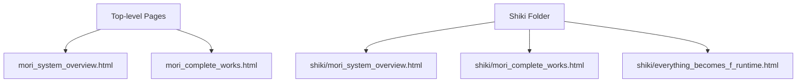
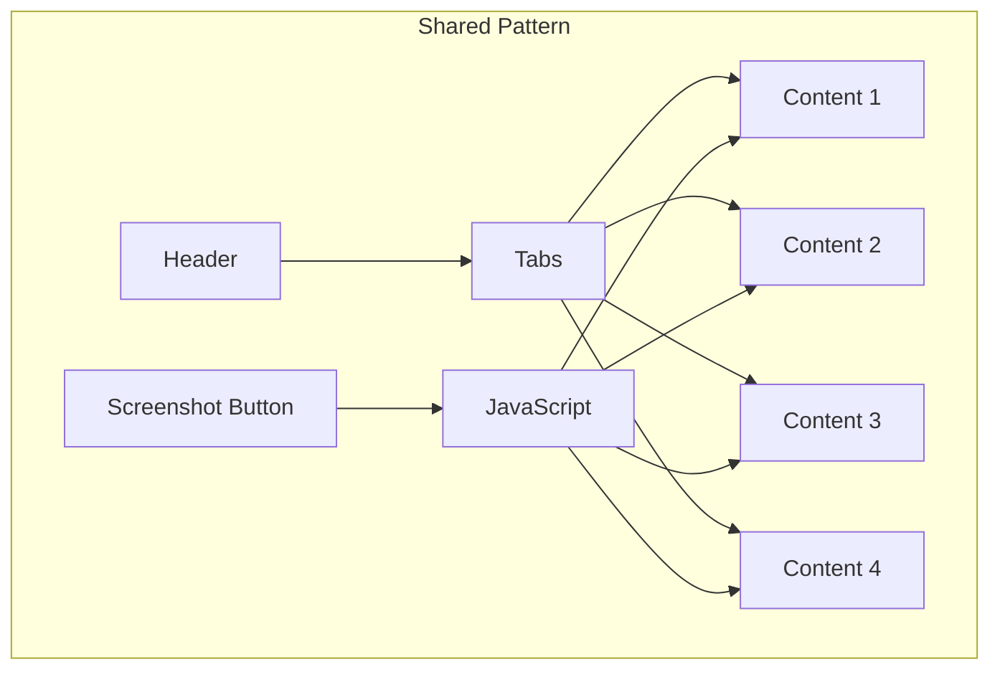
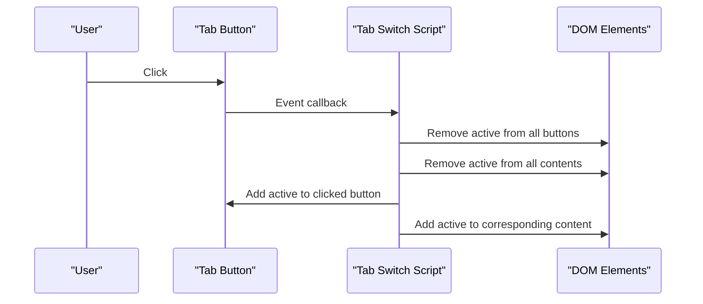
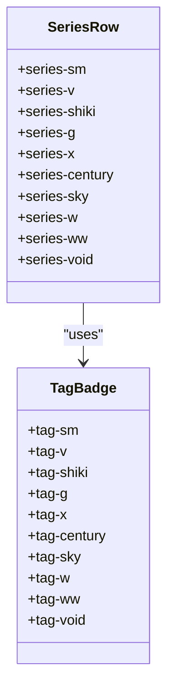
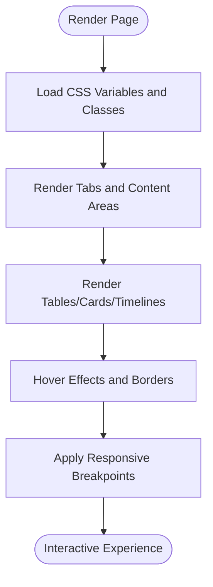
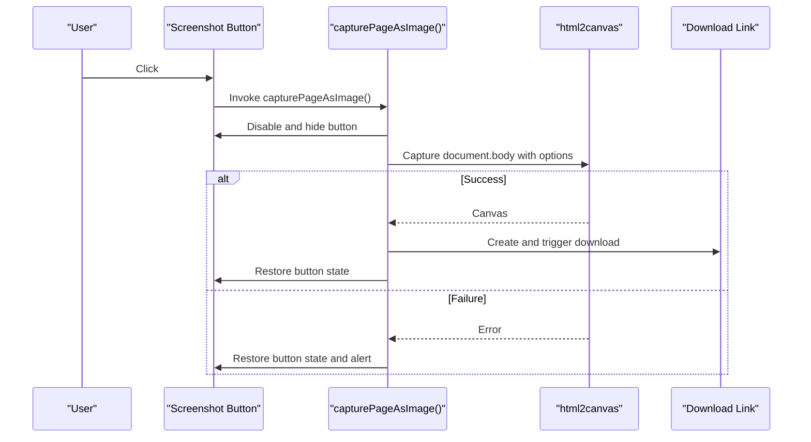
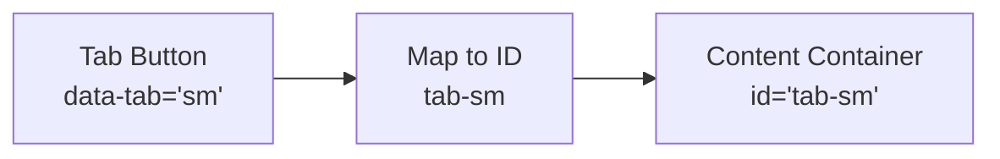
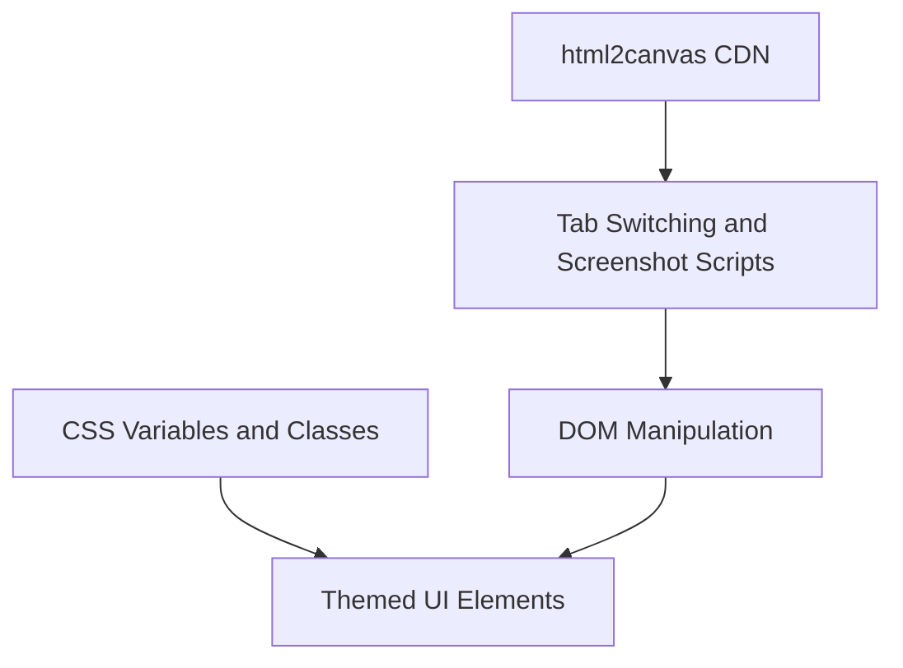

# Core Features and Functionality

<cite>
**Referenced Files in This Document**
- [mori_system_overview.html](file://mori_system_overview.html)
- [mori_complete_works.html](file://mori_complete_works.html)
- [shiki/mori_system_overview.html](file://shiki/mori_system_overview.html)
- [shiki/mori_complete_works.html](file://shiki/mori_complete_works.html)
- [shiki/everything_becomes_f_runtime.html](file://shiki/everything_becomes_f_runtime.html)
</cite>

## Table of Contents
1. [Introduction](#introduction)
2. [Project Structure](#project-structure)
3. [Core Components](#core-components)
4. [Architecture Overview](#architecture-overview)
5. [Detailed Component Analysis](#detailed-component-analysis)
6. [Dependency Analysis](#dependency-analysis)
7. [Performance Considerations](#performance-considerations)
8. [Troubleshooting Guide](#troubleshooting-guide)
9. [Conclusion](#conclusion)
10. [Appendices](#appendices)

## Introduction
This document explains the core interactive features of the Mori-universe project, focusing on:
- Tabbed navigation systems across pages
- Color-coded series identification and categorization
- Interactive visualization components (tables, cards, timelines)
- Cross-referencing between overview and series-specific content
- Screenshot functionality powered by html2canvas
- Theming via CSS variables and responsive breakpoints
- Event handling and JavaScript behavior for tab switching and screenshots

The goal is to make the implementation approachable for beginners while offering deep technical insights for advanced developers.

## Project Structure
The project consists of multiple HTML pages organized under a top-level directory and a subfolder for alternate layouts. Each page implements a self-contained interactive experience with tabbed navigation, themed visuals, and screenshot capability.

**Diagram sources**
- [mori_system_overview.html:1-702](file://mori_system_overview.html#L1-L702)
- [mori_complete_works.html:1-723](file://mori_complete_works.html#L1-L723)
- [shiki/mori_system_overview.html:1-702](file://shiki/mori_system_overview.html#L1-L702)
- [shiki/mori_complete_works.html:1-723](file://shiki/mori_complete_works.html#L1-L723)
- [shiki/everything_becomes_f_runtime.html:1-587](file://shiki/everything_becomes_f_runtime.html#L1-L587)

**Section sources**
- [mori_system_overview.html:1-702](file://mori_system_overview.html#L1-L702)
- [mori_complete_works.html:1-723](file://mori_complete_works.html#L1-L723)
- [shiki/mori_system_overview.html:1-702](file://shiki/mori_system_overview.html#L1-L702)
- [shiki/mori_complete_works.html:1-723](file://shiki/mori_complete_works.html#L1-L723)
- [shiki/everything_becomes_f_runtime.html:1-587](file://shiki/everything_becomes_f_runtime.html#L1-L587)

## Core Components
- Tabbed navigation: Pure JavaScript-driven tab switching with CSS active states and content visibility toggles.
- Color-coded series identification: CSS classes and variables define per-series colors and badges for consistent theming.
- Interactive visualization components: Data tables, phase cards, and timeline episodes with hover effects and responsive layouts.
- Screenshot functionality: Uses html2canvas to capture the current page as an image with configurable scale and background.

Key implementation patterns:
- Tab switching uses DOM queries to toggle active classes and reveal target content.
- Series identification relies on CSS classes (e.g., series-sm, series-v) and corresponding tag styles.
- Screenshot logic updates button state during capture and handles errors gracefully.

**Section sources**
- [mori_system_overview.html:283-288](file://mori_system_overview.html#L283-L288)
- [mori_system_overview.html:660-665](file://mori_system_overview.html#L660-L665)
- [mori_system_overview.html:121-130](file://mori_system_overview.html#L121-L130)
- [mori_system_overview.html:246-274](file://mori_system_overview.html#L246-L274)
- [mori_complete_works.html:350-361](file://mori_complete_works.html#L350-L361)
- [mori_complete_works.html:675-686](file://mori_complete_works.html#L675-L686)
- [mori_complete_works.html:93-113](file://mori_complete_works.html#L93-L113)
- [mori_complete_works.html:311-339](file://mori_complete_works.html#L311-L339)

## Architecture Overview
The pages share a common pattern:
- A header with a title and subtitle
- A tab navigation area
- Tab content areas (tables, cards, or timelines)
- A fixed screenshot button
- Responsive CSS with media queries
- JavaScript for tab switching and screenshot capture

**Diagram sources**
- [mori_system_overview.html:278-288](file://mori_system_overview.html#L278-L288)
- [mori_system_overview.html:659-665](file://mori_system_overview.html#L659-L665)
- [mori_complete_works.html:343-361](file://mori_complete_works.html#L343-L361)
- [mori_complete_works.html:675-686](file://mori_complete_works.html#L675-L686)

## Detailed Component Analysis

### Tabbed Navigation System
Both overview and complete works pages implement tabbed navigation using pure JavaScript. The system:
- Assigns active classes to the clicked tab button and its corresponding content container
- Removes active classes from all tabs and content containers before applying new ones
- Uses dataset attributes to map buttons to content IDs

Implementation highlights:
- Overview page uses inline onclick handlers on tab buttons and a global showTab function.
- Complete works page attaches click listeners to tab buttons and dynamically computes the target content ID.

**Diagram sources**
- [mori_system_overview.html:283-288](file://mori_system_overview.html#L283-L288)
- [mori_system_overview.html:660-665](file://mori_system_overview.html#L660-L665)
- [mori_complete_works.html:350-361](file://mori_complete_works.html#L350-L361)
- [mori_complete_works.html:675-686](file://mori_complete_works.html#L675-L686)

**Section sources**
- [mori_system_overview.html:283-288](file://mori_system_overview.html#L283-L288)
- [mori_system_overview.html:660-665](file://mori_system_overview.html#L660-L665)
- [mori_complete_works.html:350-361](file://mori_complete_works.html#L350-L361)
- [mori_complete_works.html:675-686](file://mori_complete_works.html#L675-L686)

### Color-Coded Series Identification System
Series identity is consistently represented across pages using:
- CSS classes on table rows and cards (e.g., series-sm, series-v, series-shiki)
- Tag badges with distinct background and border colors
- Per-series CSS variables for theme consistency

Examples:
- Overview page defines series classes and tag classes for visual differentiation.
- Complete works page uses data-tab attributes on buttons and corresponding content IDs to link tabs to series content.

**Diagram sources**
- [mori_system_overview.html:121-149](file://mori_system_overview.html#L121-L149)
- [mori_complete_works.html:93-113](file://mori_complete_works.html#L93-L113)

**Section sources**
- [mori_system_overview.html:121-149](file://mori_system_overview.html#L121-L149)
- [mori_complete_works.html:93-113](file://mori_complete_works.html#L93-L113)

### Interactive Visualization Components
- Overview page: A responsive data table with sticky headers, hover effects, and per-series borders.
- Complete works page: Grid of series info cards with metadata and per-series color accents.
- Runtime page: A timeline with phase groups, episode cards, and color-coded episode dots and tags.

**Diagram sources**
- [mori_system_overview.html:84-119](file://mori_system_overview.html#L84-L119)
- [mori_system_overview.html:161-230](file://mori_system_overview.html#L161-L230)
- [mori_complete_works.html:119-243](file://mori_complete_works.html#L119-L243)
- [shiki/everything_becomes_f_runtime.html:102-241](file://shiki/everything_becomes_f_runtime.html#L102-L241)

**Section sources**
- [mori_system_overview.html:84-119](file://mori_system_overview.html#L84-L119)
- [mori_system_overview.html:161-230](file://mori_system_overview.html#L161-L230)
- [mori_complete_works.html:119-243](file://mori_complete_works.html#L119-L243)
- [shiki/everything_becomes_f_runtime.html:102-241](file://shiki/everything_becomes_f_runtime.html#L102-L241)

### Screenshot Functionality
Each page includes a fixed screenshot button that captures the current page as a PNG image using html2canvas. The process:
- Disables the button and temporarily hides it to prevent double-clicks
- Captures the entire document body with a dark background and increased scale
- Restores button state and triggers a download link on success
- Displays an alert on failure with the error message

**Diagram sources**
- [mori_system_overview.html:278](file://mori_system_overview.html#L278)
- [mori_system_overview.html:669-698](file://mori_system_overview.html#L669-L698)
- [mori_complete_works.html:343](file://mori_complete_works.html#L343)
- [mori_complete_works.html:690-719](file://mori_complete_works.html#L690-L719)
- [shiki/everything_becomes_f_runtime.html:312](file://shiki/everything_becomes_f_runtime.html#L312)
- [shiki/everything_becomes_f_runtime.html:554-583](file://shiki/everything_becomes_f_runtime.html#L554-L583)

**Section sources**
- [mori_system_overview.html:278](file://mori_system_overview.html#L278)
- [mori_system_overview.html:669-698](file://mori_system_overview.html#L669-L698)
- [mori_complete_works.html:343](file://mori_complete_works.html#L343)
- [mori_complete_works.html:690-719](file://mori_complete_works.html#L690-L719)
- [shiki/everything_becomes_f_runtime.html:312](file://shiki/everything_becomes_f_runtime.html#L312)
- [shiki/everything_becomes_f_runtime.html:554-583](file://shiki/everything_becomes_f_runtime.html#L554-L583)

### Cross-Reference Database Functionality
The complete works page demonstrates cross-referencing between series and their content:
- Tab buttons use data-tab attributes to identify series (e.g., sm, v, shiki)
- Content containers are identified by IDs prefixed with tab- (e.g., tab-sm)
- This mapping enables linking a tab selection to a specific series overview

**Diagram sources**
- [mori_complete_works.html:350-361](file://mori_complete_works.html#L350-L361)
- [mori_complete_works.html:675-686](file://mori_complete_works.html#L675-L686)

**Section sources**
- [mori_complete_works.html:350-361](file://mori_complete_works.html#L350-L361)
- [mori_complete_works.html:675-686](file://mori_complete_works.html#L675-L686)

## Dependency Analysis
- Internal dependencies:
  - CSS variables define theme colors and are consumed by classes for series and badges.
  - JavaScript functions depend on DOM selectors and html2canvas library.
- External dependencies:
  - html2canvas CDN script is included for screenshot functionality.

**Diagram sources**
- [mori_system_overview.html:7-27](file://mori_system_overview.html#L7-L27)
- [mori_system_overview.html:669-698](file://mori_system_overview.html#L669-L698)
- [mori_complete_works.html:8-26](file://mori_complete_works.html#L8-L26)
- [mori_complete_works.html:690-719](file://mori_complete_works.html#L690-L719)

**Section sources**
- [mori_system_overview.html:7-27](file://mori_system_overview.html#L7-L27)
- [mori_system_overview.html:669-698](file://mori_system_overview.html#L669-L698)
- [mori_complete_works.html:8-26](file://mori_complete_works.html#L8-L26)
- [mori_complete_works.html:690-719](file://mori_complete_works.html#L690-L719)

## Performance Considerations
- Screenshot performance:
  - Using a higher scale increases rendering time and memory usage. Adjust scale based on device capabilities.
  - Disabling logging reduces overhead during capture.
- DOM manipulation:
  - Batch removal/addition of active classes minimizes reflows.
  - Avoid unnecessary DOM queries inside tight loops.
- Responsiveness:
  - Media queries adapt layout for smaller screens, reducing cognitive load and improving readability.

[No sources needed since this section provides general guidance]

## Troubleshooting Guide
Common issues and resolutions:
- Screenshot fails silently:
  - Ensure the html2canvas script is loaded and network requests succeed.
  - Verify that images are CORS-enabled if cross-origin resources are present.
- Tabs not switching:
  - Confirm that tab buttons and content containers have matching IDs and classes.
  - Check that event listeners are attached and not blocked by other scripts.
- Visual inconsistencies:
  - Validate CSS variable definitions and ensure they match series classes.
  - Confirm media query breakpoints align with viewport sizes.

**Section sources**
- [mori_system_overview.html:669-698](file://mori_system_overview.html#L669-L698)
- [mori_complete_works.html:690-719](file://mori_complete_works.html#L690-L719)

## Conclusion
The Mori-universe project showcases a cohesive set of interactive features built with pure JavaScript and CSS:
- Tabbed navigation provides intuitive content switching across overview and series-specific views.
- Color-coded series identification ensures consistent theming and easy scanning.
- Interactive visualization components deliver structured, responsive experiences.
- Screenshot functionality enhances usability by allowing users to export visual summaries.

These patterns are straightforward to extend and customize, making them suitable for educational and demonstration contexts.

[No sources needed since this section summarizes without analyzing specific files]

## Appendices

### Configuration Options and Theming
- CSS variables:
  - Define base colors, card backgrounds, borders, and typography tokens.
  - Series-specific variables enable consistent theming across pages.
- Responsive breakpoints:
  - Media queries adjust spacing, typography, and layout for mobile devices.
- Screenshot options:
  - Scale controls resolution quality.
  - Background color ensures contrast against dark themes.
  - Logging disabled to reduce overhead.

**Section sources**
- [mori_system_overview.html:7-27](file://mori_system_overview.html#L7-L27)
- [mori_system_overview.html:238-245](file://mori_system_overview.html#L238-L245)
- [mori_system_overview.html:669-698](file://mori_system_overview.html#L669-L698)
- [mori_complete_works.html:8-26](file://mori_complete_works.html#L8-L26)
- [mori_complete_works.html:301-310](file://mori_complete_works.html#L301-L310)
- [mori_complete_works.html:690-719](file://mori_complete_works.html#L690-L719)