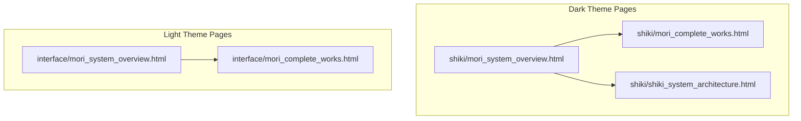
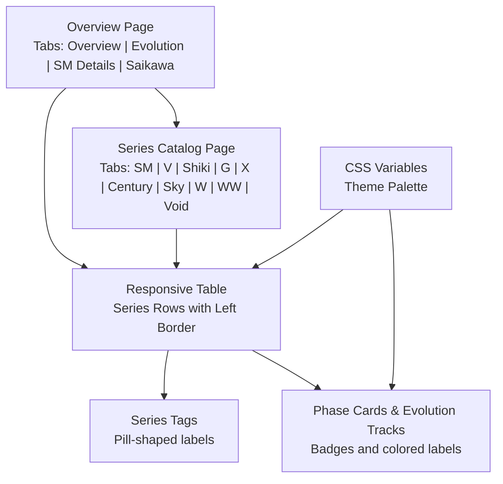
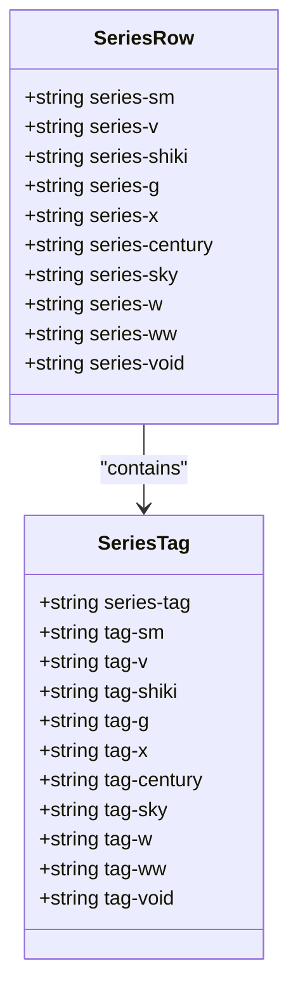
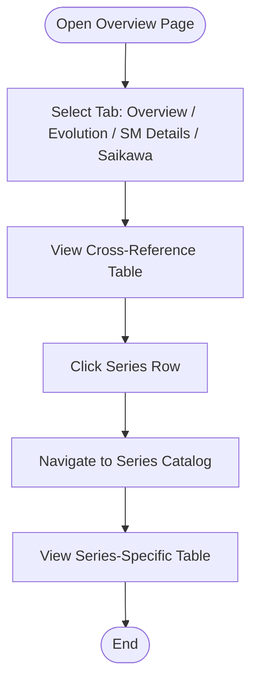
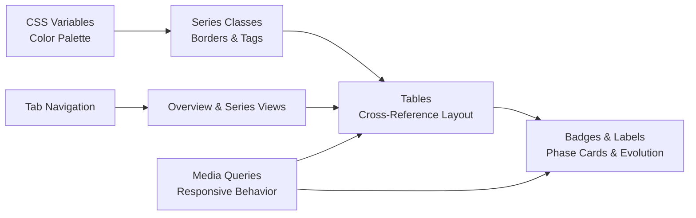

# Cross-Reference System

<cite>
**Referenced Files in This Document**
- [mori_system_overview.html](file://shiki/mori_system_overview.html)
- [mori_complete_works.html](file://shiki/mori_complete_works.html)
- [mori_system_overview.html](file://interface/mori_system_overview.html)
- [mori_complete_works.html](file://interface/mori_complete_works.html)
- [mori_system_overview.html](file://shiki/shiki_system_architecture.html)
</cite>

## Table of Contents
1. [Introduction](#introduction)
2. [Project Structure](#project-structure)
3. [Core Components](#core-components)
4. [Architecture Overview](#architecture-overview)
5. [Detailed Component Analysis](#detailed-component-analysis)
6. [Dependency Analysis](#dependency-analysis)
7. [Performance Considerations](#performance-considerations)
8. [Troubleshooting Guide](#troubleshooting-guide)
9. [Conclusion](#conclusion)

## Introduction
This document explains the cross-reference system that connects literary works across different series in the Mori universe. It focuses on:
- Series identification using CSS classes (e.g., series-sm, series-v, series-shiki, etc.)
- Tag-based labeling for quick visual recognition
- Color palette implementation via CSS custom properties and consistent theming
- Table-based cross-reference structures for series catalogs
- Responsive design for desktop and mobile
- Series badge system for phase cards and evolution tracks
- Practical examples for adding new series, customizing color schemes, and extending categorization

## Project Structure
The cross-reference system spans multiple pages:
- A dark-themed overview page with tabs and a large cross-reference table
- A light-themed overview page with tabs and a large cross-reference table
- A series-centric catalog page with tabbed series views and individual series tables
- An architecture-focused page detailing the evolution of series and their technical metaphors

**Diagram sources**
- [mori_system_overview.html:1-702](file://shiki/mori_system_overview.html#L1-L702)
- [mori_complete_works.html:1-723](file://shiki/mori_complete_works.html#L1-L723)
- [mori_system_overview.html:1-970](file://interface/mori_system_overview.html#L1-L970)
- [mori_complete_works.html:1-970](file://interface/mori_complete_works.html#L1-L970)
- [mori_system_overview.html:1-785](file://shiki/shiki_system_architecture.html#L1-L785)

**Section sources**
- [mori_system_overview.html:1-702](file://shiki/mori_system_overview.html#L1-L702)
- [mori_complete_works.html:1-723](file://shiki/mori_complete_works.html#L1-L723)
- [mori_system_overview.html:1-970](file://interface/mori_system_overview.html#L1-L970)
- [mori_complete_works.html:1-970](file://interface/mori_complete_works.html#L1-L970)
- [mori_system_overview.html:1-785](file://shiki/shiki_system_architecture.html#L1-L785)

## Core Components
- CSS custom properties define the color palette and theme variables for both dark and light themes.
- Series identification relies on CSS classes applied to table cells and series containers.
- Tag-based labeling uses small pill-shaped tags to quickly identify series and highlight key attributes.
- Responsive tables adapt to mobile screens with horizontal scrolling and reduced spacing.
- Phase cards and evolution tracks use badges and colored labels to represent series progression.

Key implementation patterns:
- Dark theme uses a deep blue/black palette with vibrant accent colors for each series.
- Light theme uses a clean white background with soft borders and primary brand colors.
- Both themes consistently apply series-specific colors to borders, tags, and headers.

**Section sources**
- [mori_system_overview.html:7-27](file://shiki/mori_system_overview.html#L7-L27)
- [mori_system_overview.html:10-31](file://interface/mori_system_overview.html#L10-L31)
- [mori_system_overview.html:120-149](file://shiki/mori_system_overview.html#L120-L149)
- [mori_system_overview.html:166-205](file://interface/mori_system_overview.html#L166-L205)

## Architecture Overview
The cross-reference system is built around:
- A central overview page with tabbed sections for different views (overview, evolution, series details, etc.)
- A series catalog page with tabbed views for each series
- Shared CSS classes and color variables to maintain visual consistency across pages
- Responsive design that adapts to different screen sizes

**Diagram sources**
- [mori_system_overview.html:283-288](file://shiki/mori_system_overview.html#L283-L288)
- [mori_complete_works.html:350-361](file://shiki/mori_complete_works.html#L350-L361)
- [mori_system_overview.html:120-149](file://shiki/mori_system_overview.html#L120-L149)
- [mori_system_overview.html:161-204](file://shiki/mori_system_overview.html#L161-L204)

**Section sources**
- [mori_system_overview.html:283-288](file://shiki/mori_system_overview.html#L283-L288)
- [mori_complete_works.html:350-361](file://shiki/mori_complete_works.html#L350-L361)
- [mori_system_overview.html:120-149](file://shiki/mori_system_overview.html#L120-L149)
- [mori_system_overview.html:161-204](file://shiki/mori_system_overview.html#L161-L204)

## Detailed Component Analysis

### Series Identification and Tagging
Series identification is achieved through:
- CSS classes applied to table rows and series containers (e.g., series-sm, series-v, series-shiki)
- Tag-based labels using classes like series-tag and tag-sm, tag-v, etc.
- Pill-shaped tags with consistent sizing and spacing

Implementation highlights:
- Each series gets a dedicated color via CSS variables and is applied as a left border on table rows
- Tags inside series cells provide quick visual cues about the series identity and characteristics
- The tag classes reuse the same color variables to keep branding consistent

**Diagram sources**
- [mori_system_overview.html:120-149](file://shiki/mori_system_overview.html#L120-L149)
- [mori_system_overview.html:166-205](file://interface/mori_system_overview.html#L166-L205)

**Section sources**
- [mori_system_overview.html:120-149](file://shiki/mori_system_overview.html#L120-L149)
- [mori_system_overview.html:166-205](file://interface/mori_system_overview.html#L166-L205)

### Color Palette and Theming
The color palette is defined via CSS custom properties and reused across:
- Borders for series rows
- Tag backgrounds and borders
- Header accents and hover states
- Badge and label styling

Dark theme variables:
- Backgrounds: --bg, --card, --border
- Series colors: --sm, --v, --shiki, --g, --x, --century, --sky, --w, --ww, --void
- Typography: --text, --text-dim, --text-bright
- Code highlighting: --code-bg, --code-border

Light theme variables:
- Backgrounds: --bg, --bg-subtle, --bg-card, --border, --border-light
- Brand colors: --primary, --primary-light, --accent-purple, --accent-green, --accent-red
- Typography: --text-primary, --text-secondary, --text-muted

Consistency mechanisms:
- Series classes reuse the same color variables for borders and tags
- Hover effects and transitions use consistent timing and easing
- Code blocks and inline code share a unified color scheme

**Section sources**
- [mori_system_overview.html:8-27](file://shiki/mori_system_overview.html#L8-L27)
- [mori_system_overview.html:11-31](file://interface/mori_system_overview.html#L11-L31)
- [mori_system_overview.html:120-149](file://shiki/mori_system_overview.html#L120-L149)
- [mori_system_overview.html:166-205](file://interface/mori_system_overview.html#L166-L205)

### Table-Based Cross-Reference Structure
Two main table layouts are used:
- Overview table: Large cross-reference with columns for series name, core books, mathematical/AI principles, philosophical propositions, volume count, and timeline
- Series catalog tables: Individual series tables with standardized columns (e.g., #, Japanese title, English title, Chinese title, year)

Responsive design:
- Tables are wrapped in scrollable containers on smaller screens
- Column widths are adjusted for readability on mobile devices
- Hover effects and spacing are tuned for touch interactions

**Diagram sources**
- [mori_system_overview.html:290-428](file://shiki/mori_system_overview.html#L290-L428)
- [mori_system_overview.html:405-432](file://interface/mori_system_overview.html#L405-L432)

**Section sources**
- [mori_system_overview.html:290-428](file://shiki/mori_system_overview.html#L290-L428)
- [mori_system_overview.html:405-432](file://interface/mori_system_overview.html#L405-L432)

### Series Badge System for Phase Cards and Evolution Tracks
Phase cards and evolution tracks use:
- Badge-like labels with rounded corners and consistent typography
- Series-specific colors applied to badges and labels
- Grid layouts that adapt to different screen sizes

Badge usage patterns:
- Phase cards display a phase number badge and series badges linking to relevant series
- Evolution tracks present stage labels with series colors and brief descriptions
- Badges are designed to be compact yet readable on both desktop and mobile

**Section sources**
- [mori_system_overview.html:161-210](file://shiki/mori_system_overview.html#L161-L210)
- [mori_system_overview.html:217-277](file://interface/mori_system_overview.html#L217-L277)

### Adding New Series to the Cross-Reference System
Steps to add a new series:
1. Define a new CSS variable for the series color in the :root block
2. Add a new series class (e.g., series-new) and corresponding tag class (e.g., tag-new)
3. Apply the series class to the table row or series container
4. Add a new tab button with the data-tab attribute pointing to the new tab content
5. Create the tab content with a series info card and a table for the series entries
6. Ensure responsive styles accommodate the new content

Example references:
- Dark theme color variables and series classes
- Light theme tab navigation and series info styling
- Series catalog table structure and responsive behavior

**Section sources**
- [mori_system_overview.html:8-27](file://shiki/mori_system_overview.html#L8-L27)
- [mori_system_overview.html:11-31](file://interface/mori_system_overview.html#L11-L31)
- [mori_complete_works.html:350-361](file://shiki/mori_complete_works.html#L350-L361)
- [mori_complete_works.html:517-528](file://interface/mori_complete_works.html#L517-L528)

### Customizing Color Schemes
To customize the color scheme:
- Modify the CSS custom properties in the :root block
- Update series classes and tag classes to use the new color variables
- Adjust hover states, borders, and shadows to match the new palette
- Test responsiveness to ensure readability across devices

Best practices:
- Keep contrast ratios sufficient for accessibility
- Maintain consistent hues across related components (borders, tags, headers)
- Use alpha transparency judiciously for subtle effects

**Section sources**
- [mori_system_overview.html:8-27](file://shiki/mori_system_overview.html#L8-L27)
- [mori_system_overview.html:11-31](file://interface/mori_system_overview.html#L11-L31)
- [mori_system_overview.html:120-149](file://shiki/mori_system_overview.html#L120-L149)
- [mori_system_overview.html:166-205](file://interface/mori_system_overview.html#L166-L205)

### Extending the Categorization System
To extend categorization:
- Add new tag classes for additional categories (e.g., tag-theme, tag-era)
- Update series info cards to include new metadata sections
- Modify tables to include new columns for category filters
- Ensure consistent styling for new categories across both themes

Integration points:
- Series info cards support flexible metadata layouts
- Tag classes can be combined to indicate multiple categories
- Tables can be filtered or sorted by category using JavaScript if needed

**Section sources**
- [mori_system_overview.html:178-205](file://interface/mori_system_overview.html#L178-L205)
- [mori_system_overview.html:120-149](file://shiki/mori_system_overview.html#L120-L149)

## Dependency Analysis
The cross-reference system depends on:
- CSS custom properties for consistent theming across pages
- Shared CSS classes for series identification and tagging
- Tab navigation logic for switching between views
- Responsive design media queries for mobile adaptation

**Diagram sources**
- [mori_system_overview.html:8-27](file://shiki/mori_system_overview.html#L8-L27)
- [mori_system_overview.html:120-149](file://shiki/mori_system_overview.html#L120-L149)
- [mori_system_overview.html:283-288](file://shiki/mori_system_overview.html#L283-L288)
- [mori_system_overview.html:238-245](file://shiki/mori_system_overview.html#L238-L245)

**Section sources**
- [mori_system_overview.html:8-27](file://shiki/mori_system_overview.html#L8-L27)
- [mori_system_overview.html:120-149](file://shiki/mori_system_overview.html#L120-L149)
- [mori_system_overview.html:283-288](file://shiki/mori_system_overview.html#L283-L288)
- [mori_system_overview.html:238-245](file://shiki/mori_system_overview.html#L238-L245)

## Performance Considerations
- CSS custom properties reduce duplication and improve maintainability
- Minimal JavaScript for tab switching reduces overhead
- Responsive design avoids heavy layout recalculations by using flexbox and grid
- Image export functionality uses a lightweight library and scales appropriately

## Troubleshooting Guide
Common issues and resolutions:
- Inconsistent colors: Verify that CSS variables are defined in :root and used consistently across classes
- Missing series borders: Ensure the series class is applied to the table row and that the border-left property is defined
- Tag visibility on dark backgrounds: Confirm tag classes use appropriate background and border colors
- Mobile layout problems: Check media query breakpoints and ensure overflow-x is enabled for tables
- Tab switching not working: Verify that tab buttons have the correct data-tab attribute and that the JavaScript targets the correct element IDs

**Section sources**
- [mori_system_overview.html:8-27](file://shiki/mori_system_overview.html#L8-L27)
- [mori_system_overview.html:120-149](file://shiki/mori_system_overview.html#L120-L149)
- [mori_system_overview.html:283-288](file://shiki/mori_system_overview.html#L283-L288)
- [mori_system_overview.html:238-245](file://shiki/mori_system_overview.html#L238-L245)

## Conclusion
The cross-reference system provides a cohesive, visually distinct way to navigate and understand the interconnected literary works across different series. Through carefully chosen CSS classes, consistent color palettes, and responsive design, it enables users to quickly identify series, track evolution, and explore detailed catalogs while maintaining thematic coherence across pages.