# Interactive Visualizations

<cite>
**Referenced Files in This Document**
- [everything_becomes_f_runtime.html](file://shiki/everything_becomes_f_runtime.html)
- [mori_complete_works.html](file://shiki/mori_complete_works.html)
- [mori_system_overview.html](file://shiki/mori_system_overview.html)
- [shiki_system_architecture.html](file://shiki/shiki_system_architecture.html)
- [mori_complete_works_interface.html](file://interface/mori_complete_works.html)
- [mori_system_overview_interface.html](file://interface/mori_system_overview.html)
</cite>

## Table of Contents
1. [Introduction](#introduction)
2. [Project Structure](#project-structure)
3. [Core Components](#core-components)
4. [Architecture Overview](#architecture-overview)
5. [Detailed Component Analysis](#detailed-component-analysis)
6. [Dependency Analysis](#dependency-analysis)
7. [Performance Considerations](#performance-considerations)
8. [Troubleshooting Guide](#troubleshooting-guide)
9. [Conclusion](#conclusion)

## Introduction

This documentation covers the interactive visualization components and screenshot functionality implemented across the Mori Universe web application. The system consists of four distinct visualization pages that showcase different aspects of author Mori Hiroshi's literary works, each featuring a sophisticated runtime visualization system and client-side screenshot capture capabilities powered by html2canvas.

The visualization system transforms complex literary concepts into interactive, animated presentations that demonstrate the evolution of narrative systems, character development, and thematic progression. Each page implements a consistent screenshot functionality that allows users to capture the current visualization state for sharing or documentation purposes.

## Project Structure

The Mori Universe project is organized into two main directories:

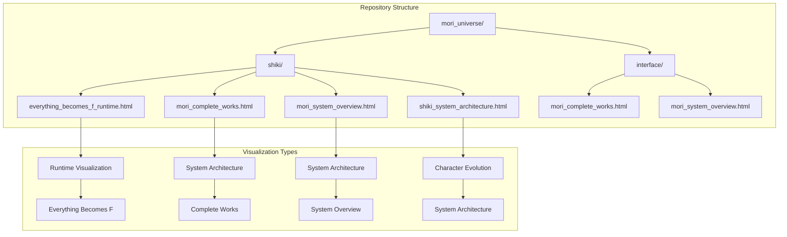

**Diagram sources**
- [everything_becomes_f_runtime.html:1-587](file://shiki/everything_becomes_f_runtime.html#L1-L587)
- [mori_complete_works.html:1-723](file://shiki/mori_complete_works.html#L1-L723)
- [mori_system_overview.html:1-702](file://shiki/mori_system_overview.html#L1-L702)
- [shiki_system_architecture.html:1-785](file://shiki/shiki_system_architecture.html#L1-L785)

**Section sources**
- [everything_becomes_f_runtime.html:1-587](file://shiki/everything_becomes_f_runtime.html#L1-L587)
- [mori_complete_works.html:1-723](file://shiki/mori_complete_works.html#L1-L723)
- [mori_system_overview.html:1-702](file://shiki/mori_system_overview.html#L1-L702)
- [shiki_system_architecture.html:1-785](file://shiki/shiki_system_architecture.html#L1-L785)

## Core Components

### Screenshot Capture System

Each visualization page implements a sophisticated screenshot capture system built around the html2canvas library. The system provides a floating action button positioned at the top-right corner of the viewport, offering users seamless image capture functionality.

#### Screenshot Button Implementation

The screenshot button follows a consistent design pattern across all visualization pages:

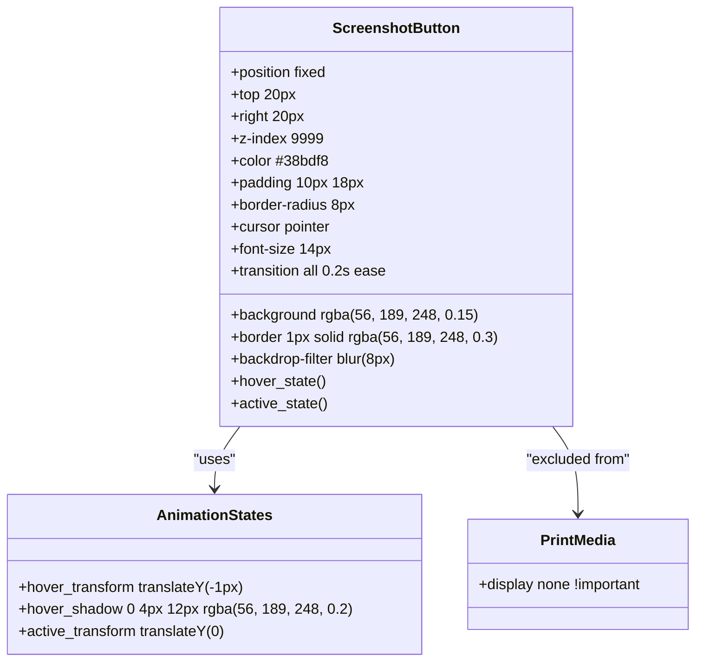

**Diagram sources**
- [everything_becomes_f_runtime.html:280-308](file://shiki/everything_becomes_f_runtime.html#L280-L308)
- [mori_complete_works.html:311-339](file://shiki/mori_complete_works.html#L311-L339)
- [mori_system_overview.html:246-274](file://shiki/mori_system_overview.html#L246-L274)

#### html2canvas Integration

The screenshot functionality leverages html2canvas with carefully configured parameters optimized for the visualization contexts:

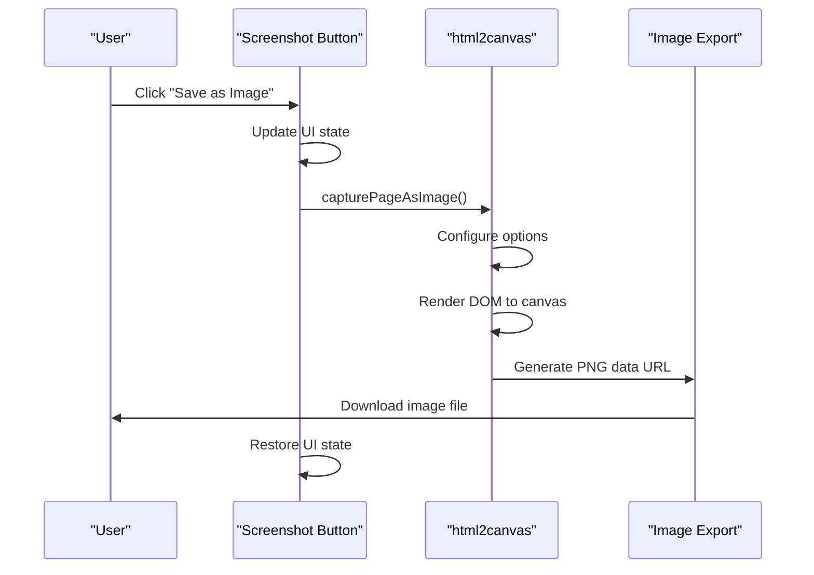

**Diagram sources**
- [everything_becomes_f_runtime.html:554-583](file://shiki/everything_becomes_f_runtime.html#L554-L583)
- [mori_complete_works.html:690-719](file://shiki/mori_complete_works.html#L690-L719)

### Runtime Visualization System

The runtime visualization system transforms static literary content into dynamic, animated presentations that demonstrate narrative progression and system evolution.

#### Everything Becomes F Runtime Visualization

The primary runtime visualization focuses on the "Everything Becomes F" narrative, presenting a chronological timeline of system phases with interactive episode cards:

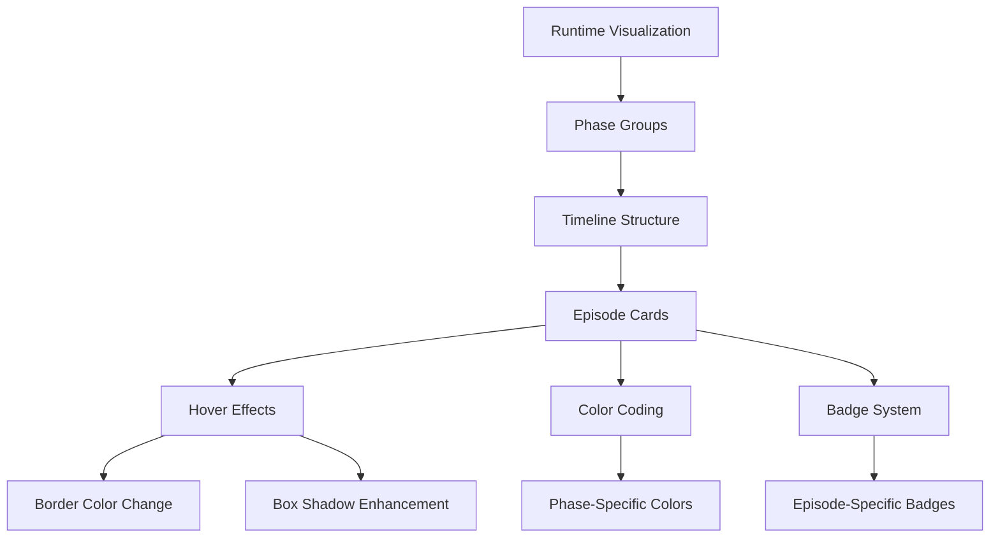

**Diagram sources**
- [everything_becomes_f_runtime.html:102-210](file://shiki/everything_becomes_f_runtime.html#L102-L210)

#### System Architecture Visualizations

The system architecture pages present complex technical concepts through structured tables and phase-based progression:

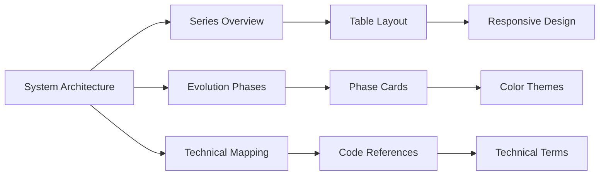

**Diagram sources**
- [mori_system_overview.html:290-520](file://shiki/mori_system_overview.html#L290-L520)
- [shiki_system_architecture.html:398-745](file://shiki/shiki_system_architecture.html#L398-L745)

**Section sources**
- [everything_becomes_f_runtime.html:280-308](file://shiki/everything_becomes_f_runtime.html#L280-L308)
- [mori_complete_works.html:311-339](file://shiki/mori_complete_works.html#L311-L339)
- [mori_system_overview.html:246-274](file://shiki/mori_system_overview.html#L246-L274)

## Architecture Overview

The interactive visualization system follows a modular architecture with consistent patterns across all visualization types:

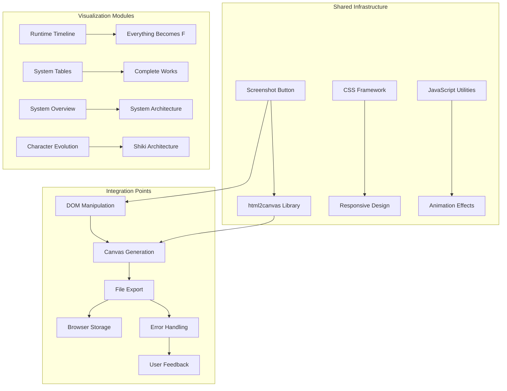

**Diagram sources**
- [everything_becomes_f_runtime.html:552-587](file://shiki/everything_becomes_f_runtime.html#L552-L587)
- [mori_system_overview.html:667-700](file://shiki/mori_system_overview.html#L667-L700)

### Component Relationships

The visualization components share common architectural patterns while maintaining specialized functionality:

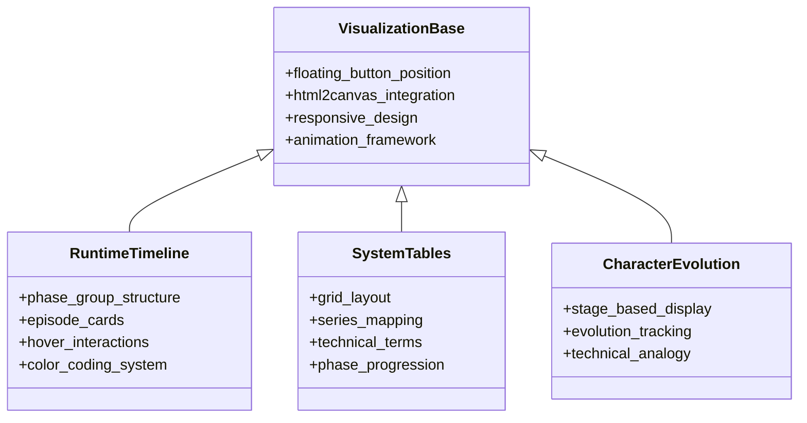

**Diagram sources**
- [everything_becomes_f_runtime.html:311-551](file://shiki/everything_becomes_f_runtime.html#L311-L551)
- [mori_system_overview.html:290-656](file://shiki/mori_system_overview.html#L290-L656)

**Section sources**
- [everything_becomes_f_runtime.html:1-587](file://shiki/everything_becomes_f_runtime.html#L1-L587)
- [mori_system_overview.html:1-702](file://shiki/mori_system_overview.html#L1-L702)
- [shiki_system_architecture.html:1-785](file://shiki/shiki_system_architecture.html#L1-L785)

## Detailed Component Analysis

### Screenshot Button Styling System

The screenshot button implements a sophisticated styling system that adapts to different visualization themes while maintaining consistent user experience:

#### Floating Position System

The button utilizes a fixed positioning strategy that ensures visibility across all screen sizes:

| Property | Desktop Value | Mobile Value | Purpose |
|----------|---------------|--------------|---------|
| Position | fixed | fixed | Maintains visibility during scroll |
| Top | 20px | 12px | Provides adequate spacing from viewport edges |
| Right | 20px | 12px | Aligns with visual hierarchy |
| Z-Index | 9999 | 9999 | Ensures button appears above all content |

#### Backdrop Filter Effects

The button incorporates modern CSS backdrop filtering for enhanced visual appeal:

```css
.screenshot-btn {
    backdrop-filter: blur(8px);
    -webkit-backdrop-filter: blur(8px);
    background: rgba(56, 189, 248, 0.15);
    border: 1px solid rgba(56, 189, 248, 0.3);
}
```

#### Hover Animation System

The hover state implements a multi-layered animation system:

```mermaid
stateDiagram-v2
[*] --> Idle
Idle --> Hover : Mouse Enter
Hover --> Active : Mouse Down
Active --> Hover : Mouse Up
Hover --> Idle : Mouse Leave
state Hover {
+transform : translateY(-1px)
+box-shadow : 0 4px 12px rgba(56, 189, 248, 0.2)
+background : rgba(56, 189, 248, 0.25)
+border-color : rgba(56, 189, 248, 0.5)
}
state Active {
+transform : translateY(0)
}
```

**Diagram sources**
- [everything_becomes_f_runtime.html:297-305](file://shiki/everything_becomes_f_runtime.html#L297-L305)

**Section sources**
- [everything_becomes_f_runtime.html:280-308](file://shiki/everything_becomes_f_runtime.html#L280-L308)
- [mori_complete_works.html:311-339](file://shiki/mori_complete_works.html#L311-L339)
- [mori_system_overview.html:246-274](file://shiki/mori_system_overview.html#L246-L274)

### html2canvas Configuration Options

The screenshot functionality utilizes html2canvas with optimized configuration parameters tailored to the visualization contexts:

#### Canvas Configuration Parameters

| Parameter | Value | Purpose | Impact |
|-----------|-------|---------|--------|
| backgroundColor | '#0b0f1a' | Matches dark theme | Ensures consistent background |
| scale | 2 | High DPI output | Improves image quality |
| useCORS | true | Enables cross-origin resources | Supports external fonts/images |
| logging | false | Disables console output | Reduces performance overhead |
| windowWidth | document.body.scrollWidth | Full page width | Captures entire viewport |
| windowHeight | document.body.scrollHeight | Full page height | Captures entire viewport |

#### Image Export Mechanism

The image export process follows a standardized workflow:

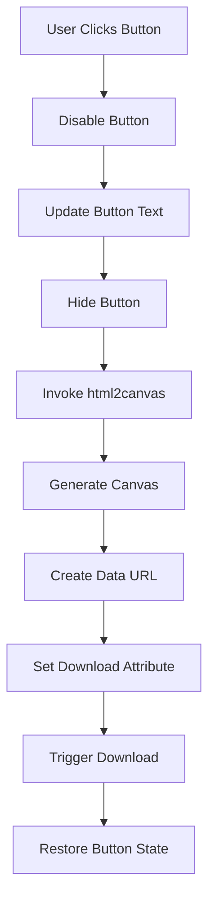

**Diagram sources**
- [everything_becomes_f_runtime.html:554-583](file://shiki/everything_becomes_f_runtime.html#L554-L583)

**Section sources**
- [everything_becomes_f_runtime.html:554-583](file://shiki/everything_becomes_f_runtime.html#L554-L583)
- [mori_complete_works.html:690-719](file://shiki/mori_complete_works.html#L690-L719)
- [mori_system_overview.html:669-698](file://shiki/mori_system_overview.html#L669-L698)

### Responsive Design Considerations

The visualization system implements comprehensive responsive design patterns to ensure optimal presentation across all device types:

#### Breakpoint Strategy

The system employs a tiered breakpoint approach:

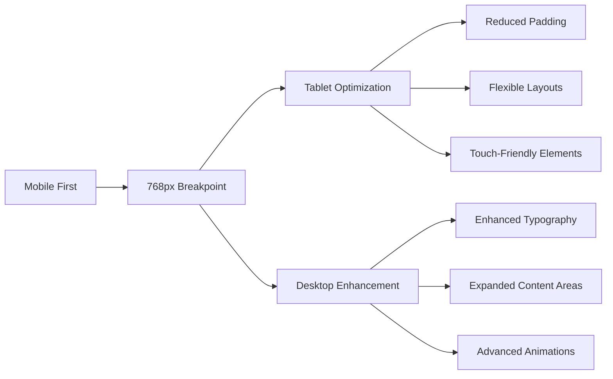

#### Adaptive Component Behavior

Different visualization components adapt their behavior based on screen size:

| Component | Mobile Adaptation | Desktop Enhancement |
|-----------|-------------------|---------------------|
| Runtime Timeline | Reduced timeline spacing | Enhanced hover effects |
| System Tables | Horizontal scrolling | Expanded column layouts |
| Character Evolution | Simplified stages | Advanced color transitions |
| Screenshot Button | Smaller touch targets | Enhanced visual feedback |

**Section sources**
- [everything_becomes_f_runtime.html:273-279](file://shiki/everything_becomes_f_runtime.html#L273-L279)
- [mori_system_overview.html:238-245](file://shiki/mori_system_overview.html#L238-L245)
- [shiki_system_architecture.html:355-359](file://shiki/shiki_system_architecture.html#L355-L359)

## Dependency Analysis

The visualization system exhibits well-structured dependencies that support maintainability and extensibility:

```mermaid
graph TB
subgraph "External Dependencies"
A[html2canvas@1.4.1] --> B[Core Functionality]
C[CDN Hosting] --> A
end
subgraph "Internal Dependencies"
D[CSS Framework] --> E[Responsive Design]
F[JavaScript Utilities] --> G[Animation Effects]
H[HTML Templates] --> I[Content Structure]
end
subgraph "Cross-Page Dependencies"
J[Shared Button Styles] --> K[All Visualization Pages]
L[Common JavaScript Functions] --> M[Consistent Behavior]
N[Theme Variables] --> O[Visual Consistency]
end
A --> J
D --> K
F --> M
```

**Diagram sources**
- [everything_becomes_f_runtime.html](file://shiki/everything_becomes_f_runtime.html#L552)
- [mori_system_overview.html](file://shiki/mori_system_overview.html#L667)

### Coupling and Cohesion Analysis

The system demonstrates appropriate separation of concerns:

- **High Cohesion**: Each visualization page focuses on a specific aspect of the Mori Universe concept
- **Low Coupling**: Shared functionality is centralized in common styles and scripts
- **Extensible Design**: New visualization components can be added with minimal disruption

**Section sources**
- [mori_complete_works.html:673-687](file://shiki/mori_complete_works.html#L673-L687)
- [mori_system_overview.html:667-667](file://shiki/mori_system_overview.html#L667-L667)

## Performance Considerations

### Client-Side Rendering Performance

The html2canvas integration introduces several performance considerations:

#### Canvas Generation Optimization

- **Scale Factor**: Using scale factor of 2 balances quality and performance
- **Background Color**: Predefined background prevents rendering delays
- **Logging Disabled**: Reduces console overhead during capture
- **Window Dimensions**: Captures full page dimensions for comprehensive output

#### Memory Management

The screenshot system implements proper cleanup procedures:

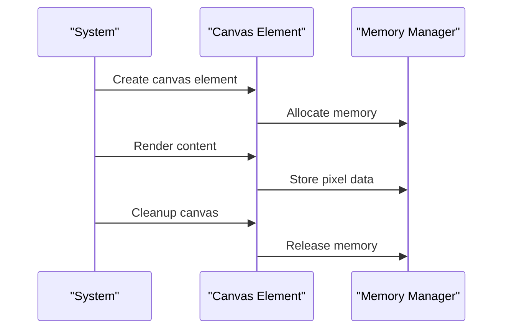

**Diagram sources**
- [everything_becomes_f_runtime.html:554-583](file://shiki/everything_becomes_f_runtime.html#L554-L583)

### Large Page Capture Challenges

For pages with extensive content, the system faces several challenges:

- **Rendering Time**: Complex DOM structures increase processing time
- **Memory Usage**: Large canvases consume significant memory
- **Browser Limits**: Some browsers impose canvas size limitations
- **Performance Degradation**: Users may experience slowdowns on older devices

**Section sources**
- [everything_becomes_f_runtime.html:561-568](file://shiki/everything_becomes_f_runtime.html#L561-L568)
- [mori_system_overview.html:791-798](file://shiki/mori_system_overview.html#L791-L798)

## Troubleshooting Guide

### Common Issues and Solutions

#### Screenshot Capture Failures

| Issue | Symptoms | Solution |
|-------|----------|----------|
| Blank Images | White or transparent output | Verify backgroundColor parameter |
| CORS Errors | Cross-origin resource failures | Enable useCORS option |
| Performance Issues | Slow capture times | Reduce scale factor or content complexity |
| Browser Compatibility | Function not working | Check browser support for html2canvas |

#### Error Handling Implementation

The system implements robust error handling mechanisms:

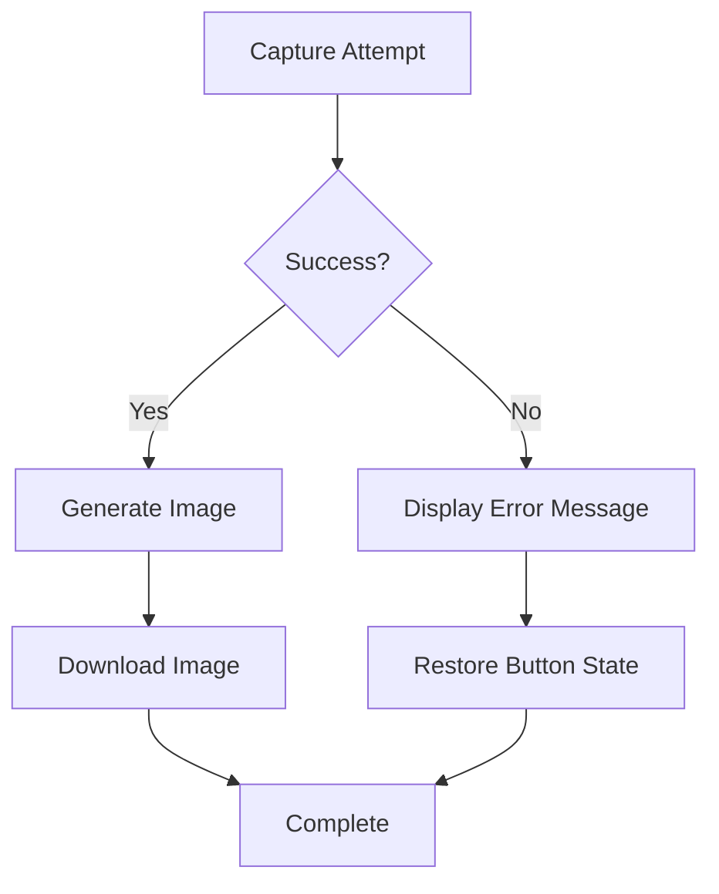

**Diagram sources**
- [everything_becomes_f_runtime.html:577-582](file://shiki/everything_becomes_f_runtime.html#L577-L582)

#### Browser Compatibility Issues

The system addresses various browser compatibility concerns:

- **Modern Browsers**: Full html2canvas support
- **Legacy Browsers**: Graceful degradation with fallback messaging
- **Mobile Browsers**: Touch-friendly button sizing and positioning
- **Security Restrictions**: CORS handling for external resources

**Section sources**
- [everything_becomes_f_runtime.html:577-582](file://shiki/everything_becomes_f_runtime.html#L577-L582)
- [mori_complete_works.html:713-718](file://shiki/mori_complete_works.html#L713-L718)

## Conclusion

The interactive visualization system for the Mori Universe project demonstrates sophisticated implementation of runtime visualization and client-side screenshot functionality. The system successfully transforms complex literary concepts into engaging, interactive presentations while providing users with seamless image capture capabilities.

Key achievements include:

- **Consistent User Experience**: Unified screenshot functionality across all visualization types
- **Responsive Design**: Adaptive layouts that work across all device types
- **Performance Optimization**: Carefully tuned html2canvas configurations for optimal performance
- **Accessibility**: Thoughtful design choices that accommodate diverse user needs
- **Extensibility**: Modular architecture that supports future enhancements

The system serves as an excellent example of how modern web technologies can be combined to create immersive, interactive experiences that enhance user engagement with complex content. The thoughtful integration of html2canvas, CSS animations, and responsive design creates a cohesive platform for exploring literary concepts through visual storytelling.

Future enhancements could include expanded customization options, additional export formats, and integration with external sharing platforms to further enhance the user experience and broaden the system's utility for educational and research purposes.