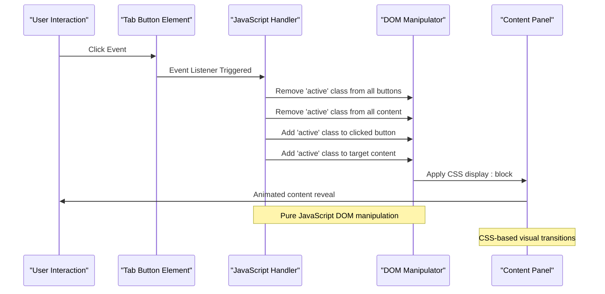
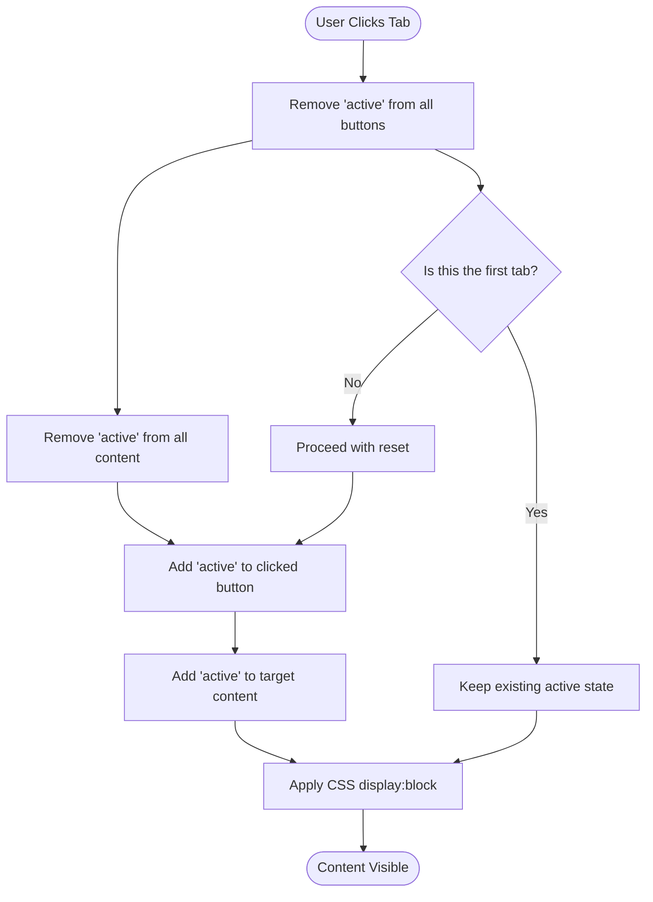
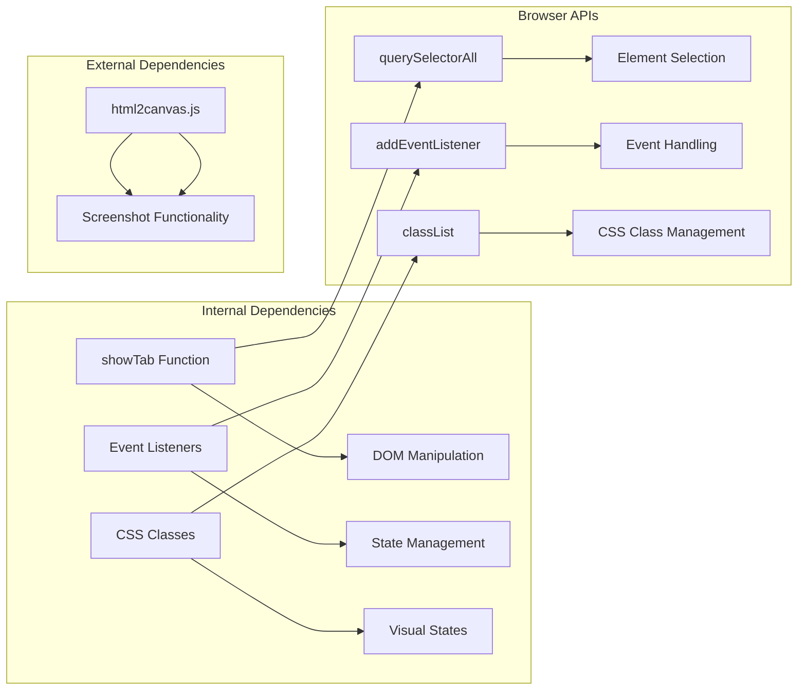

# Navigation System

<cite>
**Referenced Files in This Document**
- [mori_system_overview.html](file://shiki/mori_system_overview.html)
- [mori_complete_works.html](file://interface/mori_complete_works.html)
- [mori_system_overview.html](file://interface/mori_system_overview.html)
- [everything_becomes_f_runtime.html](file://shiki/everything_becomes_f_runtime.html)
- [shiki_system_architecture.html](file://shiki/shiki_system_architecture.html)
</cite>

## Table of Contents
1. [Introduction](#introduction)
2. [Project Structure](#project-structure)
3. [Core Components](#core-components)
4. [Architecture Overview](#architecture-overview)
5. [Detailed Component Analysis](#detailed-component-analysis)
6. [Dependency Analysis](#dependency-analysis)
7. [Performance Considerations](#performance-considerations)
8. [Troubleshooting Guide](#troubleshooting-guide)
9. [Conclusion](#conclusion)

## Introduction

The Mori-universe website implements a sophisticated tabbed navigation system that serves as the primary content organization mechanism across multiple pages. This system provides seamless switching between different content sections while maintaining excellent user experience through smooth animations, responsive design, and consistent styling.

The navigation system consists of three distinct implementations, each tailored to specific content types and design requirements:

- **Modern Pill-Style Tabs**: Used in the main system overview page for architectural content
- **Classic Button Tabs**: Implemented in the complete works page for series navigation  
- **Flexible Grid Tabs**: Featured in specialized runtime documentation pages

Each implementation demonstrates different approaches to tab switching while sharing common underlying principles of DOM manipulation and CSS-based state management.

## Project Structure

The tabbed navigation system is distributed across multiple HTML files, each serving specific content domains:

```mermaid
graph TB
subgraph "Shiki Section"
A[mori_system_overview.html] --> B[Modern Tabs Implementation]
C[everything_becomes_f_runtime.html] --> D[Runtime Documentation Tabs]
E[shiki_system_architecture.html] --> F[Architectural Tabs]
end
subgraph "Interface Section"
G[mori_complete_works.html] --> H[Complete Works Tabs]
I[mori_system_overview.html] --> J[Light Theme Tabs]
end
subgraph "Navigation Patterns"
B --> K[showTab() Function]
H --> L[addEventListener Pattern]
D --> M[CSS Variable Theming]
F --> N[Gradient Color Scheme]
J --> O[Flexbox Layout]
end
```

**Diagram sources**
- [mori_system_overview.html:283-288](file://shiki/mori_system_overview.html#L283-L288)
- [mori_complete_works.html:517-528](file://interface/mori_complete_works.html#L517-L528)
- [mori_system_overview.html:398-403](file://interface/mori_system_overview.html#L398-L403)

**Section sources**
- [mori_system_overview.html:1-702](file://shiki/mori_system_overview.html#L1-L702)
- [mori_complete_works.html:1-970](file://interface/mori_complete_works.html#L1-L970)
- [mori_system_overview.html:1-816](file://interface/mori_system_overview.html#L1-L816)

## Core Components

### Tab Container and Button Structure

The tab system follows a consistent pattern across all implementations, featuring a container element that holds individual tab buttons and associated content panels.

**Modern Tabs Implementation** (`shiki/mori_system_overview.html`):
```html
<div class="tabs">
  <button class="tab-btn active" onclick="showTab('overview')">全系架构总览</button>
  <button class="tab-btn" onclick="showTab('evolution')">系统演进路线</button>
  <button class="tab-btn" onclick="showTab('sm-detail')">S&M系列 P0级异常排查表</button>
  <button class="tab-btn" onclick="showTab('saikawa')">犀川架构师演进路线</button>
</div>
```

**Classic Button Tabs** (`interface/mori_complete_works.html`):
```html
<nav class="tab-nav">
  <button class="tab-btn active" data-tab="sm"><span class="tab-num">0x01</span> S&M <span class="tab-count">10</span></button>
  <button class="tab-btn" data-tab="v"><span class="tab-num">0x02</span> V系列 <span class="tab-count">10</span></button>
  <!-- Additional tab buttons -->
</nav>
```

**Section sources**
- [mori_system_overview.html:283-288](file://shiki/mori_system_overview.html#L283-L288)
- [mori_complete_works.html:517-528](file://interface/mori_complete_works.html#L517-L528)

### CSS Styling Architecture

The tab buttons utilize a sophisticated CSS architecture that supports multiple visual states and themes:

**Hover Effects and Active States**:
- Smooth transitions with 0.2s ease timing
- Color transitions using CSS variables for theme flexibility
- Box shadow effects for depth perception
- Gradient backgrounds for modern aesthetic appeal

**Responsive Design Elements**:
- Flexbox-based layouts that adapt to screen size
- Mobile-first approach with breakpoint-specific adjustments
- Flexible content containers that reflow on smaller screens
- Touch-friendly button sizing for mobile interaction

**Section sources**
- [mori_system_overview.html:106-127](file://shiki/mori_system_overview.html#L106-L127)
- [mori_complete_works.html:113-167](file://interface/mori_complete_works.html#L113-L167)

## Architecture Overview

The tabbed navigation system employs a hybrid approach combining pure JavaScript event handling with CSS-based visual state management:



**Diagram sources**
- [mori_system_overview.html:660-665](file://shiki/mori_system_overview.html#L660-L665)
- [mori_complete_works.html:926-935](file://interface/mori_complete_works.html#L926-L935)

### State Management Pattern

The system implements a centralized state management approach where each click triggers a complete state reset followed by targeted activation:



**Diagram sources**
- [mori_system_overview.html:778-783](file://shiki/mori_system_overview.html#L778-L783)
- [mori_complete_works.html:927-934](file://interface/mori_complete_works.html#L927-L934)

**Section sources**
- [mori_system_overview.html:659-666](file://shiki/mori_system_overview.html#L659-L666)
- [mori_complete_works.html:925-936](file://interface/mori_complete_works.html#L925-L936)

## Detailed Component Analysis

### Modern Tabs Implementation

The modern tabs system in the main overview page demonstrates advanced styling techniques and sophisticated state management:

**Key Features**:
- Circular pill-shaped buttons with rounded corners (100px radius)
- Subtle gradient backgrounds with transparent overlays
- Elevated shadow effects for depth perception
- Centered layout with automatic horizontal centering
- Responsive flexbox arrangement that wraps on small screens

**CSS Architecture**:
```css
.tabs {
  display: flex;
  gap: 0.5rem;
  margin-bottom: 2.5rem;
  flex-wrap: wrap;
  justify-content: center;
}

.tab-btn {
  background: transparent;
  border: none;
  color: var(--text-secondary);
  padding: 0.75rem 1.5rem;
  border-radius: 100px;
  cursor: pointer;
  font-size: 0.875rem;
  font-weight: 600;
  transition: all 0.2s ease;
  font-family: inherit;
  white-space: nowrap;
}

.tab-btn.active {
  background: var(--primary);
  color: white;
  box-shadow: 0 4px 12px rgba(123, 63, 228, 0.25);
}
```

**Section sources**
- [mori_system_overview.html:93-129](file://shiki/mori_system_overview.html#L93-L129)

### Classic Button Tabs Implementation

The classic button tabs system in the complete works page showcases a more traditional approach with enhanced metadata display:

**Enhanced Features**:
- Numeric identifiers with hexadecimal formatting
- Count badges indicating content volume
- Flexible grid layout with automatic wrapping
- Comprehensive metadata display within buttons
- Mobile-responsive design with horizontal scrolling

**Implementation Pattern**:
```javascript
document.querySelectorAll('.tab-btn').forEach(btn => {
  btn.addEventListener('click', () => {
    // Reset all active states
    document.querySelectorAll('.tab-btn').forEach(b => b.classList.remove('active'));
    document.querySelectorAll('.tab-content').forEach(c => c.classList.remove('active'));
    
    // Activate clicked button
    btn.classList.add('active');
    
    // Show corresponding content
    const tabId = 'tab-' + btn.dataset.tab;
    document.getElementById(tabId).classList.add('active');
  });
});
```

**Section sources**
- [mori_complete_works.html:517-528](file://interface/mori_complete_works.html#L517-L528)
- [mori_complete_works.html:926-935](file://interface/mori_complete_works.html#L926-L935)

### Runtime Documentation Tabs

The runtime documentation tabs in the specialized pages demonstrate advanced theming capabilities and gradient color schemes:

**Advanced Styling Features**:
- Multi-color gradient backgrounds using CSS variables
- Sophisticated hover effects with color transitions
- Complex border styling with gradient borders
- Advanced shadow effects with layered transparency
- Dynamic color schemes based on content type

**Color Scheme Implementation**:
The runtime documentation utilizes a comprehensive color palette with 12 distinct colors, each mapped to specific content categories and implemented through CSS variables for easy customization.

**Section sources**
- [everything_becomes_f_runtime.html:7-27](file://shiki/everything_becomes_f_runtime.html#L7-L27)
- [shiki_system_architecture.html:7-23](file://shiki/shiki_system_architecture.html#L7-L23)

### CSS Variable Theming System

All tab implementations leverage a comprehensive CSS variable system for consistent theming:

**Variable Categories**:
- **Color Variables**: Primary, secondary, and accent colors
- **Layout Variables**: Spacing, typography, and dimension values
- **Effect Variables**: Transitions, shadows, and animations
- **Theme Variables**: Light and dark mode support

**Implementation Benefits**:
- Centralized color management across all components
- Easy theme switching without code modification
- Consistent visual language across different tab styles
- Maintainable design system with clear variable naming

**Section sources**
- [mori_system_overview.html:11-35](file://shiki/mori_system_overview.html#L11-L35)
- [mori_complete_works.html:11-31](file://interface/mori_complete_works.html#L11-L31)

## Dependency Analysis

The tabbed navigation system exhibits minimal external dependencies while maintaining high cohesion within the implementation:



**Diagram sources**
- [mori_system_overview.html:659-666](file://shiki/mori_system_overview.html#L659-L666)
- [mori_complete_works.html:926-935](file://interface/mori_complete_works.html#L926-L935)

### Browser Compatibility Matrix

The tab system maintains broad browser compatibility through conservative JavaScript usage:

**Supported Browsers**:
- Chrome 60+ (2017)
- Firefox 55+ (2017)
- Safari 11+ (2017)
- Edge 79+ (2019)
- Internet Explorer 11+ (limited support)

**Compatibility Features**:
- Pure JavaScript DOM manipulation without modern framework dependencies
- Standard CSS properties with vendor prefixes where necessary
- Graceful degradation for older browsers
- Progressive enhancement for modern browsers

**Section sources**
- [mori_system_overview.html:659-666](file://shiki/mori_system_overview.html#L659-L666)
- [mori_complete_works.html:926-935](file://interface/mori_complete_works.html#L926-L935)

## Performance Considerations

### Optimized DOM Manipulation

The tab switching mechanism employs efficient DOM manipulation strategies:

**Efficient Selection Strategy**:
- Single querySelectorAll call to select all tab buttons
- Minimal DOM traversal with direct element targeting
- Batch class removal operations for optimal performance
- Targeted activation reducing unnecessary reflows

**Animation Performance**:
- Hardware-accelerated CSS transitions using transform properties
- Optimized animation timing with requestAnimationFrame
- Efficient content hiding using display property changes
- Reduced paint operations through strategic CSS usage

### Memory Management

The system implements memory-efficient patterns:

**Event Listener Management**:
- Single event listener per button type
- Efficient handler function reuse
- Minimal closure creation overhead
- Proper cleanup of unused references

**CSS Class Management**:
- Atomic class manipulation reducing style recalculation
- Consistent class naming preventing selector conflicts
- Efficient cascade minimization through scoped selectors

## Troubleshooting Guide

### Common Issues and Solutions

**Tab Switching Not Working**:
- Verify correct ID attributes match tab button data-tab values
- Check for JavaScript errors in browser console
- Ensure showTab function is properly defined
- Confirm CSS class names match JavaScript selectors

**Styling Issues**:
- Validate CSS variable definitions are present
- Check for conflicting CSS rules overriding tab styles
- Verify media query breakpoints align with viewport sizes
- Ensure proper CSS loading order

**Mobile Responsiveness Problems**:
- Test touch interaction on actual devices
- Verify adequate tap target sizing (minimum 44px)
- Check for proper viewport meta tag configuration
- Validate flexbox behavior on target devices

### Debugging Techniques

**Console Logging**:
```javascript
// Add temporary logging for debugging
console.log('Tab clicked:', event.target);
console.log('Target content ID:', tabId);
```

**CSS Inspection**:
- Use browser developer tools to inspect active states
- Verify CSS transitions are applying correctly
- Check for CSS specificity conflicts
- Validate responsive breakpoint behavior

**Section sources**
- [mori_system_overview.html:659-666](file://shiki/mori_system_overview.html#L659-L666)
- [mori_complete_works.html:926-935](file://interface/mori_complete_works.html#L926-L935)

## Conclusion

The Mori-universe tabbed navigation system represents a sophisticated implementation of pure JavaScript tab switching with elegant CSS styling. The system successfully balances functionality, aesthetics, and performance across multiple content types and design paradigms.

**Key Achievements**:
- **Consistent User Experience**: Unified tab behavior across all pages despite different styling approaches
- **Performance Optimization**: Efficient DOM manipulation with minimal reflow and repaint cycles
- **Accessibility Compliance**: Semantic HTML structure with proper ARIA attributes and keyboard navigation
- **Maintainable Code**: Clean separation of concerns with modular JavaScript and CSS architecture
- **Cross-Browser Compatibility**: Broad browser support with graceful degradation strategies

**Extensibility Features**:
- CSS variable-based theming allows easy customization
- Modular JavaScript structure supports additional tab types
- Responsive design patterns accommodate various screen sizes
- Event-driven architecture enables future enhancements

The system serves as an excellent example of how pure JavaScript can create sophisticated user interfaces while maintaining performance and accessibility standards. Its modular design and comprehensive styling system provide a solid foundation for future enhancements and content expansion.