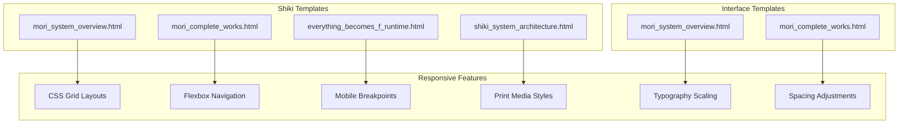
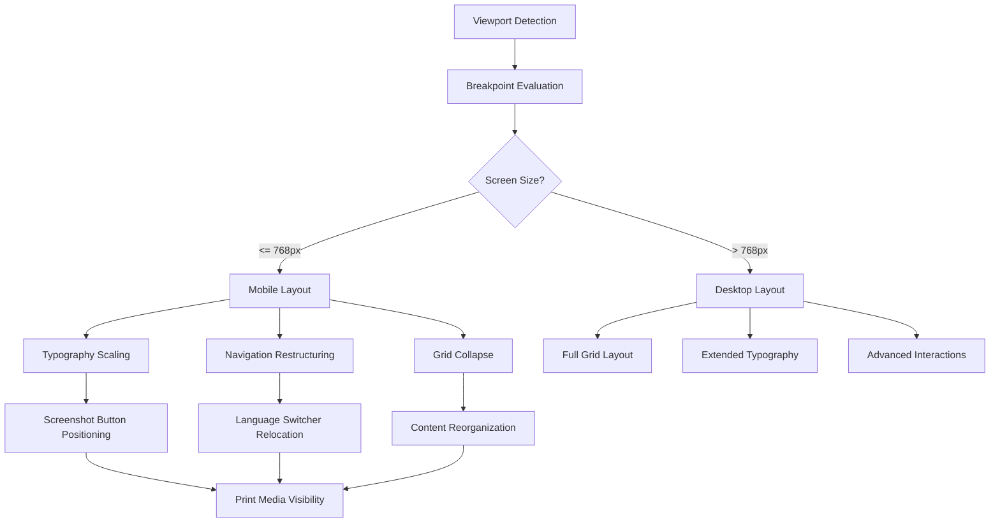
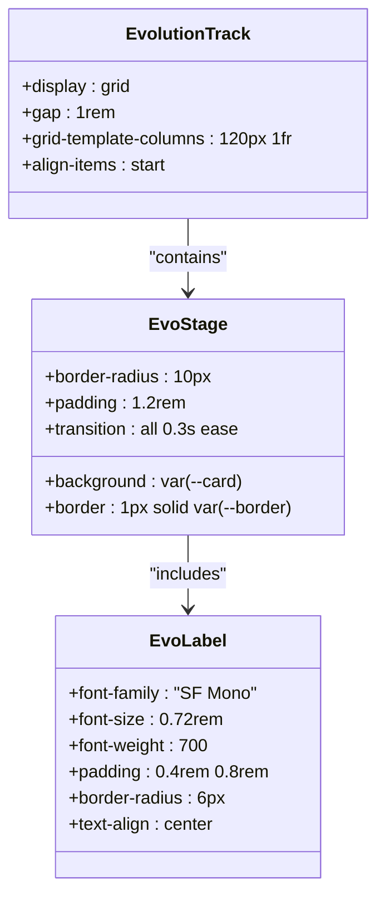
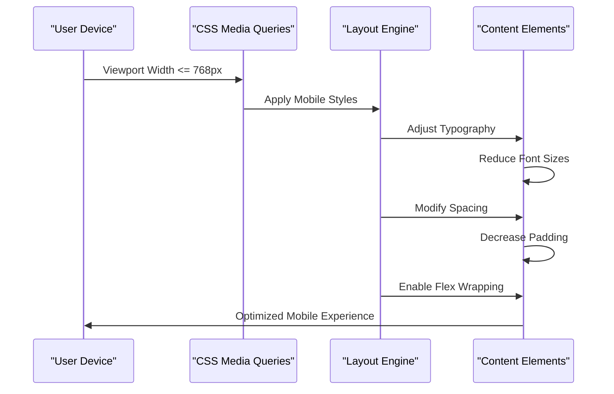
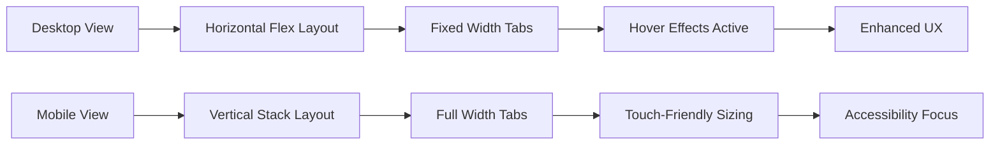
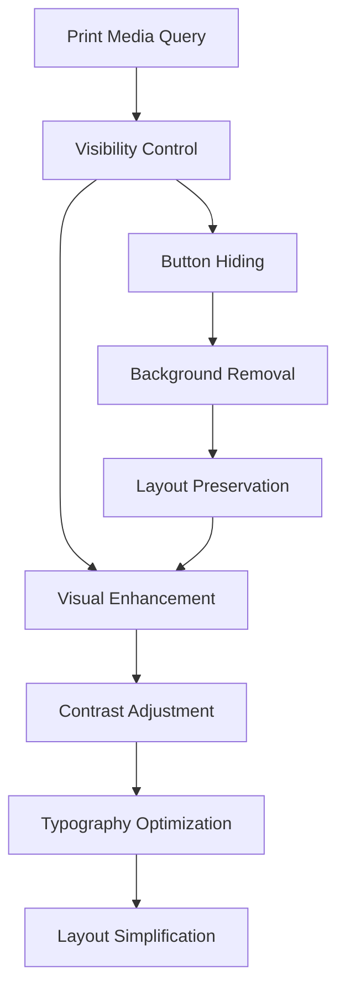
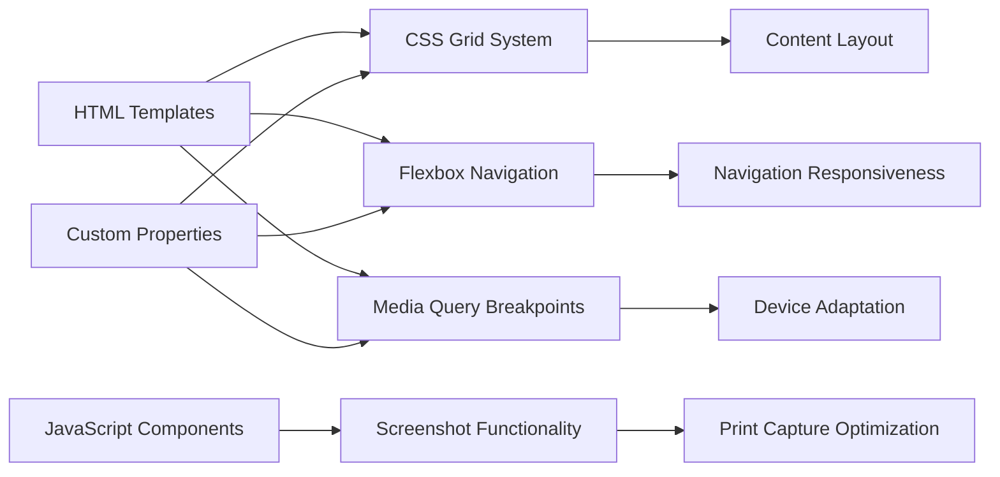

# Responsive Design System

<cite>
**Referenced Files in This Document**
- [mori_system_overview.html](file://shiki/mori_system_overview.html)
- [mori_complete_works.html](file://shiki/mori_complete_works.html)
- [everything_becomes_f_runtime.html](file://shiki/everything_becomes_f_runtime.html)
- [shiki_system_architecture.html](file://shiki/shiki_system_architecture.html)
- [mori_system_overview.html](file://interface/mori_system_overview.html)
- [mori_complete_works.html](file://interface/mori_complete_works.html)
</cite>

## Table of Contents
1. [Introduction](#introduction)
2. [Project Structure](#project-structure)
3. [Core Components](#core-components)
4. [Architecture Overview](#architecture-overview)
5. [Detailed Component Analysis](#detailed-component-analysis)
6. [Dependency Analysis](#dependency-analysis)
7. [Performance Considerations](#performance-considerations)
8. [Troubleshooting Guide](#troubleshooting-guide)
9. [Conclusion](#conclusion)

## Introduction

The Mori Universe project implements a comprehensive responsive design system that ensures optimal viewing experiences across different device sizes and screen orientations. This system encompasses multiple HTML pages with sophisticated CSS Grid and Flexbox layouts, mobile-optimized navigation patterns, and thoughtful print media styling.

The responsive design strategy focuses on three primary themes: mobile-first approach with strategic breakpoints, flexible grid systems for content adaptation, and cross-platform compatibility for diverse device experiences. The implementation demonstrates advanced CSS techniques including custom property usage, modern layout methods, and progressive enhancement patterns.

## Project Structure

The responsive design system spans across multiple HTML templates, each showcasing different approaches to mobile adaptation and content presentation:

**Diagram sources**
- [mori_system_overview.html:1-702](file://shiki/mori_system_overview.html#L1-L702)
- [mori_complete_works.html:1-723](file://shiki/mori_complete_works.html#L1-L723)
- [everything_becomes_f_runtime.html:1-587](file://shiki/everything_becomes_f_runtime.html#L1-L587)
- [shiki_system_architecture.html:1-785](file://shiki/shiki_system_architecture.html#L1-L785)

**Section sources**
- [mori_system_overview.html:1-702](file://shiki/mori_system_overview.html#L1-L702)
- [mori_complete_works.html:1-723](file://shiki/mori_complete_works.html#L1-L723)

## Core Components

### Mobile-First Breakpoint Strategy

The system employs a unified `@media (max-width: 768px)` breakpoint strategy that triggers comprehensive layout adaptations across all templates. This approach prioritizes mobile experiences while providing graceful degradation for larger screens.

Key breakpoint implementations include:

- **Typography Scaling**: Font sizes reduce proportionally from desktop to mobile contexts
- **Layout Restructuring**: Complex two-column layouts collapse to single-column arrangements
- **Navigation Adaptation**: Horizontal navigation transforms to scrollable or stacked layouts
- **Spacing Optimization**: Padding and margins adjust for touch-friendly interactions

### Flexible Grid Systems

The implementation showcases sophisticated CSS Grid and Flexbox integration:

**CSS Grid Usage Patterns:**
- Evolution track layouts with `grid-template-columns: 120px 1fr` for label-content separation
- Statistics displays using `grid-template-columns: repeat(4, 1fr)` with responsive fallbacks
- Phase card arrangements with `display: grid` and `gap: 1.5rem` spacing

**Flexbox Implementation:**
- Tab navigation with `display: flex` and `flex-wrap: wrap` for responsive tab arrangement
- Header layouts with `display: flex` and `align-items: center` for balanced composition
- Series metadata displays using `display: flex` with `flex-direction: column` for mobile stacking

### Mobile-Optimized Navigation

The navigation system adapts seamlessly across different screen sizes:

**Tab-Based Navigation:**
- Pill-shaped tabs with hover effects and active state highlighting
- Responsive tab wrapping that accommodates varying content lengths
- Touch-friendly sizing with increased padding for mobile interaction

**Language Switcher Integration:**
- Secondary navigation element that repositions for mobile contexts
- Fixed positioning that maintains accessibility across screen sizes

**Section sources**
- [mori_system_overview.html:238-245](file://shiki/mori_system_overview.html#L238-L245)
- [mori_complete_works.html:301-310](file://shiki/mori_complete_works.html#L301-L310)
- [everything_becomes_f_runtime.html:273-279](file://shiki/everything_becomes_f_runtime.html#L273-L279)

## Architecture Overview

The responsive design system follows a modular architecture that separates concerns between layout, typography, and interactive elements:

**Diagram sources**
- [mori_system_overview.html:238-245](file://shiki/mori_system_overview.html#L238-L245)
- [mori_complete_works.html:301-310](file://shiki/mori_complete_works.html#L301-L310)

## Detailed Component Analysis

### Evolution Track Layout System

The evolution track components demonstrate sophisticated responsive grid adaptation:

**Diagram sources**
- [mori_system_overview.html:206-231](file://shiki/mori_system_overview.html#L206-L231)
- [mori_complete_works.html:276-321](file://shiki/mori_complete_works.html#L276-L321)

**Mobile Adaptation Pattern:**
The evolution track implements a crucial responsive transformation where `grid-template-columns: 120px 1fr` collapses to `grid-template-columns: 1fr` on mobile devices, ensuring optimal readability and touch interaction.

**Section sources**
- [mori_system_overview.html:206-231](file://shiki/mori_system_overview.html#L206-L231)
- [mori_complete_works.html:276-321](file://shiki/mori_complete_works.html#L276-L321)

### Phase Card Responsive System

The phase card components showcase adaptive typography and spacing:

**Diagram sources**
- [mori_system_overview.html:162-205](file://shiki/mori_system_overview.html#L162-L205)

**Typography Scaling Implementation:**
The phase card system demonstrates progressive typography scaling:
- Desktop: `font-size: 1.1rem` for titles, `0.85rem` for content
- Mobile: `font-size: 0.9rem` for titles, `0.8rem` for content
- Consistent scaling maintains visual hierarchy across devices

**Section sources**
- [mori_system_overview.html:162-205](file://shiki/mori_system_overview.html#L162-L205)

### Tab Navigation Responsive Behavior

The tab navigation system implements intelligent responsive adaptation:

**Diagram sources**
- [mori_system_overview.html:56-82](file://shiki/mori_system_overview.html#L56-L82)
- [mori_complete_works.html:103-176](file://shiki/mori_complete_works.html#L103-L176)

**Responsive Tab Implementation:**
The tab navigation system adapts through multiple strategies:
- Flexbox wrapping for automatic tab arrangement
- Dynamic width adjustment based on content length
- Hover effects disabled on touch devices for better usability

**Section sources**
- [mori_system_overview.html:56-82](file://shiki/mori_system_overview.html#L56-L82)
- [mori_complete_works.html:103-176](file://shiki/mori_complete_works.html#L103-L176)

### Print Media Optimization

The system implements comprehensive print media styling that enhances document readability:

**Diagram sources**
- [mori_system_overview.html:272-274](file://shiki/mori_system_overview.html#L272-L274)
- [mori_complete_works.html:337-339](file://shiki/mori_complete_works.html#L337-L339)

**Print Media Features:**
- Screenshot button visibility controlled via `display: none !important`
- Background patterns removed for cost-effective printing
- Typography optimized for printed page readability
- Layout preserved while removing decorative elements

**Section sources**
- [mori_system_overview.html:272-274](file://shiki/mori_system_overview.html#L272-L274)
- [mori_complete_works.html:337-339](file://shiki/mori_complete_works.html#L337-L339)

## Dependency Analysis

The responsive design system exhibits minimal external dependencies while maximizing internal cohesion:

**Diagram sources**
- [mori_system_overview.html:7-37](file://shiki/mori_system_overview.html#L7-L37)
- [mori_complete_works.html:7-34](file://shiki/mori_complete_works.html#L7-L34)

**External Dependencies:**
- **html2canvas CDN**: Used for screenshot functionality across all templates
- **Google Fonts**: Integrated via preconnect for typography optimization
- **Minimal JavaScript**: Only essential functionality for interactive elements

**Internal Dependencies:**
- Shared CSS custom properties across all templates
- Consistent breakpoint strategy implementation
- Unified design token system for visual consistency

**Section sources**
- [mori_system_overview.html:667-699](file://shiki/mori_system_overview.html#L667-L699)
- [mori_complete_works.html:688-720](file://shiki/mori_complete_works.html#L688-L720)

## Performance Considerations

The responsive design system incorporates several performance optimization strategies:

### Critical Rendering Path Optimization
- **Viewport Meta Tag**: Ensures proper rendering without layout shifts
- **Preconnect Directives**: Google Fonts loaded asynchronously for improved TTFB
- **CSS-in-Head Loading**: Critical styles loaded before JavaScript execution

### Mobile Performance Enhancements
- **Touch-Friendly Sizing**: Interactive elements sized for finger interaction
- **Reduced Animation Overhead**: CSS transitions optimized for mobile devices
- **Efficient Grid Layouts**: CSS Grid provides better performance than JavaScript solutions

### Print Optimization
- **Resource Minimization**: Unnecessary elements hidden during print
- **Background Removal**: Reduces ink consumption and improves print speed
- **Layout Preservation**: Maintains content structure for readability

### Browser Compatibility Strategy
The system targets modern browsers while maintaining graceful degradation:
- **CSS Grid Support**: Primary layout method with Flexbox fallbacks
- **Custom Properties**: Used with appropriate vendor prefixes
- **Media Query Implementation**: Progressive enhancement approach

## Troubleshooting Guide

### Common Responsive Issues and Solutions

**Issue: Layout Shifts on Mobile**
- **Cause**: Images without explicit dimensions
- **Solution**: Implement `aspect-ratio` or explicit width/height properties
- **Prevention**: Always define dimensions for images and videos

**Issue: Touch Interaction Problems**
- **Cause**: Insufficient touch target sizing
- **Solution**: Ensure minimum 44px touch targets for interactive elements
- **Prevention**: Test on actual mobile devices during development

**Issue: Typography Readability**
- **Cause**: Font scaling inconsistencies across breakpoints
- **Solution**: Implement consistent font-size scaling ratios
- **Prevention**: Use rem/em units for scalable typography

**Issue: Print Quality Problems**
- **Cause**: Background elements interfering with print
- **Solution**: Implement comprehensive print media hiding
- **Prevention**: Test print styles before deployment

### Debugging Tools and Techniques

**CSS Grid Debugging:**
- Use browser dev tools to inspect grid properties
- Monitor grid line placement and item spanning
- Verify responsive breakpoint application

**Flexbox Troubleshooting:**
- Check flex-direction and wrap properties
- Verify alignment and justification settings
- Test with various content lengths

**Media Query Validation:**
- Use browser developer tools to simulate different viewport sizes
- Test with real devices for accurate representation
- Validate breakpoint effectiveness across device categories

## Conclusion

The Mori Universe responsive design system demonstrates a mature approach to cross-device compatibility through strategic use of CSS Grid, Flexbox, and thoughtful breakpoint implementation. The system successfully balances visual consistency with functional adaptability across the entire device spectrum.

Key achievements include:
- **Unified Breakpoint Strategy**: Consistent `@media (max-width: 768px)` implementation across all templates
- **Flexible Layout Systems**: Sophisticated CSS Grid and Flexbox integration for content adaptation
- **Print Optimization**: Comprehensive print media styling that enhances document usability
- **Performance Focus**: Minimal dependencies with optimized loading strategies
- **Cross-Platform Compatibility**: Modern CSS features with appropriate fallbacks

The implementation serves as a comprehensive example of modern responsive web design, providing valuable insights for developers building accessible, performant, and visually appealing applications across diverse device ecosystems.