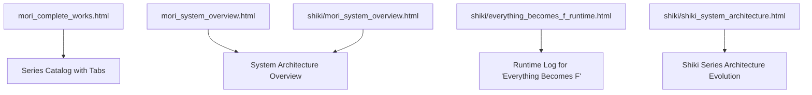
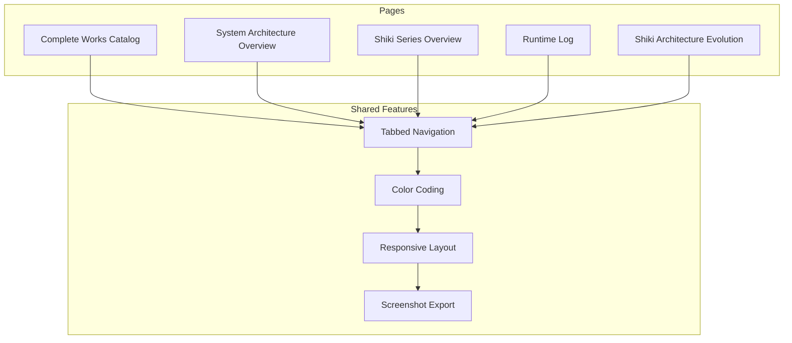
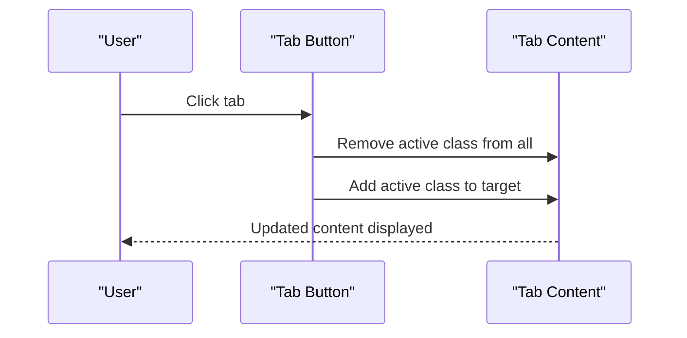
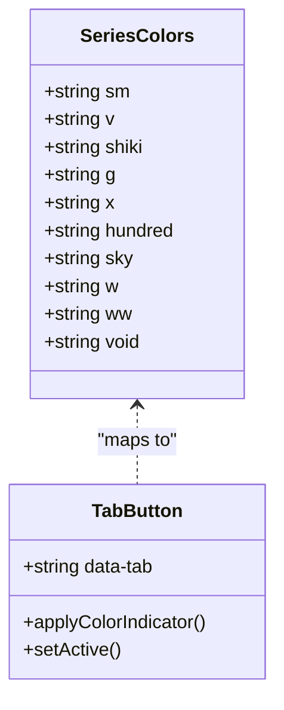
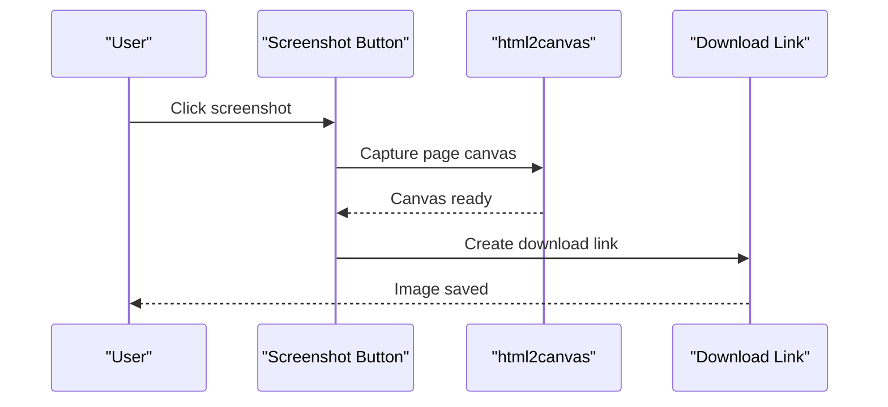

# Getting Started Guide

<cite>
**Referenced Files in This Document**
- [mori_complete_works.html](file://mori_complete_works.html)
- [mori_system_overview.html](file://mori_system_overview.html)
- [shiki/mori_system_overview.html](file://shiki/mori_system_overview.html)
- [shiki/everything_becomes_f_runtime.html](file://shiki/everything_becomes_f_runtime.html)
- [shiki/shiki_system_architecture.html](file://shiki/shiki_system_architecture.html)
</cite>

## Table of Contents
1. [Introduction](#introduction)
2. [Project Structure](#project-structure)
3. [Installation and Offline Access](#installation-and-offline-access)
4. [Browser Compatibility](#browser-compatibility)
5. [Core Components](#core-components)
6. [Architecture Overview](#architecture-overview)
7. [Detailed Component Analysis](#detailed-component-analysis)
8. [Navigation Patterns](#navigation-patterns)
9. [Series Exploration Guide](#series-exploration-guide)
10. [Interactive Features](#interactive-features)
11. [Responsive Design and Mobile Optimization](#responsive-design-and-mobile-optimization)
12. [Beginner Questions and Cross-References](#beginner-questions-and-cross-references)
13. [Troubleshooting Guide](#troubleshooting-guide)
14. [Conclusion](#conclusion)

## Introduction
Welcome to the Mori-universe project, a comprehensive digital archive of author Mori Hiroshi’s literary works presented through an immersive, tabbed interface with color-coded series identification. This guide helps you quickly install, navigate, and explore the universe of Mori’s works offline, understand the tabbed navigation system, explore series catalogs, and use the screenshot feature. It also covers responsive design, mobile optimization, and answers common beginner questions about the literary-to-technical metaphors and cross-referencing system.

## Project Structure
The Mori-universe project consists of several standalone HTML pages that work independently and can be opened directly in any modern browser. The main pages include:
- A complete works catalog with tabbed navigation across all series
- A system architecture overview page with tabs for different views
- A series-specific runtime log for "Everything Becomes F"
- A system architecture evolution page for the Shiki series
- A series overview page mirroring the architecture overview

**Diagram sources**
- [mori_complete_works.html](file://mori_complete_works.html)
- [mori_system_overview.html](file://mori_system_overview.html)
- [shiki/mori_system_overview.html](file://shiki/mori_system_overview.html)
- [shiki/everything_becomes_f_runtime.html](file://shiki/everything_becomes_f_runtime.html)
- [shiki/shiki_system_architecture.html](file://shiki/shiki_system_architecture.html)

**Section sources**
- [mori_complete_works.html](file://mori_complete_works.html)
- [mori_system_overview.html](file://mori_system_overview.html)
- [shiki/mori_system_overview.html](file://shiki/mori_system_overview.html)
- [shiki/everything_becomes_f_runtime.html](file://shiki/everything_becomes_f_runtime.html)
- [shiki/shiki_system_architecture.html](file://shiki/shiki_system_architecture.html)

## Installation and Offline Access
- Download or clone the repository to your local machine.
- Open any of the HTML files directly in your browser (no server required).
- All pages are self-contained with embedded styles and scripts, enabling full offline access.

Benefits:
- No internet connection required after download
- Zero setup—open index-like pages directly
- Portable across devices

**Section sources**
- [mori_complete_works.html](file://mori_complete_works.html)
- [mori_system_overview.html](file://mori_system_overview.html)
- [shiki/mori_system_overview.html](file://shiki/mori_system_overview.html)
- [shiki/everything_becomes_f_runtime.html](file://shiki/everything_becomes_f_runtime.html)
- [shiki/shiki_system_architecture.html](file://shiki/shiki_system_architecture.html)

## Browser Compatibility
- Tested on modern browsers (Chrome, Firefox, Safari, Edge).
- Uses standard HTML5/CSS3 and vanilla JavaScript.
- Responsive design adapts to desktop and mobile screens.

Notes:
- Some advanced features rely on client-side rendering and may require JavaScript enabled.
- The screenshot functionality depends on the html2canvas library loaded from a CDN.

**Section sources**
- [mori_complete_works.html](file://mori_complete_works.html)
- [mori_system_overview.html](file://mori_system_overview.html)
- [shiki/mori_system_overview.html](file://shiki/mori_system_overview.html)
- [shiki/everything_becomes_f_runtime.html](file://shiki/everything_becomes_f_runtime.html)
- [shiki/shiki_system_architecture.html](file://shiki/shiki_system_architecture.html)

## Core Components
- Tabbed navigation system for switching between series and views
- Color-coded series identification for quick visual scanning
- Interactive tables with hover effects and sticky headers
- Screenshot functionality to export the current page as an image
- Responsive layout with media queries for mobile devices

Key features:
- Tab switching logic updates active content dynamically
- Series-specific color themes enhance readability
- Sticky headers keep column labels visible while scrolling
- Fixed-position screenshot button for easy access

**Section sources**
- [mori_complete_works.html](file://mori_complete_works.html)
- [mori_system_overview.html](file://mori_system_overview.html)
- [shiki/mori_system_overview.html](file://shiki/mori_system_overview.html)
- [shiki/everything_becomes_f_runtime.html](file://shiki/everything_becomes_f_runtime.html)
- [shiki/shiki_system_architecture.html](file://shiki/shiki_system_architecture.html)

## Architecture Overview
The project follows a modular, single-page-application-like approach with tabbed content. Each page encapsulates its own navigation, styling, and interactivity. The architecture emphasizes:
- Self-contained HTML pages
- Minimal external dependencies (CDN-hosted html2canvas for screenshots)
- Consistent design tokens and color schemes across pages
- Responsive breakpoints for mobile-first design

**Diagram sources**
- [mori_complete_works.html](file://mori_complete_works.html)
- [mori_system_overview.html](file://mori_system_overview.html)
- [shiki/mori_system_overview.html](file://shiki/mori_system_overview.html)
- [shiki/everything_becomes_f_runtime.html](file://shiki/everything_becomes_f_runtime.html)
- [shiki/shiki_system_architecture.html](file://shiki/shiki_system_architecture.html)

## Detailed Component Analysis

### Tabbed Navigation System
The tabbed interface allows seamless switching between series and views. Each tab button controls visibility of its associated content area.

**Diagram sources**
- [mori_complete_works.html](file://mori_complete_works.html)
- [mori_system_overview.html](file://mori_system_overview.html)
- [shiki/mori_system_overview.html](file://shiki/mori_system_overview.html)

Implementation highlights:
- Event listeners on tab buttons
- Dynamic class toggling for active/inactive states
- ID-based content targeting

**Section sources**
- [mori_complete_works.html](file://mori_complete_works.html)
- [mori_system_overview.html](file://mori_system_overview.html)
- [shiki/mori_system_overview.html](file://shiki/mori_system_overview.html)

### Color-Coded Series Identification
Each series is represented by a distinct color indicator and themed styling. The color scheme is consistent across pages for easy recognition.

**Diagram sources**
- [mori_complete_works.html](file://mori_complete_works.html)
- [mori_system_overview.html](file://mori_system_overview.html)
- [shiki/mori_system_overview.html](file://shiki/mori_system_overview.html)

**Section sources**
- [mori_complete_works.html](file://mori_complete_works.html)
- [mori_system_overview.html](file://mori_system_overview.html)
- [shiki/mori_system_overview.html](file://shiki/mori_system_overview.html)

### Screenshot Functionality
A fixed-position button enables exporting the current page as an image using html2canvas.

**Diagram sources**
- [mori_complete_works.html](file://mori_complete_works.html)
- [mori_system_overview.html](file://mori_system_overview.html)
- [shiki/mori_system_overview.html](file://shiki/mori_system_overview.html)
- [shiki/everything_becomes_f_runtime.html](file://shiki/everything_becomes_f_runtime.html)
- [shiki/shiki_system_architecture.html](file://shiki/shiki_system_architecture.html)

**Section sources**
- [mori_complete_works.html](file://mori_complete_works.html)
- [mori_system_overview.html](file://mori_system_overview.html)
- [shiki/mori_system_overview.html](file://shiki/mori_system_overview.html)
- [shiki/everything_becomes_f_runtime.html](file://shiki/everything_becomes_f_runtime.html)
- [shiki/shiki_system_architecture.html](file://shiki/shiki_system_architecture.html)

## Navigation Patterns
- Use the tab bar at the top to switch between series or views
- Hover over rows in tables to highlight related entries
- Click the screenshot button to export the current view as an image
- On mobile, tabs adapt to smaller screens with adjusted spacing and typography

Step-by-step:
1. Open the desired HTML file in your browser
2. Locate the tab bar near the top of the page
3. Click a tab to reveal its content
4. Explore the series catalog or system overview
5. Use the screenshot button to save your current view

**Section sources**
- [mori_complete_works.html](file://mori_complete_works.html)
- [mori_system_overview.html](file://mori_system_overview.html)
- [shiki/mori_system_overview.html](file://shiki/mori_system_overview.html)
- [shiki/everything_becomes_f_runtime.html](file://shiki/everything_becomes_f_runtime.html)
- [shiki/shiki_system_architecture.html](file://shiki/shiki_system_architecture.html)

## Series Exploration Guide
Explore the 10 major series through the tabbed interface. Each tab reveals a dedicated series page with:
- Series information cards
- Detailed catalogs with publication metadata
- Color-coded theming aligned with the series identity

Series included:
- S&M (Ryōkawa & Moe)
- V Series
- Shiki (Seasons)
- G Series
- X Series
- Century (100 Years)
- Sky Crawlers
- W Series
- WW Series
- Void Shaper

Practical steps:
1. Open the complete works catalog
2. Click a series tab to view its catalog
3. Browse the table for titles, translations, and publication years
4. Use the color indicators to quickly identify series at a glance

**Section sources**
- [mori_complete_works.html](file://mori_complete_works.html)

## Interactive Features
- Tab switching: Instantly toggle between series or views
- Hover effects: Highlight rows in tables for better readability
- Sticky headers: Keep column labels visible while scrolling long lists
- Screenshot export: Save the current page as an image for sharing or archiving

Tips:
- The screenshot button appears fixed in the top-right corner
- On mobile, adjust your viewport to capture the intended content
- Some pages include additional tabs for alternate views (e.g., system evolution)

**Section sources**
- [mori_complete_works.html](file://mori_complete_works.html)
- [mori_system_overview.html](file://mori_system_overview.html)
- [shiki/mori_system_overview.html](file://shiki/mori_system_overview.html)
- [shiki/everything_becomes_f_runtime.html](file://shiki/everything_becomes_f_runtime.html)
- [shiki/shiki_system_architecture.html](file://shiki/shiki_system_architecture.html)

## Responsive Design and Mobile Optimization
The pages employ a mobile-first responsive design:
- Flexible layouts adapt to various screen sizes
- Adjusted typography and spacing for small screens
- Scrollable tables with horizontal overflow support
- Media queries trigger different styles below specific breakpoints

Mobile-friendly features:
- Reduced padding and font sizes on smaller screens
- Compact tab layouts that wrap when space is limited
- Touch-friendly button sizing and spacing

**Section sources**
- [mori_complete_works.html](file://mori_complete_works.html)
- [mori_system_overview.html](file://mori_system_overview.html)
- [shiki/mori_system_overview.html](file://shiki/mori_system_overview.html)
- [shiki/everything_becomes_f_runtime.html](file://shiki/everything_becomes_f_runtime.html)
- [shiki/shiki_system_architecture.html](file://shiki/shiki_system_architecture.html)

## Beginner Questions and Cross-References
Common questions addressed by the project:
- Literary-to-technical metaphors: The system architecture overview and Shiki series architecture pages explain how Mori’s narratives map onto computing concepts (e.g., sandbox escapes, kernel panics, distributed consciousness).
- Cross-referencing system: The architecture pages link related books and concepts across series, helping you trace thematic and technical connections.

Practical guidance:
- Start with the system architecture overview to understand the overarching metaphors
- Use the Shiki architecture evolution page to follow the progression of key ideas
- Cross-reference series-specific pages to locate related concepts across different works

**Section sources**
- [mori_system_overview.html](file://mori_system_overview.html)
- [shiki/mori_system_overview.html](file://shiki/mori_system_overview.html)
- [shiki/shiki_system_architecture.html](file://shiki/shiki_system_architecture.html)

## Troubleshooting Guide
Common issues and solutions:
- Page does not load: Ensure JavaScript is enabled in your browser
- Screenshot fails: Confirm the html2canvas library loads (CDN-based). Try refreshing or using a different browser
- Tables appear clipped on mobile: Scroll horizontally within the table container
- Tabs not switching: Verify the tab buttons are clickable and not disabled by browser extensions

If problems persist:
- Clear your browser cache and reload the page
- Try opening the file in an incognito/private window
- Check that the HTML file is not blocked by local security policies

**Section sources**
- [mori_complete_works.html](file://mori_complete_works.html)
- [mori_system_overview.html](file://mori_system_overview.html)
- [shiki/mori_system_overview.html](file://shiki/mori_system_overview.html)
- [shiki/everything_becomes_f_runtime.html](file://shiki/everything_becomes_f_runtime.html)
- [shiki/shiki_system_architecture.html](file://shiki/shiki_system_architecture.html)

## Conclusion
You are now equipped to explore the Mori-universe offline, navigate the tabbed interface, discover series catalogs, and export views as images. Use the color-coded series identifiers to quickly locate your interests, leverage the responsive design for mobile access, and consult the architecture pages to understand the literary-to-technical metaphors that unify the collection. Enjoy your journey through Mori’s universe.