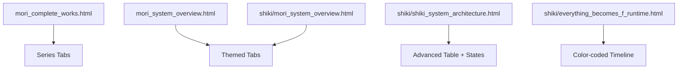
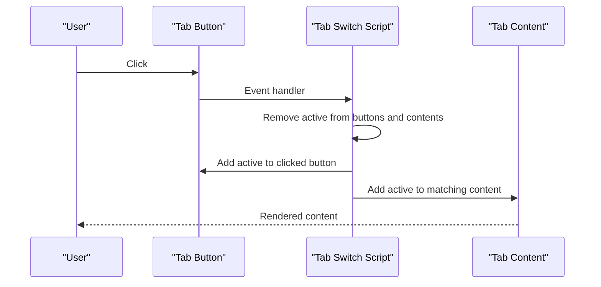
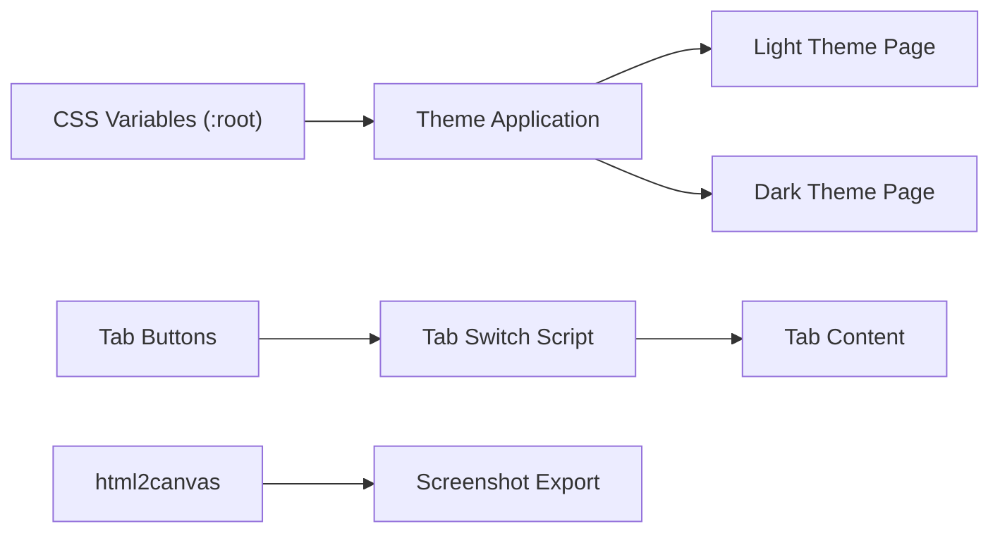

# Integration and Extension

<cite>
**Referenced Files in This Document**
- [mori_complete_works.html](file://mori_complete_works.html)
- [mori_system_overview.html](file://mori_system_overview.html)
- [shiki/mori_system_overview.html](file://shiki/mori_system_overview.html)
- [shiki/shiki_system_architecture.html](file://shiki/shiki_system_architecture.html)
- [shiki/everything_becomes_f_runtime.html](file://shiki/everything_becomes_f_runtime.html)
</cite>

## Table of Contents
1. [Introduction](#introduction)
2. [Project Structure](#project-structure)
3. [Core Components](#core-components)
4. [Architecture Overview](#architecture-overview)
5. [Detailed Component Analysis](#detailed-component-analysis)
6. [Dependency Analysis](#dependency-analysis)
7. [Performance Considerations](#performance-considerations)
8. [Troubleshooting Guide](#troubleshooting-guide)
9. [Conclusion](#conclusion)
10. [Appendices](#appendices)

## Introduction
This document explains how to integrate new series content and extend the Mori-universe project while preserving its pure HTML/CSS/JavaScript architecture. It focuses on:
- Adding new series pages and updating tab-based navigation
- Integrating the color-coded identification system
- Extending visualization components and cross-reference capabilities
- Customizing themes, layouts, and content additions
- Practical guidance for developers and troubleshooting tips

## Project Structure
The project consists of standalone HTML pages with embedded CSS and minimal JavaScript. There are two primary entry points:
- A complete works page with tabbed series navigation
- A system overview page with thematic tabs and advanced visualizations
- Additional specialized pages under the shiki directory for runtime logs and architecture evolution

**Diagram sources**
- [mori_complete_works.html:517-528](file://mori_complete_works.html#L517-L528)
- [mori_system_overview.html:398-403](file://mori_system_overview.html#L398-L403)
- [shiki/mori_system_overview.html:283-288](file://shiki/mori_system_overview.html#L283-L288)
- [shiki/shiki_system_architecture.html:398-409](file://shiki/shiki_system_architecture.html#L398-L409)
- [shiki/everything_becomes_f_runtime.html:318-542](file://shiki/everything_becomes_f_runtime.html#L318-L542)

**Section sources**
- [mori_complete_works.html:1-100](file://mori_complete_works.html#L1-L100)
- [mori_system_overview.html:1-100](file://mori_system_overview.html#L1-L100)
- [shiki/mori_system_overview.html:1-100](file://shiki/mori_system_overview.html#L1-L100)
- [shiki/shiki_system_architecture.html:1-100](file://shiki/shiki_system_architecture.html#L1-L100)
- [shiki/everything_becomes_f_runtime.html:1-100](file://shiki/everything_becomes_f_runtime.html#L1-L100)

## Core Components
- Tabbed navigation system: buttons with data attributes drive visibility of tab content blocks
- CSS variable-based theming: root-level variables define color palettes and UI tokens
- Color-coded identification: series-specific CSS classes and variables connect content to brand colors
- Cross-reference patterns: series identifiers and row markers enable linking across pages
- Screenshot export: html2canvas integration for saving visual snapshots

Key implementation patterns:
- Tab switching logic attaches click handlers to tab buttons and toggles active classes on buttons and content containers
- Color scheme is centralized in :root variables and reused across components via var(--variable)
- Series identification uses class names like .series-sm, .series-v, etc., and CSS variables for accent colors

**Section sources**
- [mori_complete_works.html:925-936](file://mori_complete_works.html#L925-L936)
- [mori_system_overview.html:777-784](file://mori_system_overview.html#L777-L784)
- [shiki/mori_system_overview.html:659-666](file://shiki/mori_system_overview.html#L659-L666)
- [mori_complete_works.html:11-31](file://mori_complete_works.html#L11-L31)
- [shiki/mori_system_overview.html:8-35](file://shiki/mori_system_overview.html#L8-L35)

## Architecture Overview
The system is built around a tabbed interface with CSS-driven theming and lightweight JavaScript for interactivity. Pages share common patterns:
- Tab buttons carry data-tab attributes that map to tab content ids
- Active states are controlled by adding/removing active classes
- Color schemes are defined via CSS variables and applied consistently across typography, borders, and accents

**Diagram sources**
- [mori_complete_works.html:925-936](file://mori_complete_works.html#L925-L936)
- [mori_system_overview.html:777-784](file://mori_system_overview.html#L777-L784)
- [shiki/mori_system_overview.html:659-666](file://shiki/mori_system_overview.html#L659-L666)

## Detailed Component Analysis

### Tabbed Navigation System
- Buttons: Each tab button has a data-tab attribute whose value is prefixed with "tab-" to match the target content id
- Content: Each tab content container has an id that equals "tab-" + data-tab value
- Behavior: On click, the script removes active from all buttons and contents, then adds active to the clicked button and corresponding content

Implementation references:
- Button markup and data attributes
- Tab switching logic in each page’s script block

Practical guidance:
- When adding a new series, mirror the existing pattern: add a new button with data-tab="your_series_key" and a corresponding content container with id="tab-your_series_key"
- Ensure the series key is unique and does not conflict with existing keys

**Section sources**
- [mori_complete_works.html:517-528](file://mori_complete_works.html#L517-L528)
- [mori_complete_works.html:925-936](file://mori_complete_works.html#L925-L936)
- [mori_system_overview.html:398-403](file://mori_system_overview.html#L398-L403)
- [mori_system_overview.html:777-784](file://mori_system_overview.html#L777-L784)
- [shiki/mori_system_overview.html:283-288](file://shiki/mori_system_overview.html#L283-L288)
- [shiki/mori_system_overview.html:659-666](file://shiki/mori_system_overview.html#L659-L666)

### Color-Coded Identification System
- CSS variables: Define a palette in :root for each series (e.g., --sm, --v, --shiki, etc.)
- Series classes: Apply classes like .series-sm, .series-v to rows and headers to apply accent colors
- Tag styles: Use .tag-sm, .tag-v, etc., to style badges and labels consistently

Integration steps:
- Add new series variables to :root
- Assign a dedicated series class to the series content container
- Apply matching tag classes to metadata and badges

Examples from the codebase:
- Root-level variables for light theme
- Series-specific variables and classes for dark theme
- Color-coded badges and tags for runtime timeline

**Section sources**
- [mori_complete_works.html:11-31](file://mori_complete_works.html#L11-L31)
- [mori_complete_works.html:160-170](file://mori_complete_works.html#L160-L170)
- [mori_complete_works.html:223-243](file://mori_complete_works.html#L223-L243)
- [shiki/mori_system_overview.html:8-35](file://shiki/mori_system_overview.html#L8-L35)
- [shiki/mori_system_overview.html:120-150](file://shiki/mori_system_overview.html#L120-L150)
- [shiki/everything_becomes_f_runtime.html:8-27](file://shiki/everything_becomes_f_runtime.html#L8-L27)
- [shiki/everything_becomes_f_runtime.html:198-235](file://shiki/everything_becomes_f_runtime.html#L198-L235)

### Cross-Reference Database Updates
Cross-reference patterns:
- Series identifiers: Use consistent identifiers (e.g., SERIES_0x01) to link across pages
- Row markers: Use classes like .series-sm to mark rows and enable targeted styling
- Metadata tags: Use .meta-tags and .tag-* classes to categorize content for filtering and linking

Extension points:
- Add new series cards with series-id and metadata
- Link series across pages using shared identifiers
- Extend tag systems to support new categories

**Section sources**
- [mori_complete_works.html:535](file://mori_complete_works.html#L535)
- [mori_complete_works.html:540-548](file://mori_complete_works.html#L540-L548)
- [mori_complete_works.html:254-269](file://mori_complete_works.html#L254-L269)

### Visualization Components
- Advanced tables: Multi-phase evolution tables with state indicators and theorem lists
- Timelines: Color-coded episode timelines with badges and system tags
- Dark/light themes: Separate :root palettes for light and dark modes

Customization options:
- Modify :root variables to change global colors
- Adjust table widths and responsive breakpoints
- Extend timeline episodes and phase groups

**Section sources**
- [shiki/shiki_system_architecture.html:410-744](file://shiki/shiki_system_architecture.html#L410-L744)
- [shiki/everything_becomes_f_runtime.html:318-542](file://shiki/everything_becomes_f_runtime.html#L318-L542)
- [shiki/mori_system_overview.html:8-35](file://shiki/mori_system_overview.html#L8-L35)

### Screenshot Export Integration
- html2canvas is included via CDN
- A screenshot button triggers capture with configurable background color and scale
- Download link is programmatically created and triggered

Best practices:
- Ensure consistent background colors for both light and dark themes
- Test scaling and window dimensions for long pages

**Section sources**
- [mori_system_overview.html:388](file://mori_system_overview.html#L388-L389)
- [mori_system_overview.html:785-800](file://mori_system_overview.html#L785-L800)
- [shiki/mori_system_overview.html:667](file://shiki/mori_system_overview.html#L667-L667)
- [shiki/mori_system_overview.html:669-699](file://shiki/mori_system_overview.html#L669-L699)
- [shiki/shiki_system_architecture.html:750](file://shiki/shiki_system_architecture.html#L750-L750)
- [shiki/shiki_system_architecture.html:752-782](file://shiki/shiki_system_architecture.html#L752-L782)

## Dependency Analysis
The pages are loosely coupled and rely on:
- Shared CSS variable definitions for theming
- Consistent class naming for tab switching
- Minimal JavaScript for interactivity

**Diagram sources**
- [mori_complete_works.html:11-31](file://mori_complete_works.html#L11-L31)
- [mori_system_overview.html:777-784](file://mori_system_overview.html#L777-L784)
- [shiki/mori_system_overview.html:659-666](file://shiki/mori_system_overview.html#L659-L666)

**Section sources**
- [mori_complete_works.html:11-31](file://mori_complete_works.html#L11-L31)
- [mori_system_overview.html:777-784](file://mori_system_overview.html#L777-L784)
- [shiki/mori_system_overview.html:659-666](file://shiki/mori_system_overview.html#L659-L666)

## Performance Considerations
- Pure HTML/CSS/JavaScript keeps load times low and avoids external framework overhead
- CSS variables reduce duplication and improve maintainability
- Lightweight tab switching avoids heavy DOM manipulation
- Screenshot export uses a CDN library; consider lazy loading for non-critical paths

## Troubleshooting Guide
Common issues and resolutions:
- Tab not switching: Verify data-tab attribute matches the tab content id prefix
- Colors not applying: Confirm series classes and CSS variables are defined in :root
- Screenshot fails: Check background color and window dimensions; ensure html2canvas is loaded
- Responsive layout glitches: Review media queries and ensure adequate padding for small screens

**Section sources**
- [mori_complete_works.html:925-936](file://mori_complete_works.html#L925-L936)
- [mori_system_overview.html:777-784](file://mori_system_overview.html#L777-L784)
- [shiki/mori_system_overview.html:659-666](file://shiki/mori_system_overview.html#L659-L666)
- [shiki/shiki_system_architecture.html:752-782](file://shiki/shiki_system_architecture.html#L752-L782)

## Conclusion
The Mori-universe project offers a clean, extensible foundation for adding new series and enhancing visualizations. By following the established patterns for tabbed navigation, color-coded theming, and cross-references, developers can integrate new content while maintaining consistency and performance.

## Appendices

### Practical Extension Playbook
- Adding a new series page
  - Create a new tab button with data-tab="your_key"
  - Add a corresponding content container with id="tab-your_key"
  - Include series card and table content
  - Add CSS variables and series classes for color coding
- Customizing themes
  - Modify :root variables to adjust global colors
  - Update tab button and content styles for consistency
- Extending cross-references
  - Use consistent series identifiers and metadata tags
  - Link related content across pages using shared identifiers
- Maintaining architecture
  - Keep all logic in embedded scripts
  - Prefer CSS variables for theming
  - Validate responsive behavior across screen sizes

[No sources needed since this section provides general guidance]