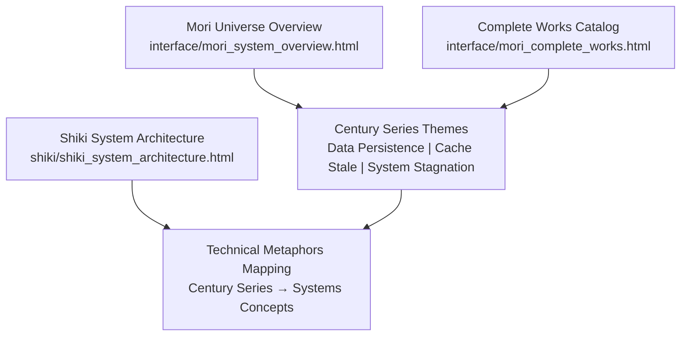
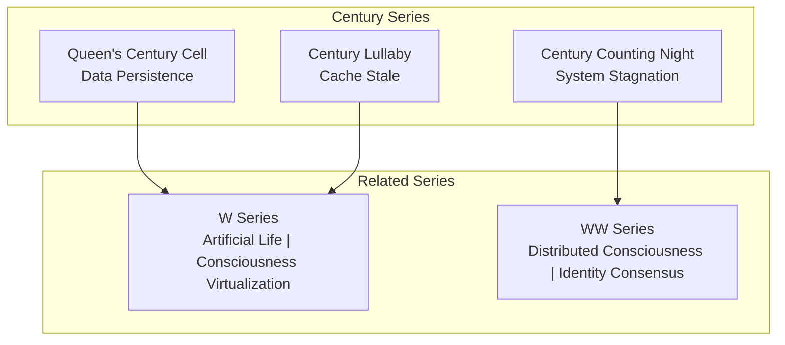
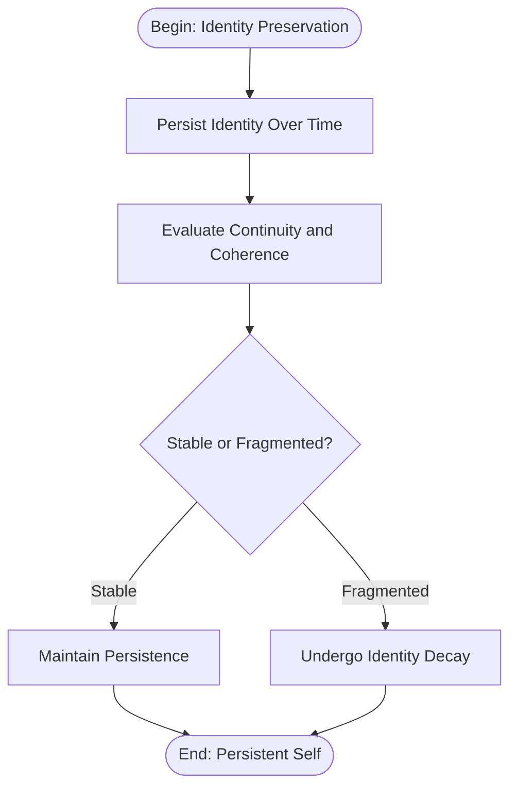
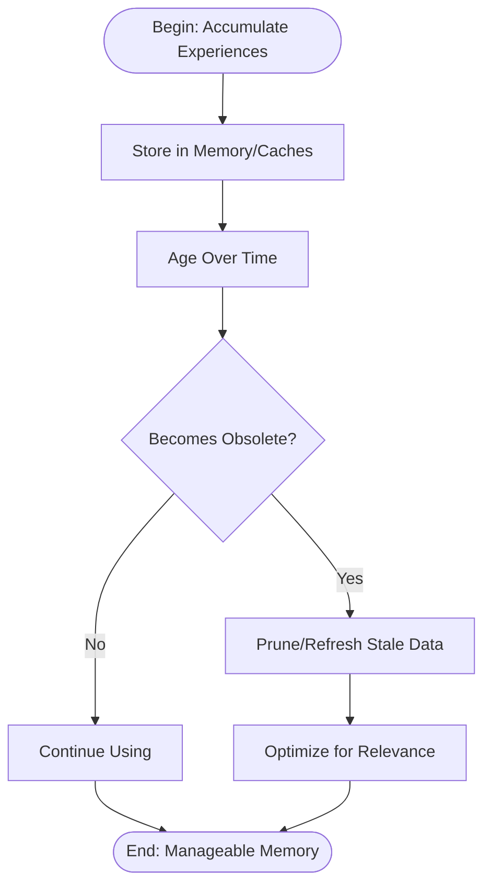
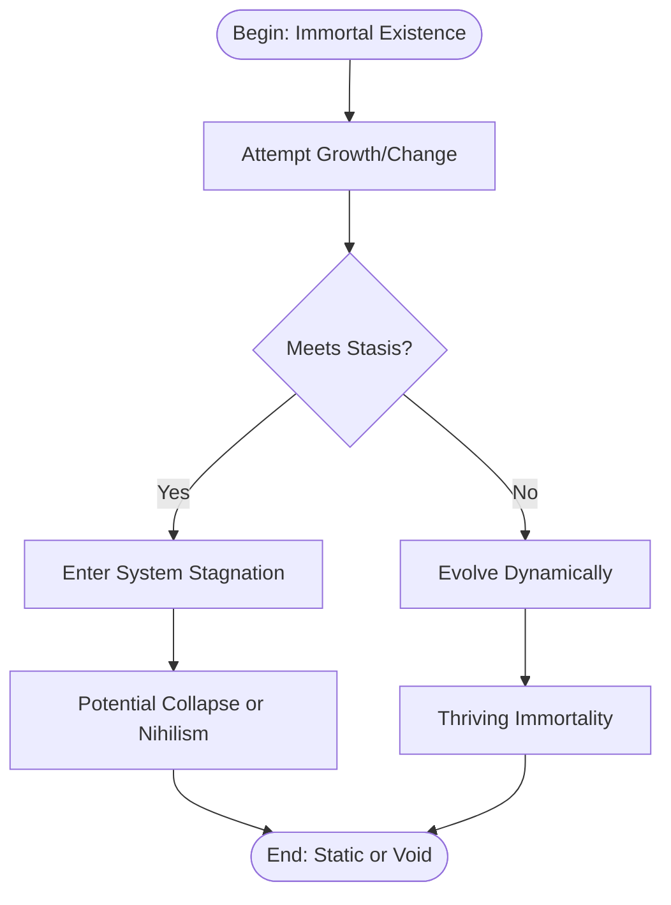
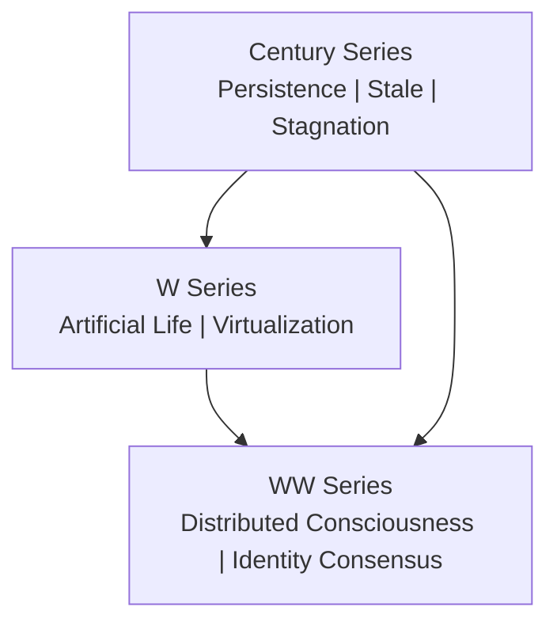
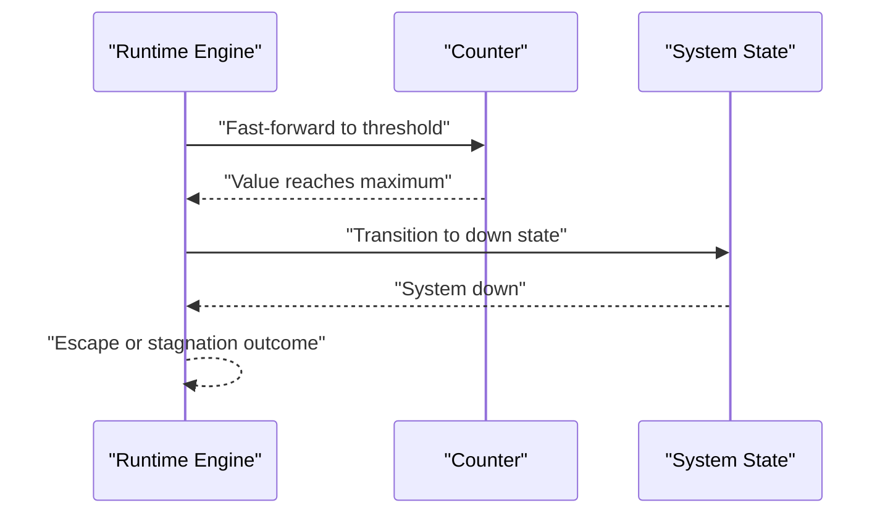
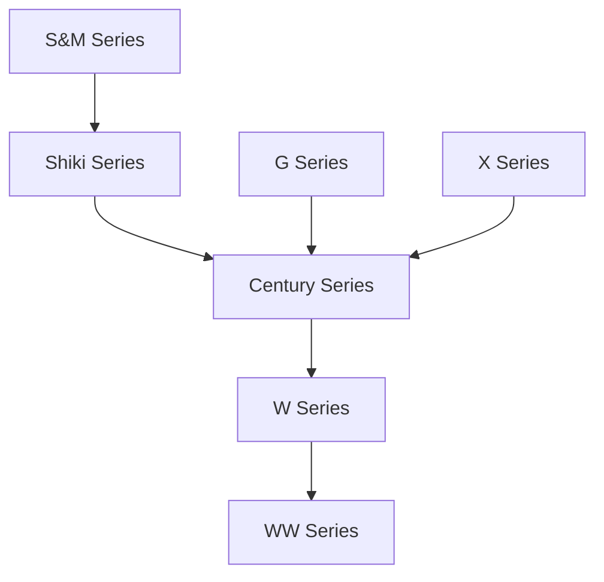
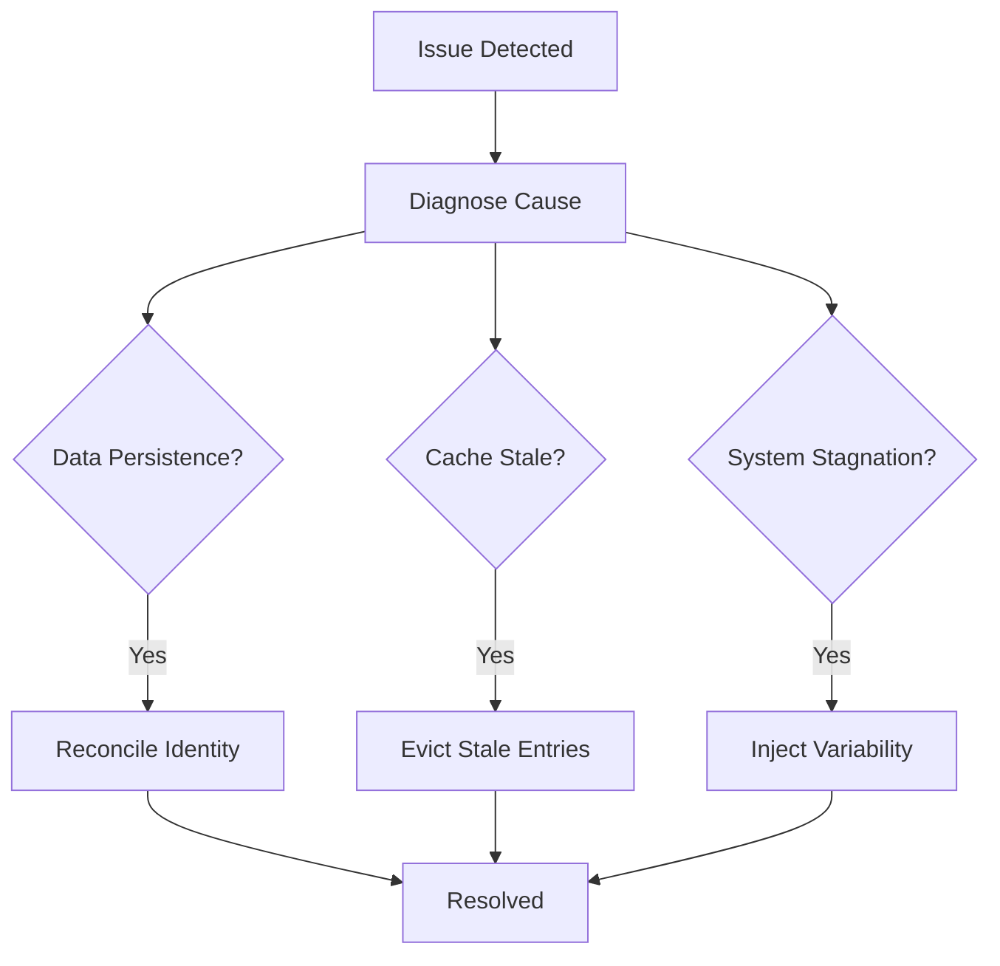

# Century Series (Immortality)

<cite>
**Referenced Files in This Document**
- [mori_system_overview.html](file://interface/mori_system_overview.html)
- [mori_complete_works.html](file://interface/mori_complete_works.html)
- [shiki_system_architecture.html](file://shiki/shiki_system_architecture.html)
- [runtime.py](file://everything_becomes_f/runtime.py)
- [sealed_room.py](file://everything_becomes_f/sealed_room.py)
- [test_l3_system.py](file://tests/test_l3_system.py)
</cite>

## Table of Contents
1. [Introduction](#introduction)
2. [Project Structure](#project-structure)
3. [Core Components](#core-components)
4. [Architecture Overview](#architecture-overview)
5. [Detailed Component Analysis](#detailed-component-analysis)
6. [Dependency Analysis](#dependency-analysis)
7. [Performance Considerations](#performance-considerations)
8. [Troubleshooting Guide](#troubleshooting-guide)
9. [Conclusion](#conclusion)
10. [Appendices](#appendices)

## Introduction
This document analyzes the Century Series within the Mori universe as a philosophical and technical meditation on immortality, stagnation, and the paradoxes of eternal existence. The series uses the technical metaphors of Data Persistence, Cache Stale, and System Stagnation to explore whether immortality is truly desirable when it implies the cessation of meaningful change and growth. It documents how each book demonstrates that eternal life might be equivalent to system stagnation, and it connects the Century Series to the broader narrative arc toward distributed consciousness. Finally, it positions the Century Series as part of the “Endgame” trilogy alongside the W and WW series, exploring the ultimate fate of consciousness in an immortal state.

## Project Structure
The repository provides three primary resources:
- An overview of the Mori universe architecture and thematic evolution across series
- A complete works catalog that lists the Century Series and its core themes
- A system architecture visualization that maps the Century Series to Data Persistence, Cache Stale, and System Stagnation

These materials collectively frame the Century Series as the terminal phase of the universe’s logical and technical evolution, culminating in questions about identity, continuity, and the nature of being.

**Diagram sources**
- [mori_system_overview.html:527–537:527-537](file://interface/mori_system_overview.html#L527-L537)
- [mori_complete_works.html:716–746:716-746](file://interface/mori_complete_works.html#L716-L746)
- [shiki_system_architecture.html:660–711:660-711](file://shiki/shiki_system_architecture.html#L660-L711)

**Section sources**
- [mori_system_overview.html:527–537:527-537](file://interface/mori_system_overview.html#L527-L537)
- [mori_complete_works.html:716–746:716-746](file://interface/mori_complete_works.html#L716-L746)
- [shiki_system_architecture.html:660–711:660-711](file://shiki/shiki_system_architecture.html#L660-L711)

## Core Components
- Century Series (three books): Queen’s Century Cell, Century Lullaby, Century Counting Night
- Core technical metaphors:
  - Data Persistence: the persistence of identity across time and systems
  - Cache Stale: outdated or obsolete memories and states
  - System Stagnation: the loss of meaningful change and growth under immortality
- Related series and themes:
  - W Series: artificial life and consciousness virtualization
  - WW Series: distributed consciousness and identity consensus
  - Endgame narrative: the convergence toward distributed awareness and global emergence

These components form the backbone of the analysis, linking literary themes to systems concepts and tracing their evolution through the Mori universe.

**Section sources**
- [mori_system_overview.html:527–537:527-537](file://interface/mori_system_overview.html#L527-L537)
- [mori_system_overview.html:666–680:666-680](file://interface/mori_system_overview.html#L666-L680)
- [mori_complete_works.html:716–746:716-746](file://interface/mori_complete_works.html#L716-L746)

## Architecture Overview
The Century Series occupies the terminal phase of the Mori universe’s evolution. It explores the implications of immortality through the lens of systems design:
- Data Persistence: the challenge of maintaining coherent identity over extended periods
- Cache Stale: the decay of relevance and meaning in stored experiences
- System Stagnation: the erosion of novelty and growth under endless continuation

**Diagram sources**
- [mori_system_overview.html:527–537:527-537](file://interface/mori_system_overview.html#L527-L537)
- [mori_system_overview.html:666–680:666-680](file://interface/mori_system_overview.html#L666-L680)

**Section sources**
- [mori_system_overview.html:527–537:527-537](file://interface/mori_system_overview.html#L527-L537)
- [mori_system_overview.html:666–680:666-680](file://interface/mori_system_overview.html#L666-L680)

## Detailed Component Analysis

### Century Series: Data Persistence
- Theme: The persistence of identity and memory across centuries
- Technical metaphor: Data Persistence
- Narrative implication: If identity persists indefinitely, what costs are paid for continuity? How do we maintain coherence across vast spans of time?

Practical examples in the series:
- The Queen’s Century Cell: a sealed chamber representing the preservation of a single identity across time
- The challenge of reconciling historical records with present reality
- The burden of carrying the past while attempting to remain meaningful

**Diagram sources**
- [mori_system_overview.html:527–537:527-537](file://interface/mori_system_overview.html#L527-L537)

**Section sources**
- [mori_system_overview.html:527–537:527-537](file://interface/mori_system_overview.html#L527-L537)

### Century Series: Cache Stale
- Theme: The obsolescence of memories and states under immortality
- Technical metaphor: Cache Stale
- Narrative implication: As time passes, stored experiences become irrelevant. How do we manage the accumulation of stale data without losing meaning?

Practical examples in the series:
- Century Lullaby: the gentle lullaby of forgotten histories
- The gradual irrelevance of past events and identities
- Strategies for pruning or refreshing cached states

**Diagram sources**
- [mori_system_overview.html:527–537:527-537](file://interface/mori_system_overview.html#L527-L537)

**Section sources**
- [mori_system_overview.html:527–537:527-537](file://interface/mori_system_overview.html#L527-L537)

### Century Series: System Stagnation
- Theme: The loss of meaningful change and growth under immortality
- Technical metaphor: System Stagnation
- Narrative implication: Eternal continuation without novelty leads to a static, unevolving state. How do we preserve dynamism in an immortal existence?

Practical examples in the series:
- Century Counting Night: the long night of counting time without progress
- The erosion of curiosity, innovation, and adaptation
- The search for external catalysts to reinvigorate the system

**Diagram sources**
- [mori_system_overview.html:527–537:527-537](file://interface/mori_system_overview.html#L527-L537)

**Section sources**
- [mori_system_overview.html:527–537:527-537](file://interface/mori_system_overview.html#L527-L537)

### Relationship to the Broader Narrative Arc
The Century Series converges with the W and WW series to explore the ultimate fate of consciousness:
- W Series introduces artificial life and consciousness virtualization, blurring the boundary between human and machine
- WW Series delves into distributed consciousness and identity consensus, raising questions about selfhood across nodes
- Together, these series form the “Endgame” trilogy, where the Century Series’ themes of persistence, obsolescence, and stagnation reach their logical conclusion

**Diagram sources**
- [mori_system_overview.html:551–574:551-574](file://interface/mori_system_overview.html#L551-L574)
- [mori_system_overview.html:666–680:666-680](file://interface/mori_system_overview.html#L666-L680)

**Section sources**
- [mori_system_overview.html:551–574:551-574](file://interface/mori_system_overview.html#L551-L574)
- [mori_system_overview.html:666–680:666-680](file://interface/mori_system_overview.html#L666-L680)

### Technical Foundations and Metaphors
The Century Series’ themes are grounded in systems concepts that mirror real-world computing challenges:
- Data Persistence: maintaining identity and state across time
- Cache Stale: managing relevance and obsolescence
- System Stagnation: preserving dynamism and avoiding static states

These metaphors are also reflected in the repository’s runtime and simulation materials, which model overflow and system transitions—echoing the themes of limits, thresholds, and breakdown under extreme conditions.

**Diagram sources**
- [runtime.py:419–456:419-456](file://everything_becomes_f/runtime.py#L419-L456)
- [test_l3_system.py:26–85:26-85](file://tests/test_l3_system.py#L26-L85)

**Section sources**
- [runtime.py:419–456:419-456](file://everything_becomes_f/runtime.py#L419-L456)
- [test_l3_system.py:26–85:26-85](file://tests/test_l3_system.py#L26-L85)

## Dependency Analysis
The Century Series depends on earlier series and themes for its philosophical grounding:
- S&M and Shiki series establish the foundational understanding of systems, identity, and growth
- G and X series introduce networked and legacy concerns
- W and WW series provide the distributed and consensus frameworks that Century Series’ themes converge upon

**Diagram sources**
- [mori_system_overview.html:594–680:594-680](file://interface/mori_system_overview.html#L594-L680)

**Section sources**
- [mori_system_overview.html:594–680:594-680](file://interface/mori_system_overview.html#L594-L680)

## Performance Considerations
- Data Persistence: balancing storage costs against retrieval needs; avoiding unnecessary overhead
- Cache Stale: implementing TTL policies and refresh strategies to prevent bloated or irrelevant caches
- System Stagnation: ensuring mechanisms for novelty and growth to avoid static states

These considerations mirror the narrative stakes: excessive persistence can weigh down identity; stale caches can distort perception; stagnation erodes the very meaning of existence.

[No sources needed since this section provides general guidance]

## Troubleshooting Guide
Common issues and resolutions aligned with the Century Series themes:
- Identity fragmentation under Data Persistence: implement coherence checks and reconciliation protocols
- Irrelevant memories under Cache Stale: apply TTL-based eviction and relevance scoring
- Static behavior under System Stagnation: inject variability and external stimuli to reinvigorate the system

**Diagram sources**
- [mori_system_overview.html:527–537:527-537](file://interface/mori_system_overview.html#L527-L537)

**Section sources**
- [mori_system_overview.html:527–537:527-537](file://interface/mori_system_overview.html#L527-L537)

## Conclusion
The Century Series uses Data Persistence, Cache Stale, and System Stagnation to interrogate the desirability of immortality. By mapping these themes onto systems concepts, the series reveals that eternal existence may equate to system stagnation—where continuity replaces change, relevance fades into obsolescence, and growth becomes impossible. The convergence with the W and WW series positions the Century Series as the “Endgame,” where consciousness must either evolve into distributed awareness or risk dissolution into static persistence.

[No sources needed since this section summarizes without analyzing specific files]

## Appendices
- Century Series catalog and themes:
  - Queen’s Century Cell: Data Persistence
  - Century Lullaby: Cache Stale
  - Century Counting Night: System Stagnation
- Related series:
  - W Series: Artificial Life and Consciousness Virtualization
  - WW Series: Distributed Consciousness and Identity Consensus

**Section sources**
- [mori_complete_works.html:716–746:716-746](file://interface/mori_complete_works.html#L716-L746)
- [mori_system_overview.html:551–574:551-574](file://interface/mori_system_overview.html#L551-L574)
- [mori_system_overview.html:666–680:666-680](file://interface/mori_system_overview.html#L666-L680)