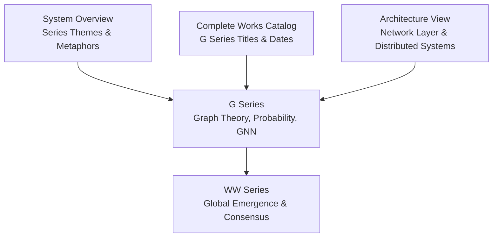
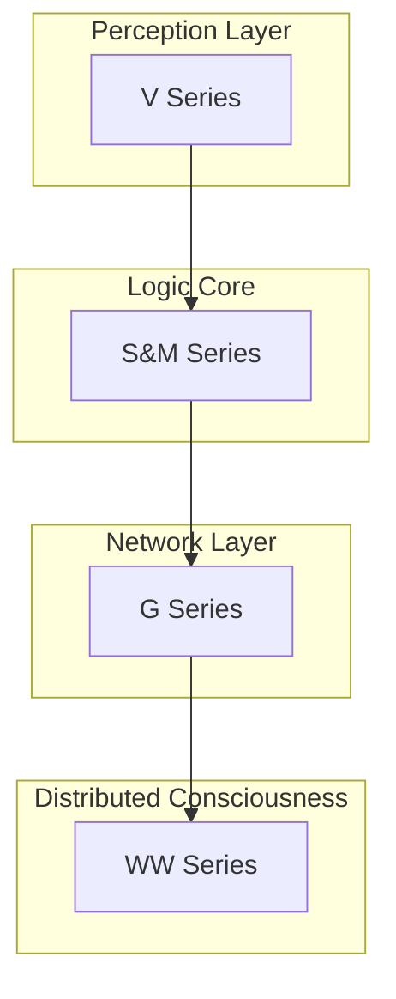
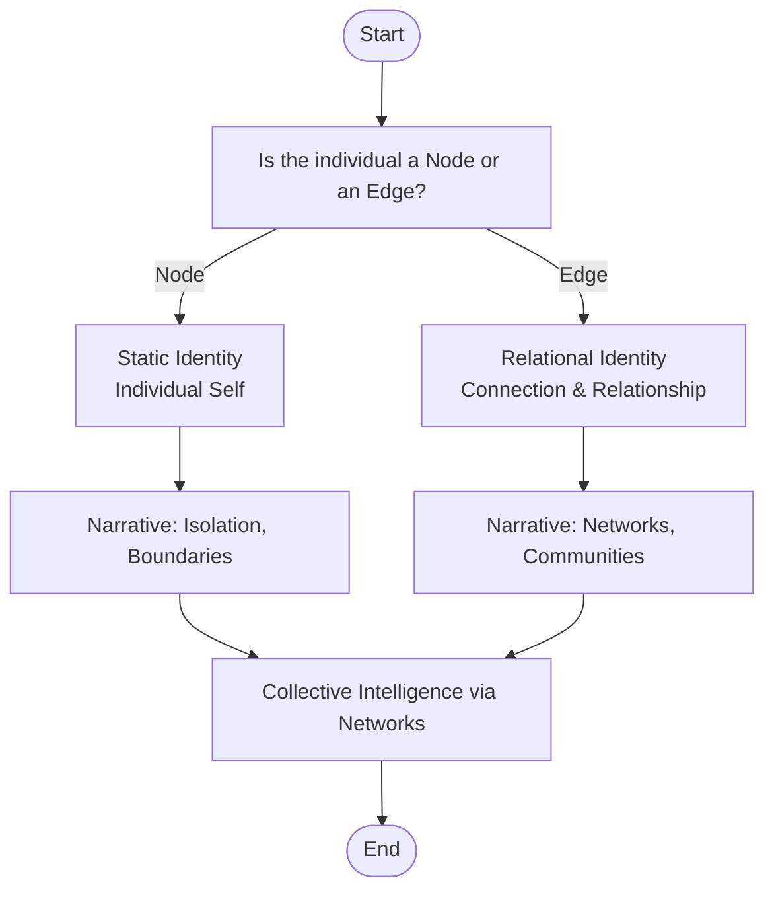
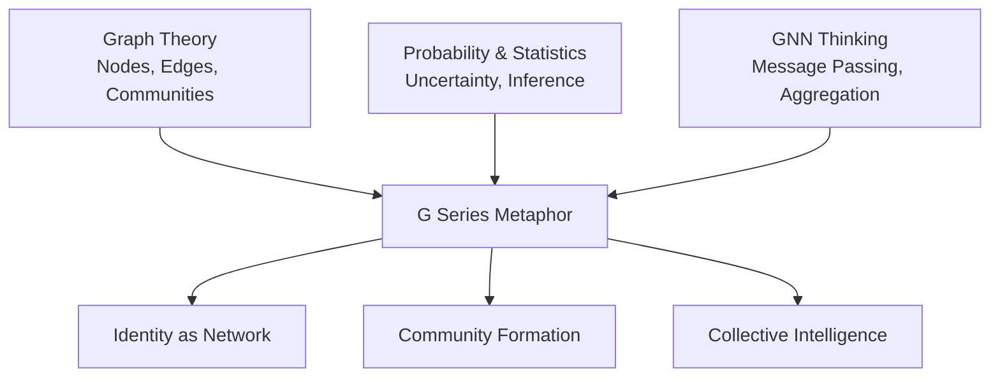
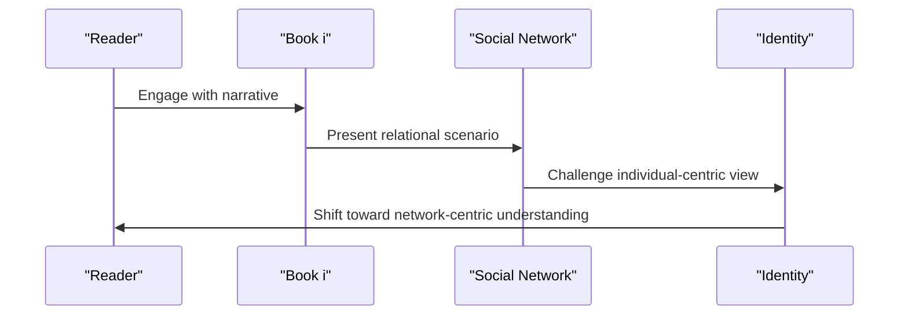
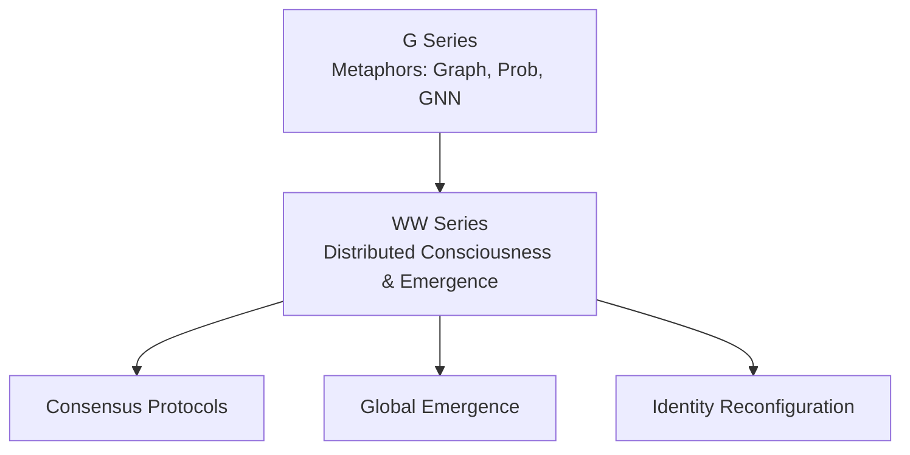
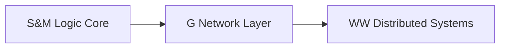

# G Series (Graph Theory and Networks)

<cite>
**Referenced Files in This Document**
- [mori_system_overview.html](file://shiki/mori_system_overview.html)
- [mori_complete_works.html](file://shiki/mori_complete_works.html)
- [shiki_system_architecture.html](file://shiki/shiki_system_architecture.html)
- [mori_system_overview.html](file://interface/mori_system_overview.html)
- [mori_complete_works.html](file://interface/mori_complete_works.html)
</cite>

## Table of Contents
1. [Introduction](#introduction)
2. [Project Structure](#project-structure)
3. [Core Components](#core-components)
4. [Architecture Overview](#architecture-overview)
5. [Detailed Component Analysis](#detailed-component-analysis)
6. [Dependency Analysis](#dependency-analysis)
7. [Performance Considerations](#performance-considerations)
8. [Troubleshooting Guide](#troubleshooting-guide)
9. [Conclusion](#conclusion)

## Introduction
This document presents a deep analysis of the G Series within the Mori universe, focusing on how graph theory, probability/statistics, and graph neural network (GNN) thinking illuminate the nature of identity, relationships, communities, and collective intelligence. The G Series explores the question: is the individual better understood as a node or as an edge in a social network? It charts a progression from isolated individuals to distributed, networked forms of consciousness, culminating in global emergence and consensus protocols that dissolve traditional boundaries of selfhood.

The G Series is positioned as the “Network Layer” of the overall system architecture, bridging the Logic Core (S&M) and the distributed consciousness era (WW). Its technical metaphors—Graph Theory, Probability & Statistics, and GNN Thinking—provide a framework for understanding how relationships, uncertainty, and message passing shape identity and social dynamics.

## Project Structure
The repository organizes the Mori universe into multiple views:
- A high-level system overview that groups series by theme and maps their technical metaphors.
- A complete works catalog that enumerates the G Series titles and publication spans.
- An architecture perspective that connects the G Series to later distributed systems and emergence.

**Diagram sources**
- [mori_system_overview.html:341-352](file://shiki/mori_system_overview.html#L341-L352)
- [mori_complete_works.html:450-480](file://shiki/mori_complete_works.html#L450-L480)
- [shiki_system_architecture.html:676-711](file://shiki/shiki_system_architecture.html#L676-L711)

**Section sources**
- [mori_system_overview.html:341-352](file://shiki/mori_system_overview.html#L341-L352)
- [mori_complete_works.html:450-480](file://shiki/mori_complete_works.html#L450-L480)
- [shiki_system_architecture.html:676-711](file://shiki/shiki_system_architecture.html#L676-L711)

## Core Components
- G Series (11 volumes): Explores identity as either nodes or edges; emphasizes graph-theoretic relationships, probabilistic reasoning, and GNN-style message passing.
- Network Layer positioning: The G Series bridges the Logic Core (S&M) and the distributed consciousness era (WW), establishing the metaphors that underpin later emergence.
- Technical metaphors:
  - Graph Theory: Nodes vs. edges; adjacency; clustering; centrality; community detection.
  - Probability & Statistics: Bayesian reasoning, uncertainty modeling, inference under incomplete information.
  - GNN Thinking: Message passing, aggregation, and update mechanisms across relational structures.

These metaphors collectively challenge the individual-centric paradigm and promote a network-centric understanding of identity and society.

**Section sources**
- [mori_system_overview.html:341-352](file://shiki/mori_system_overview.html#L341-L352)
- [mori_system_overview.html:503-514](file://interface/mori_system_overview.html#L503-L514)

## Architecture Overview
The G Series occupies the “Network Layer” of the Mori universe’s system architecture. It introduces the conceptual and technical foundations that enable later distributed systems and global emergence.

**Diagram sources**
- [mori_system_overview.html:475-488](file://shiki/mori_system_overview.html#L475-L488)
- [mori_system_overview.html:637-650](file://interface/mori_system_overview.html#L637-L650)

**Section sources**
- [mori_system_overview.html:475-488](file://shiki/mori_system_overview.html#L475-L488)
- [mori_system_overview.html:637-650](file://interface/mori_system_overview.html#L637-L650)

## Detailed Component Analysis

### G Series: Identity as Node or Edge
The G Series’ central philosophical proposition is “Node or Edge,” challenging whether identity is better understood as a static node or as a dynamic edge in a relational graph. This question drives narrative and metaphor across the series.

**Diagram sources**
- [mori_system_overview.html:348-350](file://shiki/mori_system_overview.html#L348-L350)

**Section sources**
- [mori_system_overview.html:348-350](file://shiki/mori_system_overview.html#L348-L350)

### Technical Metaphors and Their Application
- Graph Theory: The G Series frames identity and society through nodes (individuals) and edges (relationships). Concepts like clustering, centrality, and community detection inform how identities form, evolve, and merge.
- Probability & Statistics: Uncertainty and incomplete information are central. Characters often infer truths from partial observations, echoing Bayesian reasoning and statistical inference.
- GNN Thinking: Message passing and relational updates mirror how identities change through interactions—each relationship modifies the whole network.

**Diagram sources**
- [mori_system_overview.html:347-350](file://shiki/mori_system_overview.html#L347-L350)

**Section sources**
- [mori_system_overview.html:347-350](file://shiki/mori_system_overview.html#L347-L350)

### Practical Examples Across the Eleven Books
Below is a structured overview of how each book demonstrates the shift from individual-centric to network-centric thinking. While the repository does not include detailed summaries per volume, it provides the titles and publication spans that anchor the analysis.

- φ (Phi) — “φ was broken”: Introduces relational fragility and breakdown; identity as edge becomes unstable.
- θ (Theta) — “θ played with me”: Early relational bonding; edges carry meaning and memory.
- τ (Tau) — “Wait until τ”: Temporal coordination; relationships as evolving processes.
- ε (Epsilon) — “I swear by ε”: Probabilistic commitment; trust as statistical confidence.
- λ (Lambda) — “λ has no teeth”: Power asymmetries; edge weight and influence.
- η (Eta) — “Though η, yet like a dream”: Subjective experience within shared networks.
- α (Alpha) — “Disinfect with α eye drops”: Shared environments; edges as contamination/control vectors.
- β (Beta) — “Is Zig β divine?”: Distributed origins; identity as network expansion.
- γ (Gamma) — “Kiwi γ is clockwork”: Mechanistic relationships; deterministic edges.
- χ (Chi) — “χ tragedy”: Network collapse; systemic failure of edges.
- ψ (Psi) — “ψ tragedy”: Rebuilding from edges; reconstruction of identity through relationships.

**Diagram sources**
- [mori_complete_works.html:450-480](file://shiki/mori_complete_works.html#L450-L480)

**Section sources**
- [mori_complete_works.html:450-480](file://shiki/mori_complete_works.html#L450-L480)

### Connection to Distributed Consciousness and Global Emergence
The G Series lays groundwork for later distributed systems and emergence. The WW Series builds on G Series metaphors—particularly GNN message passing and emergence—to explore consensus, identity fragmentation/reintegration, and global thought.

**Diagram sources**
- [shiki_system_architecture.html:676-711](file://shiki/shiki_system_architecture.html#L676-L711)
- [mori_system_overview.html:475-488](file://shiki/mori_system_overview.html#L475-L488)

**Section sources**
- [shiki_system_architecture.html:676-711](file://shiki/shiki_system_architecture.html#L676-L711)
- [mori_system_overview.html:475-488](file://shiki/mori_system_overview.html#L475-L488)

## Dependency Analysis
The G Series depends conceptually on earlier series while enabling later distributed systems:
- Depends on S&M’s logic core for reasoning frameworks.
- Enables WW’s distributed consciousness through graph-theoretic and probabilistic metaphors.
- Relational structures established in G Series become the substrate for message-passing and emergence in WW.

**Diagram sources**
- [mori_system_overview.html:475-488](file://shiki/mori_system_overview.html#L475-L488)

**Section sources**
- [mori_system_overview.html:475-488](file://shiki/mori_system_overview.html#L475-L488)

## Performance Considerations
- Scalability of relationships: As networks grow, managing edge weights, message propagation, and consensus becomes computationally intensive.
- Robustness to failures: Network resilience mirrors the G Series’ themes—how systems maintain coherence despite broken edges or fragmented nodes.
- Computational limits: The “O(1)” ideal of ultimate freedom (as referenced in later architecture documents) implies a computational limit on the complexity of maintaining global coherence.

[No sources needed since this section provides general guidance]

## Troubleshooting Guide
Common interpretive pitfalls when reading the G Series:
- Over-identifying with nodes: Mistakenly treating characters as static individuals rather than dynamic edges in a network.
- Ignoring probabilistic uncertainty: Dismissing nuanced, uncertain relationships in favor of rigid certainties.
- Neglecting message-passing effects: Failing to see how interactions propagate and reshape identity across the network.

Recommended strategies:
- Map relationships as edges and track how they evolve over time.
- Apply Bayesian reasoning to assess the strength of evidence behind claims.
- Model identity changes as message-passing outcomes across relational structures.

[No sources needed since this section provides general guidance]

## Conclusion
The G Series reorients identity from the individual node to the relational edge, using graph theory, probability/statistics, and GNN thinking to explain community formation and collective intelligence. Positioned as the Network Layer, it bridges the Logic Core and the distributed consciousness era, establishing metaphors that enable later emergence and consensus. By viewing individuals as edges, the G Series invites readers to embrace a network-centric understanding of self and society.