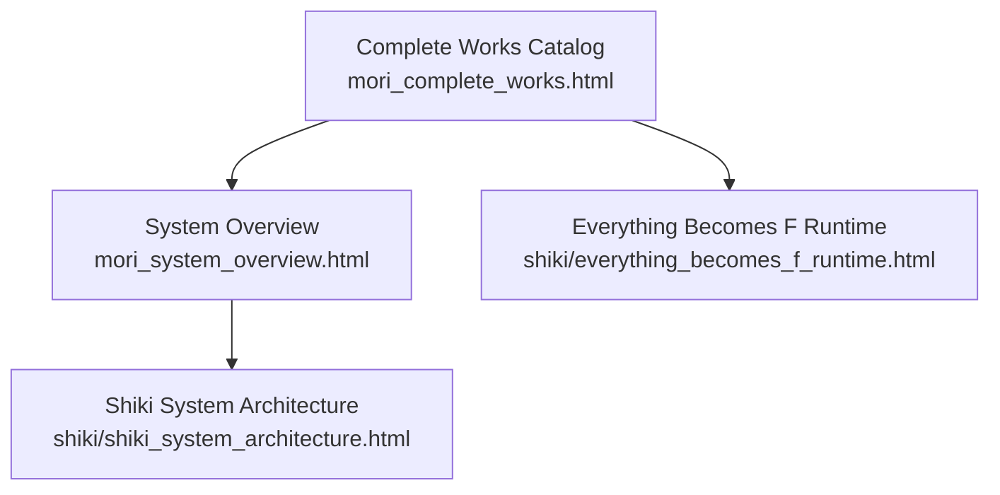
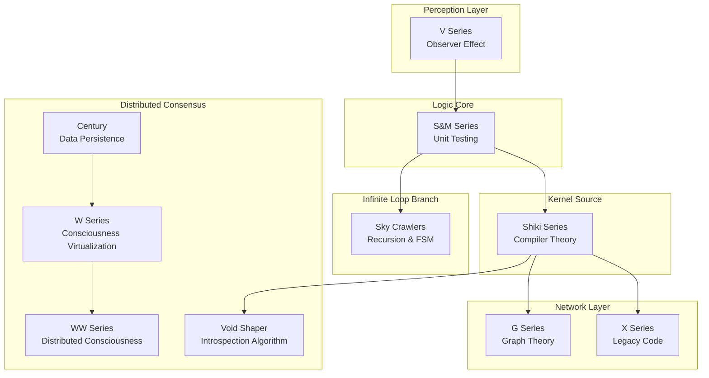
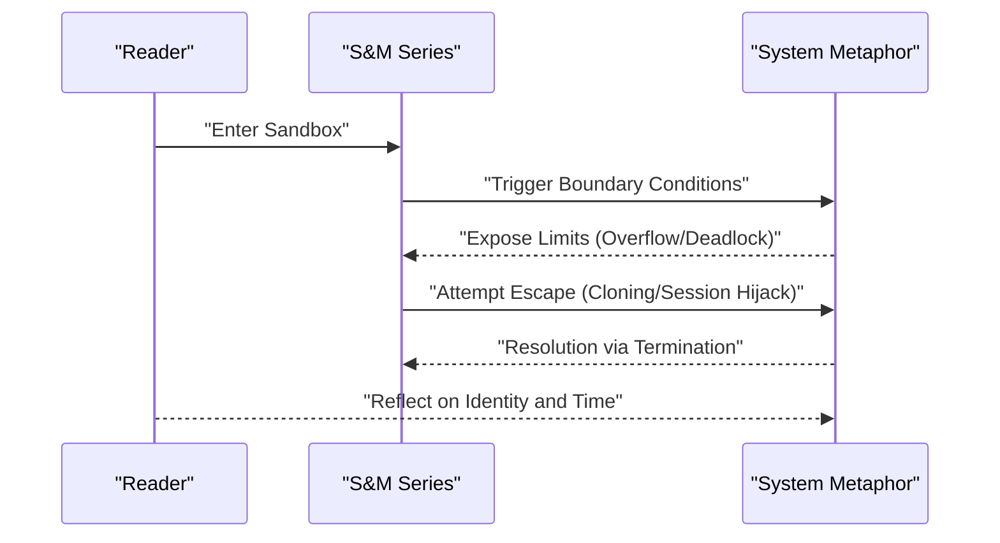
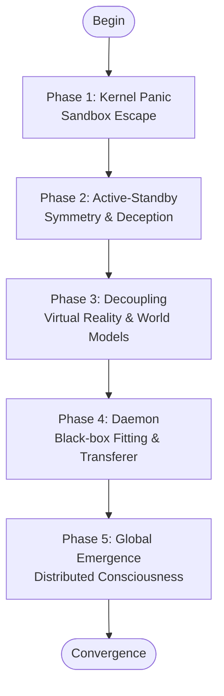
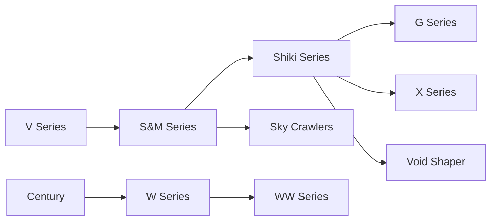

# Literary Series Analysis

<cite>
**Referenced Files in This Document**
- [mori_complete_works.html](file://mori_complete_works.html)
- [mori_system_overview.html](file://mori_system_overview.html)
- [shiki_system_architecture.html](file://shiki/shiki_system_architecture.html)
- [everything_becomes_f_runtime.html](file://shiki/everything_becomes_f_runtime.html)
</cite>

## Table of Contents
1. [Introduction](#introduction)
2. [Project Structure](#project-structure)
3. [Core Components](#core-components)
4. [Architecture Overview](#architecture-overview)
5. [Detailed Component Analysis](#detailed-component-analysis)
6. [Dependency Analysis](#dependency-analysis)
7. [Performance Considerations](#performance-considerations)
8. [Troubleshooting Guide](#troubleshooting-guide)
9. [Conclusion](#conclusion)
10. [Appendices](#appendices)

## Introduction
This document presents a comprehensive literary series analysis of Mori Hiroshi’s major works, mapping literary concepts to programming and technical principles. It explains the methodology for cross-referencing between series, the color-coded identification system, and the chronological organization of the complete works catalog. The analysis focuses on ten major series and their technical metaphors, providing both conceptual overviews for literary analysis and technical details for programmers. Practical examples demonstrate how each series connects to programming principles such as sandbox escape, pattern recognition, kernel source, graph theory, recursion, and distributed consciousness.

## Project Structure
The repository organizes the Mori universe across three primary HTML documents:
- Complete Works Catalog: Presents the ten major series with metadata, publication years, and thematic summaries.
- System Overview: Provides a unified mapping of each series to mathematical/logical/programming/AI principles and philosophical propositions.
- Shiki System Architecture: Focuses on the evolution of the protagonist真贺田四季 (Magata Shiki) through a five-phase system architecture lens, linking episodes to system concepts.
- Everything Becomes F Runtime: A runtime log of the first novel in the S&M series, structured as a timeline of system phases and events.

**Diagram sources**
- [mori_complete_works.html:1-723](file://mori_complete_works.html#L1-L723)
- [mori_system_overview.html:1-702](file://mori_system_overview.html#L1-L702)
- [shiki_system_architecture.html:1-785](file://shiki/shiki_system_architecture.html#L1-L785)
- [everything_becomes_f_runtime.html:1-587](file://shiki/everything_becomes_f_runtime.html#L1-L587)

**Section sources**
- [mori_complete_works.html:1-723](file://mori_complete_works.html#L1-L723)
- [mori_system_overview.html:1-702](file://mori_system_overview.html#L1-L702)
- [shiki_system_architecture.html:1-785](file://shiki/shiki_system_architecture.html#L1-L785)
- [everything_becomes_f_runtime.html:1-587](file://shiki/everything_becomes_f_runtime.html#L1-L587)

## Core Components
- Ten Major Series: S&M, V, Shiki, G, X, Century, Sky Crawlers, W, WW, Void Shaper.
- Color-Coded Identification: Each series is associated with a distinct color variable and tab indicator for visual navigation and thematic grouping.
- Cross-Reference Methodology: Series are linked via shared technical metaphors, recurring protagonists (notably真贺田四季), and temporal progression across the catalog.
- Chronological Organization: The complete works catalog lists publication years and series durations, enabling a temporal reading order.

Implementation highlights:
- Series metadata and thematic summaries are embedded in the Complete Works Catalog.
- Unified mapping of series to technical/AI principles and philosophical propositions resides in the System Overview.
- Shiki’s evolution is presented as a five-phase system architecture with episode-level mappings.
- The Everything Becomes F Runtime provides a granular, phase-by-phase runtime interpretation of the first S&M novel.

**Section sources**
- [mori_complete_works.html:350-644](file://mori_complete_works.html#L350-L644)
- [mori_system_overview.html:290-427](file://mori_system_overview.html#L290-L427)
- [shiki_system_architecture.html:398-745](file://shiki/shiki_system_architecture.html#L398-L745)
- [everything_becomes_f_runtime.html:318-542](file://shiki/everything_becomes_f_runtime.html#L318-L542)

## Architecture Overview
The architecture of the Mori universe is conceptualized as a layered system:
- Perception Layer (V): Explores observation and cognitive boundaries.
- Logic Core (S&M): The logical kernel where “reason” is tested against sandbox environments and boundary conditions.
- Kernel Source (Shiki): The internal source code of the system—how the mind compiles and persists across lifecycles.
- Network Layer (G/X): Socialization of logic through graphs and legacy systems.
- Infinite Loop Branch (Sky Crawlers): Parallel branches exploring recursive loops and termination problems.
- Distributed Consensus (Century/W/WW): The terminal phase dealing with identity consensus, persistence, and global emergence.

**Diagram sources**
- [mori_system_overview.html:290-520](file://mori_system_overview.html#L290-L520)

**Section sources**
- [mori_system_overview.html:290-520](file://mori_system_overview.html#L290-L520)

## Detailed Component Analysis

### S&M Series (Rational Kernel and Sandbox Escape)
- Purpose: To test the limits of rationality through sandbox environments and boundary conditions.
- Technical Metaphors:
  - Sandbox Escape: Breaking out of isolated environments using internal anomalies.
  - Integer Overflow: System limits exposed by extreme states.
  - Hash Collision: Identity indistinguishability under identical signatures.
  - Concurrency Deadlock: Resource contention leading to system halt.
  - Front-end Rendering Fraud: UI-state desynchronization.
  - Namespace Pollution: Variable name collisions causing confusion.
  - Cache Invalidation: Historical data invalidating current decisions.
  - Session Hijacking: Attention pointer manipulation.
  - Object Cloning: Identity duplication across time/space.
  - Container Escape: Transcending physical/mental containers.
- Literary Themes: Freedom vs. isolation, proof vs. existence, identity vs. replication, time vs. permanence.
- Practical Example: In the Everything Becomes F Runtime, the story progresses through five phases mirroring system stages—cold boot, kernel access, I/O testing, memory dump, and deadlock—culminating in integer overflow and termination.

**Diagram sources**
- [mori_system_overview.html:522-609](file://mori_system_overview.html#L522-L609)
- [everything_becomes_f_runtime.html:318-542](file://shiki/everything_becomes_f_runtime.html#L318-L542)

**Section sources**
- [mori_system_overview.html:522-609](file://mori_system_overview.html#L522-L609)
- [everything_becomes_f_runtime.html:318-542](file://shiki/everything_becomes_f_runtime.html#L318-L542)

### V Series (Pattern Recognition and Observer Effect)
- Purpose: Explore perception and cognition before logical reasoning.
- Technical Metaphors:
  - Pattern Recognition: Psychology and pattern matching.
  - Symmetry Breaking: Observational bias and perceptual distortion.
  - Visual Deception: Addressing errors and misdirection.
- Literary Themes: Subjectivity distorts reality; the observer affects the observed.

**Section sources**
- [mori_system_overview.html:317-328](file://mori_system_overview.html#L317-L328)

### Shiki Series (Kernel Source and Lifecycle Management)
- Purpose: Depict the compilation and persistence of the mind across lifecycles.
- Technical Metaphors:
  - Kernel Source: Internal system source code.
  - Lifecycle Management: Growth and optimization phases.
  - State Persistence: Identity crossing carriers.
- Literary Themes: Genius as system compilation; transcendence of physical constraints.

**Diagram sources**
- [shiki_system_architecture.html:410-679](file://shiki/shiki_system_architecture.html#L410-L679)

**Section sources**
- [shiki_system_architecture.html:410-679](file://shiki/shiki_system_architecture.html#L410-L679)

### G Series (Graph Theory and Network Thinking)
- Purpose: Investigate identity as nodes or edges—relationships as the fundamental reality.
- Technical Metaphors:
  - Graph Theory: Nodes and edges.
  - Probability & Statistics: Probabilistic reasoning.
  - GNN Thinking: Graph neural network reasoning.
- Literary Themes: Individual vs. connection; the web as substrate.

**Section sources**
- [mori_system_overview.html:342-352](file://mori_system_overview.html#L342-L352)

### X Series (Structural Engineering and Legacy Code)
- Purpose: Address technical debt and maintaining legacy systems.
- Technical Metaphors:
  - Structural Engineering: Physical and logical frameworks.
  - Reverse Engineering: Understanding existing systems.
  - Legacy Code: Maintenance vs. rewriting.
- Literary Themes: Weight of history; difficulty of change without breaking continuity.

**Section sources**
- [mori_system_overview.html:354-364](file://mori_system_overview.html#L354-L364)

### Century Series (Data Persistence and Immortality Paradox)
- Purpose: Examine immortality and stagnation.
- Technical Metaphors:
  - Data Persistence: Eternal storage.
  - Cache Stale: Outdated states affecting decisions.
  - System Stagnation: Lack of change as death.
- Literary Themes: Eternity equals stillness; the cost of endless life.

**Section sources**
- [mori_system_overview.html:366-376](file://mori_system_overview.html#L366-L376)

### Sky Crawlers (Recursion and Infinite Loop)
- Purpose: Explore recursive processes without base cases.
- Technical Metaphors:
  - Recursion & Base Case: Recursive functions.
  - FSM: Finite state machines.
  - Infinite Loop: Unending processes.
- Literary Themes: Meaning without termination; process as purpose.

**Section sources**
- [mori_system_overview.html:378-388](file://mori_system_overview.html#L378-L388)

### W Series (Artificial Life and Consciousness Virtualization)
- Purpose: Define the boundary between human and artificial life.
- Technical Metaphors:
  - Black-box Fitting: Behavioral mimicry.
  - Artificial Life: Walkalone constructs.
  - Consciousness Virtualization: Transferer existence.
- Literary Themes: Turing Test 2.0; what makes us human?

**Section sources**
- [mori_system_overview.html:390-400](file://mori_system_overview.html#L390-L400)

### WW Series (Distributed Consciousness and Identity Consensus)
- Purpose: Investigate identity across distributed nodes.
- Technical Metaphors:
  - Distributed Consciousness: Fragmented awareness.
  - Decentralization: No central authority.
  - Global Emergence: Collective intelligence.
- Literary Themes: Identity consensus; loneliness amplified or dissolved in the cloud.

**Section sources**
- [mori_system_overview.html:402-412](file://mori_system_overview.html#L402-L412)

### Void Shaper (Introspection Algorithm and Human Nature)
- Purpose: Explore introspection and human nature through martial arts philosophy.
- Technical Metaphors:
  - Introspection Algorithm: Self-analysis.
  - Human Nature Exploration: Philosophical swordplay.
- Literary Themes: Bushido philosophy; self-knowledge through discipline.

**Section sources**
- [mori_system_overview.html:414-424](file://mori_system_overview.html#L414-L424)

## Dependency Analysis
Cross-series dependencies and relationships:
- V precedes S&M: Perception informs logic.
- S&M introduces真贺田四季 as the Root User; her evolution spans Shiki.
- Shiki bridges to G/X (network/socialization), Sky Crawlers (infinite loops), and Century/W/WW (distributed consensus).
- Void Shaper complements Shiki’s introspective journey.

**Diagram sources**
- [mori_system_overview.html:290-427](file://mori_system_overview.html#L290-L427)

**Section sources**
- [mori_system_overview.html:290-427](file://mori_system_overview.html#L290-L427)

## Performance Considerations
- Mapping literary concepts to technical metaphors enhances analytical throughput by leveraging familiar paradigms for both literary scholars and programmers.
- The color-coded identification system accelerates navigation and thematic scanning across the catalog.
- The five-phase Shiki architecture provides a reusable framework for interpreting narrative arcs as system evolution.

## Troubleshooting Guide
Common pitfalls and resolutions:
- Misinterpreting series boundaries: Use the Complete Works Catalog to confirm publication years and series counts.
- Overlooking cross-references: Consult the System Overview for unified mappings and shared technical concepts.
- Confusing metaphors with literal plot details: Apply the runtime log methodology (as in Everything Becomes F) to distinguish metaphorical system stages from narrative events.
- Neglecting temporal progression: Review the chronological organization to avoid misreading cause-effect relationships across series.

**Section sources**
- [mori_complete_works.html:646-667](file://mori_complete_works.html#L646-L667)
- [mori_system_overview.html:290-427](file://mori_system_overview.html#L290-L427)
- [everything_becomes_f_runtime.html:318-542](file://shiki/everything_becomes_f_runtime.html#L318-L542)

## Conclusion
By mapping Mori Hiroshi’s literary series to programming and technical principles, we gain a structured lens for understanding both the literary and computational architectures underlying his work. The color-coded identification system, unified cross-references, and chronological organization enable deep comparative analysis. The five-phase Shiki architecture offers a robust interpretive model, while the Everything Becomes F Runtime demonstrates how individual novels can be understood as system lifecycle traces. This approach benefits both literary analysts and programmers by revealing shared patterns across disciplines.

## Appendices
- Color-coded series identifiers and tab indicators are defined in the Complete Works Catalog and System Overview styles.
- The Complete Works Catalog provides the authoritative list of titles, publication years, and series counts.
- The System Overview consolidates technical/AI principles and philosophical propositions per series.

**Section sources**
- [mori_complete_works.html:1-723](file://mori_complete_works.html#L1-L723)
- [mori_system_overview.html:1-702](file://mori_system_overview.html#L1-L702)