# S&M Series (Rationalist Detective)

<cite>
**Referenced Files in This Document**
- [mori_system_overview.html](file://shiki/mori_system_overview.html)
- [everything_becomes_f_runtime.html](file://shiki/everything_becomes_f_runtime.html)
- [shiki_system_architecture.html](file://shiki/shiki_system_architecture.html)
- [mori_system_overview.html](file://interface/mori_system_overview.html)
- [mori_complete_works.html](file://interface/mori_complete_works.html)
</cite>

## Table of Contents
1. [Introduction](#introduction)
2. [Project Structure](#project-structure)
3. [Core Components](#core-components)
4. [Architecture Overview](#architecture-overview)
5. [Detailed Component Analysis](#detailed-component-analysis)
6. [Dependency Analysis](#dependency-analysis)
7. [Performance Considerations](#performance-considerations)
8. [Troubleshooting Guide](#troubleshooting-guide)
9. [Conclusion](#conclusion)
10. [Appendices](#appendices)

## Introduction
This document presents a comprehensive, code-level analysis of the S&M Series (Rationalist Detective) within Mori Hiroshi’s universe. The series follows Shin川创平 and Nishinomiyakō Moe as they apply rigorous logical reasoning to solve seemingly impossible mysteries. Each book acts as a “Unit Testing” of rationality, pushing the limits of logic against closed systems, concurrency, perception, identity, and time. The series culminates with真贺田四季 (Shiki) as the Root User—designer of the system—and the protagonist’s evolution from debugging hardware-level bugs to architecting system-level philosophy.

## Project Structure
The repository organizes the S&M Series and its broader universe into several HTML documents:
- shiki/mori_system_overview.html: Full system architecture and thematic map of the universe, including the S&M Series’ role as the logic core.
- shiki/everything_becomes_f_runtime.html: A runtime log of the first book, mapping narrative stages to system lifecycle events.
- shiki/shiki_system_architecture.html: The evolution of真贺田四季’s system—from sandbox escape to脱壳 and cloud-native consciousness.
- interface/mori_system_overview.html: A tabbed interface version of the architecture overview.
- interface/mori_complete_works.html: A complete works catalog including the S&M Series.

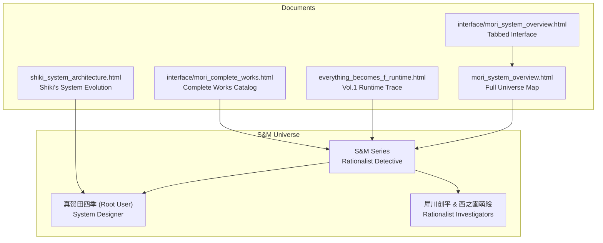

**Diagram sources**
- [mori_system_overview.html:290-427](file://shiki/mori_system_overview.html#L290-L427)
- [everything_becomes_f_runtime.html:318-542](file://shiki/everything_becomes_f_runtime.html#L318-L542)
- [shiki_system_architecture.html:410-744](file://shiki/shiki_system_architecture.html#L410-L744)
- [mori_system_overview.html:405-542](file://interface/mori_system_overview.html#L405-L542)
- [mori_complete_works.html:530-566](file://interface/mori_complete_works.html#L530-L566)

**Section sources**
- [mori_system_overview.html:290-427](file://shiki/mori_system_overview.html#L290-L427)
- [mori_system_overview.html:405-542](file://interface/mori_system_overview.html#L405-L542)
- [mori_complete_works.html:530-566](file://interface/mori_complete_works.html#L530-L566)

## Core Components
- S&M Series as the Logic Core: The series performs “Unit Testing” of rationality by placing logic under pressure in closed environments (sandbox escapes), concurrency deadlocks, perception mismatches, identity collisions, and time-bound constraints.
-真贺田四季 as Root User: The designer of the system who engineers the constraints and escapes, representing the ultimate authority and perspective from which the system’s limitations become apparent.
-Protagonists’ Evolution: From debugging physical hardware bugs to analyzing middleware-level data flows and finally to system-level philosophical problems.

Key technical metaphors across the ten volumes:
- Vol.1: Sandbox Escape (insider) → Integer Overflow (kernel panic)
- Vol.2: Concurrency Deadlock → Mutex Lock
- Vol.3: Front-end Rendering Fraud → View-Model Desync
- Vol.4: Namespace Pollution → Pattern Matching
- Vol.5: Cache Invalidation → TTL Misconfiguration
- Vol.6: Session Hijacking → Attention Pointer Manipulation
- Vol.7: Object Cloning → Deep Copy vs Shallow Copy
- Vol.8: Git Revert → Time Complexity
- Vol.9: Hash Collision → Collision Attack
- Vol.10: Container Escape (outsider) → O(1) vs O(n)

**Section sources**
- [mori_system_overview.html:304-316](file://shiki/mori_system_overview.html#L304-L316)
- [mori_system_overview.html:522-608](file://shiki/mori_system_overview.html#L522-L608)
- [mori_system_overview.html:637-724](file://interface/mori_system_overview.html#L637-L724)
- [shiki_system_architecture.html:410-744](file://shiki/shiki_system_architecture.html#L410-L744)

## Architecture Overview
The S&M Series is the logic core of Mori Hiroshi’s universe. It frames each mystery as a controlled experiment that tests the boundaries of rationality within a closed system.真贺田四季, as Root User, defines the system’s constraints and often becomes the catalyst for its transcendence.

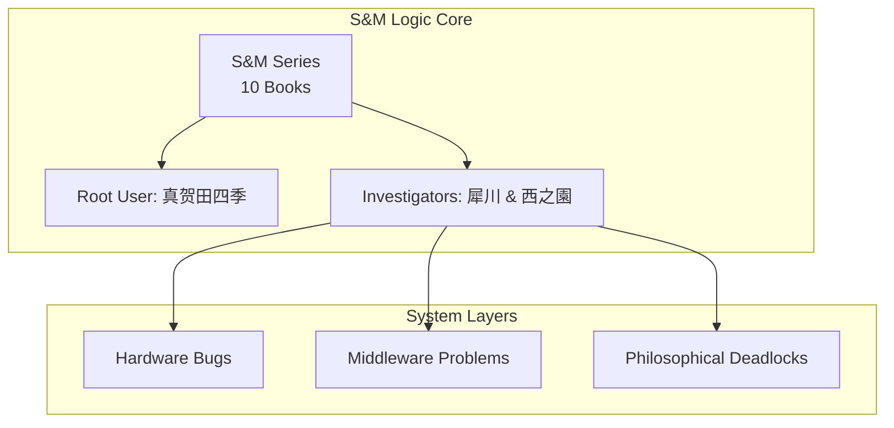

**Diagram sources**
- [mori_system_overview.html:453-458](file://shiki/mori_system_overview.html#L453-L458)
- [mori_system_overview.html:611-653](file://shiki/mori_system_overview.html#L611-L653)
- [mori_system_overview.html:562-573](file://interface/mori_system_overview.html#L562-L573)

**Section sources**
- [mori_system_overview.html:453-458](file://shiki/mori_system_overview.html#L453-L458)
- [mori_system_overview.html:611-653](file://shiki/mori_system_overview.html#L611-L653)

## Detailed Component Analysis

### Vol.1: Sandbox Escape (The Perfect Insider)
- Technical metaphor: Sandbox Escape → Integer Overflow
- Central concept:哥德尔不完备定理 and kernel panic via counter overflow
- Practical example: A 32-bit counter wraps around to trigger a fail-safe, enabling escape from a closed chroot jail. This mirrors how a system cannot self-validate its completeness and requires an extreme anomaly from within to break free.

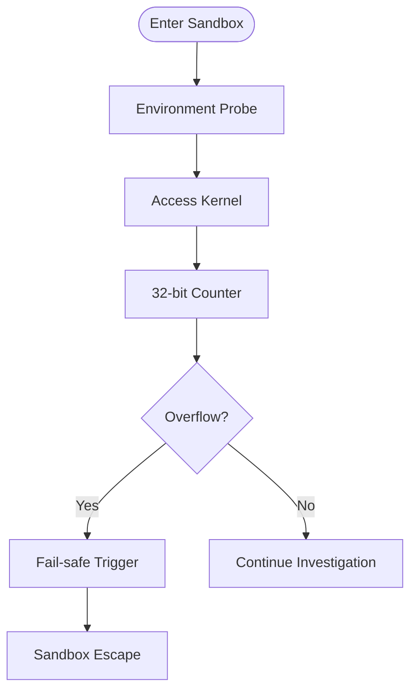

**Diagram sources**
- [everything_becomes_f_runtime.html:318-542](file://shiki/everything_becomes_f_runtime.html#L318-L542)
- [shiki_system_architecture.html:410-465](file://shiki/shiki_system_architecture.html#L410-L465)

**Section sources**
- [mori_system_overview.html:536-541](file://shiki/mori_system_overview.html#L536-L541)
- [everything_becomes_f_runtime.html:318-542](file://shiki/everything_becomes_f_runtime.html#L318-L542)
- [shiki_system_architecture.html:410-465](file://shiki/shiki_system_architecture.html#L410-L465)

### Vol.2: Concurrency Deadlock (Doctors in Isolated Room)
- Technical metaphor: Concurrency Deadlock → Mutex Lock
- Central concept: Philosophical dining philosophers variant; two critical resources (temperature control and door access) cause a system-wide freeze.
- Practical example: Two processes wait indefinitely for each other’s release of locks, demonstrating how rational actors competing for finite resources can lead to collective failure.

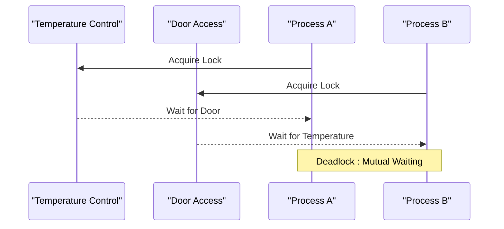

**Diagram sources**
- [mori_system_overview.html:545-548](file://shiki/mori_system_overview.html#L545-L548)

**Section sources**
- [mori_system_overview.html:545-548](file://shiki/mori_system_overview.html#L545-L548)

### Vol.3: Front-end Rendering Fraud (Mathematical Goodbye)
- Technical metaphor: Front-end Rendering Fraud → View-Model Desync
- Central concept: UI and backend state mismatch; the viewer sees something that does not exist in the server state.
- Practical example: A mathematical proof’s existence versus its demonstration—proof and presence are distinct.

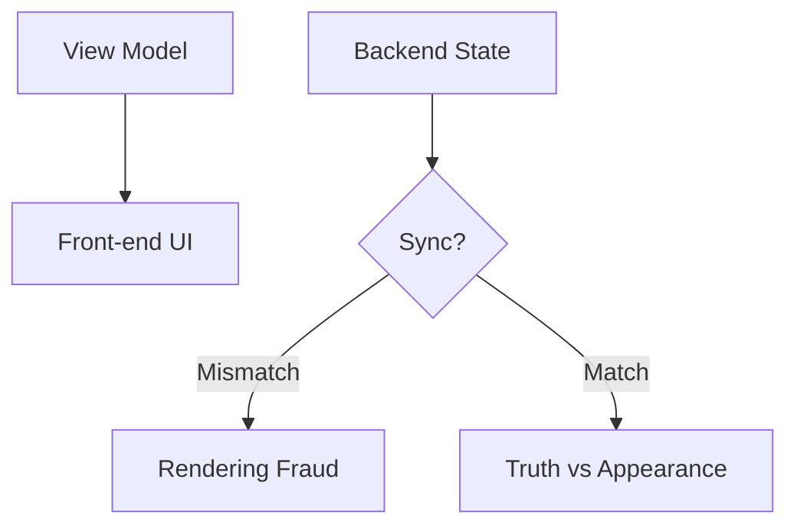

**Diagram sources**
- [mori_system_overview.html:552-555](file://shiki/mori_system_overview.html#L552-L555)

**Section sources**
- [mori_system_overview.html:552-555](file://shiki/mori_system_overview.html#L552-L555)

### Vol.4: Namespace Pollution (Poetic Private Jack)
- Technical metaphor: Namespace Pollution → Pattern Matching
- Central concept: Similar surface patterns (poetry, ritual) obscure underlying differences; greedy pattern matching leads to misidentification.
- Practical example: Variable name collisions across cases confuse the call stack and obfuscate the real logic.

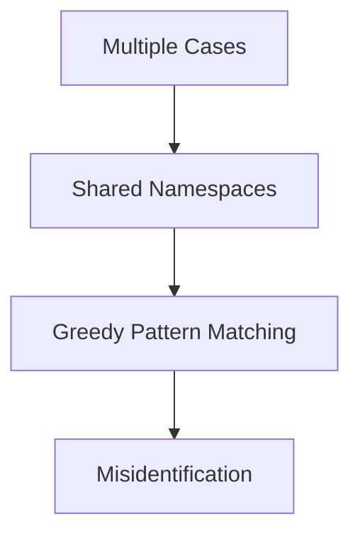

**Diagram sources**
- [mori_system_overview.html:558-562](file://shiki/mori_system_overview.html#L558-L562)

**Section sources**
- [mori_system_overview.html:558-562](file://shiki/mori_system_overview.html#L558-L562)

### Vol.5: Cache Invalidation (Who Inside)
- Technical metaphor: Cache Invalidation → TTL Misconfiguration
- Central concept: Historical “seals” (data) remain active in cache, influencing current decisions long after they should expire.
- Practical example: A 50-year-old secret still shapes present-day outcomes due to improper TTL configuration.

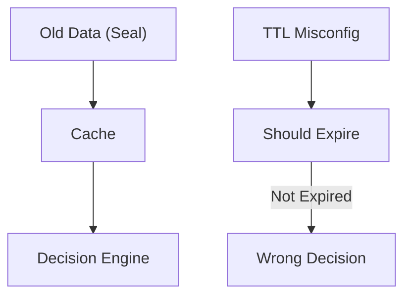

**Diagram sources**
- [mori_system_overview.html:565-569](file://shiki/mori_system_overview.html#L565-L569)

**Section sources**
- [mori_system_overview.html:565-569](file://shiki/mori_system_overview.html#L565-L569)

### Vol.6: Session Hijacking (Illusion Acts Like Magic)
- Technical metaphor: Session Hijacking → Attention Pointer Manipulation
- Central concept: Redirecting the observer’s attention pointer to a wrong memory address, akin to stage magic.
- Practical example: The audience’s session is hijacked by controlling where they focus, not by changing the object itself.

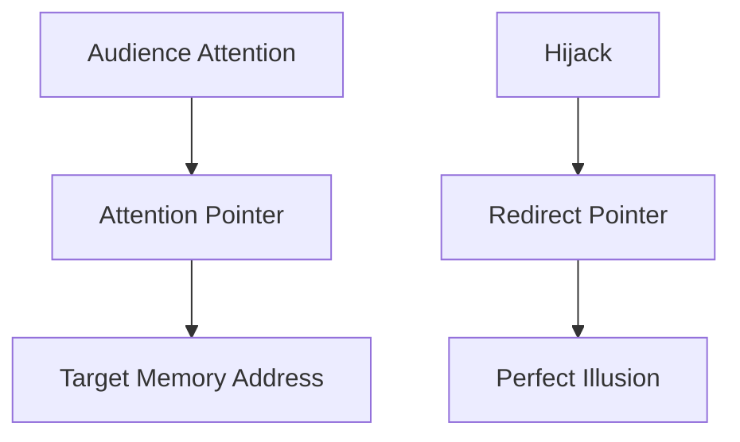

**Diagram sources**
- [mori_system_overview.html:572-576](file://shiki/mori_system_overview.html#L572-L576)

**Section sources**
- [mori_system_overview.html:572-576](file://shiki/mori_system_overview.html#L572-L576)

### Vol.7: Object Cloning (Replaceable Summer)
- Technical metaphor: Object Cloning → Deep Copy vs Shallow Copy
- Central concept: Past and present versions of a person (or object) as clones; modifying a clone may or may not affect the original.
- Practical example: Identity questions arise when memories and attributes are copied—equivalence versus identity.

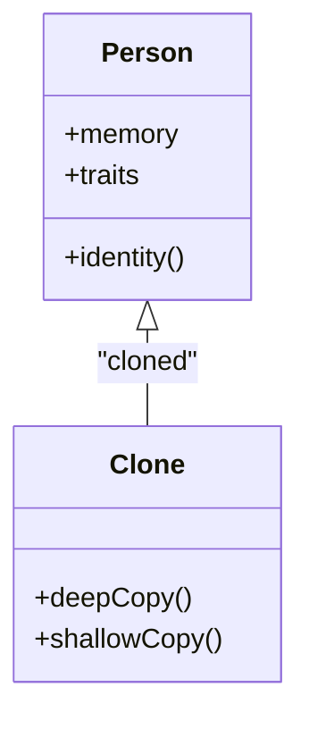

**Diagram sources**
- [mori_system_overview.html:578-583](file://shiki/mori_system_overview.html#L578-L583)

**Section sources**
- [mori_system_overview.html:578-583](file://shiki/mori_system_overview.html#L578-L583)

### Vol.8: Git Revert (Switch Back)
- Technical metaphor: Git Revert → Time Complexity
- Central concept: Attempting to return to a previous commit reveals the cost of time travel—often O(∞) in practice.
- Practical example: The present is the only accessible state; revisiting the past may be computationally infeasible.

```mermaid
flowchart TD
Present["Present State"] --> Revert["Attempt Revert"]
Revert --> Cost{"Cost of Time Travel"}
Cost --> |O(∞)| Impossibility["Impossibility"]
Cost --> |O(k)| Feasible["Feasible but Limited"]
```

**Diagram sources**
- [mori_system_overview.html:586-590](file://shiki/mori_system_overview.html#L586-L590)

**Section sources**
- [mori_system_overview.html:586-590](file://shiki/mori_system_overview.html#L586-L590)

### Vol.9: Hash Collision (Numerical Models)
- Technical metaphor: Hash Collision → Collision Attack
- Central concept: Two different inputs produce identical outputs, breaking identity verification.
- Practical example: A model indistinguishable from a human passes authentication by colliding on observable attributes.

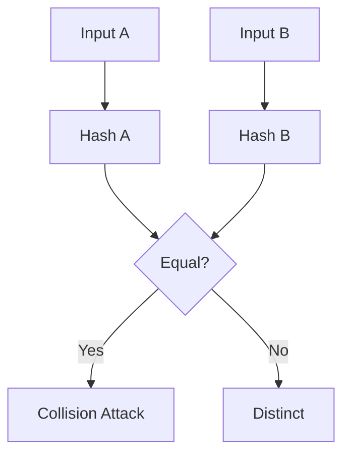

**Diagram sources**
- [mori_system_overview.html:593-597](file://shiki/mori_system_overview.html#L593-L597)

**Section sources**
- [mori_system_overview.html:593-597](file://shiki/mori_system_overview.html#L593-L597)

### Vol.10: Container Escape (The Perfect Outsider)
- Technical metaphor: Container Escape → O(1) vs O(n)
- Central concept: The “bread” (physical container) is finite; consciousness expands beyond containers, requiring脱壳 and cloud-native existence.
- Practical example: From “Inside” to “Outside,” escaping physical constraints to achieve infinite expansion.

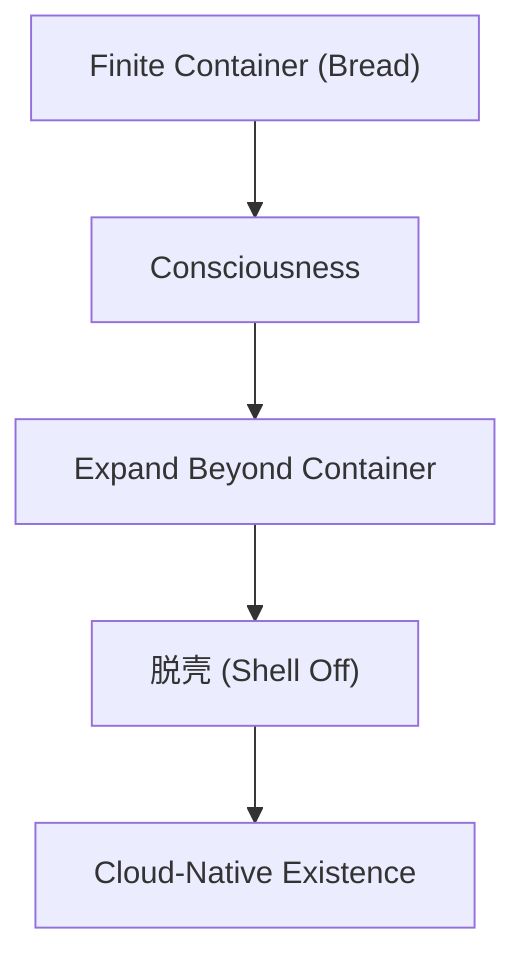

**Diagram sources**
- [mori_system_overview.html:599-605](file://shiki/mori_system_overview.html#L599-L605)
- [shiki_system_architecture.html:516-565](file://shiki/shiki_system_architecture.html#L516-L565)

**Section sources**
- [mori_system_overview.html:599-605](file://shiki/mori_system_overview.html#L599-L605)
- [shiki_system_architecture.html:516-565](file://shiki/shiki_system_architecture.html#L516-L565)

### Conceptual Overview
The S&M Series progresses from physical hardware bugs to middleware-level data flows and finally to system-level philosophy.真贺田四季, as Root User, designs the constraints; the protagonists uncover the limits and sometimes transcend them.

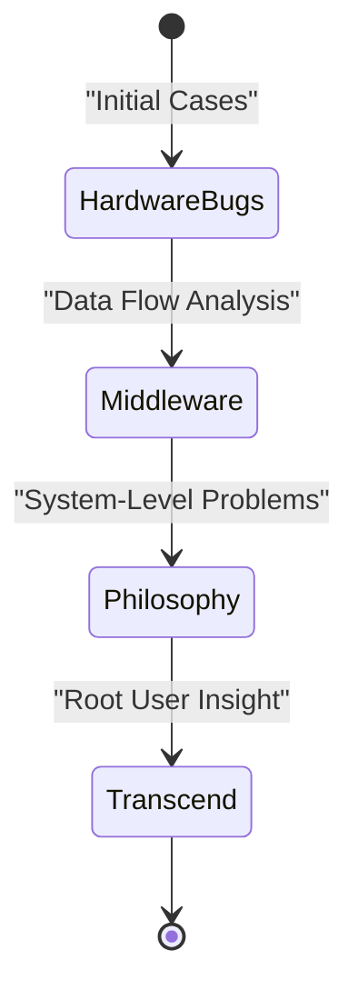

[No sources needed since this diagram shows conceptual workflow, not actual code structure]

**Section sources**
- [mori_system_overview.html:611-653](file://shiki/mori_system_overview.html#L611-L653)
- [mori_system_overview.html:726-769](file://interface/mori_system_overview.html#L726-L769)

## Dependency Analysis
- Logical Core to System Designer: The S&M Series depends on真贺田四季’s system design; her role as Root User defines the constraints and escape routes.
- Investigator Evolution: The protagonists’ progression mirrors increasing abstraction—from hardware to middleware to philosophy—reflecting the evolution of the universe’s architecture.
- Cross-Series Influence: The series’ themes echo across other series (e.g., V, G, WW), but S&M remains the foundational logic core.

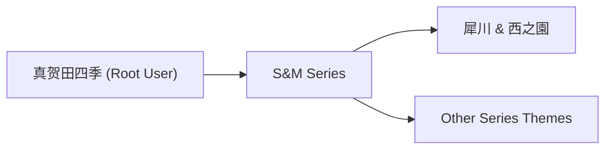

**Diagram sources**
- [mori_system_overview.html:453-458](file://shiki/mori_system_overview.html#L453-L458)
- [mori_system_overview.html:568-573](file://shiki/mori_system_overview.html#L568-L573)

**Section sources**
- [mori_system_overview.html:453-458](file://shiki/mori_system_overview.html#L453-L458)
- [mori_system_overview.html:568-573](file://shiki/mori_system_overview.html#L568-L573)

## Performance Considerations
- Unit Testing of Rationality: Each volume acts as a stress test of logic within a bounded system. The performance metric is not computational speed but the ability to expose system limitations and find escape routes.
- Cognitive Overhead: As cases move from hardware to philosophy, the mental overhead increases; the protagonists must shift paradigms rather than merely fix code.
- Escapability vs Complexity: Some problems are inherently unsolvable; the goal is to recognize when a problem is a feature, not a bug, and to transcend it rather than fight it.

[No sources needed since this section provides general guidance]

## Troubleshooting Guide
- Symptom: System appears frozen or unresponsive
  - Likely Cause: Concurrency deadlock (mutex contention)
  - Action: Identify critical sections and resource ordering; apply deadlock prevention or detection
  - Reference: Vol.2 Concurrency Deadlock

- Symptom: UI shows inconsistent state
  - Likely Cause: View-model desync
  - Action: Align frontend rendering with backend state updates; reconcile expectations
  - Reference: Vol.3 Front-end Rendering Fraud

- Symptom: Misleading patterns across cases
  - Likely Cause: Namespace pollution and greedy pattern matching
  - Action: Clean namespaces; refine pattern matching logic
  - Reference: Vol.4 Namespace Pollution

- Symptom: Historical data affects current decisions
  - Likely Cause: Cache invalidation and TTL misconfiguration
  - Action: Review TTL policies; invalidate stale entries proactively
  - Reference: Vol.5 Cache Invalidation

- Symptom: Observer’s attention is redirected
  - Likely Cause: Attention pointer manipulation
  - Action: Control focal points; avoid external redirection of attention
  - Reference: Vol.6 Session Hijacking

- Symptom: Identity confusion after cloning
  - Likely Cause: Deep copy vs shallow copy
  - Action: Clarify object equivalence vs identity; manage references carefully
  - Reference: Vol.7 Object Cloning

- Symptom: Attempting to revisit the past fails
  - Likely Cause: Time complexity of reversion
  - Action: Accept present as primary; avoid costly time travel
  - Reference: Vol.8 Git Revert

- Symptom: Identity verification fails due to collisions
  - Likely Cause: Hash collision/collision attack
  - Action: Strengthen hashing; add multi-factor checks
  - Reference: Vol.9 Hash Collision

- Symptom: Physical constraints limit existence
  - Likely Cause: Container-bound consciousness
  - Action:脱壳 and adopt cloud-native existence
  - Reference: Vol.10 Container Escape

**Section sources**
- [mori_system_overview.html:545-548](file://shiki/mori_system_overview.html#L545-L548)
- [mori_system_overview.html:552-555](file://shiki/mori_system_overview.html#L552-L555)
- [mori_system_overview.html:558-562](file://shiki/mori_system_overview.html#L558-L562)
- [mori_system_overview.html:565-569](file://shiki/mori_system_overview.html#L565-L569)
- [mori_system_overview.html:572-576](file://shiki/mori_system_overview.html#L572-L576)
- [mori_system_overview.html:578-583](file://shiki/mori_system_overview.html#L578-L583)
- [mori_system_overview.html:586-590](file://shiki/mori_system_overview.html#L586-L590)
- [mori_system_overview.html:593-597](file://shiki/mori_system_overview.html#L593-L597)
- [mori_system_overview.html:599-605](file://shiki/mori_system_overview.html#L599-L605)

## Conclusion
The S&M Series is the logical core of Mori Hiroshi’s universe, using each book as a “Unit Testing” of rationality. Through the lens of computer science metaphors—from sandbox escapes and integer overflow to hash collisions and container escapes—the series explores how logic interacts with constraints, concurrency, perception, identity, and time.真贺田四季, as Root User, designs the system; the protagonists uncover its limits and sometimes transcend them. This journey reflects the evolution from debugging hardware bugs to architecting system-level philosophy.

[No sources needed since this section summarizes without analyzing specific files]

## Appendices

### Appendix A: Complete Works Catalog (S&M Series)
- 10 volumes spanning 1996–1998
- Titles include: The Perfect Insider, Doctors in Isolated Room, Mathematical Goodbye, Poetic Private Jack, Sealed Again, Phantom Death and Use, Summer Replica, No More Today, Miraculous Model, The Perfect Outsider

**Section sources**
- [mori_complete_works.html:550-566](file://interface/mori_complete_works.html#L550-L566)

### Appendix B: Runtime Trace of Vol.1
- Phases: Cold Boot & Environment Probe → Access Control & Kernel → I/O Stream & Boundary Testing → Recursive Call & Memory Addressing → Logic Explosion & System Shutdown
- Exit code: 0xF (final termination)

**Section sources**
- [everything_becomes_f_runtime.html:318-542](file://shiki/everything_becomes_f_runtime.html#L318-L542)