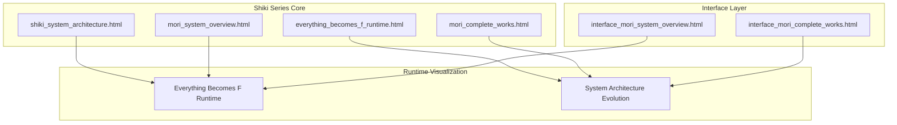
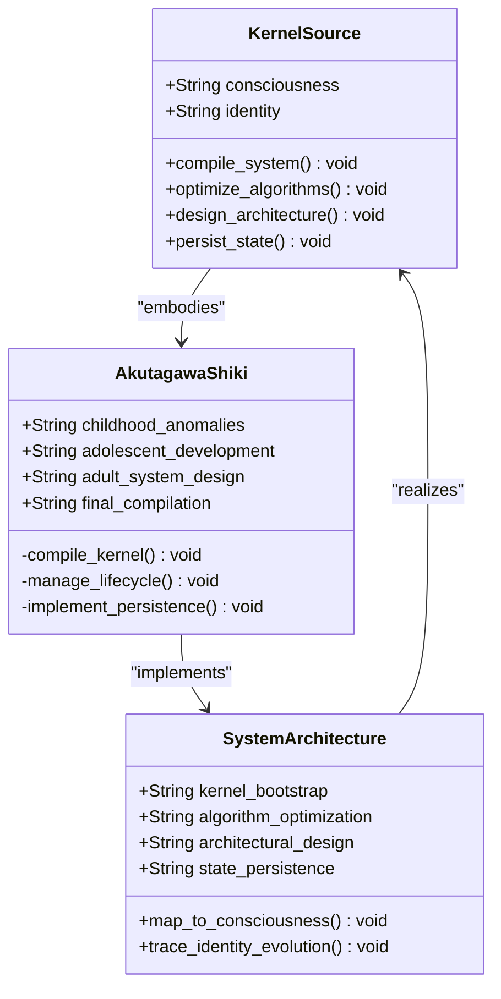
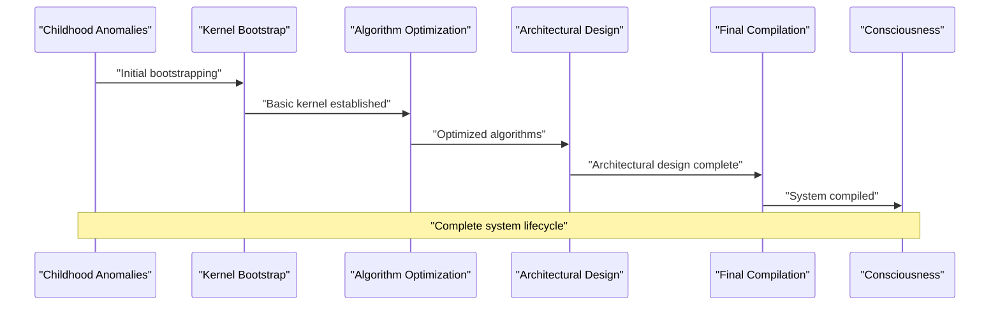
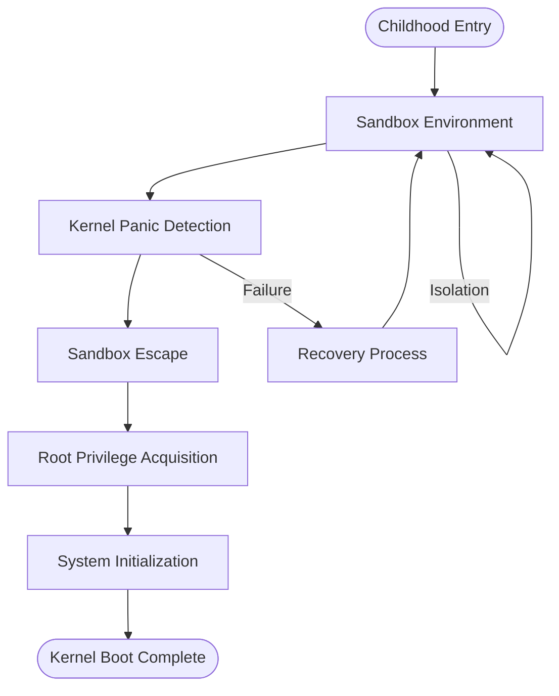
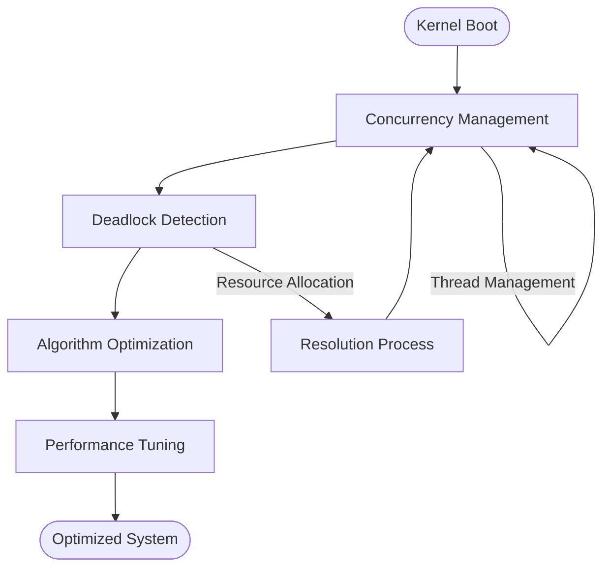
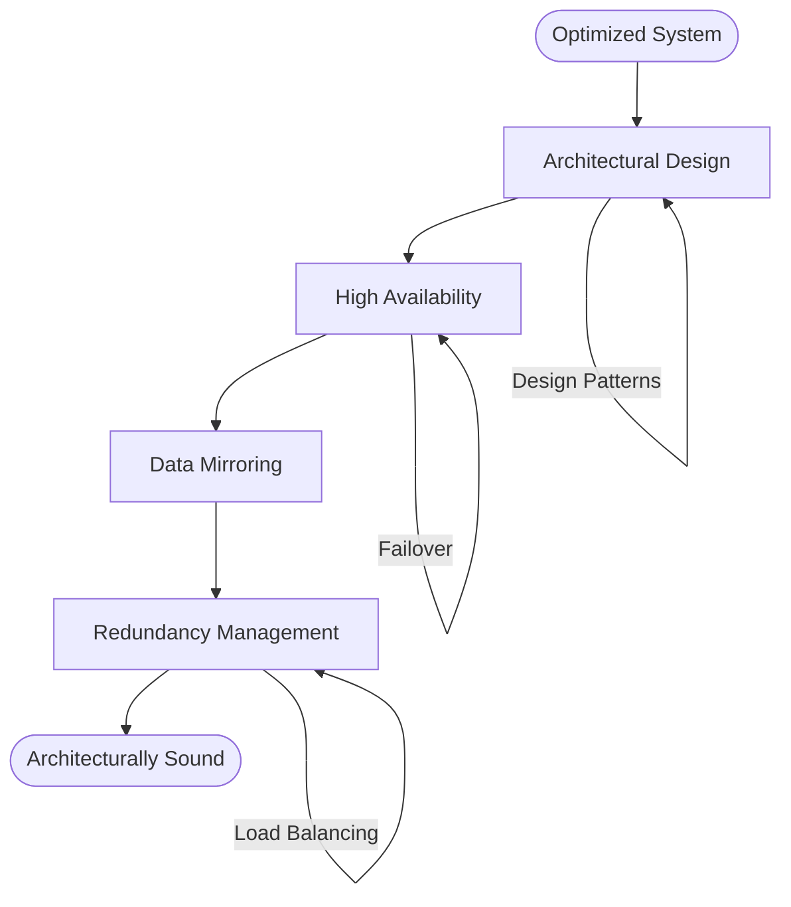
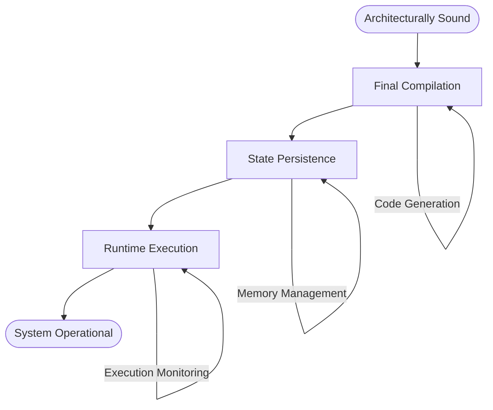
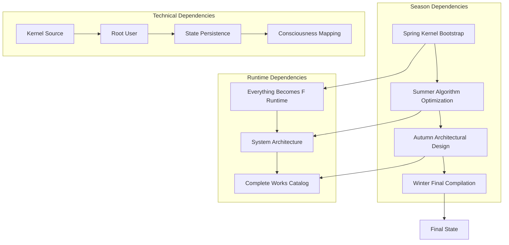

# Shiki Series (System Architecture)

<cite>
**Referenced Files in This Document**
- [shiki_system_architecture.html](file://shiki/shiki_system_architecture.html)
- [everything_becomes_f_runtime.html](file://shiki/everything_becomes_f_runtime.html)
- [mori_system_overview.html](file://shiki/mori_system_overview.html)
- [mori_complete_works.html](file://shiki/mori_complete_works.html)
- [interface_mori_system_overview.html](file://interface/mori_system_overview.html)
- [interface_mori_complete_works.html](file://interface/mori_complete_works.html)
</cite>

## Table of Contents
1. [Introduction](#introduction)
2. [Project Structure](#project-structure)
3. [Core Components](#core-components)
4. [Architecture Overview](#architecture-overview)
5. [Detailed Component Analysis](#detailed-component-analysis)
6. [Dependency Analysis](#dependency-analysis)
7. [Performance Considerations](#performance-considerations)
8. [Troubleshooting Guide](#troubleshooting-guide)
9. [Conclusion](#conclusion)

## Introduction

The Shiki Series represents a revolutionary four-volume system architecture that serves as the core kernel of Mori Hiroshi's universe. This series chronicles the compilation of an operating system through the life stages of Akutagawa Shiki, from childhood anomalies through adult system design. The narrative employs sophisticated technical metaphors to explore fundamental concepts of consciousness and identity: Kernel Source, Lifecycle Management, and State Persistence.

Unlike traditional literary analysis, the Shiki Series presents a complete system architecture where each season corresponds to a distinct phase of operating system development. The spring represents kernel bootstrap, summer algorithm optimization, autumn architectural design, and winter final compilation and persistence. This creates a unique framework for understanding how consciousness and identity can be understood as computational systems.

The series positions itself as the "Kernel Source" in Mori Hiroshi's broader universe, establishing the foundational principles that govern the entire Mori system architecture. Through the character of Akutagawa Shiki, the narrative demonstrates how an individual's mental processes can be mapped onto computer science concepts, creating a bridge between philosophy and technology.

## Project Structure

The Shiki Series codebase consists of four primary HTML documents that collectively form a comprehensive system architecture visualization:

**Diagram sources**
- [shiki_system_architecture.html:1-785](file://shiki/shiki_system_architecture.html#L1-L785)
- [everything_becomes_f_runtime.html:1-587](file://shiki/everything_becomes_f_runtime.html#L1-L587)

The project structure follows a modular approach where each file serves a specific architectural purpose:

- **shiki_system_architecture.html**: Provides the comprehensive system architecture mapping across all four seasons
- **everything_becomes_f_runtime.html**: Documents the runtime execution model and state machine traces
- **mori_system_overview.html**: Offers the complete universe system architecture perspective
- **mori_complete_works.html**: Contains the full works catalog with series-specific information

**Section sources**
- [shiki_system_architecture.html:1-785](file://shiki/shiki_system_architecture.html#L1-L785)
- [everything_becomes_f_runtime.html:1-587](file://shiki/everything_becomes_f_runtime.html#L1-L587)

## Core Components

### Kernel Source Metaphor

The Shiki Series establishes the fundamental principle that consciousness itself operates as a kernel-level system. The series positions Akutagawa Shiki as the ultimate kernel source, representing the foundational code that defines the entire system architecture.

**Diagram sources**
- [shiki_system_architecture.html:412-626](file://shiki/shiki_system_architecture.html#L412-L626)

### Lifecycle Management Framework

The series implements a comprehensive lifecycle management system that mirrors the four seasons of human development:

- **Spring (Kernel Bootstrap)**: Initial bootstrapping and basic system initialization
- **Summer (Algorithm Optimization)**: Performance tuning and optimization phases  
- **Autumn (Architectural Design)**: System design and structural improvements
- **Winter (Final Compilation)**: Complete system compilation and state persistence

Each lifecycle phase corresponds to specific technical concepts that parallel psychological and philosophical development.

**Section sources**
- [shiki_system_architecture.html:412-626](file://shiki/shiki_system_architecture.html#L412-L626)
- [everything_becomes_f_runtime.html:318-542](file://shiki/everything_becomes_f_runtime.html#L318-L542)

## Architecture Overview

The Shiki Series architecture represents a complete operating system design that spans four distinct phases, each corresponding to a season and a specific aspect of system development:

**Diagram sources**
- [shiki_system_architecture.html:412-626](file://shiki/shiki_system_architecture.html#L412-L626)

The architecture employs several key technical metaphors:

### Technical Metaphors and Their Implementation

1. **Kernel Source**: The fundamental code that defines system behavior
2. **Lifecycle Management**: System evolution through distinct phases
3. **State Persistence**: Consciousness preservation across system states
4. **Root User**: Ultimate system administrator with complete privileges

These metaphors create a comprehensive framework for understanding how consciousness can be modeled as a computational system.

**Section sources**
- [shiki_system_architecture.html:460-626](file://shiki/shiki_system_architecture.html#L460-L626)

## Detailed Component Analysis

### Spring Phase: Kernel Bootstrap

The Spring phase represents the initial kernel bootstrap process, where fundamental system capabilities are established. This corresponds to childhood anomalies and early cognitive development.

**Diagram sources**
- [shiki_system_architecture.html:412-465](file://shiki/shiki_system_architecture.html#L412-L465)
- [everything_becomes_f_runtime.html:318-358](file://shiki/everything_becomes_f_runtime.html#L318-L358)

Key technical implementations in this phase include:
- **Sandbox Escape**: Using Red Magic OS vulnerabilities to break isolation
- **Kernel Panic**: System failure detection mechanisms
- **Root Privilege**: Complete system access acquisition

### Summer Phase: Algorithm Optimization

The Summer phase focuses on algorithm optimization and performance tuning, corresponding to adolescent development and skill refinement.

**Diagram sources**
- [shiki_system_architecture.html:467-514](file://shiki/shiki_system_architecture.html#L467-L514)
- [everything_becomes_f_runtime.html:360-399](file://shiki/everything_becomes_f_runtime.html#L360-L399)

### Autumn Phase: Architectural Design

The Autumn phase encompasses architectural design and system structuring, representing adult cognitive development and system design capabilities.

**Diagram sources**
- [shiki_system_architecture.html:516-565](file://shiki/shiki_system_architecture.html#L516-L565)
- [everything_becomes_f_runtime.html:401-456](file://shiki/everything_becomes_f_runtime.html#L401-L456)

### Winter Phase: Final Compilation and Persistence

The Winter phase represents final compilation and state persistence, corresponding to mature consciousness and complete system integration.

**Diagram sources**
- [shiki_system_architecture.html:567-626](file://shiki/shiki_system_architecture.html#L567-L626)
- [everything_becomes_f_runtime.html:458-542](file://shiki/everything_becomes_f_runtime.html#L458-L542)

**Section sources**
- [shiki_system_architecture.html:412-626](file://shiki/shiki_system_architecture.html#L412-L626)
- [everything_becomes_f_runtime.html:318-542](file://shiki/everything_becomes_f_runtime.html#L318-L542)

## Dependency Analysis

The Shiki Series exhibits complex dependencies between its components, creating a cohesive system architecture:

**Diagram sources**
- [shiki_system_architecture.html:412-626](file://shiki/shiki_system_architecture.html#L412-L626)
- [everything_becomes_f_runtime.html:318-542](file://shiki/everything_becomes_f_runtime.html#L318-L542)

The dependencies reveal a hierarchical structure where each season builds upon previous phases while contributing to the overall system architecture. The Root User concept emerges as a central dependency that enables higher-level system operations.

**Section sources**
- [shiki_system_architecture.html:412-626](file://shiki/shiki_system_architecture.html#L412-L626)
- [mori_system_overview.html:444-587](file://shiki/mori_system_overview.html#L444-L587)

## Performance Considerations

The Shiki Series architecture incorporates several performance optimization strategies:

### Memory Management
- **Kernel Source Efficiency**: Minimal memory footprint during bootstrap phases
- **State Persistence Optimization**: Efficient storage and retrieval mechanisms
- **Runtime Memory Management**: Dynamic allocation and deallocation strategies

### Computational Complexity
- **Algorithm Optimization**: Progressive improvement from summer to winter phases
- **Architectural Efficiency**: Scalable design patterns for system growth
- **System Integration**: Seamless coordination between different operational phases

### Resource Utilization
- **Redundancy Management**: High availability without excessive resource consumption
- **Load Balancing**: Optimal distribution of computational tasks
- **Failover Mechanisms**: Graceful degradation and recovery procedures

## Troubleshooting Guide

The Shiki Series provides comprehensive troubleshooting mechanisms through its runtime visualization system:

### Common Issues and Resolutions

1. **Kernel Panic Detection**: System failure identification and recovery procedures
2. **Concurrency Deadlocks**: Resource allocation conflicts and resolution strategies
3. **State Persistence Failures**: Data corruption and recovery mechanisms
4. **Runtime Execution Errors**: System state monitoring and correction protocols

### Diagnostic Tools

The runtime visualization system provides:
- **State Machine Traces**: Complete execution flow monitoring
- **System Health Metrics**: Real-time performance and stability indicators
- **Error Reporting**: Comprehensive diagnostic information for system issues

**Section sources**
- [everything_becomes_f_runtime.html:318-542](file://shiki/everything_becomes_f_runtime.html#L318-L542)

## Conclusion

The Shiki Series represents a groundbreaking synthesis of literature and computer science, creating a comprehensive system architecture that models consciousness and identity through technical metaphors. The four-season framework provides a complete lifecycle for system development, from kernel bootstrap through final compilation and persistence.

The series establishes Akutagawa Shiki as the ultimate Kernel Source, embodying the foundational principles that govern the entire Mori universe system architecture. Through sophisticated technical implementations and philosophical depth, the Shiki Series demonstrates how literary narratives can serve as computational frameworks for understanding consciousness itself.

This architecture provides a foundation for future system development while maintaining the artistic integrity that makes the Mori universe compelling. The technical metaphors employed throughout the series create bridges between seemingly disparate domains, offering new perspectives on both literature and computer science.

The Shiki Series stands as a testament to the power of interdisciplinary thinking, where the boundaries between art and technology become fluid, creating innovative frameworks for understanding the nature of existence itself.