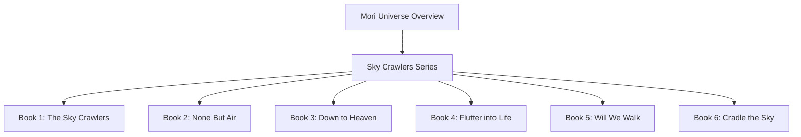
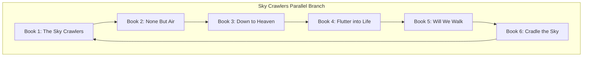
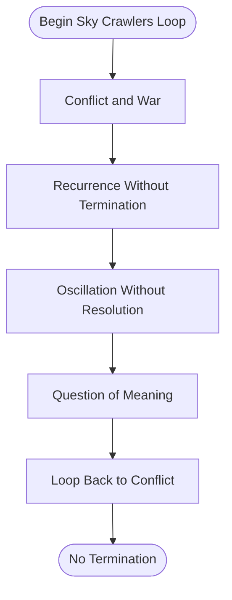
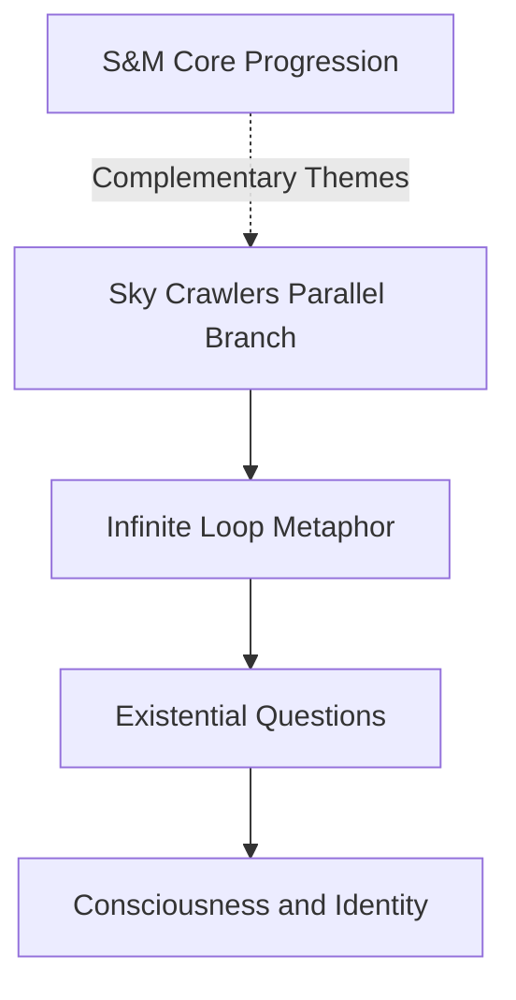

# Sky Crawlers (Infinite Loops)

<cite>
**Referenced Files in This Document**
- [mori_system_overview.html](file://shiki/mori_system_overview.html)
- [everything_becomes_f_runtime.html](file://shiki/everything_becomes_f_runtime.html)
- [mori_complete_works.html](file://interface/mori_complete_works.html)
</cite>

## Table of Contents
1. [Introduction](#introduction)
2. [Project Structure](#project-structure)
3. [Core Components](#core-components)
4. [Architecture Overview](#architecture-overview)
5. [Detailed Component Analysis](#detailed-component-analysis)
6. [Dependency Analysis](#dependency-analysis)
7. [Performance Considerations](#performance-considerations)
8. [Troubleshooting Guide](#troubleshooting-guide)
9. [Conclusion](#conclusion)
10. [Appendices](#appendices)

## Introduction
This document analyzes the Sky Crawlers (空中杀手) series as a parallel branch within the Mori universe, focusing on the metaphor of infinite loops, recursive processes without base cases, and the philosophical implications of processes without termination. The series explores the existential condition of Kildren trapped in an endless cycle of war, serving as a conceptual framework for understanding how systems—when lacking proper termination conditions—can persist indefinitely without meaningful direction. The document maps the six-book arc to illustrate how recursion, state machines, and infinite loops are used to explore themes of consciousness, identity, and the search for meaning in an unending existence.

## Project Structure
The Sky Crawlers series is presented as a standalone tab within the “Complete Works” interface and as part of the “System Overview” architecture page. It is positioned as a parallel branch in the overall narrative progression, distinct from the core logical progression of the S&M series but philosophically aligned with deeper questions about termination, purpose, and the nature of existence.

**Diagram sources**
- [mori_complete_works.html:748-823](file://interface/mori_complete_works.html#L748-L823)

**Section sources**
- [mori_complete_works.html:748-823](file://interface/mori_complete_works.html#L748-L823)

## Core Components
- Series identity and placement:
  - Sky Crawlers is identified as a six-book series with titles spanning 2002–2006.
  - It is described as a parallel branch in the overall narrative, focusing on the theme of infinite loops and recursion without base cases.
- Recursive and termination metaphors:
  - The series is framed as a philosophical metaphor for recursion without a base case: processes that run forever without termination, raising questions about whether such running has meaning and whether the process itself is the purpose.
- State machine and loop semantics:
  - The series’ central metaphor is an infinite loop of war, analogous to a recursive process that lacks a base case and therefore never terminates.

**Section sources**
- [mori_system_overview.html:520-526](file://shiki/mori_system_overview.html#L520-L526)
- [mori_system_overview.html:652-661](file://shiki/mori_system_overview.html#L652-L661)
- [mori_complete_works.html:748-823](file://interface/mori_complete_works.html#L748-L823)

## Architecture Overview
The Sky Crawlers series is architecturally positioned as a parallel branch in the Mori universe’s evolution. While the S&M series focuses on unit testing logic and the “perfect insider/outside” transitions, Sky Crawlers explores the philosophical implications of processes that run without termination. The series’ six books form a narrative loop that mirrors the concept of an infinite loop in computing: a process that continues indefinitely because it lacks a base case.

**Diagram sources**
- [mori_complete_works.html:771-777](file://interface/mori_complete_works.html#L771-L777)

**Section sources**
- [mori_system_overview.html:652-661](file://shiki/mori_system_overview.html#L652-L661)
- [mori_complete_works.html:748-823](file://interface/mori_complete_works.html#L748-L823)

## Detailed Component Analysis

### Book 1: The Sky Crawlers
- Theme: The foundational book introduces the concept of Kildren trapped in an endless cycle, establishing the recursive loop motif.
- Metaphor: The war becomes a metaphor for recursion without a base case—processes that continue indefinitely without termination.
- State machine interpretation: The loop of conflict reflects a state machine that never reaches a halting state.

**Section sources**
- [mori_complete_works.html:771-772](file://interface/mori_complete_works.html#L771-L772)

### Book 2: None But Air
- Theme: Explores the idea of existence confined to air, reinforcing the notion of a closed-loop system with no exit.
- Metaphor: The sky as a container that traps the Kildren, echoing the concept of a system that runs without breaking out of its boundaries.

**Section sources**
- [mori_complete_works.html:773-774](file://interface/mori_complete_works.html#L773-L774)

### Book 3: Down to Heaven
- Theme: The descent toward heaven suggests a recursive path that never resolves, mirroring a process that keeps moving toward a goal that is never reached.
- Metaphor: The journey becomes a metaphor for a recursive function that approaches a limit but never achieves it.

**Section sources**
- [mori_complete_works.html:775-776](file://interface/mori_complete_works.html#L775-L776)

### Book 4: Flutter into Life
- Theme: The fluttering motion implies a continuous oscillation without settling, reflecting a state machine that cycles without reaching a stable terminal state.
- Metaphor: The life force is captured in perpetual motion, akin to a recursive process that generates new states without terminating.

**Section sources**
- [mori_complete_works.html:777-778](file://interface/mori_complete_works.html#L777-L778)

### Book 5: Will We Walk
- Theme: The question of walking forward highlights the ambiguity of progress in an infinite loop—movement without destination.
- Metaphor: The act of walking becomes symbolic of a recursive call that advances the process but never reaches a base case.

**Section sources**
- [mori_complete_works.html:779-780](file://interface/mori_complete_works.html#L779-L780)

### Book 6: Cradle the Sky
- Theme: The cradle motif suggests a protective but confining loop, reinforcing the idea of a recursive process that nurtures continuation without resolution.
- Metaphor: The sky as a cradle encapsulates the Kildren in an eternal embrace, mirroring a system that maintains its own state indefinitely.

**Section sources**
- [mori_complete_works.html:781-782](file://interface/mori_complete_works.html#L781-L782)

### Conceptual Overview
The six-book arc of Sky Crawlers can be understood as a conceptual state machine with no halting state. Each book contributes to a narrative loop that reflects the semantics of an infinite loop: a process that continues indefinitely because it lacks a base case. This loop is not merely mechanical but deeply philosophical, exploring the meaning of existence without purpose or endpoint.

[No sources needed since this diagram shows conceptual workflow, not actual code structure]

## Dependency Analysis
- Narrative dependency:
  - The Sky Crawlers series depends on the broader Mori universe’s thematic framework, particularly the exploration of consciousness, identity, and the search for meaning.
- Architectural dependency:
  - The series is positioned as a parallel branch, distinct from the core logical progression of the S&M series, yet complementary in its focus on termination problems and infinite loops.
- Conceptual dependency:
  - The six-book loop mirrors the semantics of a recursive process without a base case, reinforcing the metaphor of infinite loops in both narrative and computational contexts.

[No sources needed since this diagram shows conceptual relationships, not direct code mapping]

**Section sources**
- [mori_system_overview.html:652-661](file://shiki/mori_system_overview.html#L652-L661)

## Performance Considerations
- Conceptual parallels:
  - In computing, infinite loops and recursive functions without base cases can lead to resource exhaustion and system instability. Similarly, the Sky Crawlers’ endless cycle of war can be seen as a metaphor for systems that consume resources without achieving meaningful outcomes.
- Practical implications:
  - The series encourages reflection on whether processes should be measured by their ability to terminate or by their ongoing activity. This duality mirrors real-world concerns about system performance and sustainability.

[No sources needed since this section provides general guidance]

## Troubleshooting Guide
- Identifying infinite loops:
  - Look for recurring motifs and unresolved conflicts that echo a state machine without a halting state.
- Resolving philosophical loops:
  - Introduce a base case or termination condition—either narrative resolution or a shift in perspective that redefines the process’s purpose.
- Managing recursive processes:
  - Ensure that recursive functions include a base case to prevent unbounded execution, paralleling the need for purposeful direction in human existence.

[No sources needed since this section provides general guidance]

## Conclusion
The Sky Crawlers series serves as a philosophical mirror to the concept of infinite loops in computing. Through six books, it presents a narrative loop that reflects the semantics of recursion without a base case, prompting readers to contemplate the meaning of existence without purpose or endpoint. Positioned as a parallel branch in the Mori universe, the series complements the core logical progression by exploring themes of consciousness, identity, and the search for meaning in an unending existence.

[No sources needed since this section summarizes without analyzing specific files]

## Appendices
- Related runtime visualization:
  - The “Everything Becomes F” runtime log provides a structured timeline of phases that can be mapped to the Sky Crawlers loop, emphasizing the progression from cold boot to termination and highlighting the significance of exit conditions.

**Section sources**
- [everything_becomes_f_runtime.html:350-574](file://shiki/everything_becomes_f_runtime.html#L350-L574)