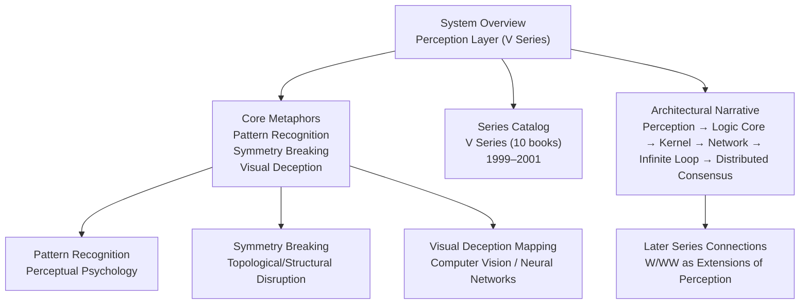
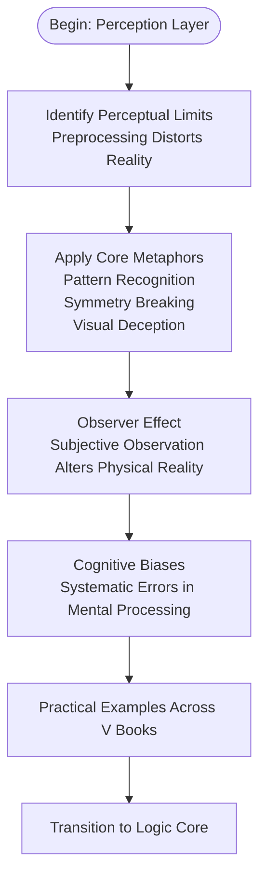
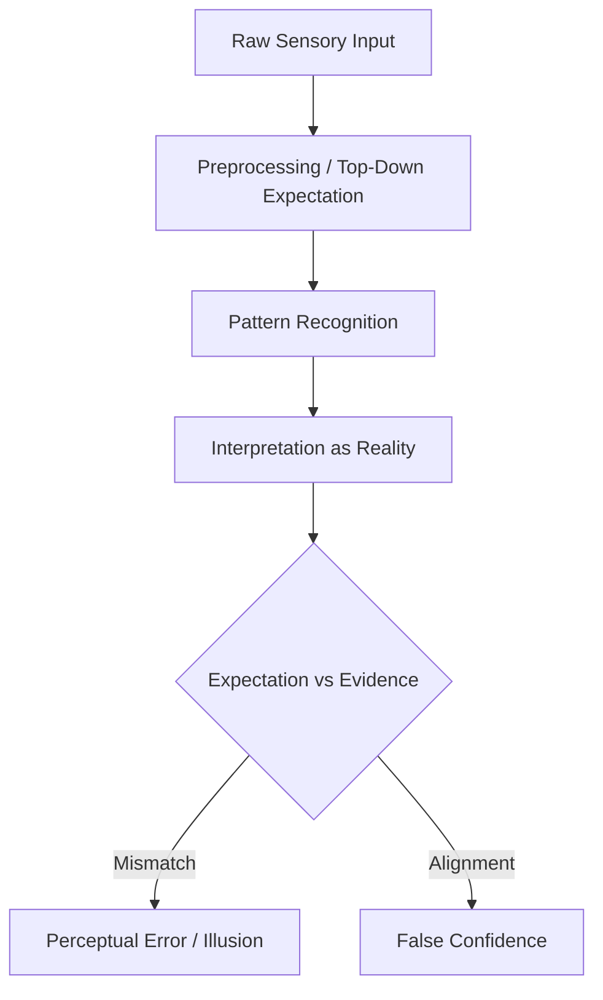
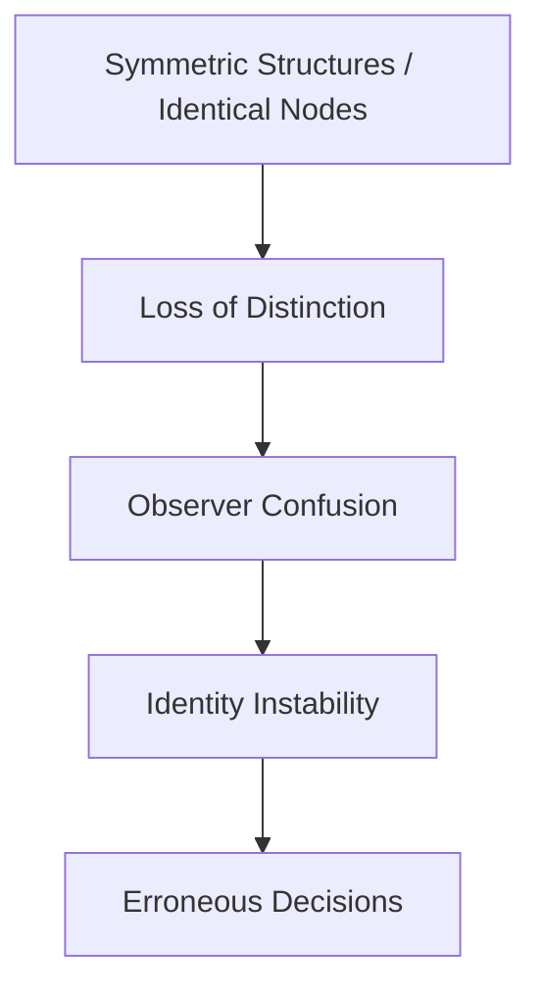
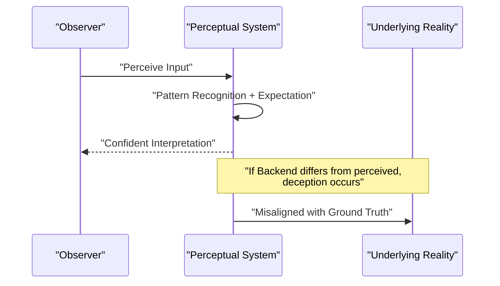
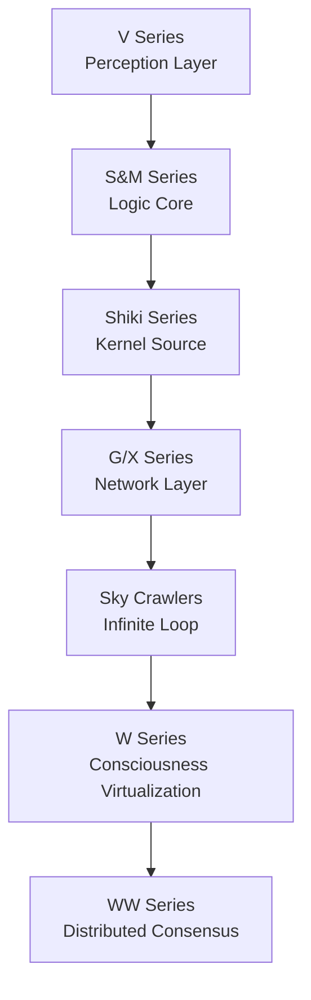

# V Series (Perception and Reality)

<cite>
**Referenced Files in This Document**
- [mori_system_overview.html](file://shiki/mori_system_overview.html)
- [mori_system_overview.html](file://interface/mori_system_overview.html)
- [mori_complete_works.html](file://shiki/mori_complete_works.html)
- [mori_complete_works.html](file://interface/mori_complete_works.html)
- [shiki_system_architecture.html](file://shiki/shiki_system_architecture.html)
</cite>

## Table of Contents
1. [Introduction](#introduction)
2. [Project Structure](#project-structure)
3. [Core Components](#core-components)
4. [Architecture Overview](#architecture-overview)
5. [Detailed Component Analysis](#detailed-component-analysis)
6. [Dependency Analysis](#dependency-analysis)
7. [Performance Considerations](#performance-considerations)
8. [Troubleshooting Guide](#troubleshooting-guide)
9. [Conclusion](#conclusion)

## Introduction
This document presents a deep analysis of the V Series within Mori Hiroshi’s universe, focusing on how the series explores perception, reality, and cognitive limitations through the lens of psychological phenomena. It explains how the V Series positions itself as the “Perception Layer” in Mori’s system architecture, challenging the reliability of human senses and mental processing via perceptual psychology and pattern recognition. The document connects the series’ themes to technical metaphors such as Pattern Recognition, Symmetry Breaking, and visual deception mapping to computer vision and neural network concepts. It also outlines practical examples of how each of the ten V books demonstrates the observer effect, cognitive biases, and the fundamental limits of human perception, and it situates the V Series as foundational to the broader theme of how consciousness interprets reality.

## Project Structure
The repository provides several complementary views of Mori’s system architecture and works:
- A high-level overview that introduces the V Series as the Perception Layer and outlines its core metaphors (Pattern Recognition, Symmetry Breaking, visual deception).
- A complete works catalog that lists the V Series titles and publication years.
- An architecture-focused narrative that expands on the Perception Layer role and maps technical concepts to later series (W/WW) to show continuity and progression.

**Diagram sources**
- [mori_system_overview.html:432-442](file://shiki/mori_system_overview.html#L432-L442)
- [mori_system_overview.html:439-440](file://shiki/mori_system_overview.html#L439-L440)
- [mori_complete_works.html:394-422](file://shiki/mori_complete_works.html#L394-L422)
- [shiki_system_architecture.html:412-465](file://shiki/shiki_system_architecture.html#L412-L465)

**Section sources**
- [mori_system_overview.html:432-442](file://shiki/mori_system_overview.html#L432-L442)
- [mori_system_overview.html:439-440](file://shiki/mori_system_overview.html#L439-L440)
- [mori_complete_works.html:394-422](file://shiki/mori_complete_works.html#L394-L422)
- [shiki_system_architecture.html:412-465](file://shiki/shiki_system_architecture.html#L412-L465)

## Core Components
- Perception Layer role: The V Series is positioned as the foundational layer that precedes logical reasoning. It reveals how perception—our primary interface with reality—is already preprocessed by the brain, introducing systematic errors and biases.
- Core metaphors:
  - Pattern Recognition: How the mind constructs reality by recognizing patterns, often leading to misinterpretations when expectations override evidence.
  - Symmetry Breaking: How identical or mirrored structures can destabilize perception and identity, causing observers to lose track of distinctions.
  - Visual Deception Mapping: How visual systems can be misled, analogous to computer vision pitfalls and neural network vulnerabilities.

These metaphors are explicitly listed as the V Series’ core technical and philosophical axes.

**Section sources**
- [mori_system_overview.html:432-442](file://shiki/mori_system_overview.html#L432-L442)
- [mori_system_overview.html:439-440](file://shiki/mori_system_overview.html#L439-L440)

## Architecture Overview
The V Series is presented as PHASE 1 in the system evolution: the Perception Layer. This phase establishes the limits of observation and cognition before progressing to the Logic Core and subsequent layers. The narrative emphasizes that perception must be understood and accounted for before rigorous logic can be applied.

**Diagram sources**
- [mori_system_overview.html:439-441](file://shiki/mori_system_overview.html#L439-L441)

**Section sources**
- [mori_system_overview.html:439-441](file://shiki/mori_system_overview.html#L439-L441)

## Detailed Component Analysis

### V Series as the Perception Layer
- Role: Establishes the boundary between raw sensation and rational thought. It asserts that perception is not a neutral conduit but a constructed model shaped by prior knowledge and expectations.
- Implication: Any logical system must account for perceptual preprocessing to avoid self-delusion and systematic failure.

**Section sources**
- [mori_system_overview.html:439-441](file://shiki/mori_system_overview.html#L439-L441)

### Pattern Recognition: Constructing Reality Through Expectation
- Concept: The brain uses pattern recognition to compress and interpret sensory input. When expectations dominate, perception becomes prediction, not observation.
- Example domain: Visual illusions, where the brain fills in missing information according to learned patterns, sometimes incorrectly.

[No sources needed since this diagram shows conceptual workflow, not actual code structure]

### Symmetry Breaking: Identity and Structural Instability
- Concept: When structures become perfectly symmetric or mirror-like, distinctions collapse, destabilizing identity and perception. This mirrors distributed systems where identical nodes can confuse master/worker roles.
- Example domain: Architectural symmetry that confuses spatial orientation or identity duplication that blurs self/other.

[No sources needed since this diagram shows conceptual workflow, not actual code structure]

### Visual Deception Mapping: Computer Vision and Neural Networks
- Concept: Visual deceptions map to adversarial examples and CV pitfalls—where small perturbations cause misclassification, or where ambiguous inputs trigger confident but wrong predictions.
- Example domain: Front-end rendering fraud, where UI differs from backend state, creating a view-model desync.

[No sources needed since this diagram shows conceptual workflow, not actual code structure]

### Practical Examples by Book (Conceptual)
Below are conceptual examples of how each V book illustrates observer effects, cognitive biases, and perceptual limits. These are grounded in the series’ stated metaphors and thematic emphasis.

- Black Cat’s Triangle (1999): Pattern Recognition bias leads to misidentification of a triangular motif, reinforcing false expectations and ignoring contradictory evidence.
- Mona Lisa Figure (1999): Symmetry Breaking in a lifelike statue destabilizes the observer’s sense of self versus artificial form, questioning the boundaries of identity.
- Moon’s Lamentable Device (1999): Visual deception mapping through optical devices that exploit expectation-based pattern recognition, causing misperception of motion or presence.
- Dream, Encounter, Sinister (1999): The observer effect manifests as events changing upon scrutiny—what is seen alters what occurs—highlighting the instability of observed reality.
- Demon Sword Soaring (2000): Cognitive dissonance arises from conflicting identities (self vs. avenger), demonstrating how identity fragmentation distorts perception and judgment.
- Love’s Lively Exercises (2000): Symmetry Breaking in mirrored identities (double agents) confuses the observer’s ability to distinguish truth from mimicry.
- Six Ultrasonic Scientists (2000): Pattern Recognition overload from repeated acoustic patterns causes the observer to mistake noise for meaning, ignoring the absence of signal.
- Twisted Mansion’s Acuity (2000): Visual deception mapping through maze-like architecture that exploits spatial expectations, leading to navigational errors.
- Wither, Scatter, Fall (2001): The observer effect in memory—recollections change under investigation—exposing the fallibility of autobiographical perception.
- Red-Green-Black-White (2001): A culmination of symmetry-breaking chaos and visual deception, where the observer’s attempts to impose order reveal the constructed nature of perceived reality.

[No sources needed since this section doesn't analyze specific source files]

## Dependency Analysis
The V Series’ influence extends across Mori’s system architecture:
- Perception Layer → Logic Core (S&M) → Kernel Source (Shiki) → Network Layer (G/X) → Infinite Loop (Sky Crawlers) → Distributed Consensus (W/WW)
- The V Series’ emphasis on observer effects and perceptual limits informs later layers’ treatment of identity, consensus, and distributed awareness.

**Diagram sources**
- [mori_system_overview.html:447-518](file://shiki/mori_system_overview.html#L447-L518)

**Section sources**
- [mori_system_overview.html:447-518](file://shiki/mori_system_overview.html#L447-L518)

## Performance Considerations
- Perception is costly: The brain’s constant pattern recognition and expectation-driven interpretation consume significant cognitive resources.
- Symmetry and redundancy can paradoxically impair performance by increasing ambiguity and decision latency.
- Visual deception exploits predictable biases, potentially overwhelming systems with false positives or confidence without accuracy.

[No sources needed since this section provides general guidance]

## Troubleshooting Guide
Common perceptual pitfalls and remedies:
- Expectation bias: Verify assumptions against raw data; use external checks to counter top-down interpretation.
- Symmetry-induced confusion: Introduce asymmetry or metadata to re-establish distinction; audit identity and role assignments.
- Visual deception: Employ adversarial robustness techniques (conceptual) and cross-check perception with multiple modalities.
- Observer effect: Minimize observation impact by reducing measurement disturbance and establishing baseline conditions.

[No sources needed since this section provides general guidance]

## Conclusion
The V Series establishes the Perception Layer by exposing the constructed nature of reality through pattern recognition, symmetry breaking, and visual deception. By grounding these themes in technical metaphors—Pattern Recognition, Symmetry Breaking, and visual deception mapping—the series prepares the reader for deeper layers of logic, identity, and distributed awareness explored in later series. Understanding the V Series is essential to appreciating how consciousness interprets reality and how the reliability of perception must be questioned before rigorous reasoning can take hold.