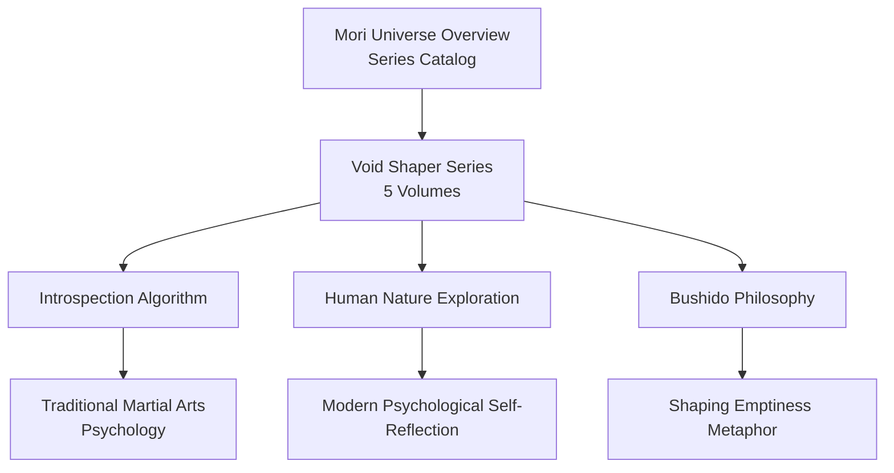
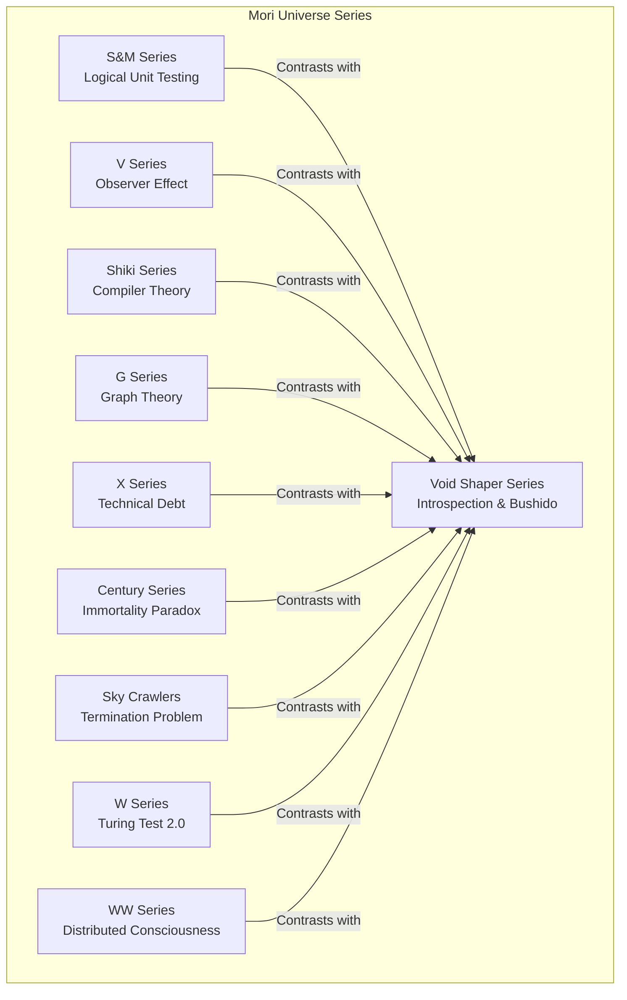
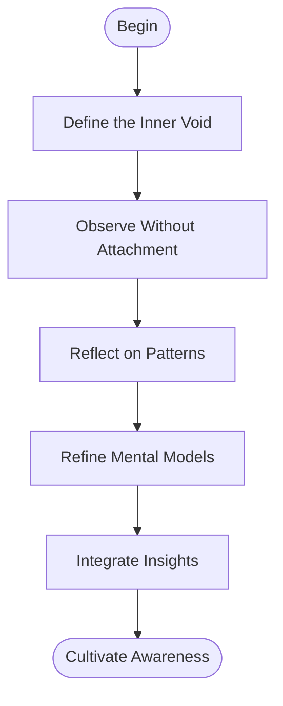
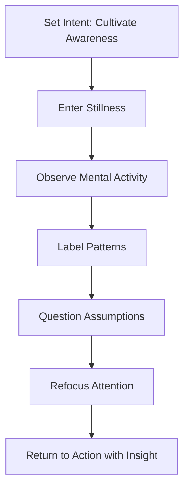
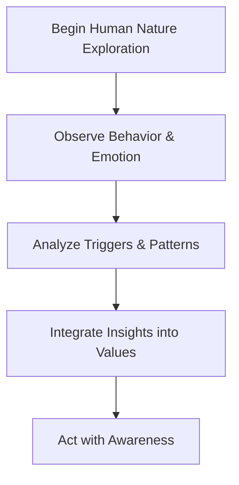
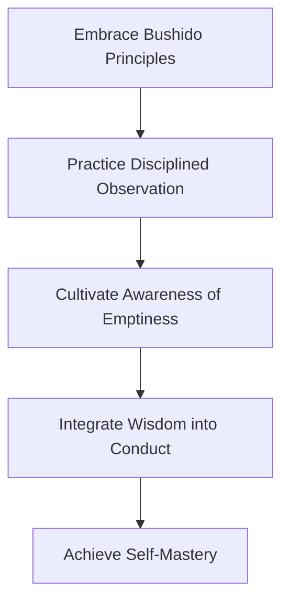
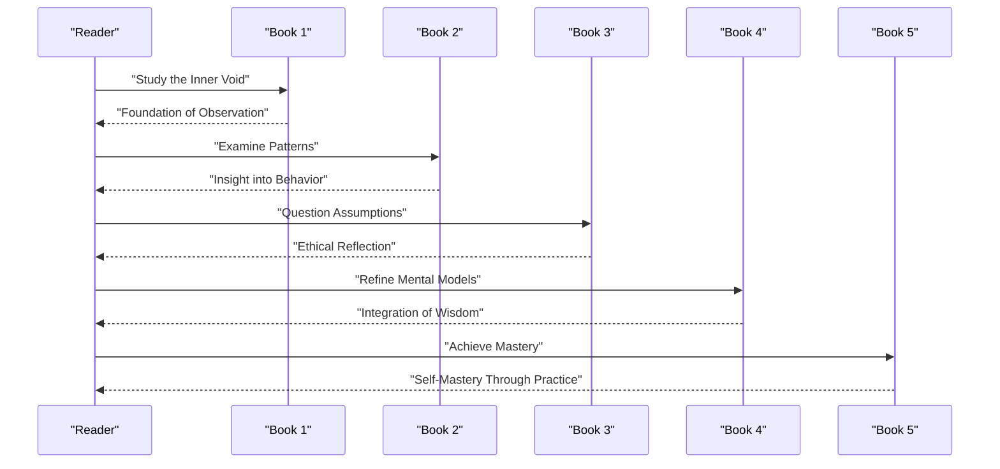
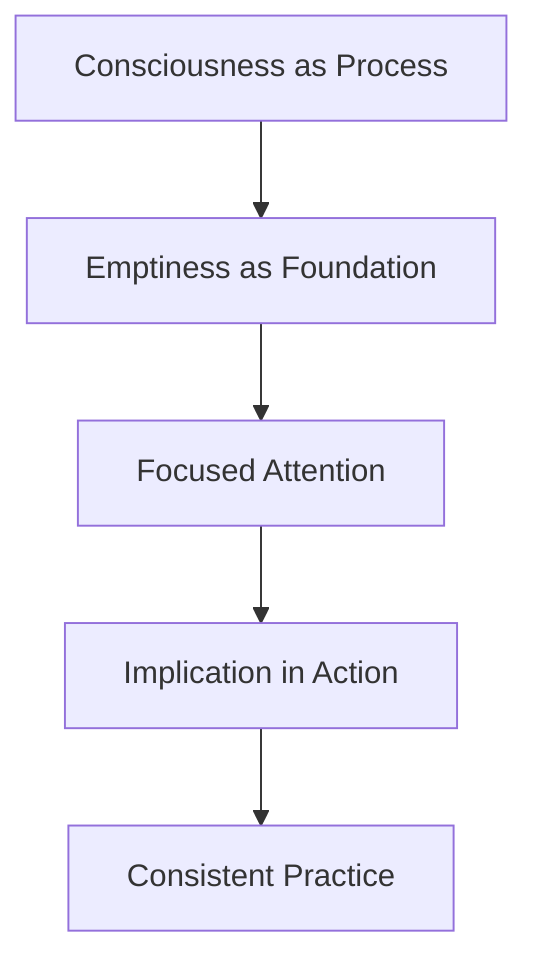
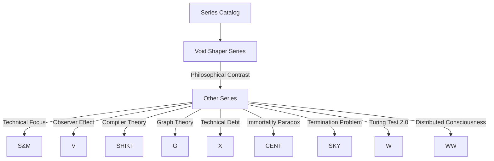

# Void Shaper Series (Bushido Philosophy)

<cite>
**Referenced Files in This Document**
- [mori_system_overview.html](file://Shiki/mori_system_overview.html)
- [mori_system_overview.html](file://interface/mori_system_overview.html)
- [shiki_system_architecture.html](file://shiki/shiki_system_architecture.html)
</cite>

## Table of Contents
1. [Introduction](#introduction)
2. [Project Structure](#project-structure)
3. [Core Components](#core-components)
4. [Architecture Overview](#architecture-overview)
5. [Detailed Component Analysis](#detailed-component-analysis)
6. [Dependency Analysis](#dependency-analysis)
7. [Performance Considerations](#performance-considerations)
8. [Troubleshooting Guide](#troubleshooting-guide)
9. [Conclusion](#conclusion)
10. [Appendices](#appendices)

## Introduction
The Void Shaper series is a five-volume philosophical and literary work embedded within the Mori universe’s broader system architecture narrative. It focuses on the metaphor of “Void Shaper” (虚空塑形者) to explore introspective algorithms, human nature, and Bushido philosophy. The series uses the concept of shaping emptiness as a vehicle for examining the self, drawing parallels between the meditative discipline of martial arts and the systematic process of self-inquiry. The series’ central thesis is that profound self-awareness emerges not from accumulating external knowledge, but from the deliberate cultivation of inner stillness and the disciplined examination of one’s inner void.

This document synthesizes the series’ role as a philosophical foundation distinct from the more technical approaches of other series in the Mori universe. It outlines how each of the five books demonstrates the Introspection Algorithm and Human Nature Exploration, and how these processes connect to traditional martial arts philosophy and modern psychological self-reflection. It also documents the series’ contribution to understanding consciousness, personal growth, self-mastery, and the pursuit of enlightenment through systematic self-examination.

## Project Structure
The Void Shaper series is cataloged alongside other series in the Mori universe’s architecture overview. It is presented as a standalone five-volume series with a focus on introspection and Bushido philosophy. The series’ core works are listed in Japanese titles, and the series is associated with two primary pillars:
- Introspection Algorithm: a methodical process of turning inward to observe and refine one’s mental and emotional states.
- Human Nature Exploration: a deep dive into the psychological, ethical, and spiritual dimensions of the self.

These pillars are contrasted with the more algorithmic and computational approaches of other series, positioning Void Shaper as a philosophical and introspective counterpoint.

**Diagram sources**
- [mori_system_overview.html:448-477](file://Shiki/mori_system_overview.html#L448-L477)
- [mori_system_overview.html:578-600](file://interface/mori_system_overview.html#L578-L600)

**Section sources**
- [mori_system_overview.html:448-477](file://Shiki/mori_system_overview.html#L448-L477)
- [mori_system_overview.html:578-600](file://interface/mori_system_overview.html#L578-L600)

## Core Components
The Void Shaper series is structured around five books that progressively demonstrate the Introspection Algorithm and Human Nature Exploration. While the specific content of each book is not detailed in the provided files, the series’ catalog identifies the five core works and positions them within a framework that emphasizes:
- Shaping emptiness as a metaphor for cultivating awareness.
- The integration of Bushido philosophy into the practice of self-examination.
- The contrast with more technical series that emphasize computational and logical frameworks.

Key characteristics:
- Five volumes: indicating a structured, progressive journey.
- Introspection Algorithm: a methodological approach to self-inquiry.
- Human Nature Exploration: a deep investigation into the self’s psychological and ethical dimensions.
- Bushido Philosophy: a philosophical lens rooted in martial discipline and self-cultivation.

**Section sources**
- [mori_system_overview.html:448-477](file://Shiki/mori_system_overview.html#L448-L477)
- [mori_system_overview.html:578-600](file://interface/mori_system_overview.html#L578-L600)

## Architecture Overview
The Void Shaper series is positioned within the Mori universe’s broader architecture as a philosophical counterpart to the more technically oriented series. The architecture overview highlights the series’ unique focus on introspection and human nature, contrasting it with series that emphasize algorithmic, mathematical, or computational principles. The series’ role is to provide a philosophical foundation for understanding consciousness and personal development through the lens of self-examination and martial discipline.

**Diagram sources**
- [mori_system_overview.html:448-477](file://Shiki/mori_system_overview.html#L448-L477)
- [mori_system_overview.html:578-600](file://interface/mori_system_overview.html#L578-L600)

**Section sources**
- [mori_system_overview.html:448-477](file://Shiki/mori_system_overview.html#L448-L477)
- [mori_system_overview.html:578-600](file://interface/mori_system_overview.html#L578-L600)

## Detailed Component Analysis

### Series Overview and Metaphor
The Void Shaper series frames the process of self-discovery as the act of shaping emptiness. This metaphor suggests that true insight emerges not from filling the mind with knowledge, but from the deliberate creation of space for reflection and awareness. The series’ emphasis on Bushido philosophy reinforces this approach, linking introspection to the disciplined practice of martial arts and the cultivation of moral and spiritual strength.

**Diagram sources**
- [mori_system_overview.html:448-477](file://Shiki/mori_system_overview.html#L448-L477)
- [mori_system_overview.html:578-600](file://interface/mori_system_overview.html#L578-L600)

**Section sources**
- [mori_system_overview.html:448-477](file://Shiki/mori_system_overview.html#L448-L477)
- [mori_system_overview.html:578-600](file://interface/mori_system_overview.html#L578-L600)

### Introspection Algorithm
The Introspection Algorithm, as identified in the series catalog, represents a methodical approach to self-examination. While the specific mechanics are not detailed in the provided files, the algorithmic framing implies a repeatable, structured process for turning inward. This process likely involves:
- Defining the inner void as the starting point.
- Observing thoughts and emotions without immediate reaction.
- Reflecting on recurring patterns and beliefs.
- Refining mental models through sustained attention.
- Integrating insights into daily life and practice.

**Diagram sources**
- [mori_system_overview.html:448-477](file://Shiki/mori_system_overview.html#L448-L477)
- [mori_system_overview.html:578-600](file://interface/mori_system_overview.html#L578-L600)

**Section sources**
- [mori_system_overview.html:448-477](file://Shiki/mori_system_overview.html#L448-L477)
- [mori_system_overview.html:578-600](file://interface/mori_system_overview.html#L578-L600)

### Human Nature Exploration
Human Nature Exploration, as part of the series’ pillars, indicates a deep engagement with the psychological and ethical dimensions of the self. This exploration likely encompasses:
- Understanding the roots of emotion and behavior.
- Investigating moral intuitions and ethical reasoning.
- Examining the interplay between individual psychology and social context.
- Integrating insights into personal values and conduct.

**Diagram sources**
- [mori_system_overview.html:448-477](file://Shiki/mori_system_overview.html#L448-L477)
- [mori_system_overview.html:578-600](file://interface/mori_system_overview.html#L578-L600)

**Section sources**
- [mori_system_overview.html:448-477](file://Shiki/mori_system_overview.html#L448-L477)
- [mori_system_overview.html:578-600](file://interface/mori_system_overview.html#L578-L600)

### Bushido Philosophy and the Void Shaper Metaphor
Bushido philosophy, emphasized in the series catalog, provides a cultural and ethical framework for self-cultivation. The metaphor of shaping emptiness aligns with the martial discipline of focusing on stillness, precision, and the refinement of character. This connection suggests that the Void Shaper’s journey mirrors the path of a warrior who disciplines the mind and spirit to achieve clarity and mastery.

**Diagram sources**
- [mori_system_overview.html:448-477](file://Shiki/mori_system_overview.html#L448-L477)
- [mori_system_overview.html:578-600](file://interface/mori_system_overview.html#L578-L600)

**Section sources**
- [mori_system_overview.html:448-477](file://Shiki/mori_system_overview.html#L448-L477)
- [mori_system_overview.html:578-600](file://interface/mori_system_overview.html#L578-L600)

### Practical Examples Across the Five Books
While the specific content of each book is not detailed in the provided files, the series’ catalog positions the five books as a structured progression that demonstrates:
- The Introspection Algorithm through staged exercises in observation and reflection.
- Human Nature Exploration by examining recurring patterns and ethical dilemmas.
- The integration of Bushido philosophy into daily practice and decision-making.

**Diagram sources**
- [mori_system_overview.html:448-477](file://Shiki/mori_system_overview.html#L448-L477)
- [mori_system_overview.html:578-600](file://interface/mori_system_overview.html#L578-L600)

**Section sources**
- [mori_system_overview.html:448-477](file://Shiki/mori_system_overview.html#L448-L477)
- [mori_system_overview.html:578-600](file://interface/mori_system_overview.html#L578-L600)

### Conceptual Overview
The Void Shaper series offers a conceptual framework for understanding consciousness through the lens of introspection and self-cultivation. It complements the more technical series by emphasizing the subjective, experiential dimension of awareness. The series’ metaphor of shaping emptiness invites readers to approach self-knowledge not as a destination, but as a continuous practice of mindful attention and ethical refinement.

[No sources needed since this diagram shows conceptual workflow, not actual code structure]

[No sources needed since this section doesn't analyze specific source files]

## Dependency Analysis
The Void Shaper series depends on the broader Mori universe’s architecture to establish its philosophical contrast with more technical series. The series’ placement within the catalog indicates its role as a complement to series that emphasize algorithmic, mathematical, or computational principles. This dependency is conceptual rather than structural, reflecting the series’ position within the narrative architecture of the universe.

**Diagram sources**
- [mori_system_overview.html:448-477](file://Shiki/mori_system_overview.html#L448-L477)
- [mori_system_overview.html:578-600](file://interface/mori_system_overview.html#L578-L600)

**Section sources**
- [mori_system_overview.html:448-477](file://Shiki/mori_system_overview.html#L448-L477)
- [mori_system_overview.html:578-600](file://interface/mori_system_overview.html#L578-L600)

## Performance Considerations
This section provides general guidance for readers engaging with the Void Shaper series. The introspective practices described in the series require sustained attention and patience. Readers should approach the material with a mindset of gradual cultivation rather than immediate results. Consistency in practice and reflection is key to integrating the series’ insights into daily life.

[No sources needed since this section provides general guidance]

## Troubleshooting Guide
Common challenges when engaging with the Void Shaper series include:
- Difficulty maintaining focus during introspective exercises.
- Resistance to questioning deeply held assumptions.
- Confusion about the relationship between observation and action.

Strategies for overcoming these challenges:
- Start with shorter observation periods and gradually increase duration.
- Keep a reflective journal to track patterns and insights.
- Practice ethical reflection regularly to strengthen moral reasoning.
- Apply insights incrementally to daily decisions and interactions.

[No sources needed since this section provides general guidance]

## Conclusion
The Void Shaper series stands as a philosophical cornerstone within the Mori universe, offering a unique perspective on consciousness through the lens of introspection, human nature exploration, and Bushido philosophy. By framing self-awareness as the deliberate shaping of emptiness, the series provides a pathway for personal growth, self-mastery, and the pursuit of enlightenment through systematic self-examination. Its contrast with the more technical series highlights the importance of subjective, experiential dimensions in understanding the self and the world.

[No sources needed since this section summarizes without analyzing specific files]

## Appendices
- Series Catalog References: The Void Shaper series is cataloged with its five core works and positioned within the broader Mori universe architecture.
- Metaphor of Emptiness: The series uses the metaphor of shaping emptiness to guide readers toward deeper self-awareness and ethical maturity.
- Integration with Bushido: The series connects introspective practices to martial discipline, emphasizing the cultivation of character and clarity.

**Section sources**
- [mori_system_overview.html:448-477](file://Shiki/mori_system_overview.html#L448-L477)
- [mori_system_overview.html:578-600](file://interface/mori_system_overview.html#L578-L600)