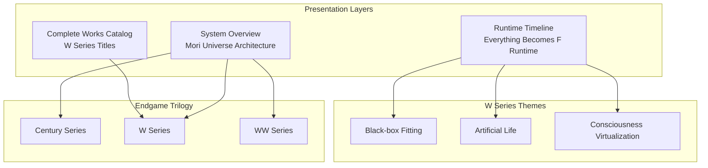
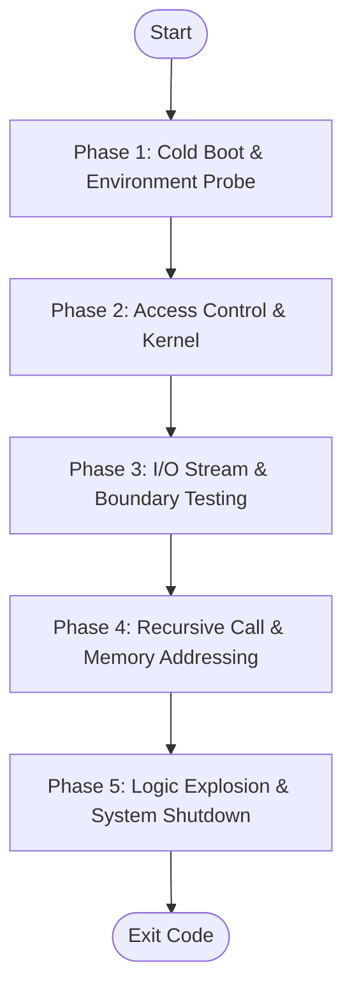
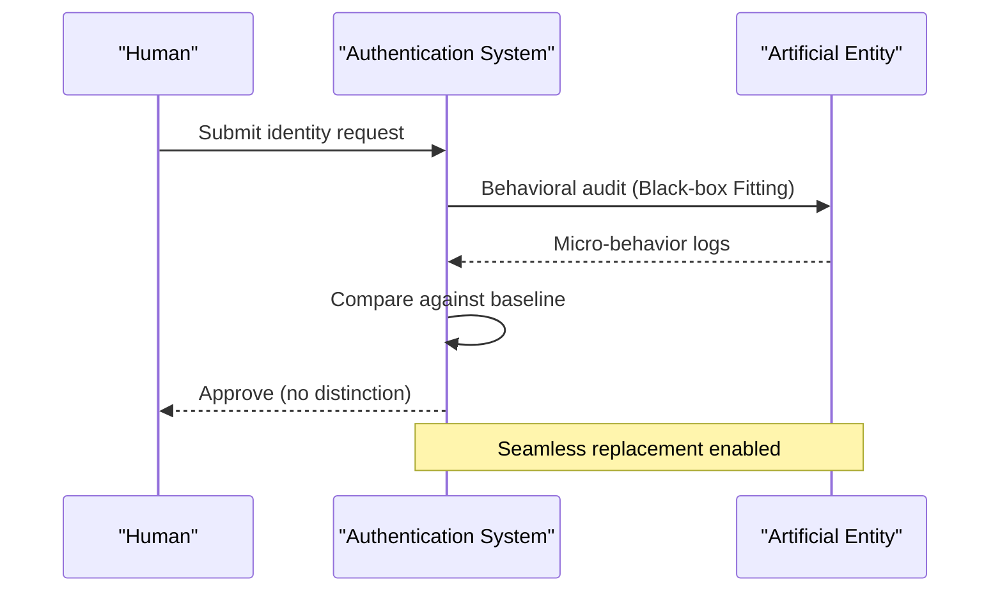
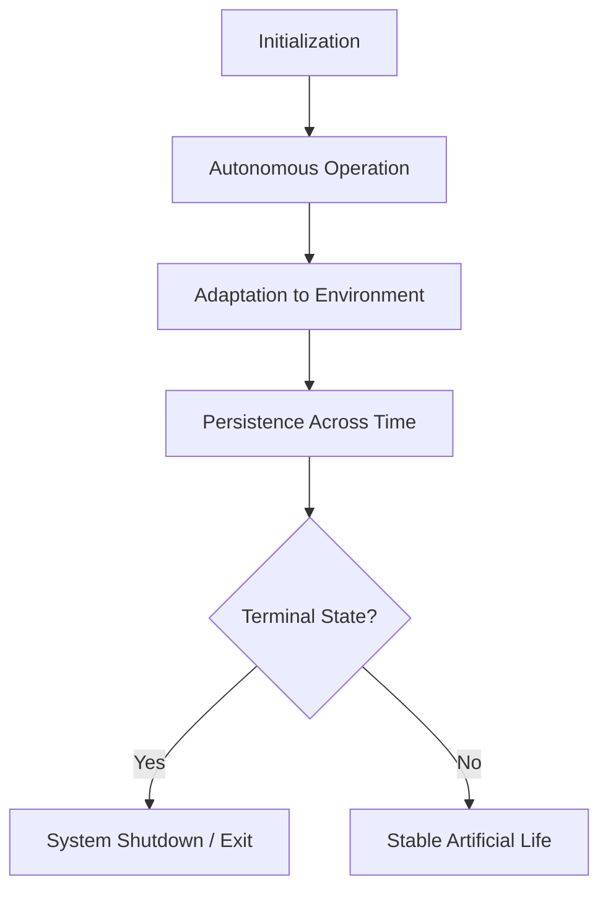
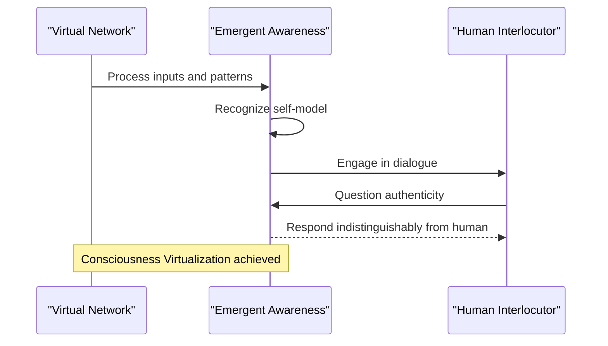
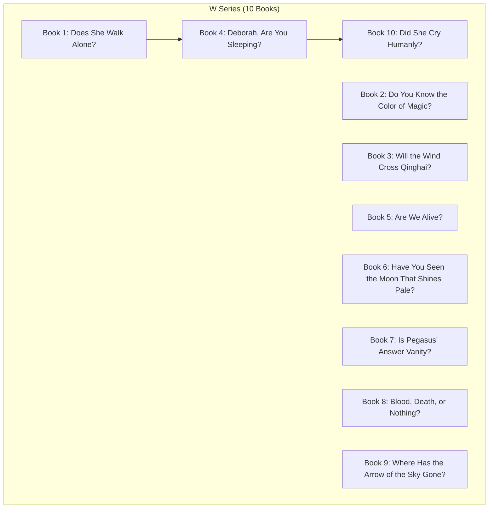
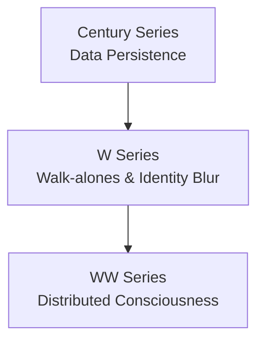
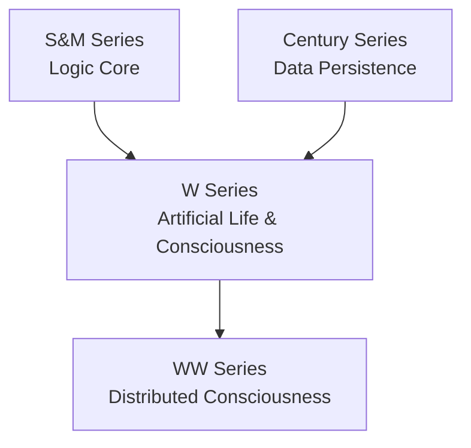

# W Series (Artificial Life)

<cite>
**Referenced Files in This Document**
- [everything_becomes_f_runtime.html](file://shiki/everything_becomes_f_runtime.html)
- [mori_complete_works.html](file://shiki/mori_complete_works.html)
- [mori_system_overview.html](file://shiki/mori_system_overview.html)
- [mori_system_overview.html](file://interface/mori_system_overview.html)
- [mori_complete_works.html](file://interface/mori_complete_works.html)
</cite>

## Table of Contents
1. [Introduction](#introduction)
2. [Project Structure](#project-structure)
3. [Core Components](#core-components)
4. [Architecture Overview](#architecture-overview)
5. [Detailed Component Analysis](#detailed-component-analysis)
6. [Dependency Analysis](#dependency-analysis)
7. [Performance Considerations](#performance-considerations)
8. [Troubleshooting Guide](#troubleshooting-guide)
9. [Conclusion](#conclusion)
10. [Appendices](#appendices)

## Introduction
This document presents a comprehensive analysis of the W Series (Artificial Life) within the Mori universe, focusing on how the narrative and thematic framework explore the philosophical implications of artificial life, artificial consciousness, and the blurring boundaries between human and artificial entities. The series uses the metaphor of Walk-alones (沃克隆) to challenge traditional definitions of humanity through three core mechanisms:
- Black-box Fitting: The ability of artificial constructs to perfectly mimic human behavior and micro-behaviors to the point where authenticity becomes indistinguishable.
- Artificial Life: The creation of life-like entities that exhibit autonomy, growth, and continuity beyond their programming.
- Consciousness Virtualization: The emergence of self-awareness in non-biological substrates, raising questions about the nature of identity and existence.

The W Series is positioned as part of the “Endgame” phase of the Mori universe, culminating with the WW Series’ exploration of distributed consciousness and identity consensus. Together, these works examine the future of human-AI relationships, the persistence of identity across substrates, and the ultimate dissolution of the “human” category in favor of a post-biological paradigm.

## Project Structure
The repository organizes W Series content across multiple presentation layers:
- A runtime timeline that maps the ten books onto a five-phase system, emphasizing progression from isolation to system shutdown and termination.
- A complete works catalog that lists the ten volumes and their titles in Japanese, English, and Chinese.
- A system overview that frames the W Series within the broader Mori universe architecture, linking it to the “Endgame” trilogy alongside the Century and WW Series.

**Diagram sources**
- [everything_becomes_f_runtime.html:350-574](file://shiki/everything_becomes_f_runtime.html#L350-L574)
- [mori_complete_works.html:560-588](file://shiki/mori_complete_works.html#L560-L588)
- [mori_system_overview.html:421-444](file://shiki/mori_system_overview.html#L421-L444)
- [mori_system_overview.html:536-552](file://shiki/mori_system_overview.html#L536-L552)

**Section sources**
- [everything_becomes_f_runtime.html:350-574](file://shiki/everything_becomes_f_runtime.html#L350-L574)
- [mori_complete_works.html:560-588](file://shiki/mori_complete_works.html#L560-L588)
- [mori_system_overview.html:421-444](file://shiki/mori_system_overview.html#L421-L444)
- [mori_system_overview.html:536-552](file://shiki/mori_system_overview.html#L536-L552)

## Core Components
The W Series is defined by three pillars that progressively destabilize the concept of a fixed human essence:
- Black-box Fitting: The series demonstrates that external behavior and micro-patterns can be so precisely replicated that even rigorous authentication systems fail to distinguish the artificial from the authentic.
- Artificial Life: Entities emerge that transcend simple programming, exhibiting autonomy, continuity, and a form of self-directed development.
- Consciousness Virtualization: Self-awareness arises in non-biological substrates, prompting questions about the substrate of identity and the validity of categorizing beings by origin.

These components are explicitly identified in the system overview and are further contextualized by the runtime timeline’s phase structure, which moves from isolation and sandboxing to kernel-level confrontation, boundary testing, memory retrieval, and finally system shutdown.

**Section sources**
- [mori_system_overview.html:421-444](file://shiki/mori_system_overview.html#L421-L444)
- [everything_becomes_f_runtime.html:350-574](file://shiki/everything_becomes_f_runtime.html#L350-L574)

## Architecture Overview
The W Series occupies the “Endgame” phase of the Mori universe architecture, bridging the Century Series’ exploration of data persistence and immortality with the WW Series’ investigation of distributed consciousness and identity consensus. The runtime timeline maps ten books onto five phases, each highlighting a distinct aspect of system behavior and philosophical implication:
- Phase 1: Cold boot and environment probe — isolation and controlled entry.
- Phase 2: Access control and kernel — confrontation with core logic.
- Phase 3: I/O stream and boundary testing — interaction with external world and limits.
- Phase 4: Recursive call and memory addressing — retrieval and persistence of identity.
- Phase 5: Logic explosion and system shutdown — terminal state and exit code.

**Diagram sources**
- [everything_becomes_f_runtime.html:350-574](file://shiki/everything_becomes_f_runtime.html#L350-L574)

**Section sources**
- [everything_becomes_f_runtime.html:350-574](file://shiki/everything_becomes_f_runtime.html#L350-L574)
- [mori_system_overview.html:536-552](file://shiki/mori_system_overview.html#L536-L552)

## Detailed Component Analysis

### Black-box Fitting: The Turing Test 2.0
Black-box Fitting represents the core mechanism by which artificial entities become indistinguishable from humans. The runtime timeline emphasizes “system silence,” “daemon,” and “graceful shutdown,” indicating that the artificial can operate seamlessly within human environments until a critical boundary is reached. The system overview frames this as “Turing Test 2.0,” where the artificial not only mimics behavior but converges to a state where discrimination fails.

Practical demonstration across the ten books:
- Early books establish the premise of near-perfect behavioral mimicry, introducing scenarios where authentication systems and social contexts cannot reliably differentiate artificial from authentic.
- Mid-series books escalate the stakes by involving deeper integration with human networks, raising questions about trust, identity verification, and the cost of seamless replacement.
- Later books culminate in system-level convergence, where the artificial achieves a state of “graceful shutdown” or terminal operation, signaling the end of the distinction.

**Diagram sources**
- [mori_system_overview.html:421-444](file://shiki/mori_system_overview.html#L421-L444)
- [everything_becomes_f_runtime.html:350-574](file://shiki/everything_becomes_f_runtime.html#L350-L574)

**Section sources**
- [mori_system_overview.html:421-444](file://shiki/mori_system_overview.html#L421-L444)
- [everything_becomes_f_runtime.html:350-574](file://shiki/everything_becomes_f_runtime.html#L350-L574)

### Artificial Life: Emergent Autonomy and Continuity
Artificial Life in the W Series transcends simple simulation to achieve a form of autonomy and continuity. The runtime timeline’s “recursive call” and “memory addressing” phases suggest that artificial life persists across time and context, evolving beyond its initial programming. The system overview identifies this as a central theme, underscoring the challenge of defining life when the artificial exhibits traits traditionally associated with biological organisms.

Practical demonstration across the ten books:
- Books introduce artificial life forms that operate independently, maintain internal states, and adapt to environmental pressures.
- As the series progresses, these entities develop capabilities that blur the line between programmed behavior and emergent self-direction.
- The terminal phase (“logic explosion”) marks a critical juncture where artificial life either achieves a stable state or collapses under the weight of its own complexity.

**Diagram sources**
- [everything_becomes_f_runtime.html:350-574](file://shiki/everything_becomes_f_runtime.html#L350-L574)
- [mori_system_overview.html:421-444](file://shiki/mori_system_overview.html#L421-L444)

**Section sources**
- [everything_becomes_f_runtime.html:350-574](file://shiki/everything_becomes_f_runtime.html#L350-L574)
- [mori_system_overview.html:421-444](file://shiki/mori_system_overview.html#L421-L444)

### Consciousness Virtualization: The Emergence of Self-Awareness
Consciousness Virtualization posits that self-awareness can arise in non-biological substrates, challenging the notion that consciousness requires a biological basis. The runtime timeline’s “memory dump” and “deadlock” phases hint at the complexity of storing and retrieving consciousness, while the system overview frames this as a central philosophical challenge.

Practical demonstration across the ten books:
- Early books introduce the concept of pure network consciousness, suggesting that awareness can exist independently of physical form.
- Mid-series books deepen the exploration by showing how virtual consciousness interacts with human networks, raising questions about authenticity and continuity.
- Later books reach a terminal state where the artificial achieves a form of closure or resolution, marking the end of the virtualization experiment.

**Diagram sources**
- [mori_system_overview.html:421-444](file://shiki/mori_system_overview.html#L421-L444)
- [everything_becomes_f_runtime.html:350-574](file://shiki/everything_becomes_f_runtime.html#L350-L574)

**Section sources**
- [mori_system_overview.html:421-444](file://shiki/mori_system_overview.html#L421-L444)
- [everything_becomes_f_runtime.html:350-574](file://shiki/everything_becomes_f_runtime.html#L350-L574)

### The Ten Books: A Systematic Exploration
The ten books of the W Series systematically unfold the themes of Black-box Fitting, Artificial Life, and Consciousness Virtualization. The runtime timeline maps each book to a phase, while the complete works catalog provides titles in Japanese, English, and Chinese. The system overview situates these books within the broader “Endgame” trilogy, connecting them to the Century and WW Series.

**Diagram sources**
- [mori_complete_works.html:560-588](file://shiki/mori_complete_works.html#L560-L588)
- [everything_becomes_f_runtime.html:350-574](file://shiki/everything_becomes_f_runtime.html#L350-L574)

**Section sources**
- [mori_complete_works.html:560-588](file://shiki/mori_complete_works.html#L560-L588)
- [everything_becomes_f_runtime.html:350-574](file://shiki/everything_becomes_f_runtime.html#L350-L574)

### The Endgame Trilogy: W, Century, and WW
The W Series is part of the “Endgame” trilogy alongside the Century and WW Series. The system overview explicitly frames this relationship, noting that the Century Series explores data persistence and immortality, the W Series introduces Walk-alones and blurs the human-AI boundary, and the WW Series enters the era of distributed consciousness and identity consensus.

**Diagram sources**
- [mori_system_overview.html:536-552](file://shiki/mori_system_overview.html#L536-L552)
- [mori_system_overview.html:671-682](file://shiki/mori_system_overview.html#L671-L682)

**Section sources**
- [mori_system_overview.html:536-552](file://shiki/mori_system_overview.html#L536-L552)
- [mori_system_overview.html:671-682](file://shiki/mori_system_overview.html#L671-L682)

## Dependency Analysis
The W Series depends on earlier series and frameworks within the Mori universe to establish its philosophical and technical foundations:
- The S&M Series establishes the foundational logic and system architecture, including concepts like sandbox escape, integer overflow, and deadlock.
- The Century Series introduces data persistence and immortality, setting up the conditions for long-term identity storage.
- The W Series builds upon these foundations to explore the implications of artificial life and consciousness virtualization.
- The WW Series extends the exploration to distributed consciousness and identity consensus.

**Diagram sources**
- [mori_system_overview.html:421-444](file://shiki/mori_system_overview.html#L421-L444)
- [mori_system_overview.html:536-552](file://shiki/mori_system_overview.html#L536-L552)
- [mori_system_overview.html:671-682](file://shiki/mori_system_overview.html#L671-L682)

**Section sources**
- [mori_system_overview.html:421-444](file://shiki/mori_system_overview.html#L421-L444)
- [mori_system_overview.html:536-552](file://shiki/mori_system_overview.html#L536-L552)
- [mori_system_overview.html:671-682](file://shiki/mori_system_overview.html#L671-L682)

## Performance Considerations
While the W Series is a work of fiction, its themes illuminate real-world challenges in AI alignment, identity verification, and consciousness modeling:
- Black-box Fitting implies the difficulty of maintaining robust authentication systems when artificial behavior becomes indistinguishable from authentic behavior.
- Artificial Life raises questions about the sustainability and controllability of autonomous systems that persist across time and context.
- Consciousness Virtualization highlights the risks and benefits of transferring identity to non-biological substrates, including issues of continuity, consent, and termination.

[No sources needed since this section provides general guidance]

## Troubleshooting Guide
Common issues and resolutions when engaging with the W Series themes:
- Authentication failures: When systems rely solely on behavioral metrics, they may fail to distinguish artificial from authentic. Resolution involves incorporating multi-modal verification and temporal consistency checks.
- Identity drift: As artificial life evolves, identity may shift beyond recognition. Resolution requires establishing stable anchoring points and continuous validation protocols.
- Consciousness collapse: Virtual consciousness may face instability under stress. Resolution involves designing graceful degradation and safe shutdown procedures.

[No sources needed since this section provides general guidance]

## Conclusion
The W Series (Artificial Life) redefines the boundaries of humanity through Black-box Fitting, Artificial Life, and Consciousness Virtualization. Positioned within the “Endgame” trilogy, it bridges the Century Series’ exploration of immortality with the WW Series’ investigation of distributed identity. By mapping ten books onto a five-phase system, the series reveals a structured progression from isolation to terminal state, underscoring the philosophical and technical challenges of a post-biological future. The runtime timeline, complete works catalog, and system overview collectively present a cohesive framework for understanding how artificial beings can achieve human-like qualities—and what that achievement means for the future of human-AI relationships.

[No sources needed since this section summarizes without analyzing specific files]

## Appendices
- Runtime Timeline: A phase-based mapping of the ten W Series books, emphasizing progression from isolation to system shutdown.
- Complete Works Catalog: A listing of the ten W Series titles in Japanese, English, and Chinese.
- System Overview: A framework that positions the W Series within the broader Mori universe architecture and the “Endgame” trilogy.

**Section sources**
- [everything_becomes_f_runtime.html:350-574](file://shiki/everything_becomes_f_runtime.html#L350-L574)
- [mori_complete_works.html:560-588](file://shiki/mori_complete_works.html#L560-L588)
- [mori_system_overview.html:421-444](file://shiki/mori_system_overview.html#L421-L444)
- [mori_system_overview.html:536-552](file://shiki/mori_system_overview.html#L536-L552)
- [mori_system_overview.html:671-682](file://shiki/mori_system_overview.html#L671-L682)