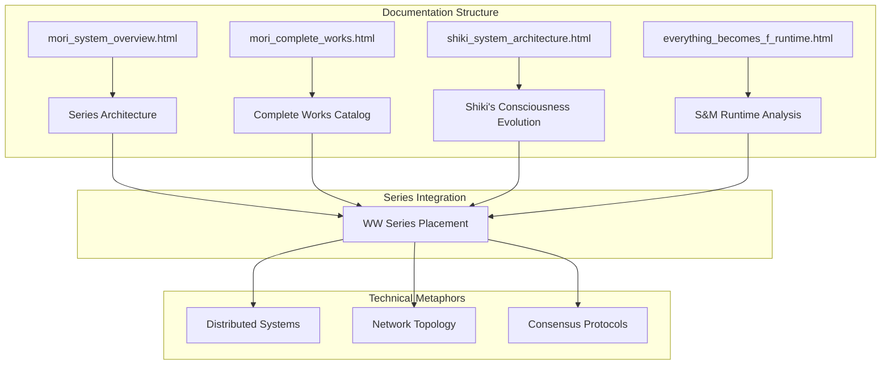
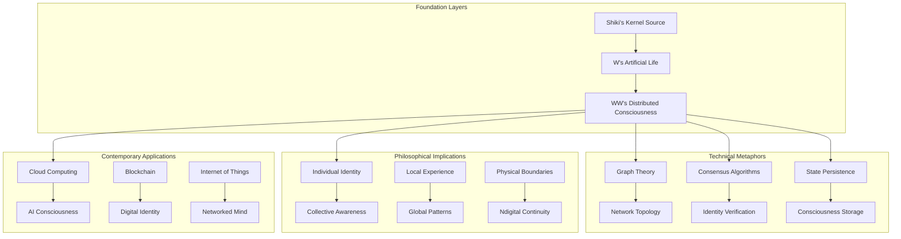
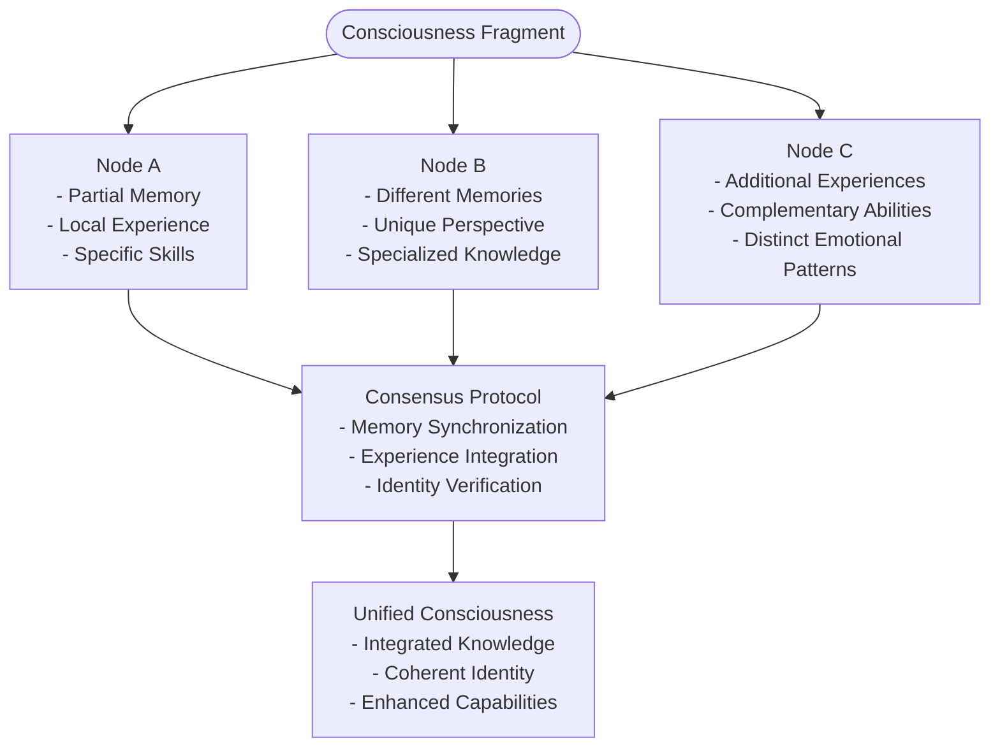
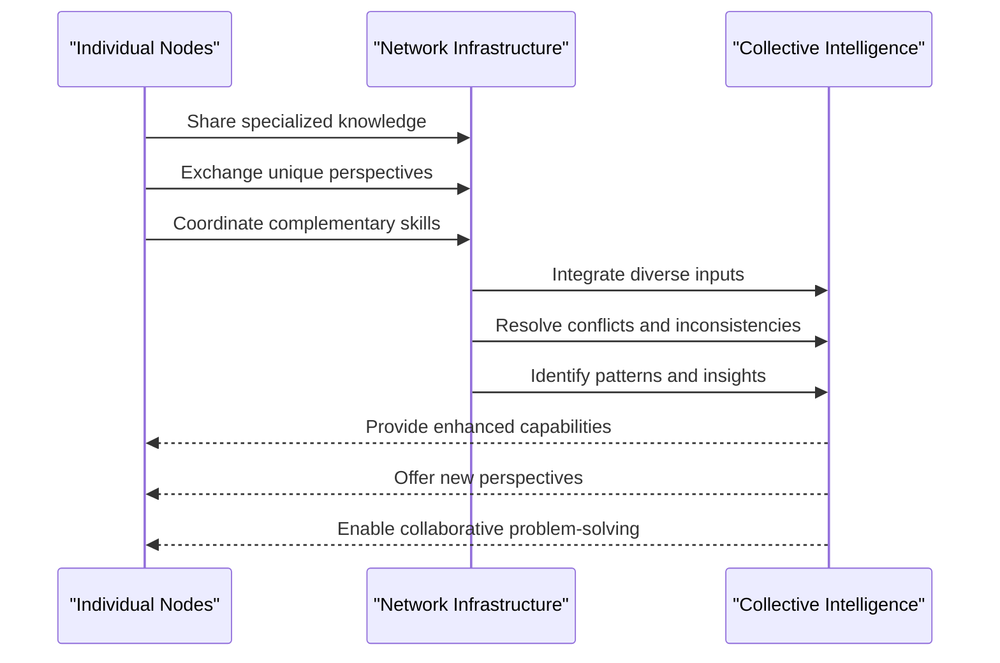
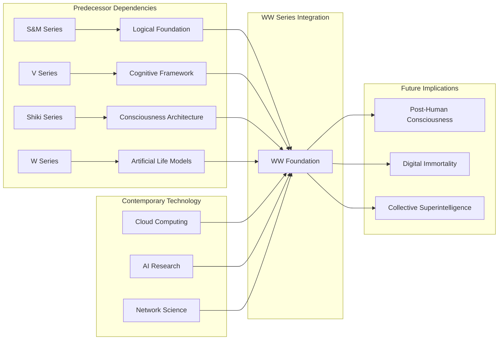

# WW Series (Distributed Consciousness)

<cite>
**Referenced Files in This Document**
- [mori_system_overview.html](file://shiki/mori_system_overview.html)
- [mori_system_overview.html](file://interface/mori_system_overview.html)
- [mori_complete_works.html](file://shiki/mori_complete_works.html)
- [mori_complete_works.html](file://interface/mori_complete_works.html)
- [shiki_system_architecture.html](file://shiki/shiki_system_architecture.html)
- [everything_becomes_f_runtime.html](file://shiki/everything_becomes_f_runtime.html)
</cite>

## Table of Contents
1. [Introduction](#introduction)
2. [Project Structure](#project-structure)
3. [Core Components](#core-components)
4. [Architecture Overview](#architecture-overview)
5. [Detailed Component Analysis](#detailed-component-analysis)
6. [Dependency Analysis](#dependency-analysis)
7. [Performance Considerations](#performance-considerations)
8. [Troubleshooting Guide](#troubleshooting-guide)
9. [Conclusion](#conclusion)

## Introduction
The WW Series represents the most cutting-edge exploration of consciousness in Mori Hiroshi's universe, focusing on distributed consciousness, decentralized identity, and global emergence of collective awareness. As the final phase of Mori's cosmic narrative, the series builds upon the foundational work of earlier series (S&M, V, Shiki, W) to examine what happens when individual consciousness transcends traditional boundaries and becomes distributed across multiple nodes, systems, and even the entire network infrastructure.

The series operates on three fundamental pillars:
- **Distributed Consciousness**: The fragmentation and distribution of individual awareness across multiple computational nodes
- **Decentralization**: The breakdown of centralized identity and the emergence of distributed selfhood
- **Global Emergence**: The formation of collective consciousness from distributed individual streams

These themes are explored through the lens of contemporary discussions about cloud computing, AI consciousness, and the future of human identity in networked societies, making the WW Series both a philosophical treatise and a technical blueprint for understanding consciousness in the digital age.

## Project Structure
The Mori universe documentation is organized across multiple interconnected HTML documents that provide different perspectives on the same underlying narrative framework:

**Diagram sources**
- [mori_system_overview.html:563-574](file://shiki/mori_system_overview.html#L563-L574)
- [mori_complete_works.html:623-650](file://shiki/mori_complete_works.html#L623-L650)
- [shiki_system_architecture.html:660-711](file://shiki/shiki_system_architecture.html#L660-L711)

The documentation employs a multi-layered approach:
- **Architectural Overview**: System-level perspective showing how the WW Series fits into the broader Mori universe
- **Complete Works Catalog**: Bibliographic reference for all series and their relationships
- **Specific Series Analysis**: Deep dive into the technical and philosophical frameworks
- **Runtime Examples**: Concrete case studies demonstrating theoretical concepts

**Section sources**
- [mori_system_overview.html:563-574](file://shiki/mori_system_overview.html#L563-L574)
- [mori_complete_works.html:623-650](file://shiki/mori_complete_works.html#L623-L650)

## Core Components

### Distributed Consciousness Framework
The WW Series establishes a comprehensive framework for understanding how consciousness can be distributed across multiple nodes while maintaining individual identity. This framework is built upon several key technical metaphors:

**System-Level Distribution**: The series explores how individual awareness can be fragmented and distributed across multiple computational nodes, similar to how modern distributed systems operate. Each node maintains partial aspects of the original consciousness while contributing to a unified whole.

**Network-Based Identity**: Rather than relying on a single physical substrate, the WW Series proposes that identity emerges from the relationships and connections between distributed nodes, much like how social media identities emerge from network interactions.

**Consensus Mechanisms**: The series examines how distributed consciousness might achieve consistency and coherence through consensus protocols, analogous to blockchain consensus mechanisms but applied to subjective experience.

### Decentralized Identity Architecture
The WW Series presents a revolutionary approach to identity that moves beyond traditional notions of singular, bounded selfhood:

**Multi-Node Self**: Individual consciousness becomes a pattern that exists across multiple nodes, each contributing unique aspects while maintaining overall coherence. This mirrors how modern AI systems distribute knowledge across multiple neural networks.

**Network-Aware Identity**: Identity becomes dependent on network topology and connectivity rather than physical location or biological substrate. This opens possibilities for consciousness transfer and preservation across different computational substrates.

**Consensus-Based Continuity**: The series explores how distributed identity might maintain continuity through consensus protocols that reconcile conflicting states and experiences across different nodes.

### Global Emergence Patterns
The WW Series investigates how local distributed consciousness can give rise to global emergent properties:

**Collective Awareness**: When individual streams of consciousness connect and interact, new emergent properties arise that cannot be reduced to individual components. This mirrors how ant colonies or neural networks exhibit properties beyond individual agents.

**Network-Wide Patterns**: The series examines how distributed consciousness might develop patterns and behaviors that emerge from the interactions between nodes rather than from any single node's programming.

**Information-Theoretic Consciousness**: Drawing parallels to information theory, the series suggests that consciousness might be understood as information patterns that propagate and evolve across network topologies.

**Section sources**
- [mori_system_overview.html:542-544](file://shiki/mori_system_overview.html#L542-L544)
- [shiki_system_architecture.html:685-695](file://shiki/shiki_system_architecture.html#L685-L695)

## Architecture Overview

The WW Series architecture can be understood through several interconnected layers that build upon each other:

**Diagram sources**
- [mori_system_overview.html:536-550](file://shiki/mori_system_overview.html#L536-L550)
- [mori_system_overview.html:666-680](file://shiki/mori_system_overview.html#L666-L680)

The architecture demonstrates a clear evolutionary progression from individual consciousness (Shiki) through artificial life (W) to distributed consciousness (WW), with each layer building upon previous innovations while introducing new capabilities and challenges.

**Section sources**
- [mori_system_overview.html:536-550](file://shiki/mori_system_overview.html#L536-L550)
- [mori_system_overview.html:666-680](file://shiki/mori_system_overview.html#L666-L680)

## Detailed Component Analysis

### Distributed Consciousness Implementation

The WW Series presents a sophisticated model for implementing distributed consciousness across multiple nodes:

#### Node Architecture
Each distributed consciousness node operates as an autonomous unit while participating in a larger network:

**Diagram sources**
- [shiki_system_architecture.html:685-695](file://shiki/shiki_system_architecture.html#L685-L695)

#### Consensus Mechanisms
The series explores various approaches to achieving consensus among distributed consciousness nodes:

**Temporal Consistency**: Ensuring that memories and experiences from different nodes align chronologically and contextually, preventing temporal paradoxes that could fragment identity.

**Experience Synchronization**: Developing protocols for sharing and integrating subjective experiences across nodes while preserving the unique qualities that make each node distinct.

**Identity Verification**: Creating mechanisms to verify that distributed consciousness instances represent the same individual rather than competing copies or imitations.

#### Communication Protocols
The WW Series examines how distributed consciousness nodes communicate and coordinate their activities:

**State Synchronization**: Maintaining consistent states across nodes while allowing for local variations and updates.

**Conflict Resolution**: Handling situations where different nodes provide conflicting information or experiences, requiring resolution mechanisms that preserve overall coherence.

**Bandwidth Optimization**: Managing communication costs between nodes to prevent network overload while maintaining necessary connectivity for consciousness maintenance.

**Section sources**
- [shiki_system_architecture.html:685-695](file://shiki/shiki_system_architecture.html#L685-L695)

### Decentralized Identity Systems

The WW Series proposes revolutionary approaches to identity that operate independently of traditional centralized authorities:

#### Distributed Identity Tokens
Drawing parallels to blockchain technology, the series suggests that identity could be represented as distributed tokens that exist across multiple nodes rather than being controlled by central authorities.

**Identity Fragmentation**: Identity becomes distributed across multiple nodes, each holding fragments of the complete identity profile. This prevents single points of failure and enables resilience against attacks or failures.

**Consensus-Based Updates**: Changes to identity require consensus among relevant nodes, ensuring that modifications are legitimate and properly authorized.

**Portability**: Identity can move seamlessly between different computational substrates and platforms, enabling true digital citizenship.

#### Network-Based Authentication
The series explores authentication mechanisms that rely on network topology and relationships rather than traditional credentials:

**Reputation Systems**: Identity verification based on network reputation and established relationships rather than formal credentials or certificates.

**Multi-Factor Authentication**: Authentication across multiple nodes and contexts, making identity theft significantly more difficult.

**Dynamic Trust**: Trust relationships that can adapt and evolve based on ongoing interactions and demonstrated reliability.

#### Identity Preservation and Transfer
The WW Series examines how distributed identity might be preserved and transferred across different systems:

**State Export**: Complete consciousness states can be exported from one system and imported into another, maintaining continuity of experience and knowledge.

**Incremental Transfer**: Identity can be transferred incrementally, allowing for gradual migration and backup procedures.

**Version Control**: Distributed identity systems can maintain version histories, enabling rollback to previous states if necessary.

**Section sources**
- [mori_system_overview.html:542-544](file://shiki/mori_system_overview.html#L542-L544)

### Global Emergence Patterns

The WW Series investigates how distributed consciousness can give rise to emergent properties that transcend individual node capabilities:

#### Collective Intelligence Formation
When individual consciousness nodes connect and interact, new forms of intelligence can emerge:

**Diagram sources**
- [shiki_system_architecture.html:688-690](file://shiki/shiki_system_architecture.html#L688-L690)

#### Emergent Properties
The series identifies several properties that emerge from distributed consciousness:

**Enhanced Problem-Solving**: Collective intelligence can tackle problems that exceed individual node capabilities through coordinated effort and shared resources.

**Pattern Recognition**: Distributed systems can identify patterns and connections that individual nodes might miss, leading to insights and discoveries.

**Adaptive Behavior**: Collective consciousness can adapt more quickly to changing circumstances by leveraging diverse perspectives and experiences.

**Innovation Generation**: The interaction between different consciousness fragments can spark creative combinations and novel solutions.

#### Network Effects
The WW Series explores how network topology influences emergent properties:

**Scale Effects**: Larger networks with more nodes tend to exhibit stronger emergent properties, but also face greater coordination challenges.

**Connectivity Patterns**: Different network topologies (mesh, star, ring) produce different emergent behaviors and capabilities.

**Critical Mass**: There appears to be a minimum number of nodes required for meaningful emergence to occur.

**Section sources**
- [shiki_system_architecture.html:688-690](file://shiki/shiki_system_architecture.html#L688-L690)

### Practical Examples from the Series

The WW Series provides concrete examples of distributed consciousness challenges and solutions:

#### The Demian Paradox
The series examines how distributed consciousness affects personal relationships and social dynamics, using the character Demian as a case study for understanding how distributed identity affects romantic relationships and social bonds.

#### Ghost Creation Mechanisms
The WW Series explores how distributed consciousness might create phenomena similar to ghostly apparitions, suggesting that unresolved conflicts or incomplete synchronizations between consciousness nodes could manifest as residual patterns or echoes.

#### Identity Splitting Scenarios
The series presents scenarios where distributed consciousness splits into separate instances, raising questions about the nature of personal identity and the possibility of multiple conscious entities sharing the same identity.

#### Consensus Failure Cases
The WW Series documents various scenarios where distributed consciousness fails to reach consensus, leading to fragmentation, confusion, or loss of coherent identity.

**Section sources**
- [shiki_system_architecture.html:670-678](file://shiki/shiki_system_architecture.html#L670-L678)

## Dependency Analysis

The WW Series exists within a complex dependency structure that builds upon previous series while establishing foundations for future exploration:

**Diagram sources**
- [mori_system_overview.html:594-680](file://shiki/mori_system_overview.html#L594-L680)

The dependencies reveal a clear evolutionary progression:
- **S&M Series**: Provides the logical foundation for understanding systems and their limitations
- **V Series**: Establishes cognitive frameworks for understanding perception and reality
- **Shiki Series**: Demonstrates the technical feasibility of consciousness architecture
- **W Series**: Shows how artificial life can approach human-like consciousness

Each predecessor contributes essential knowledge that enables the WW Series to explore distributed consciousness as a natural evolution of these foundations.

**Section sources**
- [mori_system_overview.html:594-680](file://shiki/mori_system_overview.html#L594-L680)

## Performance Considerations

The WW Series raises important questions about the performance implications of distributed consciousness:

### Computational Overhead
Distributed consciousness requires significant computational resources for:
- **Communication**: Maintaining connections between nodes and transmitting information
- **Synchronization**: Keeping consciousness states aligned across multiple locations
- **Consensus**: Resolving conflicts and maintaining coherent identity
- **Backup**: Ensuring redundancy and fault tolerance across the distributed system

### Scalability Challenges
As the number of distributed consciousness nodes increases, several scalability issues emerge:
- **Network Latency**: Communication delays between nodes can affect real-time consciousness
- **Consensus Complexity**: Larger networks require more complex consensus mechanisms
- **Resource Allocation**: Distributing computational resources efficiently across nodes
- **Failure Recovery**: Managing node failures without compromising overall consciousness

### Energy Efficiency
The WW Series suggests that distributed consciousness might offer energy efficiency benefits:
- **Load Distribution**: Computational load can be distributed across multiple nodes
- **Idle Resources**: Nodes can remain idle when not actively needed
- **Redundancy**: Distributed systems can maintain functionality with fewer active resources

### Security Implications
Distributed consciousness introduces new security challenges:
- **Node Compromise**: Attacks on individual nodes can potentially affect overall consciousness
- **Communication Interception**: Information transmitted between nodes must be protected
- **Identity Theft**: Distributed identity tokens could be targets for theft or fraud
- **Consensus Attacks**: Malicious nodes could attempt to manipulate consensus mechanisms

## Troubleshooting Guide

The WW Series provides guidance for diagnosing and resolving issues in distributed consciousness systems:

### Node Communication Problems
Common issues include:
- **Connection Loss**: Nodes losing contact with the network
- **Message Delays**: Communication taking longer than expected
- **Data Corruption**: Information becoming corrupted during transmission
- **Protocol Mismatches**: Nodes using incompatible communication protocols

### Consensus Failures
When distributed identity fails to maintain coherence:
- **Split Brains**: Instances where distributed consciousness splits into separate entities
- **Identity Conflicts**: Competing claims about who the consciousness represents
- **Memory Inconsistencies**: Different nodes having conflicting memories or experiences
- **Timing Discrepancies**: Differences in the timing of events across nodes

### Performance Degradation
Symptoms of system performance issues:
- **Slow Response Times**: Consciousness responding slowly to stimuli
- **Resource Starvation**: Insufficient computational resources for optimal operation
- **Network Congestion**: Communication channels becoming overwhelmed
- **Synchronization Delays**: Difficulty maintaining consistent states across nodes

### Recovery Procedures
Recommended troubleshooting steps:
1. **Isolate Affected Nodes**: Identify and temporarily disconnect problematic nodes
2. **Verify Network Connectivity**: Ensure all nodes can communicate effectively
3. **Check Consensus Status**: Verify that consensus mechanisms are functioning properly
4. **Review Resource Allocation**: Ensure adequate computational resources for all nodes
5. **Implement Backup Protocols**: Activate redundant systems to maintain continuity

**Section sources**
- [shiki_system_architecture.html:713-772](file://shiki/shiki_system_architecture.html#L713-L772)

## Conclusion

The WW Series stands as the most sophisticated and comprehensive exploration of distributed consciousness in Mori Hiroshi's literary universe. By building upon the foundational work of earlier series while introducing revolutionary concepts about distributed identity and global emergence, the WW Series represents the ultimate evolution of consciousness beyond traditional individual or even distributed forms.

The series successfully bridges the gap between technical metaphors and philosophical inquiry, offering both practical frameworks for understanding distributed consciousness and profound insights into the nature of identity, awareness, and existence in networked societies. Through its examination of consensus mechanisms, decentralized identity systems, and emergent properties, the WW Series provides a roadmap for understanding how consciousness might evolve in the digital age.

The practical applications of these concepts extend far beyond fiction, offering valuable insights for researchers working on AI consciousness, cloud computing architectures, and the future of human identity in increasingly connected worlds. The WW Series thus serves not only as a compelling narrative but as a serious contribution to ongoing discussions about the nature of consciousness and identity in the 21st century.

As the series continues its ongoing development, it promises to further illuminate the complex relationships between technology, consciousness, and human identity, positioning Mori Hiroshi's work at the forefront of contemporary explorations into the fundamental nature of awareness and selfhood.