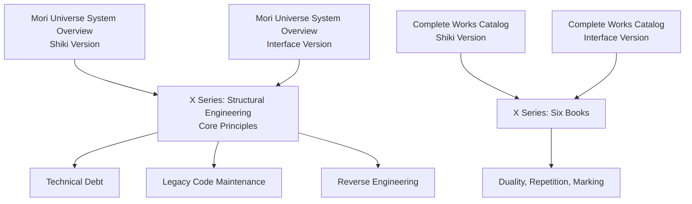
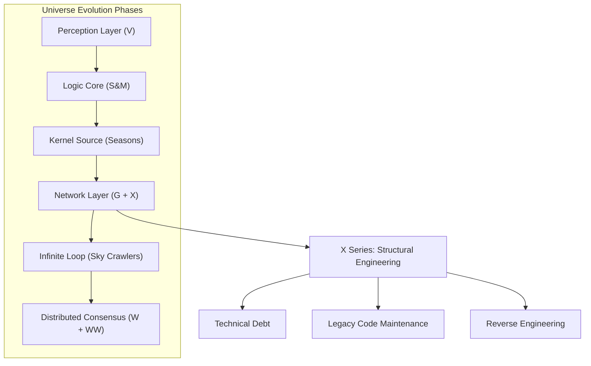
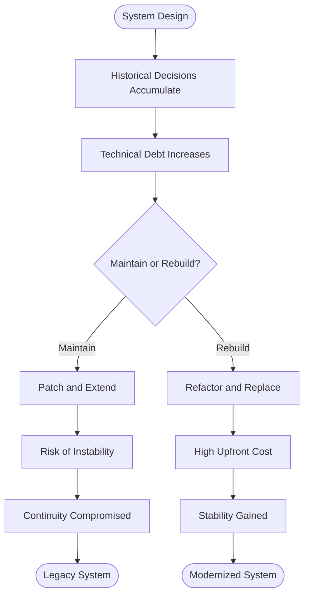
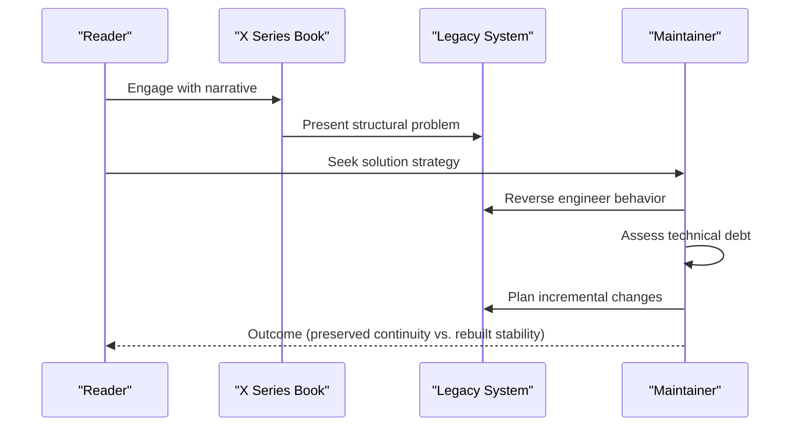
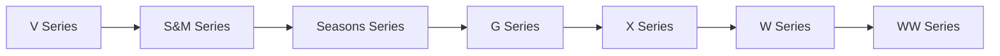

# X Series (Structural Engineering)

<cite>
**Referenced Files in This Document**
- [mori_system_overview.html](file://shiki/mori_system_overview.html)
- [mori_system_overview.html](file://interface/mori_system_overview.html)
- [mori_complete_works.html](file://shiki/mori_complete_works.html)
- [mori_complete_works.html](file://interface/mori_complete_works.html)
- [shiki_system_architecture.html](file://shiki/shiki_system_architecture.html)
</cite>

## Table of Contents
1. [Introduction](#introduction)
2. [Project Structure](#project-structure)
3. [Core Components](#core-components)
4. [Architecture Overview](#architecture-overview)
5. [Detailed Component Analysis](#detailed-component-analysis)
6. [Dependency Analysis](#dependency-analysis)
7. [Performance Considerations](#performance-considerations)
8. [Troubleshooting Guide](#troubleshooting-guide)
9. [Conclusion](#conclusion)

## Introduction
This document analyzes the X Series within the Mori Universe as a structural engineering narrative that explores the tension between working with existing systems and building new ones. The series is framed as a "Structural Engineering" series, with its core themes centered on Technical Debt, Legacy Code Maintenance, and Reverse Engineering. Through six books spanning 2007–2009, the X Series demonstrates how maintaining and evolving complex, historical systems creates heavier burdens than constructing clean, modern alternatives. The narrative metaphor of structures—foundations, frameworks, and infrastructure—parallels the technical challenges of upgrading legacy systems while preserving continuity.

## Project Structure
The repository provides two complementary views of the Mori Universe’s architecture and series catalog:
- A system overview that maps the universe’s evolution across series and highlights the X Series’ role in network-layer evolution and technical debt.
- A complete works catalog that lists the X Series’ six books and their thematic markers (duality, repetition, marking).

**Diagram sources**
- [mori_system_overview.html:515-526](file://shiki/mori_system_overview.html#L515-L526)
- [mori_system_overview.html:515-526](file://interface/mori_system_overview.html#L515-L526)
- [mori_complete_works.html:482-500](file://shiki/mori_complete_works.html#L482-L500)
- [mori_complete_works.html:681-714](file://interface/mori_complete_works.html#L681-L714)

**Section sources**
- [mori_system_overview.html:515-526](file://shiki/mori_system_overview.html#L515-L526)
- [mori_system_overview.html:515-526](file://interface/mori_system_overview.html#L515-L526)
- [mori_complete_works.html:482-500](file://shiki/mori_complete_works.html#L482-L500)
- [mori_complete_works.html:681-714](file://interface/mori_complete_works.html#L681-L714)

## Core Components
- X Series as Structural Engineering: The X Series is explicitly identified as a "Structural Engineering" series, with core principles including Structural Engineering, Reverse Engineering, and Legacy Code Maintenance. Its central philosophical proposition is Technical Debt—the weight of historical decisions that make maintenance harder than building anew.
- Series Positioning: The X Series follows the G Series in the evolution roadmap, representing the transition from single-point logic to network-layer reasoning. It introduces the challenge of evolving systems without destabilizing existing foundations.
- Book Catalog: The X Series comprises six books published between 2007 and 2009, each carrying thematic markers of duality, repetition, and marking, which mirror the structural metaphor of repeated patterns and layered foundations.

Practical implications:
- Working with existing systems requires careful reverse engineering to understand hidden dependencies and accumulated technical debt.
- Legacy maintenance often demands incremental upgrades that preserve continuity, contrasting with the freedom to rebuild cleanly.

**Section sources**
- [mori_system_overview.html:515-526](file://shiki/mori_system_overview.html#L515-L526)
- [mori_system_overview.html:515-526](file://interface/mori_system_overview.html#L515-L526)
- [mori_system_overview.html:644-648](file://shiki/mori_system_overview.html#L644-L648)
- [mori_system_overview.html:644-648](file://interface/mori_system_overview.html#L644-L648)
- [mori_complete_works.html:482-500](file://shiki/mori_complete_works.html#L482-L500)
- [mori_complete_works.html:681-714](file://interface/mori_complete_works.html#L681-L714)

## Architecture Overview
The X Series fits into the broader Mori Universe architecture as the bridge between localized logic (S&M/Seasons) and distributed consciousness (W/WW). It focuses on the network layer and the challenges of maintaining and extending systems built on earlier assumptions.

**Diagram sources**
- [mori_system_overview.html:594-681](file://shiki/mori_system_overview.html#L594-L681)
- [mori_system_overview.html:594-681](file://interface/mori_system_overview.html#L594-L681)

**Section sources**
- [mori_system_overview.html:594-681](file://shiki/mori_system_overview.html#L594-L681)
- [mori_system_overview.html:594-681](file://interface/mori_system_overview.html#L594-L681)

## Detailed Component Analysis

### X Series: Structural Engineering Metaphor
The X Series frames narrative problems as structural challenges:
- Foundations and continuity: How do you maintain a system’s integrity while introducing change?
- Load-bearing elements: Which parts are critical and cannot fail during upgrades?
- Expansion strategies: Can growth be additive, or must it restructure?

These questions parallel real-world engineering decisions: choosing between patching legacy components and replacing them with modern equivalents.

**Section sources**
- [mori_system_overview.html:515-526](file://shiki/mori_system_overview.html#L515-L526)
- [mori_system_overview.html:515-526](file://interface/mori_system_overview.html#L515-L526)

### Technical Debt in the X Series
Technical Debt is the central philosophical proposition of the X Series. The narrative demonstrates:
- Historical baggage: Past decisions create constraints that increase the cost of future changes.
- Incremental maintenance: Evolving systems often requires careful, low-risk modifications to avoid breaking existing behavior.
- The rebuilding trade-off: Starting fresh can eliminate accumulated debt but risks losing continuity and institutional knowledge.

**Diagram sources**
- [mori_system_overview.html:644-648](file://shiki/mori_system_overview.html#L644-L648)
- [mori_system_overview.html:644-648](file://interface/mori_system_overview.html#L644-L648)

**Section sources**
- [mori_system_overview.html:644-648](file://shiki/mori_system_overview.html#L644-L648)
- [mori_system_overview.html:644-648](file://interface/mori_system_overview.html#L644-L648)

### Legacy Code Maintenance and Reverse Engineering
The X Series emphasizes:
- Understanding legacy systems through reverse engineering: uncovering implicit assumptions, undocumented behaviors, and hidden coupling.
- Managing maintenance costs: prioritizing changes that reduce long-term debt while preserving observable behavior.
- Incremental modernization: replacing components piece by piece rather than attempting wholesale replacement.

**Diagram sources**
- [mori_system_overview.html:644-648](file://shiki/mori_system_overview.html#L644-L648)
- [mori_system_overview.html:644-648](file://interface/mori_system_overview.html#L644-L648)

**Section sources**
- [mori_system_overview.html:644-648](file://shiki/mori_system_overview.html#L644-L648)
- [mori_system_overview.html:644-648](file://interface/mori_system_overview.html#L644-L648)

### Six Books and Their Structural Themes
While the repository catalogs the X Series’ six books and their publication years, it does not provide individual summaries per book. However, the collective themes of duality, repetition, and marking suggest recurring structural motifs:
- Duality: Mirrors, echoes, and parallel systems that test identity and continuity.
- Repetition: Patterns that persist across time and space, reflecting inherited structures.
- Marking: Symbols and traces that anchor meaning and guide interpretation.

These themes reinforce the structural metaphor: systems are built from repeated patterns and marked boundaries, requiring careful stewardship when change is needed.

**Section sources**
- [mori_complete_works.html:482-500](file://shiki/mori_complete_works.html#L482-L500)
- [mori_complete_works.html:681-714](file://interface/mori_complete_works.html#L681-L714)

## Dependency Analysis
The X Series depends on prior series for context and builds toward later series for resolution:
- Dependencies on earlier series (V, S&M, Seasons): The X Series emerges after single-point logic and kernel-level reasoning, inheriting assumptions about identity, continuity, and persistence.
- Dependencies on later series (W, WW): The X Series’ exploration of technical debt and maintenance informs the distributed consensus and global emergence explored in W and WW.

**Diagram sources**
- [mori_system_overview.html:594-681](file://shiki/mori_system_overview.html#L594-L681)
- [mori_system_overview.html:594-681](file://interface/mori_system_overview.html#L594-L681)

**Section sources**
- [mori_system_overview.html:594-681](file://shiki/mori_system_overview.html#L594-L681)
- [mori_system_overview.html:594-681](file://interface/mori_system_overview.html#L594-L681)

## Performance Considerations
- Incremental improvements over wholesale refactoring: The X Series’ emphasis on reverse engineering and legacy maintenance suggests that small, measured changes can reduce risk and preserve functionality.
- Trade-offs between speed and stability: Rebuilding systems may accelerate progress but can destabilize continuity; maintaining legacy systems preserves stability but increases long-term debt.
- Architectural continuity: Preserving observable behavior while modernizing internals is a key constraint that influences performance and reliability outcomes.

[No sources needed since this section provides general guidance]

## Troubleshooting Guide
Common challenges reflected in the X Series’ themes:
- Over-reliance on legacy patterns: Without reverse engineering, maintenance becomes reactive and error-prone.
- Ignoring technical debt: Deferred decisions compound, increasing the cost and risk of future changes.
- Disruptive upgrades: Attempting wholesale replacements without continuity planning can break systems and erode trust.

Recommended practices:
- Document implicit assumptions and coupling discovered through reverse engineering.
- Prioritize high-debt areas for refactoring while preserving observable behavior.
- Plan incremental upgrades that minimize disruption to ongoing operations.

**Section sources**
- [mori_system_overview.html:644-648](file://shiki/mori_system_overview.html#L644-L648)
- [mori_system_overview.html:644-648](file://interface/mori_system_overview.html#L644-L648)

## Conclusion
The X Series positions structural engineering as a lens for understanding the human and technical challenges of system evolution. By emphasizing Technical Debt, Legacy Code Maintenance, and Reverse Engineering, it illuminates the difficult balance between preserving continuity and enabling progress. The six books, with their recurring motifs of duality, repetition, and marking, reinforce the metaphor of layered, inherited systems that demand careful stewardship. Together with the broader universe roadmap, the X Series demonstrates how narrative themes mirror real-world engineering trade-offs, guiding readers to think systematically about the costs and benefits of maintaining versus rebuilding.