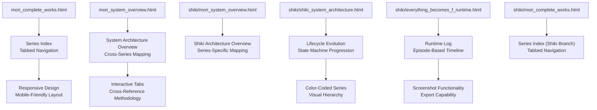
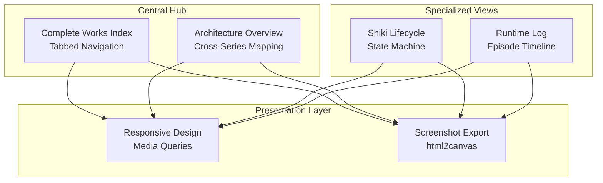
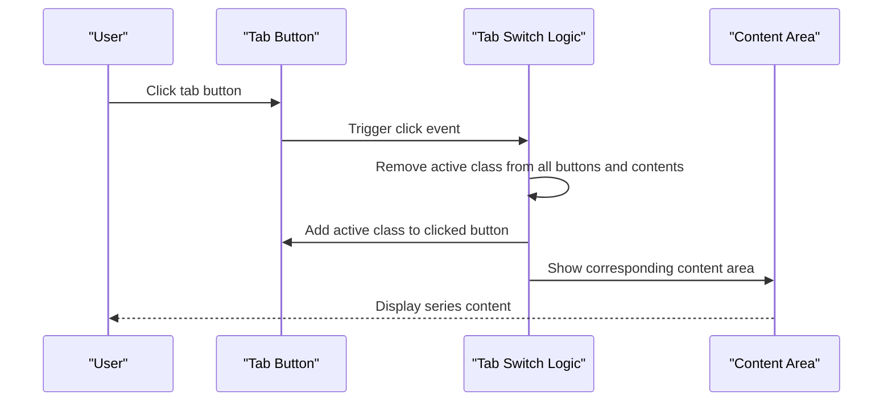
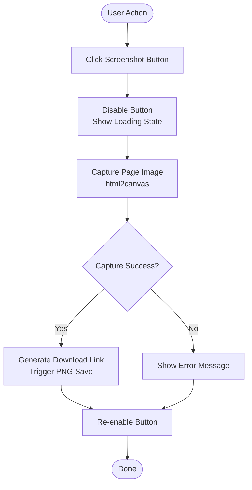
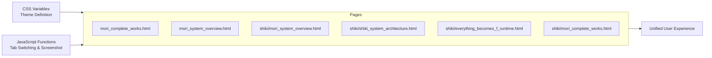

# Project Overview

<cite>
**Referenced Files in This Document**
- [mori_complete_works.html](file://mori_complete_works.html)
- [mori_system_overview.html](file://mori_system_overview.html)
- [shiki/mori_system_overview.html](file://shiki/mori_system_overview.html)
- [shiki/shiki_system_architecture.html](file://shiki/shiki_system_architecture.html)
- [shiki/everything_becomes_f_runtime.html](file://shiki/everything_becomes_f_runtime.html)
- [shiki/mori_complete_works.html](file://shiki/mori_complete_works.html)
</cite>

## Table of Contents
1. [Introduction](#introduction)
2. [Project Structure](#project-structure)
3. [Core Components](#core-components)
4. [Architecture Overview](#architecture-overview)
5. [Detailed Component Analysis](#detailed-component-analysis)
6. [Dependency Analysis](#dependency-analysis)
7. [Performance Considerations](#performance-considerations)
8. [Troubleshooting Guide](#troubleshooting-guide)
9. [Conclusion](#conclusion)

## Introduction
The Mori-universe project is a digital archive and analytical framework dedicated to Mori Hiroshi’s literary works. It serves as an educational resource mapping the interconnected universe of Japanese author Mori Hiroshi’s literary works, particularly the Mori-universe system architecture. The project provides:
- A tabbed navigation system for browsing the complete works across multiple series (S&M, V, Shiki, G, X, Century, Sky Crawlers, W, WW, Void Shaper)
- Color-coded series identification for quick visual scanning
- Interactive visualization capabilities through responsive design and screenshot functionality
- Interdisciplinary insights combining literature, systems theory, and computational metaphors

The platform is designed for both beginners seeking an accessible overview and experienced developers interested in exploring the technical and philosophical parallels embedded in Mori’s narratives.

## Project Structure
The project is organized around several HTML pages, each focusing on a specific aspect of the Mori universe:
- A complete works index with tabbed navigation and series categorization
- An architecture overview page presenting the system evolution and cross-series connections
- A specialized architecture page focusing on the Shiki series’ lifecycle and technical metaphors
- A runtime log page illustrating the progression of “Everything Becomes F” through a state machine lens
- A secondary complete works page under the shiki directory mirroring the main structure

**Diagram sources**
- [mori_complete_works.html:342-722](file://mori_complete_works.html#L342-L722)
- [mori_system_overview.html:277-701](file://mori_system_overview.html#L277-L701)
- [shiki/mori_system_overview.html:277-701](file://shiki/mori_system_overview.html#L277-L701)
- [shiki/shiki_system_architecture.html:391-784](file://shiki/shiki_system_architecture.html#L391-L784)
- [shiki/everything_becomes_f_runtime.html:311-586](file://shiki/everything_becomes_f_runtime.html#L311-L586)
- [shiki/mori_complete_works.html:342-722](file://shiki/mori_complete_works.html#L342-L722)

**Section sources**
- [mori_complete_works.html:342-722](file://mori_complete_works.html#L342-L722)
- [mori_system_overview.html:277-701](file://mori_system_overview.html#L277-L701)
- [shiki/mori_system_overview.html:277-701](file://shiki/mori_system_overview.html#L277-L701)
- [shiki/shiki_system_architecture.html:391-784](file://shiki/shiki_system_architecture.html#L391-L784)
- [shiki/everything_becomes_f_runtime.html:311-586](file://shiki/everything_becomes_f_runtime.html#L311-L586)
- [shiki/mori_complete_works.html:342-722](file://shiki/mori_complete_works.html#L342-L722)

## Core Components
- Tabbed Navigation System
  - Provides quick access to each series with color-coded indicators
  - Implements smooth activation/deactivation of tabs and corresponding content blocks
  - Supports keyboard-friendly interaction and mobile responsiveness

- Color-Coded Series Identification
  - Each series is associated with a distinct accent color for immediate recognition
  - Visual indicators appear on tab buttons and series cards
  - Enhances accessibility and scannability across long lists

- Interactive Visualization Capabilities
  - Responsive layout adapts to screen sizes with media queries
  - Screenshot functionality exports the current page as a PNG image
  - Uses html2canvas for client-side rendering and export

- Cross-Reference Methodology
  - Series metadata cards present key attributes (characters, publication years, volumes)
  - Comprehensive tables list titles, translations, and publication years
  - Footer statistics summarize totals and ongoing series

**Section sources**
- [mori_complete_works.html:57-117](file://mori_complete_works.html#L57-L117)
- [mori_complete_works.html:160-243](file://mori_complete_works.html#L160-L243)
- [mori_system_overview.html:55-82](file://mori_system_overview.html#L55-L82)
- [shiki/shiki_system_architecture.html:51-93](file://shiki/shiki_system_architecture.html#L51-L93)

## Architecture Overview
The Mori-universe architecture blends literary analysis with interactive presentation:
- Central hub: Complete works index with unified tabbed interface
- Specialized views: Architecture overviews and lifecycle analyses
- Cross-linking: Shared series identifiers and color schemes across pages
- Export capability: Screenshot functionality for sharing and archival

**Diagram sources**
- [mori_complete_works.html:342-722](file://mori_complete_works.html#L342-L722)
- [mori_system_overview.html:277-701](file://mori_system_overview.html#L277-L701)
- [shiki/shiki_system_architecture.html:391-784](file://shiki/shiki_system_architecture.html#L391-L784)
- [shiki/everything_becomes_f_runtime.html:311-586](file://shiki/everything_becomes_f_runtime.html#L311-L586)

## Detailed Component Analysis

### Tabbed Navigation System
The tabbed navigation system enables seamless switching between series while maintaining visual continuity:
- Tab buttons feature color indicators and active state highlighting
- Content areas are toggled via JavaScript event listeners
- Mobile-first responsive design ensures usability across devices

**Diagram sources**
- [mori_complete_works.html:674-686](file://mori_complete_works.html#L674-L686)
- [mori_system_overview.html:659-665](file://mori_system_overview.html#L659-L665)

**Section sources**
- [mori_complete_works.html:57-117](file://mori_complete_works.html#L57-L117)
- [mori_system_overview.html:55-82](file://mori_system_overview.html#L55-L82)

### Color-Coded Series Identification
Each series is visually distinguished through a dedicated accent color:
- S&M: Blue (#38bdf8)
- V: Teal (#2dd4bf)
- Shiki: Pink (#f472b6)
- G: Purple (#a78bfa)
- X: Orange (#fb923c)
- Century: Yellow (#fbbf24)
- Sky Crawlers: Red (#f87171)
- W: Light Blue (#60a5fa)
- WW: Violet (#818cf8)
- Void Shaper: Green (#4ade80)

These colors are applied to tab indicators, series titles, and table headers for consistent visual hierarchy.

**Section sources**
- [mori_complete_works.html:15-26](file://mori_complete_works.html#L15-L26)
- [mori_complete_works.html:92-113](file://mori_complete_works.html#L92-L113)
- [mori_system_overview.html:8-27](file://mori_system_overview.html#L8-L27)
- [shiki/shiki_system_architecture.html:8-23](file://shiki/shiki_system_architecture.html#L8-L23)

### Interactive Visualization Capabilities
The platform incorporates interactive elements to enhance user engagement:
- Screenshot functionality allows exporting the current view as a PNG
- Responsive design adapts layouts for mobile and desktop screens
- Visual feedback through hover states and active tab highlighting

**Diagram sources**
- [mori_complete_works.html:688-720](file://mori_complete_works.html#L688-L720)
- [mori_system_overview.html:667-699](file://mori_system_overview.html#L667-L699)
- [shiki/shiki_system_architecture.html:749-782](file://shiki/shiki_system_architecture.html#L749-L782)
- [shiki/everything_becomes_f_runtime.html:552-584](file://shiki/everything_becomes_f_runtime.html#L552-L584)

**Section sources**
- [mori_complete_works.html:311-339](file://mori_complete_works.html#L311-L339)
- [mori_system_overview.html:246-274](file://mori_system_overview.html#L246-L274)
- [shiki/shiki_system_architecture.html:360-388](file://shiki/shiki_system_architecture.html#L360-L388)
- [shiki/everything_becomes_f_runtime.html:280-308](file://shiki/everything_becomes_f_runtime.html#L280-L308)

### Cross-Reference Methodology
The system employs a structured approach to cross-reference series and content:
- Metadata cards provide essential series information
- Comprehensive tables list titles, translations, and publication years
- Footer statistics offer aggregated insights across the entire corpus

Practical examples:
- Series categorization: Each tab corresponds to a specific series with associated metadata
- Cross-referencing: Architecture overview maps series to technical concepts and philosophical themes
- Lifecycle visualization: Shiki’s architecture page presents a five-phase evolution with detailed theorem mappings

**Section sources**
- [mori_system_overview.html:290-427](file://mori_system_overview.html#L290-L427)
- [shiki/shiki_system_architecture.html:398-744](file://shiki/shiki_system_architecture.html#L398-L744)
- [shiki/everything_becomes_f_runtime.html:318-542](file://shiki/everything_becomes_f_runtime.html#L318-L542)

## Dependency Analysis
The project exhibits a cohesive internal dependency structure:
- Shared CSS variables define consistent theming across pages
- JavaScript functions are duplicated across pages for screenshot functionality
- Tab navigation logic follows a uniform pattern across different contexts

**Diagram sources**
- [mori_complete_works.html:7-340](file://mori_complete_works.html#L7-L340)
- [mori_system_overview.html:7-275](file://mori_system_overview.html#L7-L275)
- [shiki/mori_system_overview.html:7-275](file://shiki/mori_system_overview.html#L7-L275)
- [shiki/shiki_system_architecture.html:7-389](file://shiki/shiki_system_architecture.html#L7-L389)
- [shiki/everything_becomes_f_runtime.html:7-309](file://shiki/everything_becomes_f_runtime.html#L7-L309)
- [shiki/mori_complete_works.html:7-339](file://shiki/mori_complete_works.html#L7-L339)

**Section sources**
- [mori_complete_works.html:7-340](file://mori_complete_works.html#L7-L340)
- [mori_system_overview.html:7-275](file://mori_system_overview.html#L7-L275)
- [shiki/mori_system_overview.html:7-275](file://shiki/mori_system_overview.html#L7-L275)
- [shiki/shiki_system_architecture.html:7-389](file://shiki/shiki_system_architecture.html#L7-L389)
- [shiki/everything_becomes_f_runtime.html:7-309](file://shiki/everything_becomes_f_runtime.html#L7-L309)
- [shiki/mori_complete_works.html:7-339](file://shiki/mori_complete_works.html#L7-L339)

## Performance Considerations
- Client-side rendering: html2canvas captures the DOM for export, which can be resource-intensive on large pages
- CSS animations: Smooth transitions and hover effects are optimized for modern browsers
- Responsive design: Media queries ensure efficient rendering across device sizes
- JavaScript efficiency: Event delegation and minimal DOM manipulation improve interactivity

## Troubleshooting Guide
Common issues and resolutions:
- Screenshot export failures: Verify browser support for html2canvas and CORS settings
- Tab switching not working: Ensure JavaScript is enabled and event listeners are attached
- Mobile layout problems: Check viewport meta tag and media query breakpoints
- Color contrast issues: Validate WCAG compliance for accessibility standards

**Section sources**
- [mori_complete_works.html:688-720](file://mori_complete_works.html#L688-L720)
- [mori_system_overview.html:667-699](file://mori_system_overview.html#L667-L699)
- [shiki/shiki_system_architecture.html:749-782](file://shiki/shiki_system_architecture.html#L749-L782)
- [shiki/everything_becomes_f_runtime.html:552-584](file://shiki/everything_becomes_f_runtime.html#L552-L584)

## Conclusion
The Mori-universe project successfully combines literary scholarship with interactive digital presentation. Its tabbed navigation, color-coded series identification, and screenshot functionality provide an accessible yet sophisticated platform for exploring Mori Hiroshi’s interconnected narrative universe. The architecture supports both casual readers and researchers, offering multiple entry points and cross-referencing mechanisms that illuminate the technical and philosophical themes woven throughout his works.