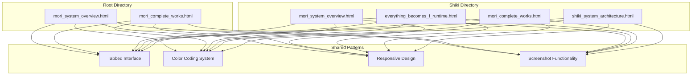
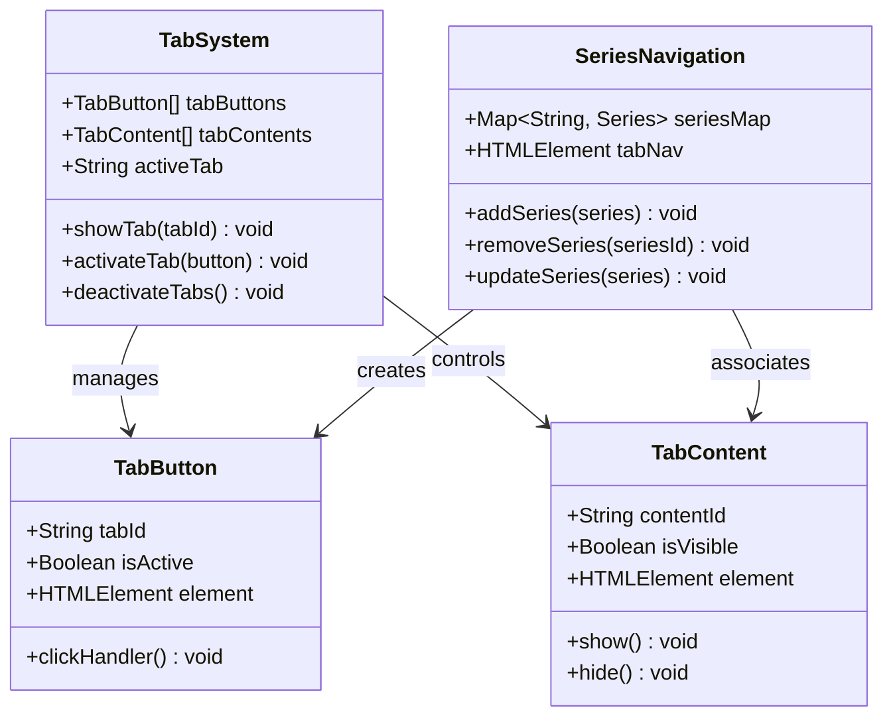
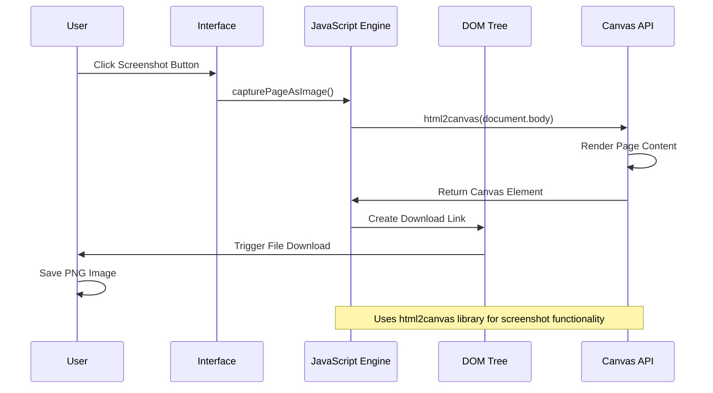
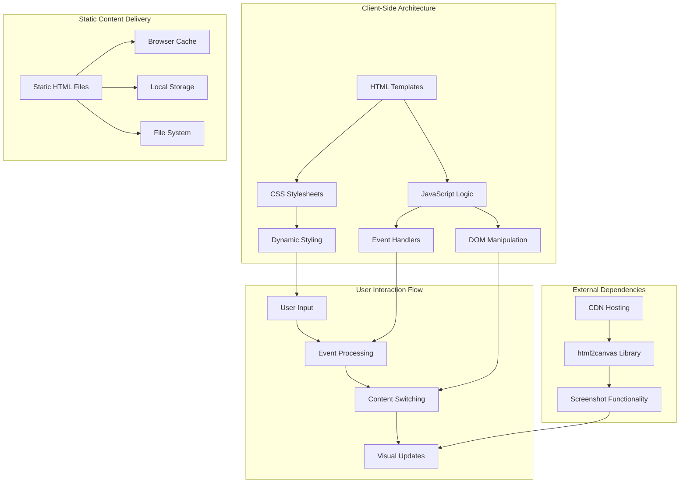
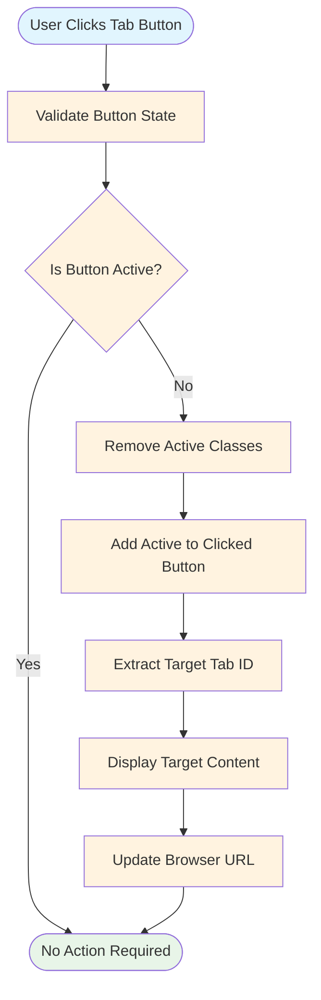
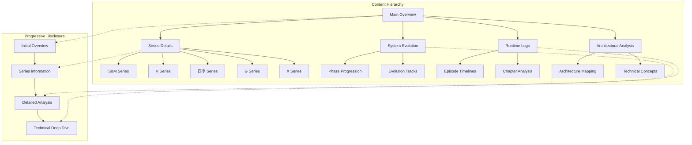
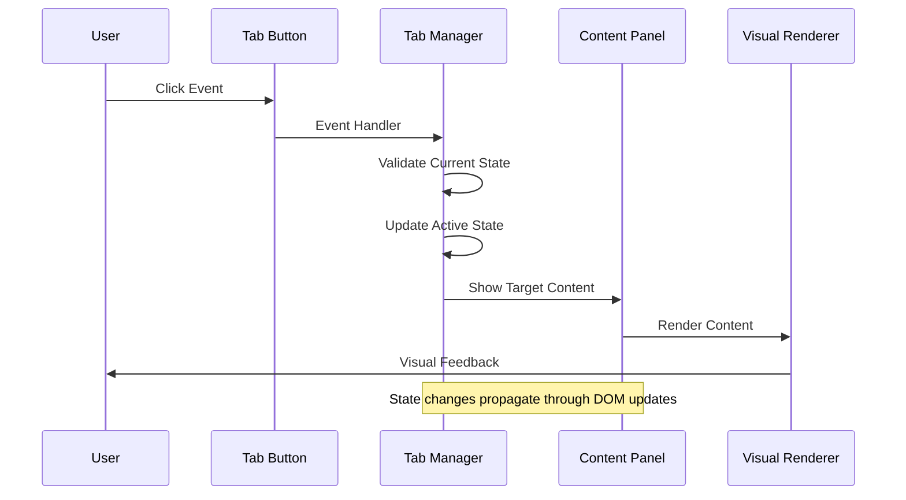
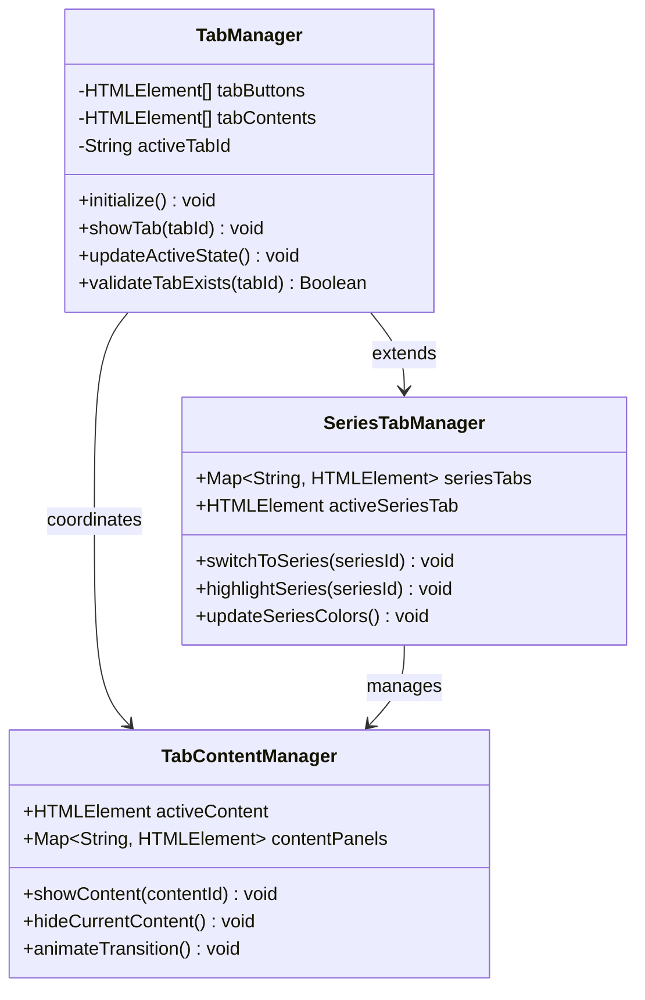
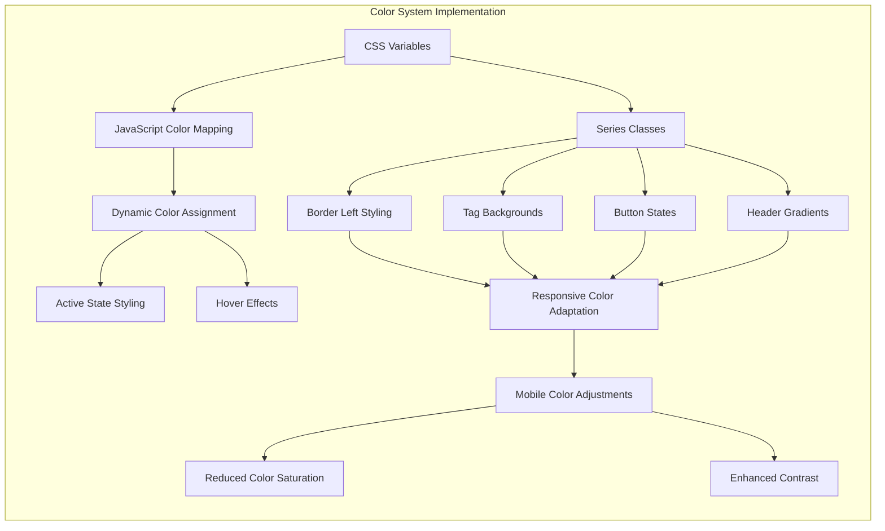
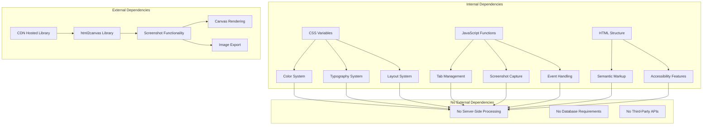

# System Architecture

<cite>
**Referenced Files in This Document**
- [mori_system_overview.html](file://mori_system_overview.html)
- [mori_complete_works.html](file://mori_complete_works.html)
- [shiki/mori_system_overview.html](file://shiki/mori_system_overview.html)
- [shiki/everything_becomes_f_runtime.html](file://shiki/everything_becomes_f_runtime.html)
- [shiki/mori_complete_works.html](file://shiki/mori_complete_works.html)
- [shiki/shiki_system_architecture.html](file://shiki/shiki_system_architecture.html)
</cite>

## Table of Contents
1. [Introduction](#introduction)
2. [Project Structure](#project-structure)
3. [Core Components](#core-components)
4. [Architecture Overview](#architecture-overview)
5. [Detailed Component Analysis](#detailed-component-analysis)
6. [Dependency Analysis](#dependency-analysis)
7. [Performance Considerations](#performance-considerations)
8. [Troubleshooting Guide](#troubleshooting-guide)
9. [Conclusion](#conclusion)

## Introduction

The Mori-universe system architecture represents a sophisticated digital humanities project that presents the complete works of Japanese author Mori Hiroshi through an innovative tabbed interface design. This architecture combines literary analysis with technical system visualization, creating an immersive experience that bridges philosophy, technology, and narrative storytelling.

The system employs a pure HTML/CSS/JavaScript implementation without external dependencies, utilizing modern web technologies to create an interactive, responsive experience. The architecture centers around three primary design patterns: tabbed navigation, color-coded series identification, and interactive visualization components.

## Project Structure

The Mori-universe project follows a modular directory structure that separates different aspects of the Mori universe:



**Diagram sources**
- [mori_system_overview.html:1-702](file://mori_system_overview.html#L1-L702)
- [mori_complete_works.html:1-723](file://mori_complete_works.html#L1-L723)
- [shiki/mori_system_overview.html:1-702](file://shiki/mori_system_overview.html#L1-L702)

The project consists of two main directories:
- **Root level**: Contains the main overview and complete works pages
- **Shiki directory**: Houses specialized content focusing on the character真贺田四季 (Magata Shiki)

**Section sources**
- [mori_system_overview.html:1-702](file://mori_system_overview.html#L1-L702)
- [mori_complete_works.html:1-723](file://mori_complete_works.html#L1-L723)
- [shiki/mori_system_overview.html:1-702](file://shiki/mori_system_overview.html#L1-L702)

## Core Components

### Tabbed Interface Architecture

The system implements a sophisticated tabbed navigation system that serves as the primary content organization mechanism. Each page contains multiple tab panels that can be activated independently, allowing users to explore different aspects of the Mori universe simultaneously.



**Diagram sources**
- [mori_system_overview.html:659-666](file://mori_system_overview.html#L659-L666)
- [mori_complete_works.html:673-687](file://mori_complete_works.html#L673-L687)

### Color-Coded Series Identification System

The architecture implements a comprehensive color-coding system that visually distinguishes between different series within the Mori universe. Each series is assigned a unique color scheme that permeates the entire interface design.

```mermaid
graph LR
subgraph "Series Color System"
A[S&M Series - Blue (#38bdf8)]
B[V Series - Teal (#2dd4bf)]
C[四季 Series - Pink (#f472b6)]
D[G Series - Purple (#a78bfa)]
E[X Series - Orange (#fb923c)]
F[百年 Series - Yellow (#fbbf24)]
G[空中杀手 Series - Red (#f87171)]
H[W Series - Light Blue (#60a5fa)]
I[WW Series - Violet (#818cf8)]
J[Void Shaper Series - Green (#4ade80)]
end
subgraph "Visual Implementation"
K[Border Left Styling]
L[Tag Background Colors]
M[Button Active States]
N[Header Gradient Effects]
end
A --> K
B --> K
C --> K
D --> K
E --> K
F --> K
G --> K
H --> K
I --> K
J --> K
A --> L
B --> L
C --> L
D --> L
E --> L
F --> L
G --> L
H --> L
I --> L
J --> L
A --> M
B --> M
C --> M
D --> M
E --> M
F --> M
G --> M
H --> M
I --> M
J --> M
A --> N
B --> N
C --> N
D --> N
E --> N
F --> N
G --> N
H --> N
I --> N
J --> N
```

**Diagram sources**
- [mori_system_overview.html:120-149](file://mori_system_overview.html#L120-L149)
- [mori_complete_works.html:160-170](file://mori_complete_works.html#L160-L170)

### Interactive Visualization Components

The system incorporates several interactive visualization components that enhance user engagement and provide dynamic content presentation:



**Diagram sources**
- [mori_system_overview.html:669-698](file://mori_system_overview.html#L669-L698)
- [shiki/everything_becomes_f_runtime.html:554-583](file://shiki/everything_becomes_f_runtime.html#L554-L583)

**Section sources**
- [mori_system_overview.html:659-698](file://mori_system_overview.html#L659-L698)
- [mori_complete_works.html:673-720](file://mori_complete_works.html#L673-L720)

## Architecture Overview

The Mori-universe system architecture follows a client-side rendering pattern with server-side static file delivery. The system is designed as a single-page application (SPA) that loads all content dynamically without requiring server-side processing.



**Diagram sources**
- [mori_system_overview.html:669-698](file://mori_system_overview.html#L669-L698)
- [mori_complete_works.html:688-720](file://mori_complete_works.html#L688-L720)

The architecture emphasizes performance and accessibility through several key design decisions:

### Pure Static File Implementation

The system maintains a completely static architecture, eliminating server-side dependencies and database requirements. This approach ensures:

- **Instant loading**: No server requests required for basic page functionality
- **Offline accessibility**: Content remains available without network connectivity  
- **Scalability**: Zero server load regardless of traffic volume
- **Security**: No server-side attack surface

### Responsive Design System

The architecture implements a comprehensive responsive design system using CSS media queries that adapt the interface to various screen sizes and devices.

**Section sources**
- [mori_system_overview.html:238-245](file://mori_system_overview.html#L238-L245)
- [mori_complete_works.html:301-310](file://mori_complete_works.html#L301-L310)

## Detailed Component Analysis

### Navigation System Architecture

The navigation system operates through a centralized tab management mechanism that coordinates between tab buttons and their corresponding content panels.



**Diagram sources**
- [mori_system_overview.html:660-665](file://mori_system_overview.html#L660-L665)
- [mori_complete_works.html:675-685](file://mori_complete_works.html#L675-L685)

### Content Organization Patterns

The system employs modular content organization that allows for progressive disclosure of information:



**Diagram sources**
- [mori_system_overview.html:290-654](file://mori_system_overview.html#L290-L654)
- [mori_complete_works.html:349-644](file://mori_complete_works.html#L349-L644)

### Data Flow Architecture

The system implements a unidirectional data flow pattern where user interactions trigger state changes that propagate through the interface:



**Diagram sources**
- [mori_system_overview.html:659-666](file://mori_system_overview.html#L659-L666)
- [mori_complete_works.html:673-687](file://mori_complete_works.html#L673-L687)

**Section sources**
- [mori_system_overview.html:659-666](file://mori_system_overview.html#L659-L666)
- [mori_complete_works.html:673-687](file://mori_complete_works.html#L673-L687)

### Technical Implementation Details

#### Tab Switching Mechanism

The tab switching mechanism utilizes a clean separation of concerns between presentation and logic:



**Diagram sources**
- [mori_system_overview.html:659-666](file://mori_system_overview.html#L659-L666)
- [mori_complete_works.html:673-687](file://mori_complete_works.html#L673-L687)

#### Color-Coding Implementation

The color-coding system implements a comprehensive theming approach that affects multiple UI elements:



**Diagram sources**
- [mori_system_overview.html:8-27](file://mori_system_overview.html#L8-L27)
- [mori_complete_works.html:8-26](file://mori_complete_works.html#L8-L26)

**Section sources**
- [mori_system_overview.html:8-27](file://mori_system_overview.html#L8-L27)
- [mori_complete_works.html:8-26](file://mori_complete_works.html#L8-L26)

## Dependency Analysis

The system maintains minimal external dependencies to ensure reliability and performance:



**Diagram sources**
- [mori_system_overview.html:667](file://mori_system_overview.html#L667)
- [mori_complete_works.html:688](file://mori_complete_works.html#L688)

The dependency analysis reveals a carefully constructed architecture that prioritizes:

- **Performance**: Minimal external resources reduce loading times
- **Reliability**: Fewer dependencies mean fewer potential failure points
- **Maintainability**: Simple architecture is easier to update and debug
- **Security**: No external dependencies eliminate injection vulnerabilities

**Section sources**
- [mori_system_overview.html:667-667](file://mori_system_overview.html#L667-L667)
- [mori_complete_works.html:688-688](file://mori_complete_works.html#L688-L688)

## Performance Considerations

The Mori-universe architecture implements several performance optimization strategies:

### Static Asset Delivery

The system leverages browser caching mechanisms to minimize bandwidth usage and improve load times. All static assets are delivered as pre-rendered HTML files with embedded CSS and JavaScript, eliminating the need for server-side processing.

### Efficient DOM Manipulation

The tab switching mechanism employs efficient DOM manipulation techniques that minimize layout thrashing and repaint cycles. The system uses class-based state management rather than inline style modifications to optimize rendering performance.

### Optimized Media Queries

The responsive design system utilizes CSS media queries that are optimized for modern browsers while maintaining graceful degradation for older clients. The breakpoints are strategically placed to minimize unnecessary reflows during viewport changes.

### Image Optimization

The screenshot functionality uses the html2canvas library with optimized rendering parameters to balance quality and performance. The system automatically scales down image resolution for mobile devices while maintaining full quality for desktop users.

## Troubleshooting Guide

### Common Issues and Solutions

#### Tab Switching Problems

**Issue**: Tabs fail to switch or remain inactive
**Solution**: Verify that all tab buttons have unique IDs and that the JavaScript initialization occurs after DOMContentLoaded

#### Color-Coding Inconsistencies

**Issue**: Series colors appear incorrect or inconsistent
**Solution**: Check that CSS variables are properly defined and that the color classes match the series identifiers

#### Screenshot Functionality Failures

**Issue**: Screenshot capture fails or produces blank images
**Solution**: Ensure that the html2canvas library is properly loaded and that the page content is fully rendered before capture

#### Responsive Design Issues

**Issue**: Layout breaks on mobile devices
**Solution**: Verify that media queries are properly structured and that viewport meta tags are included in the HTML head

**Section sources**
- [mori_system_overview.html:669-698](file://mori_system_overview.html#L669-L698)
- [mori_complete_works.html:690-720](file://mori_complete_works.html#L690-L720)

## Conclusion

The Mori-universe system architecture represents a sophisticated implementation of a static, client-side web application that successfully balances technical innovation with literary accessibility. The architecture demonstrates several key strengths:

**Technical Excellence**: The pure HTML/CSS/JavaScript implementation showcases modern web development practices without unnecessary complexity. The tabbed interface system provides intuitive navigation while maintaining excellent performance characteristics.

**Design Innovation**: The color-coded series identification system creates a cohesive visual language that enhances user comprehension and engagement. The responsive design ensures accessibility across all device types.

**Content Organization**: The modular content structure enables progressive disclosure of information, allowing users to explore the Mori universe at their own pace while maintaining contextual coherence.

**Architectural Simplicity**: The minimal external dependency approach ensures long-term maintainability and eliminates potential security vulnerabilities. The static file delivery model provides excellent scalability and reliability.

The system successfully integrates literary analysis with technical visualization, creating an innovative platform that serves both casual readers and academic researchers. The architecture provides a solid foundation for future enhancements while maintaining the simplicity and reliability that make it accessible to users worldwide.