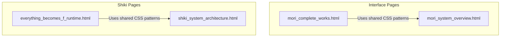
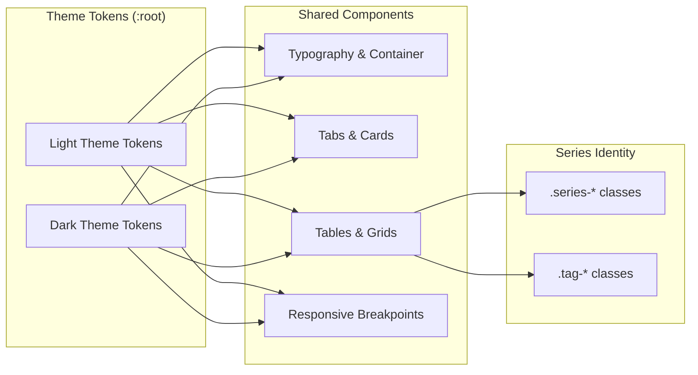
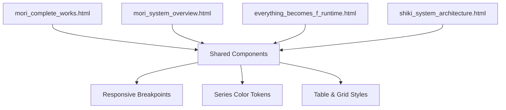

# CSS Architecture and Theming System

<cite>
**Referenced Files in This Document**
- [mori_complete_works.html](file://interface/mori_complete_works.html)
- [mori_system_overview.html](file://interface/mori_system_overview.html)
- [everything_becomes_f_runtime.html](file://shiki/everything_becomes_f_runtime.html)
- [shiki_system_architecture.html](file://shiki/shiki_system_architecture.html)
</cite>

## Table of Contents
1. [Introduction](#introduction)
2. [Project Structure](#project-structure)
3. [Core Components](#core-components)
4. [Architecture Overview](#architecture-overview)
5. [Detailed Component Analysis](#detailed-component-analysis)
6. [Dependency Analysis](#dependency-analysis)
7. [Performance Considerations](#performance-considerations)
8. [Troubleshooting Guide](#troubleshooting-guide)
9. [Conclusion](#conclusion)

## Introduction
This document explains the CSS architecture and theming system of the Mori-universe project. It focuses on:
- CSS custom properties (:root variables) for consistent theming across light/dark themes
- Dark mode color scheme using --bg, --card, and --text variables
- Series-specific color coding for thematic identity
- Responsive design using CSS media queries targeting 768px breakpoints
- Grid-based layout system for phase cards and evolution tracks
- Table styling architecture with sticky headers and hover effects
- Modular CSS organization across pages
- Print media styles and backdrop-filter effects for the screenshot button
- Gradient color schemes and performance considerations for a lightweight, framework-free approach

## Project Structure
The project consists of four standalone HTML pages, each embedding scoped CSS:
- interface/mori_complete_works.html: Series catalog with tabbed navigation, statistics, and responsive tables
- interface/mori_system_overview.html: System architecture overview with phase cards, evolution tracks, and series tagging
- shiki/everything_becomes_f_runtime.html: Episode timeline with color-coded episode dots and badges
- shiki/shiki_system_architecture.html: Deep table with sticky headers, phase/state tagging, and gradient backgrounds

**Diagram sources**
- [mori_complete_works.html](file://interface/mori_complete_works.html)
- [mori_system_overview.html](file://interface/mori_system_overview.html)
- [everything_becomes_f_runtime.html](file://shiki/everything_becomes_f_runtime.html)
- [shiki_system_architecture.html](file://shiki/shiki_system_architecture.html)

**Section sources**
- [mori_complete_works.html](file://interface/mori_complete_works.html)
- [mori_system_overview.html](file://interface/mori_system_overview.html)
- [everything_becomes_f_runtime.html](file://shiki/everything_becomes_f_runtime.html)
- [shiki_system_architecture.html](file://shiki/shiki_system_architecture.html)

## Core Components
- CSS custom properties in :root define theme tokens for background, card, borders, text, and series colors
- Modular styles for containers, typography, tabs, cards, tables, grids, and responsive adjustments
- Series-specific color coding via classes like .series-sm, .series-v, .series-shiki, etc.
- Sticky table headers and hover effects for interactive tables
- Backdrop-filter for the screenshot button and print media styles to hide UI elements during printing

Key implementation patterns:
- Centralized theming via CSS variables for easy theme switching
- Series color tokens mapped to both background and border for consistent accents
- Responsive breakpoints at 768px for mobile adaptation
- Grid layouts for phase cards and evolution tracks
- Gradient backgrounds for headers and highlights

**Section sources**
- [mori_complete_works.html](file://interface/mori_complete_works.html)
- [mori_system_overview.html](file://interface/mori_system_overview.html)
- [everything_becomes_f_runtime.html](file://shiki/everything_becomes_f_runtime.html)
- [shiki_system_architecture.html](file://shiki/shiki_system_architecture.html)

## Architecture Overview
The CSS architecture follows a modular, component-based approach with a strong emphasis on CSS custom properties for theming and consistent spacing/typography. Each page defines its own :root tokens aligned to its theme (light or dark), and reuses common selectors for cards, tables, and responsive behavior.

**Diagram sources**
- [mori_complete_works.html](file://interface/mori_complete_works.html)
- [mori_system_overview.html](file://interface/mori_system_overview.html)
- [everything_becomes_f_runtime.html](file://shiki/everything_becomes_f_runtime.html)
- [shiki_system_architecture.html](file://shiki/shiki_system_architecture.html)

## Detailed Component Analysis

### CSS Custom Properties and Theming
- Light theme (interface pages): Uses --bg, --bg-subtle, --bg-card, --border, --border-light, --text-primary, --text-secondary, --text-muted, and series tokens like --sm, --v, --shiki, etc.
- Dark theme (shiki pages): Uses --bg, --card, --border, --text, --text-dim, --text-bright, and series tokens like --c1..--c6 for gradients and accents
- Consistent usage of var(--token) across background, color, border, and shadow declarations

Practical effect:
- Changing a single :root token updates the entire page’s appearance
- Series-specific tokens enable consistent color coding across components

**Section sources**
- [mori_complete_works.html](file://interface/mori_complete_works.html)
- [mori_system_overview.html](file://interface/mori_system_overview.html)
- [everything_becomes_f_runtime.html](file://shiki/everything_becomes_f_runtime.html)
- [shiki_system_architecture.html](file://shiki/shiki_system_architecture.html)

### Dark Mode Color Scheme
- Dark theme defines --bg, --card, --border, --text, --text-dim, --text-bright, and gradient tokens --c1..--c6
- Typography and backgrounds adapt using var(--bg) and var(--card)
- Borders and subtle highlights use var(--border) and var(--text-dim)

Example usage patterns:
- Background: background: var(--bg)
- Card: background: var(--card)
- Borders: border: 1px solid var(--border)

**Section sources**
- [shiki/everything_becomes_f_runtime.html](file://shiki/everything_becomes_f_runtime.html)
- [shiki/shiki_system_architecture.html](file://shiki/shiki_system_architecture.html)

### Series-Specific Color Coding
- Interface pages: .series-sm, .series-v, .series-shiki, .series-g, .series-x, .series-century, .series-sky, .series-w, .series-ww, .series-void
- Shiki runtime: .series-* classes on table rows to apply left-border accents
- Tagging: .tag-sm, .tag-v, .tag-shiki, etc., for pill-shaped tags and series identification
- Episode timeline: .ep-* and .badge-* classes for episode dots and badges with color-coded backgrounds/borders

Implementation pattern:
- Each series has a dedicated token (e.g., --sm, --v, --shiki) used to set background, border, and text colors consistently across badges, tags, and row accents

**Section sources**
- [mori_system_overview.html](file://interface/mori_system_overview.html)
- [mori_complete_works.html](file://interface/mori_complete_works.html)
- [everything_becomes_f_runtime.html](file://shiki/everything_becomes_f_runtime.html)

### Responsive Design and 768px Breakpoints
- Media query @media (max-width: 768px) adjusts paddings, font sizes, and layout
- Interface pages: tabs wrap and shrink, table wrapper becomes horizontally scrollable, screenshot button reduces size
- Shiki runtime: reduced padding and font sizes for readability on small screens

Responsive behavior examples:
- Tab navigation wraps and shrinks on small screens
- Table min-width and horizontal scrolling for legibility
- Screenshot button repositioned and sized for mobile

**Section sources**
- [mori_complete_works.html](file://interface/mori_complete_works.html)
- [mori_system_overview.html](file://interface/mori_system_overview.html)
- [shiki/everything_becomes_f_runtime.html](file://shiki/everything_becomes_f_runtime.html)
- [shiki/shiki_system_architecture.html](file://shiki/shiki_system_architecture.html)

### Grid-Based Layout System
- Interface overview: .phase-grid for phase cards, .evo-stage for evolution track stages
- Each grid uses CSS Grid with controlled column widths and gaps
- Hover states and transitions enhance interactivity

Grid usage patterns:
- .phase-grid with gap and responsive adjustments
- .evo-stage with 140px label column and flexible content area

**Section sources**
- [mori_system_overview.html](file://interface/mori_system_overview.html)

### Table Styling Architecture
- Shared table styles across pages: wrapper with rounded corners, borders, and shadows
- Sticky headers using position: sticky and z-index stacking
- Hover effects on rows and cells for interactivity
- Left-border accents per series on table rows

Styling specifics:
- .table-wrapper sets background, border, radius, overflow
- thead th uses sticky positioning and gradient backgrounds
- tbody tr hover applies subtle background tint
- .series-* classes add left border accents

**Section sources**
- [mori_complete_works.html](file://interface/mori_complete_works.html)
- [mori_system_overview.html](file://interface/mori_system_overview.html)
- [shiki/shiki_system_architecture.html](file://shiki/shiki_system_architecture.html)

### Typography and Visual Hierarchy
- Inter and Noto Sans SC fonts for readable text across pages
- Clear hierarchy with font weights, sizes, and letter-spacing
- Code blocks styled with monospace fonts and soft borders

Typography patterns:
- Headings use bold weights and reduced letter-spacing
- Subtitles and metadata use muted colors and smaller sizes
- Code blocks use consistent border and background tokens

**Section sources**
- [mori_complete_works.html](file://interface/mori_complete_works.html)
- [mori_system_overview.html](file://interface/mori_system_overview.html)

### Print Media Styles
- Print styles hide the screenshot button and remove decorative background patterns
- Interface overview removes grid background pattern for clean printing

Print behavior:
- .screenshot-btn { display: none !important } in print media
- body::before removed in print media

**Section sources**
- [mori_complete_works.html](file://interface/mori_complete_works.html)
- [mori_system_overview.html](file://interface/mori_system_overview.html)

### Backdrop-Filter Effects for Screenshot Button
- Screenshot buttons use backdrop-filter: blur(8px) and -webkit-backdrop-filter for frosted glass effect
- Hover states adjust background, border, and shadow for feedback
- Active state restores baseline position

Effect usage:
- .screenshot-btn with blur and transition effects
- Hover and active pseudo-states for interactivity

**Section sources**
- [mori_complete_works.html](file://interface/mori_complete_works.html)
- [mori_system_overview.html](file://interface/mori_system_overview.html)
- [everything_becomes_f_runtime.html](file://shiki/everything_becomes_f_runtime.html)
- [shiki/shiki_system_architecture.html](file://shiki/shiki_system_architecture.html)

### Gradient Color Schemes
- Header gradients: linear-gradient with series or theme tokens
- Card and table headers: gradient backgrounds for depth
- Episode timeline: gradient stroke for central axis

Gradient patterns:
- Header gradients with multiple stops for visual interest
- Table header gradients with bottom borders for separation
- Episode timeline gradient for continuity

**Section sources**
- [everything_becomes_f_runtime.html](file://shiki/everything_becomes_f_runtime.html)
- [shiki/shiki_system_architecture.html](file://shiki/shiki_system_architecture.html)

## Dependency Analysis
The CSS architecture is intentionally modular and self-contained within each HTML page. There are no cross-page CSS dependencies; each page defines its own :root tokens and component styles. This isolation enables:
- Easy theme switching by updating :root tokens
- Independent maintenance of each page’s styles
- Lightweight delivery with minimal overhead

**Diagram sources**
- [mori_complete_works.html](file://interface/mori_complete_works.html)
- [mori_system_overview.html](file://interface/mori_system_overview.html)
- [everything_becomes_f_runtime.html](file://shiki/everything_becomes_f_runtime.html)
- [shiki_system_architecture.html](file://shiki/shiki_system_architecture.html)

**Section sources**
- [mori_complete_works.html](file://interface/mori_complete_works.html)
- [mori_system_overview.html](file://interface/mori_system_overview.html)
- [everything_becomes_f_runtime.html](file://shiki/everything_becomes_f_runtime.html)
- [shiki_system_architecture.html](file://shiki/shiki_system_architecture.html)

## Performance Considerations
- Pure CSS approach avoids JavaScript rendering overhead
- Minimal dependencies: only html2canvas is used for screenshot functionality
- Efficient use of CSS variables reduces duplication and improves maintainability
- Backdrop-filter effects are supported on modern browsers; fallbacks are implicit via default button styles
- Media queries optimize layout for mobile without heavy scripts
- Sticky headers and hover effects are lightweight and hardware-accelerated where supported

Best practices:
- Keep :root tokens centralized for easy theme switching
- Prefer CSS Grid and Flexbox for layout to minimize JS-driven DOM manipulation
- Use print media styles to reduce unnecessary rendering
- Avoid excessive use of expensive filters; backdrop-filter is acceptable for modern devices

[No sources needed since this section provides general guidance]

## Troubleshooting Guide
Common issues and resolutions:
- Screenshot button not visible in print: Ensure print media styles hide .screenshot-btn
- Mobile layout breaks: Verify @media (max-width: 768px) adjustments for tables and buttons
- Series colors not applying: Confirm .series-* and .tag-* classes match :root tokens
- Sticky headers not sticking: Check position: sticky and z-index stacking context
- Backdrop-filter not working: Ensure browser support or provide fallback styles

**Section sources**
- [mori_complete_works.html](file://interface/mori_complete_works.html)
- [mori_system_overview.html](file://interface/mori_system_overview.html)
- [everything_becomes_f_runtime.html](file://shiki/everything_becomes_f_runtime.html)
- [shiki/shiki_system_architecture.html](file://shiki/shiki_system_architecture.html)

## Conclusion
The Mori-universe project employs a robust, modular CSS architecture centered on CSS custom properties for theming. The design system cleanly separates concerns across pages while enabling consistent series identity, responsive behavior, and interactive table experiences. The use of :root tokens allows straightforward theme switching, and the absence of external frameworks keeps the solution lightweight and maintainable. By leveraging CSS Grid, sticky headers, and backdrop-filter effects, the project achieves both visual sophistication and performance efficiency.