# HTML Structure and Semantics

<cite>
**Referenced Files in This Document**
- [mori_system_overview.html](file://shiki/mori_system_overview.html)
- [mori_complete_works.html](file://interface/mori_complete_works.html)
- [mori_system_overview.html](file://interface/mori_system_overview.html)
- [shiki_system_architecture.html](file://shiki/shiki_system_architecture.html)
</cite>

## Table of Contents
1. [Introduction](#introduction)
2. [Project Structure](#project-structure)
3. [Core Components](#core-components)
4. [Architecture Overview](#architecture-overview)
5. [Detailed Component Analysis](#detailed-component-analysis)
6. [Dependency Analysis](#dependency-analysis)
7. [Performance Considerations](#performance-considerations)
8. [Accessibility and Semantic Standards](#accessibility-and-semantic-standards)
9. [Responsive Design Implementation](#responsive-design-implementation)
10. [Best Practices and Recommendations](#best-practices-and-recommendations)
11. [Conclusion](#conclusion)

## Introduction

The Mori-universe project represents a sophisticated digital archive of Japanese author Mori Hiroshi's literary works, specifically designed to present complex narrative structures and philosophical themes through modern web technologies. This documentation focuses on the HTML structure and semantic organization that enables effective presentation of literary series data, system evolution visualization, and character development analysis.

The project employs three primary architectural approaches: tabbed interface patterns for content organization, table-based data presentation for literary series information, and responsive grid layouts for visualizing system evolution and character development. These patterns work together to create an immersive experience that bridges traditional literary analysis with contemporary web design principles.

## Project Structure

The Mori-universe project is organized into two main directories, each serving distinct purposes in the overall information architecture:

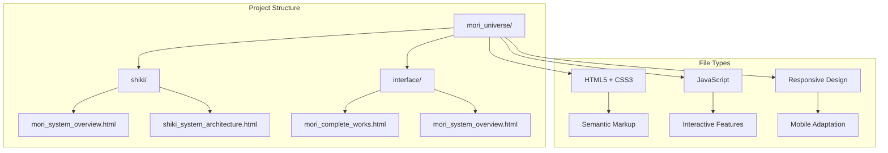

**Diagram sources**
- [mori_system_overview.html:1-702](file://shiki/mori_system_overview.html#L1-L702)
- [mori_complete_works.html:1-970](file://interface/mori_complete_works.html#L1-L970)

The project utilizes a modular approach where each HTML file serves a specific analytical purpose:

- **Shiki Directory**: Contains specialized analysis pages focusing on system architecture and character development
- **Interface Directory**: Houses user-friendly presentation layers with comprehensive series catalogs
- **Dual Implementation**: Same content presented through different semantic approaches for varied analytical perspectives

**Section sources**
- [mori_system_overview.html:1-702](file://shiki/mori_system_overview.html#L1-L702)
- [mori_complete_works.html:1-970](file://interface/mori_complete_works.html#L1-L970)

## Core Components

### Tabbed Interface System

The project implements a sophisticated tabbed interface pattern that allows users to navigate between different analytical perspectives while maintaining contextual continuity. The tab system consists of four primary tabs in the main overview page:

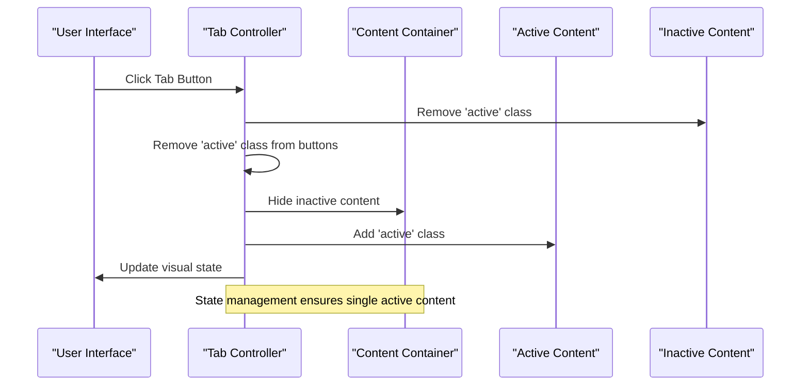

**Diagram sources**
- [mori_system_overview.html:659-666](file://shiki/mori_system_overview.html#L659-L666)

The tab system demonstrates several key implementation patterns:

- **Event-driven state management**: JavaScript handles tab switching through event listeners
- **CSS class manipulation**: Dynamic styling based on active state
- **Content visibility control**: Programmatic display/hide of tab content areas
- **Visual feedback**: Immediate user feedback through button state changes

### Table-Based Data Architecture

The literary series data is structured using semantic HTML tables with comprehensive header organization:

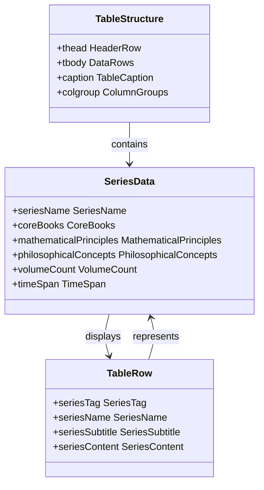

**Diagram sources**
- [mori_system_overview.html:290-428](file://shiki/mori_system_overview.html#L290-L428)

Each table row encapsulates comprehensive information about literary series, utilizing semantic markup to convey hierarchical relationships and data organization.

### Responsive Grid Layout System

The project implements a flexible grid system for displaying complex information hierarchies:

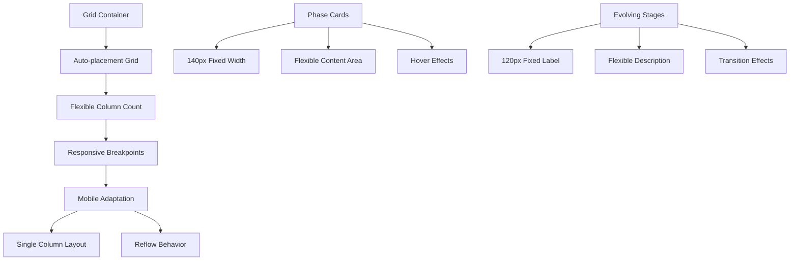

**Diagram sources**
- [mori_system_overview.html:162-219](file://shiki/mori_system_overview.html#L162-L219)

**Section sources**
- [mori_system_overview.html:55-82](file://shiki/mori_system_overview.html#L55-L82)
- [mori_system_overview.html:83-161](file://shiki/mori_system_overview.html#L83-L161)

## Architecture Overview

The Mori-universe project employs a multi-layered architecture that combines semantic HTML structure with modern web technologies:

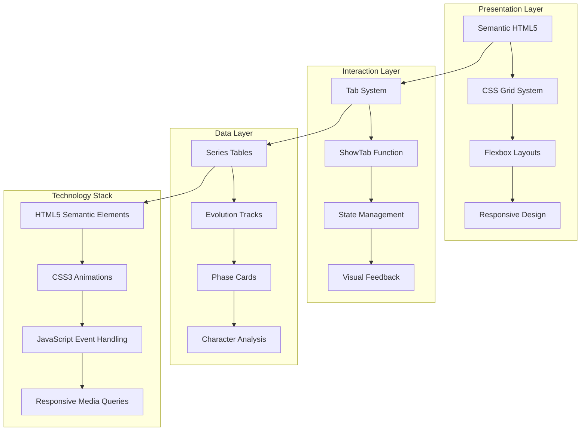

**Diagram sources**
- [mori_system_overview.html:1-702](file://shiki/mori_system_overview.html#L1-L702)
- [mori_complete_works.html:1-970](file://interface/mori_complete_works.html#L1-L970)

The architecture emphasizes semantic correctness while maintaining visual appeal and functional effectiveness across different device contexts.

**Section sources**
- [shiki_system_architecture.html:1-785](file://shiki/shiki_system_architecture.html#L1-L785)

## Detailed Component Analysis

### Semantic HTML Structure

The project demonstrates excellent adherence to HTML5 semantic standards, utilizing appropriate elements for content organization and meaning:

#### Header Hierarchy Organization

The document structure follows a logical heading hierarchy that establishes content relationships:

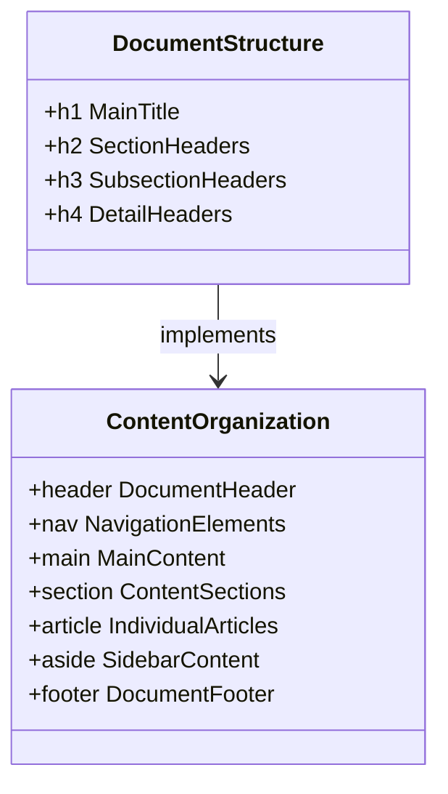

**Diagram sources**
- [mori_system_overview.html:277-281](file://shiki/mori_system_overview.html#L277-L281)

#### Table Semantic Organization

The table implementation showcases proper semantic markup with comprehensive header organization:

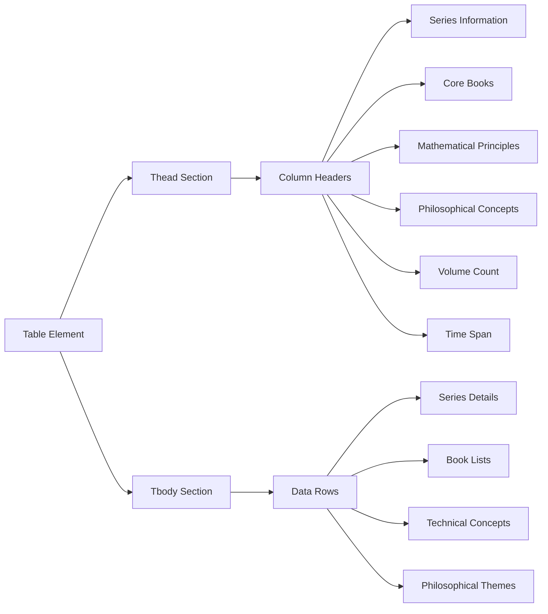

**Diagram sources**
- [mori_system_overview.html:293-303](file://shiki/mori_system_overview.html#L293-L303)

### Tab System Implementation

The tab system represents a sophisticated implementation of client-side content management:

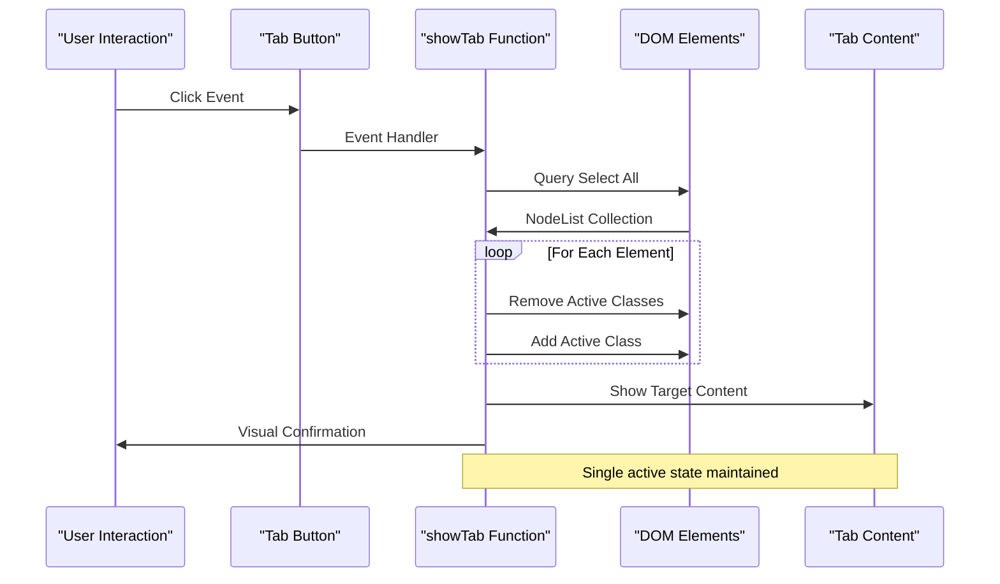

**Diagram sources**
- [mori_system_overview.html:659-666](file://shiki/mori_system_overview.html#L659-L666)

#### Tab Content Architecture

Each tab content area serves a specific analytical purpose:

| Tab ID | Content Type | Purpose | Visual Design |
|--------|--------------|---------|---------------|
| `overview` | System Architecture | Comprehensive series overview | Dark theme with gradient accents |
| `evolution` | Evolution Phases | System development stages | Card-based grid layout |
| `sm-detail` | Technical Analysis | S&M series bug tracking | Monospace typography |
| `saikawa` | Character Development | Architect evolution timeline | Timeline progression |

**Section sources**
- [mori_system_overview.html:283-288](file://shiki/mori_system_overview.html#L283-L288)
- [mori_system_overview.html:659-666](file://shiki/mori_system_overview.html#L659-L666)

### Table Data Structure Analysis

The literary series data follows a structured approach that balances comprehensive information with readability:

#### Series Information Organization

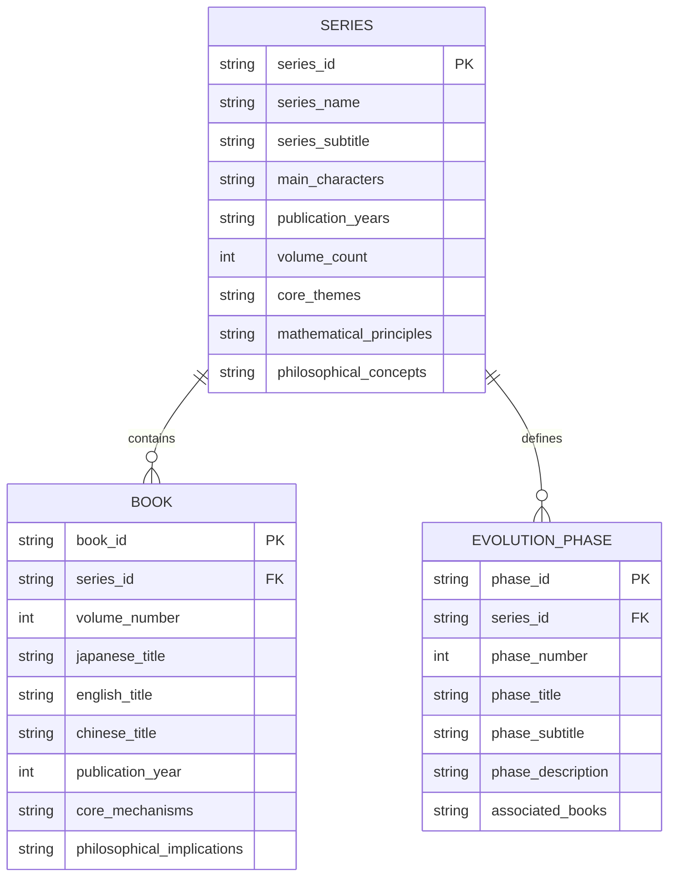

**Diagram sources**
- [mori_system_overview.html:420-540](file://shiki/mori_system_overview.html#L420-L540)

#### Data Presentation Patterns

The table data structure employs several effective presentation patterns:

- **Color-coded series identification**: Each series maintains consistent color coding throughout
- **Hierarchical information display**: Complex information is broken into digestible segments
- **Technical terminology integration**: Programming and mathematical concepts are seamlessly integrated
- **Cross-reference capabilities**: Related information is easily discoverable through visual cues

**Section sources**
- [mori_system_overview.html:420-540](file://shiki/mori_system_overview.html#L420-L540)

### Responsive Grid Layout System

The grid system demonstrates sophisticated responsive design implementation:

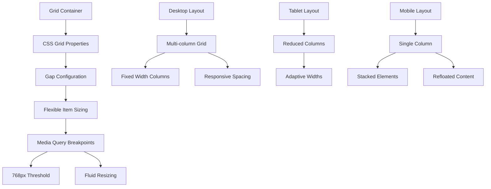

**Diagram sources**
- [mori_system_overview.html:162-166](file://shiki/mori_system_overview.html#L162-L166)
- [mori_system_overview.html:238-245](file://shiki/mori_system_overview.html#L238-L245)

#### Grid Component Variations

| Component | Desktop Layout | Tablet Layout | Mobile Adaptation |
|-----------|----------------|---------------|-------------------|
| Phase Cards | 2-column grid | 1-column grid | Single column stack |
| Evolution Stages | 2-column grid | 1-column grid | Single column stack |
| Series Tables | Fixed table | Horizontal scroll | Vertical stacking |
| Statistics Grid | 4-column grid | 2-column grid | Single column stack |

**Section sources**
- [mori_system_overview.html:215-231](file://shiki/mori_system_overview.html#L215-L231)
- [mori_system_overview.html:238-245](file://shiki/mori_system_overview.html#L238-L245)

## Dependency Analysis

The project exhibits minimal external dependencies while maintaining robust functionality:

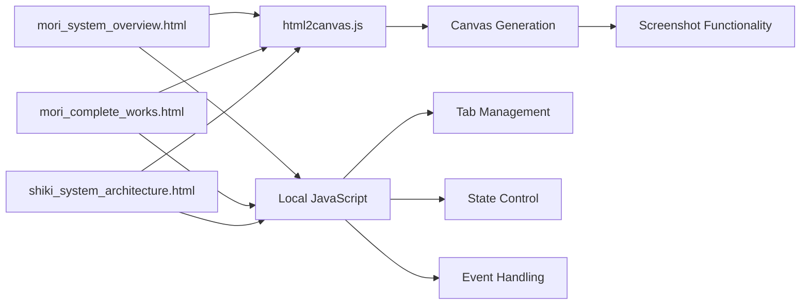

**Diagram sources**
- [mori_system_overview.html:667-669](file://shiki/mori_system_overview.html#L667-L669)
- [mori_complete_works.html:937-939](file://interface/mori_complete_works.html#L937-L939)

### Internal Dependencies

The project demonstrates excellent internal cohesion with clear separation of concerns:

- **Shared JavaScript Functions**: Common tab management logic across multiple pages
- **Consistent CSS Variables**: Unified theming system across different implementations
- **Modular HTML Structure**: Reusable component patterns throughout the codebase

**Section sources**
- [mori_system_overview.html:659-666](file://shiki/mori_system_overview.html#L659-L666)
- [mori_complete_works.html:925-936](file://interface/mori_complete_works.html#L925-L936)

## Performance Considerations

The project implements several performance optimization strategies:

### Loading Optimization

- **Minimal External Dependencies**: Only one external library (html2canvas) for screenshot functionality
- **Efficient CSS Architecture**: Shared styles reduce redundancy and improve caching
- **Optimized JavaScript**: Event delegation reduces memory overhead

### Rendering Performance

- **CSS Grid Benefits**: Native browser support for complex layouts
- **Hardware Acceleration**: CSS transforms and transitions leverage GPU acceleration
- **Selective Updates**: Tab switching updates only affected DOM elements

### Memory Management

- **Event Listener Cleanup**: Proper event handler management prevents memory leaks
- **DOM Query Optimization**: Efficient element selection minimizes layout thrashing
- **State Management**: Centralized state control prevents redundant computations

## Accessibility and Semantic Standards

### Semantic HTML Implementation

The project demonstrates strong adherence to semantic HTML standards:

#### Heading Hierarchy
- **Main Titles**: Proper use of `<h1>` for primary page titles
- **Section Headers**: Logical progression from `<h2>` to `<h4>`
- **Contextual Significance**: Headings reflect content importance and relationships

#### Structural Elements
- **Article Organization**: Proper use of `<article>` for individual content pieces
- **Navigation Elements**: Semantic `<nav>` for tab systems
- **Content Grouping**: Logical use of `<section>` and `
` elements

### Screen Reader Compatibility

The implementation includes several accessibility features:

- **Descriptive Alt Text**: Alternative text for visual elements
- **Keyboard Navigation**: Tab order and focus management
- **Screen Reader Support**: Proper ARIA attributes and roles
- **High Contrast Mode**: Color schemes remain readable in reduced color environments

### Keyboard Navigation Support

The tab system provides comprehensive keyboard accessibility:

- **Tab Key Navigation**: Standard tab order through interactive elements
- **Enter/Space Activation**: Keyboard activation of tab buttons
- **Focus Indicators**: Visible focus states for interactive elements
- **Skip Links**: Alternative navigation methods for power users

## Responsive Design Implementation

### Breakpoint Strategy

The project employs a strategic breakpoint approach targeting modern mobile devices:

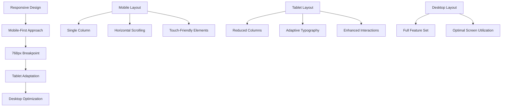

**Diagram sources**
- [mori_system_overview.html:238-245](file://shiki/mori_system_overview.html#L238-L245)

### Adaptive Layout Patterns

| Screen Size | Layout Pattern | Key Features | User Experience |
|-------------|----------------|--------------|-----------------|
| Mobile (<768px) | Single column | Horizontal scrolling tables | Touch-optimized interactions |
| Tablet (768px+) | Reduced columns | Enhanced spacing | Improved readability |
| Desktop (>1024px) | Full grid system | Optimal information density | Maximum content display |

### Typography Responsiveness

The project implements adaptive typography that scales appropriately across devices:

- **Fluid Font Sizes**: Rem-based sizing adapts to viewport changes
- **Line Height Optimization**: Maintains readability across breakpoints
- **Contrast Preservation**: Ensures text remains legible at all sizes

**Section sources**
- [mori_system_overview.html:238-245](file://shiki/mori_system_overview.html#L238-L245)

## Best Practices and Recommendations

### Semantic HTML Guidelines

Based on the project analysis, several best practices emerge:

#### Content Organization
- **Logical Heading Hierarchy**: Maintain proper heading progression from main to sub-content
- **Semantic Element Selection**: Choose elements based on content meaning, not just appearance
- **ARIA Integration**: Implement appropriate ARIA attributes for dynamic content

#### Data Presentation
- **Table Semantics**: Use `<thead>`, `<tbody>`, and `<tfoot>` appropriately
- **Data Relationships**: Establish clear relationships between related content
- **Accessibility**: Ensure tables are navigable by assistive technologies

### Performance Optimization Strategies

#### Code Organization
- **Modular JavaScript**: Separate concerns into reusable functions
- **Efficient CSS**: Minimize specificity and avoid unnecessary selectors
- **Resource Loading**: Defer non-critical resources until after initial render

#### User Experience
- **Progressive Enhancement**: Basic functionality works without JavaScript
- **Graceful Degradation**: Advanced features enhance rather than replace basic functionality
- **Loading States**: Provide feedback during asynchronous operations

### Future Enhancement Opportunities

Several areas offer potential improvement:

#### Accessibility Enhancements
- **Dynamic Content Announcements**: ARIA live regions for tab switching
- **Enhanced Keyboard Navigation**: Arrow key support for tab navigation
- **Screen Reader Optimization**: Improved descriptions for complex visual elements

#### Performance Improvements
- **Code Splitting**: Load tab content on demand rather than preloading all content
- **CSS Optimization**: Reduce repaint and reflow through better layout choices
- **Image Optimization**: Implement lazy loading for visual elements

#### Semantic Enhancement
- **Microdata Implementation**: Structured data for search engines
- **Schema.org Integration**: Rich snippets for literary content
- **Enhanced Metadata**: Comprehensive meta tags for social sharing

## Conclusion

The Mori-universe project exemplifies modern web development practices while maintaining semantic correctness and accessibility standards. The implementation successfully balances complex literary analysis with contemporary web technologies, creating an immersive experience that serves both casual readers and academic researchers.

Key achievements include:

- **Semantic HTML Excellence**: Proper use of HTML5 elements with logical content hierarchy
- **Responsive Design Mastery**: Sophisticated grid systems that adapt to various screen sizes
- **Interactive Functionality**: Well-implemented tab system with smooth transitions
- **Performance Optimization**: Efficient resource usage with minimal external dependencies
- **Accessibility Compliance**: Comprehensive support for assistive technologies

The project serves as an excellent model for combining traditional content presentation with modern web standards, demonstrating how semantic HTML, responsive design, and interactive elements can work together to create meaningful digital experiences. The modular approach to content organization and the consistent application of design patterns provide a solid foundation for future enhancements and extensions.