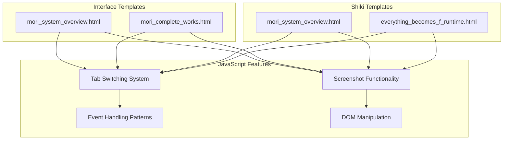
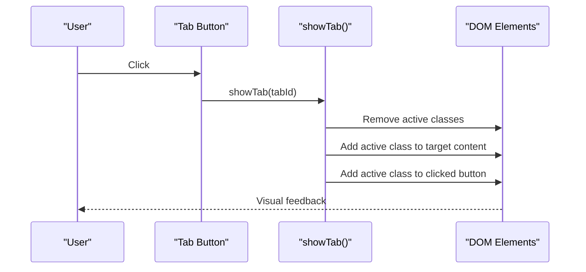
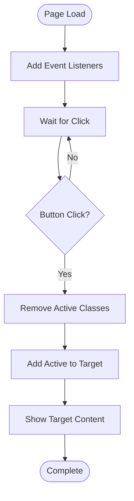
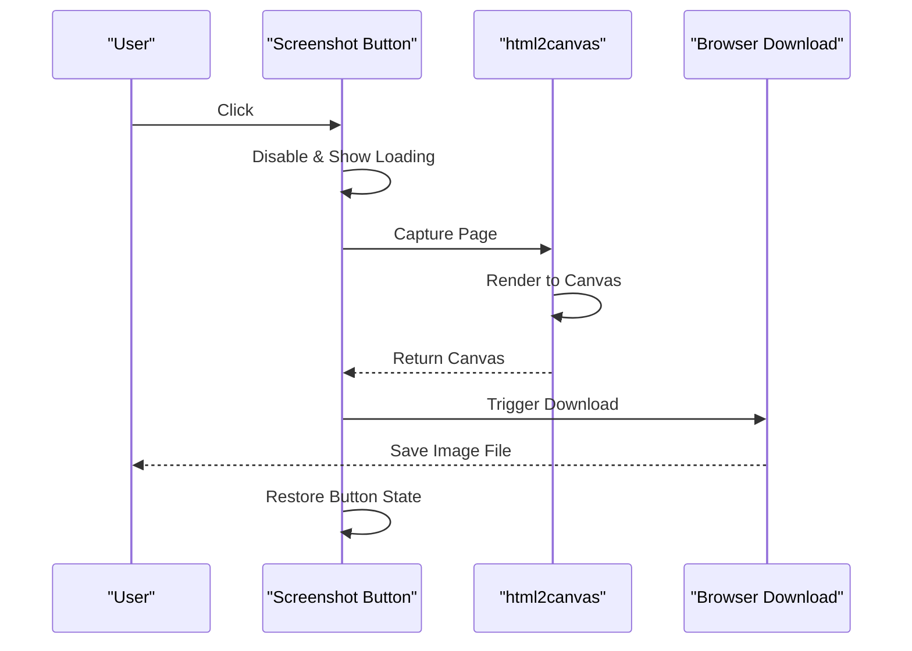
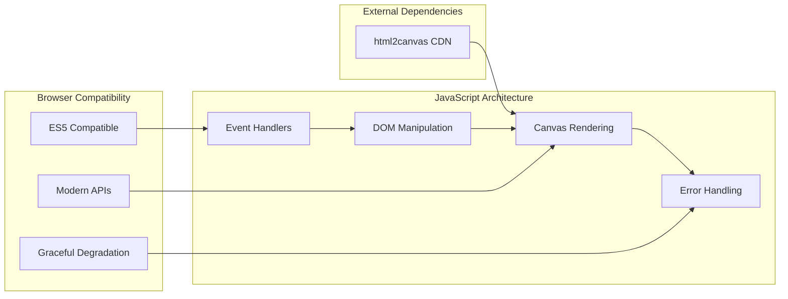
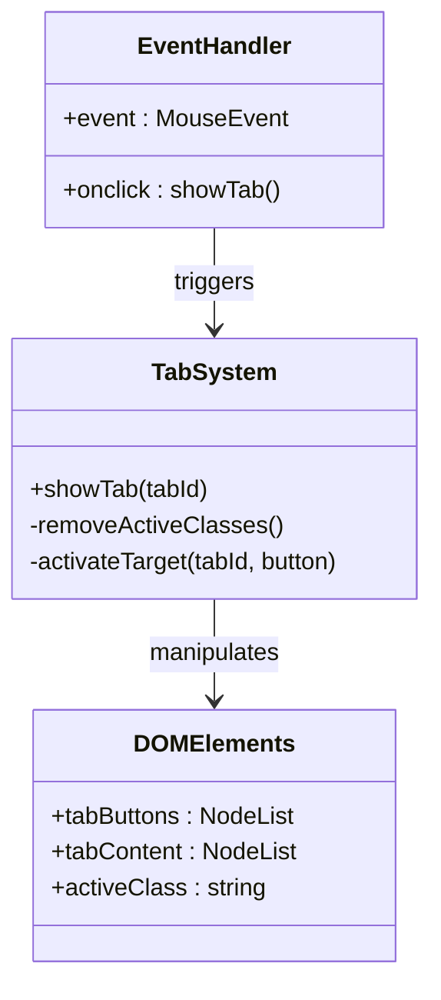
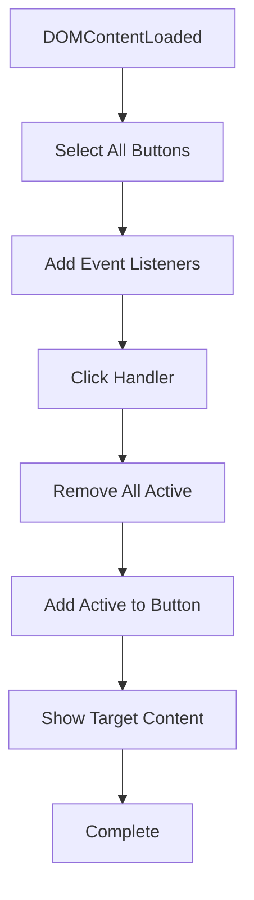
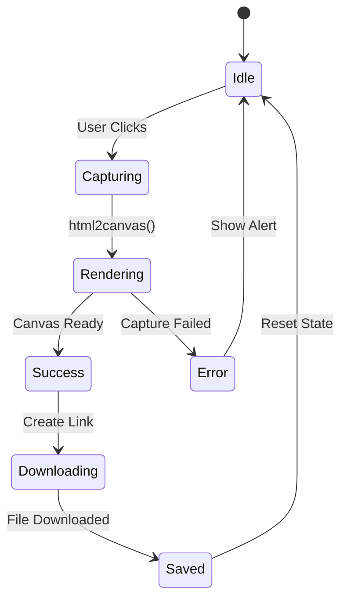
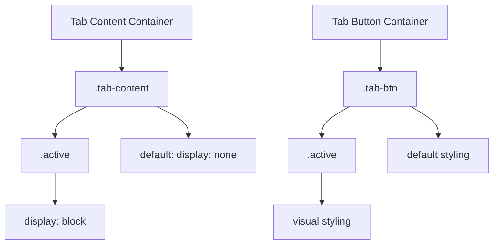
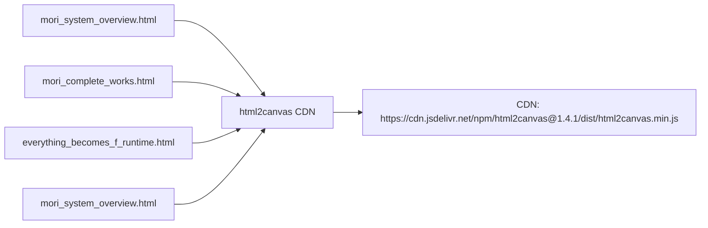

# JavaScript Functionality and Interactivity

<cite>
**Referenced Files in This Document**
- [mori_system_overview.html](file://interface/mori_system_overview.html)
- [mori_complete_works.html](file://interface/mori_complete_works.html)
- [mori_system_overview.html](file://shiki/mori_system_overview.html)
- [everything_becomes_f_runtime.html](file://shiki/everything_becomes_f_runtime.html)
</cite>

## Table of Contents
1. [Introduction](#introduction)
2. [Project Structure](#project-structure)
3. [Core Components](#core-components)
4. [Architecture Overview](#architecture-overview)
5. [Detailed Component Analysis](#detailed-component-analysis)
6. [Dependency Analysis](#dependency-analysis)
7. [Performance Considerations](#performance-considerations)
8. [Troubleshooting Guide](#troubleshooting-guide)
9. [Conclusion](#conclusion)

## Introduction

The Mori-universe project demonstrates a sophisticated yet lightweight JavaScript architecture that prioritizes pure vanilla JavaScript implementation while delivering modern interactive web experiences. This documentation focuses on the JavaScript functionality and interactivity features, particularly the tab switching system, event handling patterns, DOM manipulation techniques, and the screenshot functionality powered by html2canvas.

The project showcases three distinct implementations of JavaScript functionality across different page templates, each demonstrating unique approaches to tab management and screenshot capture while maintaining the core principle of minimal dependencies and maximum compatibility.

## Project Structure

The Mori-universe project consists of four main HTML pages organized into two primary template categories:



**Diagram sources**
- [mori_system_overview.html:398-403](file://interface/mori_system_overview.html#L398-L403)
- [mori_complete_works.html:517-528](file://interface/mori_complete_works.html#L517-L528)

The project implements JavaScript functionality in three distinct ways:

1. **Traditional onclick handlers** - Using the `showTab()` function with direct DOM manipulation
2. **Modern event listener approach** - Using `addEventListener` for better separation of concerns
3. **Hybrid approach** - Combining both patterns within the same page

**Section sources**
- [mori_system_overview.html:398-403](file://interface/mori_system_overview.html#L398-L403)
- [mori_system_overview.html:283-286](file://shiki/mori_system_overview.html#L283-L286)

## Core Components

### Tab Switching System

The tab switching system represents the primary interactive feature across all implementations. It manages content visibility through CSS classes and maintains active state indicators for user feedback.

#### Traditional Implementation Pattern

The classic approach uses direct function calls triggered by HTML attributes:



**Diagram sources**
- [mori_system_overview.html:660-665](file://shiki/mori_system_overview.html#L660-L665)

#### Modern Event Listener Implementation

The newer approach separates presentation from behavior using event listeners:



**Diagram sources**
- [mori_complete_works.html:926-935](file://interface/mori_complete_works.html#L926-L935)

### Screenshot Functionality

The screenshot system leverages html2canvas for capturing page content as PNG images with comprehensive error handling and user feedback mechanisms.



**Diagram sources**
- [everything_becomes_f_runtime.html:553-583](file://shiki/everything_becomes_f_runtime.html#L553-L583)

**Section sources**
- [mori_system_overview.html:660-665](file://shiki/mori_system_overview.html#L660-L665)
- [mori_complete_works.html:926-935](file://interface/mori_complete_works.html#L926-L935)
- [everything_becomes_f_runtime.html:553-583](file://shiki/everything_becomes_f_runtime.html#L553-L583)

## Architecture Overview

The JavaScript architecture follows a minimalist philosophy with three core principles:

1. **Pure Vanilla JavaScript** - No external frameworks or libraries
2. **Progressive Enhancement** - Basic functionality works without JavaScript
3. **Performance Optimization** - Efficient DOM manipulation and memory management



**Diagram sources**
- [mori_system_overview.html:387-388](file://interface/mori_system_overview.html#L387-L388)
- [mori_complete_works.html:937-938](file://interface/mori_complete_works.html#L937-L938)

### Lightweight JavaScript Approach

The project maintains a pure JavaScript approach with minimal external dependencies:

- **Single external dependency**: html2canvas library loaded from CDN
- **No build tools**: Direct HTML/JavaScript implementation
- **Zero polyfills**: Uses modern browser APIs where available
- **Self-contained**: All functionality contained within HTML files

**Section sources**
- [mori_system_overview.html:387-388](file://interface/mori_system_overview.html#L387-L388)
- [mori_complete_works.html:937-938](file://interface/mori_complete_works.html#L937-L938)

## Detailed Component Analysis

### Tab Switching System Implementation

#### Method 1: Direct Function Calls (Traditional)

The traditional implementation uses HTML attributes to trigger JavaScript functions:



**Diagram sources**
- [mori_system_overview.html:660-665](file://shiki/mori_system_overview.html#L660-L665)

#### Method 2: Event Listeners (Modern)

The modern implementation separates concerns using event listeners:



**Diagram sources**
- [mori_complete_works.html:926-935](file://interface/mori_complete_works.html#L926-L935)

#### Method 3: Hybrid Approach

Some implementations combine both patterns for maximum compatibility:

| Implementation | Tab Buttons | Screenshot Button |
|----------------|-------------|-------------------|
| Traditional | `onclick="showTab()"` | `onclick="capturePageAsImage()"` |
| Event Listeners | `data-tab` attributes | `addEventListener` |
| Hybrid | Mixed patterns | Mixed patterns |

**Section sources**
- [mori_system_overview.html:660-665](file://shiki/mori_system_overview.html#L660-L665)
- [mori_complete_works.html:926-935](file://interface/mori_complete_works.html#L926-L935)

### Screenshot Functionality Analysis

#### Canvas-Based Image Export System

The screenshot functionality implements a robust image capture system:



**Diagram sources**
- [everything_becomes_f_runtime.html:553-583](file://shiki/everything_becomes_f_runtime.html#L553-L583)

#### Loading States and User Feedback

The system implements comprehensive user feedback mechanisms:

1. **Button State Management**: Disables button during processing
2. **Visual Indicators**: Changes button text to loading state
3. **Display Control**: Temporarily hides button during capture
4. **Error Recovery**: Restores button state on failure

**Section sources**
- [everything_becomes_f_runtime.html:553-583](file://shiki/everything_becomes_f_runtime.html#L553-L583)
- [mori_system_overview.html:785-812](file://interface/mori_system_overview.html#L785-L812)

### DOM Manipulation Techniques

#### Content Visibility Management

The project uses CSS classes to manage content visibility:



**Diagram sources**
- [mori_system_overview.html:660-665](file://shiki/mori_system_overview.html#L660-L665)

#### Active State Management

The system maintains active states through class manipulation:

1. **Remove All Active**: Clear existing active classes
2. **Add Active to Target**: Apply active class to clicked element
3. **Show Target Content**: Display corresponding content
4. **Maintain Visual Feedback**: Provide immediate user feedback

**Section sources**
- [mori_system_overview.html:660-665](file://shiki/mori_system_overview.html#L660-L665)

## Dependency Analysis

### External Dependencies

The project maintains minimal external dependencies focused on essential functionality:



**Diagram sources**
- [mori_system_overview.html:387-388](file://interface/mori_system_overview.html#L387-L388)
- [mori_complete_works.html:937-938](file://interface/mori_complete_works.html#L937-L938)

### Internal Dependencies

The JavaScript functionality has no internal dependencies, promoting modularity and maintainability:

- **Self-contained functions**: Each script block operates independently
- **No shared state**: Functions don't rely on global variables
- **Local scope**: Variables are scoped to individual functions
- **Reusability**: Functions can be copied between pages

**Section sources**
- [mori_system_overview.html:387-388](file://interface/mori_system_overview.html#L387-L388)
- [mori_complete_works.html:937-938](file://interface/mori_complete_works.html#L937-L938)

## Performance Considerations

### Large Dataset Optimization Strategies

The project implements several performance optimization strategies for handling large datasets in tables:

#### CSS-Based Sticky Headers

Sticky table headers improve scrolling performance on large datasets:

```css
/* Sticky header implementation */
thead th {
    position: sticky;
    top: 0;
    z-index: 10;
}
```

#### Efficient DOM Manipulation

The tab switching system minimizes DOM queries and manipulations:

1. **Single Query Selection**: Use `querySelectorAll` once per operation
2. **Batch Updates**: Remove classes from all elements before adding new ones
3. **Direct Access**: Use `getElementById` for target element access
4. **Event Delegation**: Prefer event listeners over inline handlers for scalability

#### Canvas Rendering Optimization

The screenshot functionality includes performance considerations:

1. **Scale Factor Control**: Adjustable rendering quality vs. performance
2. **Background Color**: Optimized rendering with specified background
3. **Window Dimensions**: Accurate capture of scrollable content
4. **Error Handling**: Prevents memory leaks on failed captures

**Section sources**
- [mori_system_overview.html:660-665](file://shiki/mori_system_overview.html#L660-L665)
- [everything_becomes_f_runtime.html:553-583](file://shiki/everything_becomes_f_runtime.html#L553-L583)

### Browser Compatibility Considerations

The project maintains broad browser compatibility through several strategies:

#### Progressive Enhancement

1. **Basic Functionality**: Core features work without JavaScript
2. **Enhanced Experience**: JavaScript adds interactivity
3. **Graceful Degradation**: Features adapt to older browsers
4. **Feature Detection**: Use modern APIs where available

#### Polyfill-Free Approach

1. **Vanilla JavaScript**: No transpilation or polyfills required
2. **Modern APIs**: Uses widely supported browser APIs
3. **CSS Fallbacks**: Graceful degradation for advanced CSS features
4. **Event Handling**: Cross-browser compatible event model

**Section sources**
- [mori_system_overview.html:398-403](file://interface/mori_system_overview.html#L398-L403)
- [mori_complete_works.html:517-528](file://interface/mori_complete_works.html#L517-L528)

## Troubleshooting Guide

### Common JavaScript Issues

#### Tab Switching Problems

**Issue**: Tabs don't switch content
**Solution**: Verify tab IDs match between buttons and content containers

**Issue**: Active state not maintained
**Solution**: Check CSS class names and ensure they match JavaScript selectors

**Issue**: Multiple tabs active simultaneously
**Solution**: Ensure proper class removal before adding new active classes

#### Screenshot Functionality Issues

**Issue**: Canvas rendering fails
**Solution**: Check CORS policies for external resources

**Issue**: Download doesn't trigger
**Solution**: Verify canvas.toDataURL() support and file size limits

**Issue**: Button remains disabled
**Solution**: Ensure error handling restores button state

#### Performance Issues

**Issue**: Slow tab switching on mobile devices
**Solution**: Optimize CSS animations and reduce DOM queries

**Issue**: Memory leaks with frequent screenshots
**Solution**: Clean up canvas elements and remove event listeners

**Section sources**
- [everything_becomes_f_runtime.html:553-583](file://shiki/everything_becomes_f_runtime.html#L553-L583)
- [mori_system_overview.html:785-812](file://interface/mori_system_overview.html#L785-L812)

### Debugging Approaches

#### Console Logging Strategy

Implement strategic console logging for debugging:

```javascript
// Enable/disable logging based on environment
const DEBUG = false;

function debugLog(message, data) {
    if (DEBUG) {
        console.log(`[DEBUG] ${message}`, data);
    }
}
```

#### Error Handling Patterns

Implement comprehensive error handling:

```javascript
try {
    // Critical operation
} catch (error) {
    console.error('Operation failed:', error);
    // Fallback behavior
}
```

#### Performance Monitoring

Monitor performance impact of JavaScript operations:

```javascript
const startTime = performance.now();
// Operation
const endTime = performance.now();
console.log(`Operation took ${endTime - startTime} milliseconds`);
```

**Section sources**
- [mori_system_overview.html:660-665](file://shiki/mori_system_overview.html#L660-L665)
- [mori_complete_works.html:926-935](file://interface/mori_complete_works.html#L926-L935)

## Security Considerations

### CORS Handling

The screenshot functionality includes CORS considerations:

1. **useCORS: true** - Enables cross-origin resource sharing
2. **External Resource Loading**: Images and fonts from external domains
3. **Security Policy Compliance**: Respects browser security restrictions
4. **Fallback Handling**: Graceful degradation when CORS fails

### Data Sanitization

While the project primarily displays static content, security considerations include:

1. **User Input Validation**: If user-generated content is added, implement proper sanitization
2. **Content Security Policy**: Consider implementing CSP headers
3. **XSS Prevention**: Use proper escaping for any dynamic content
4. **File Download Security**: Validate file names and MIME types

### Best Practices for Pure JavaScript

Maintaining security in a pure JavaScript approach:

1. **Avoid Inline Scripts**: Use external script files or event listeners
2. **Minimize Global Variables**: Reduce attack surface area
3. **Validate User Input**: Even for static content, validate any dynamic additions
4. **Secure CDN Usage**: Trust only verified CDN sources

**Section sources**
- [everything_becomes_f_runtime.html:553-583](file://shiki/everything_becomes_f_runtime.html#L553-L583)
- [mori_system_overview.html:785-812](file://interface/mori_system_overview.html#L785-L812)

## Conclusion

The Mori-universe project exemplifies excellent JavaScript implementation practices through its pure vanilla approach, comprehensive interactivity features, and robust performance optimization strategies. The three distinct implementations demonstrate different approaches to achieving the same functionality while maintaining the core principles of minimal dependencies, maximum compatibility, and clean code organization.

Key achievements include:

- **Minimal Dependencies**: Single external library dependency for advanced functionality
- **Cross-Browser Compatibility**: Broad browser support through progressive enhancement
- **Performance Optimization**: Efficient DOM manipulation and canvas rendering
- **Robust Error Handling**: Comprehensive user feedback and recovery mechanisms
- **Clean Architecture**: Separation of concerns and modular code organization

The project serves as an excellent example of how modern web interactivity can be achieved without heavy frameworks, providing a foundation for scalable, maintainable JavaScript implementations in web projects.