# Technical Implementation

<cite>
**Referenced Files in This Document**
- [mori_complete_works.html](file://mori_complete_works.html)
- [mori_system_overview.html](file://mori_system_overview.html)
- [everything_becomes_f_runtime.html](file://shiki/everything_becomes_f_runtime.html)
- [mori_complete_works.html](file://shiki/mori_complete_works.html)
- [mori_system_overview.html](file://shiki/mori_system_overview.html)
- [shiki_system_architecture.html](file://shiki/shiki_system_architecture.html)
</cite>

## Table of Contents
1. [Introduction](#introduction)
2. [Project Structure](#project-structure)
3. [Core Components](#core-components)
4. [Architecture Overview](#architecture-overview)
5. [Detailed Component Analysis](#detailed-component-analysis)
6. [Dependency Analysis](#dependency-analysis)
7. [Performance Considerations](#performance-considerations)
8. [Troubleshooting Guide](#troubleshooting-guide)
9. [Conclusion](#conclusion)

## Introduction

The Mori-universe project is a sophisticated HTML/CSS/JavaScript implementation that presents the complete works of Japanese author Mori Hiroshi in an interactive, thematically-consistent manner. The project demonstrates advanced front-end techniques including semantic HTML structure, CSS custom properties for dynamic theming, JavaScript event handling for tab switching, responsive design with media queries, and screenshot functionality using html2canvas library.

The implementation showcases a modular approach to content organization across multiple HTML files, each serving specific narrative contexts while maintaining visual and functional consistency. The project emphasizes performance through a lightweight architecture with minimal external dependencies.

## Project Structure

The project follows a well-organized structure with core pages and specialized content sections:

```mermaid
graph TB
subgraph "Main Pages"
A[mori_complete_works.html]
B[mori_system_overview.html]
end
subgraph "Shiki Specialized Content"
C[everything_becomes_f_runtime.html]
D[mori_complete_works.html (Shiki)]
E[mori_system_overview.html (Shiki)]
F[shiki_system_architecture.html]
end
subgraph "CSS Architecture"
G[Custom Properties System]
H[Responsive Design]
I[Color-Coded Theming]
end
A --> G
B --> G
C --> G
D --> G
E --> G
F --> G
G --> H
G --> I
```

**Diagram sources**
- [mori_complete_works.html:1-723](file://mori_complete_works.html#L1-L723)
- [mori_system_overview.html:1-702](file://mori_system_overview.html#L1-L702)
- [everything_becomes_f_runtime.html:1-587](file://shiki/everything_becomes_f_runtime.html#L1-L587)

The project consists of two primary content areas:

1. **Complete Works Collection**: Comprehensive presentation of Mori Hiroshi's literary works with detailed tabbed interface
2. **Shiki Specialized Content**: Thematic content focused on the Magata Shiki character, featuring runtime logs and system architecture analysis

**Section sources**
- [mori_complete_works.html:1-723](file://mori_complete_works.html#L1-L723)
- [mori_system_overview.html:1-702](file://mori_system_overview.html#L1-L702)
- [everything_becomes_f_runtime.html:1-587](file://shiki/everything_becomes_f_runtime.html#L1-L587)

## Core Components

### CSS Custom Properties System

The project implements a comprehensive CSS custom properties system that enables dynamic theming across all pages. The system uses a root-level variable definition pattern that cascades throughout the stylesheet hierarchy.

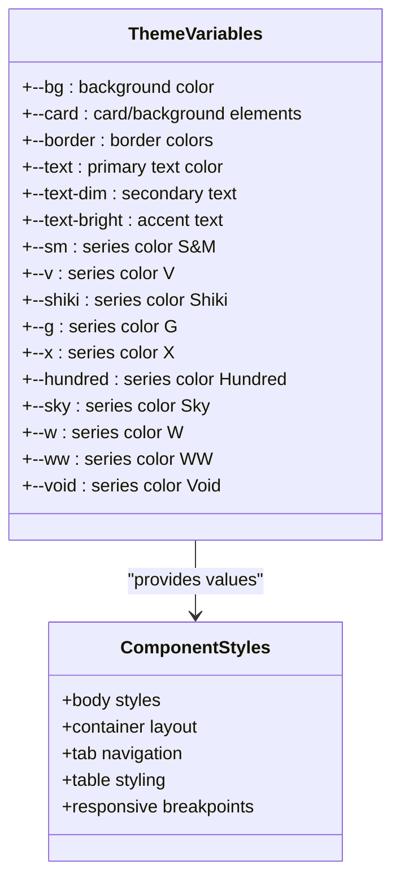

**Diagram sources**
- [mori_complete_works.html:8-26](file://mori_complete_works.html#L8-L26)
- [mori_system_overview.html:8-27](file://mori_system_overview.html#L8-L27)

The theme system enables:
- **Consistent Color Palette**: All pages share identical color variables for cohesive branding
- **Dynamic Series Identification**: Each literary series has dedicated color variables for visual distinction
- **Flexible Dark Mode**: All color values use dark theme defaults suitable for extended reading sessions

### Tabbed Interface Architecture

The tabbed interface system demonstrates sophisticated JavaScript event handling with semantic HTML structure:

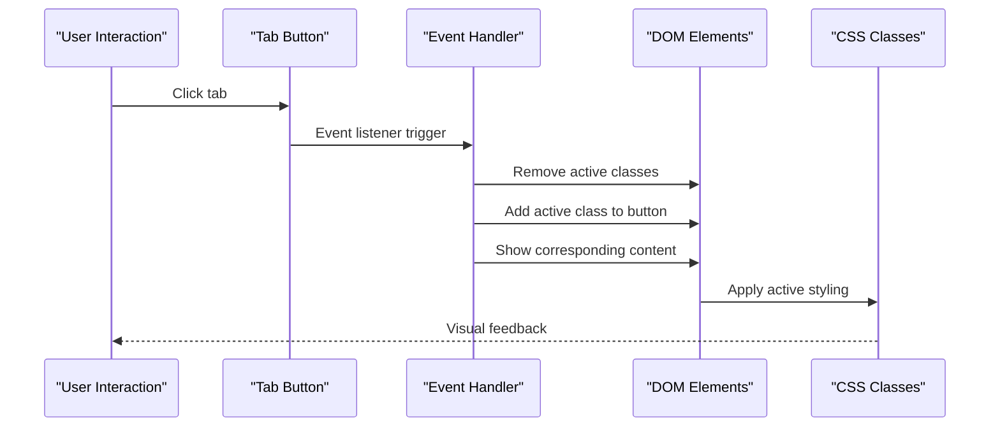

**Diagram sources**
- [mori_complete_works.html:673-687](file://mori_complete_works.html#L673-L687)
- [mori_system_overview.html:659-666](file://mori_system_overview.html#L659-L666)

The implementation features:
- **Data-driven Navigation**: Buttons use `data-tab` attributes to identify target content
- **Automatic State Management**: JavaScript handles removal/addition of active classes
- **Content Visibility Control**: Hidden content becomes visible through CSS class manipulation

### Responsive Design Implementation

The responsive design system utilizes CSS media queries to adapt layouts across different screen sizes:

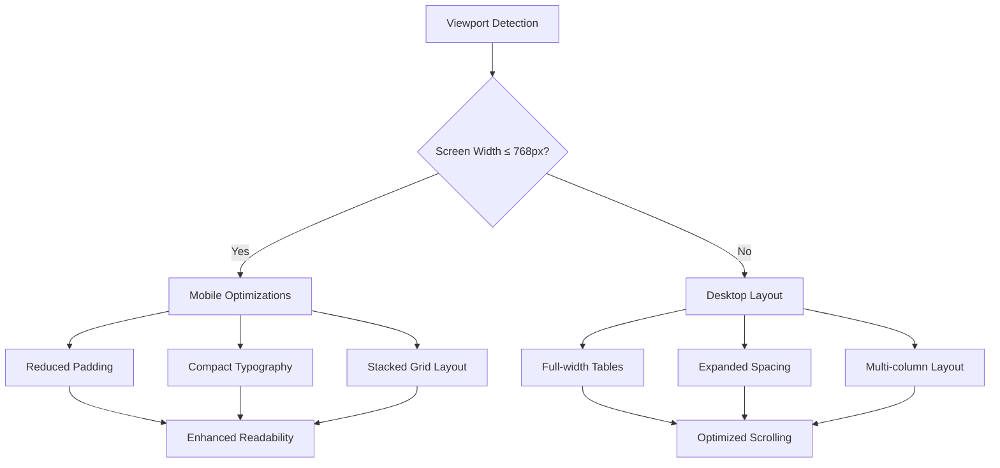

**Diagram sources**
- [mori_complete_works.html:301-310](file://mori_complete_works.html#L301-L310)
- [mori_system_overview.html:238-245](file://mori_system_overview.html#L238-L245)

**Section sources**
- [mori_complete_works.html:7-340](file://mori_complete_works.html#L7-L340)
- [mori_system_overview.html:7-275](file://mori_system_overview.html#L7-L275)

## Architecture Overview

The Mori-universe project implements a modular architecture that separates concerns across multiple HTML files while maintaining visual and functional consistency:

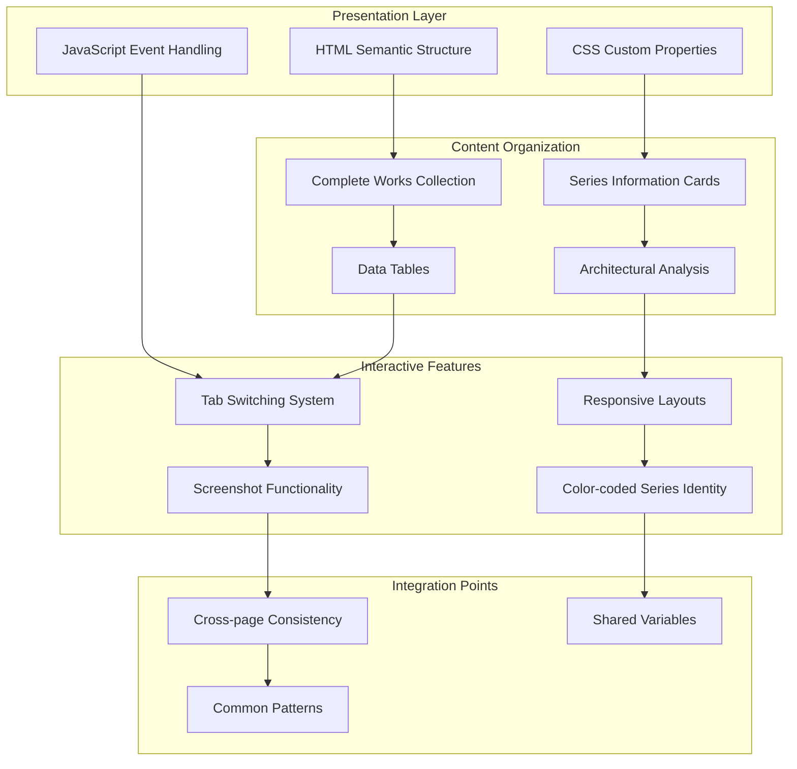

**Diagram sources**
- [mori_complete_works.html:342-722](file://mori_complete_works.html#L342-L722)
- [mori_system_overview.html:277-701](file://mori_system_overview.html#L277-L701)

The architecture emphasizes:
- **Modular Content Delivery**: Separate HTML files for different content themes
- **Consistent Styling**: Shared CSS variables ensure visual coherence
- **Event-driven Interactions**: JavaScript handles user interactions without page reloads
- **Performance Optimization**: Minimal external dependencies reduce load times

## Detailed Component Analysis

### HTML Semantic Structure Analysis

The project employs semantic HTML elements to create meaningful content hierarchy:

#### Main Page Structure
The primary pages use a structured approach with clear semantic roles:

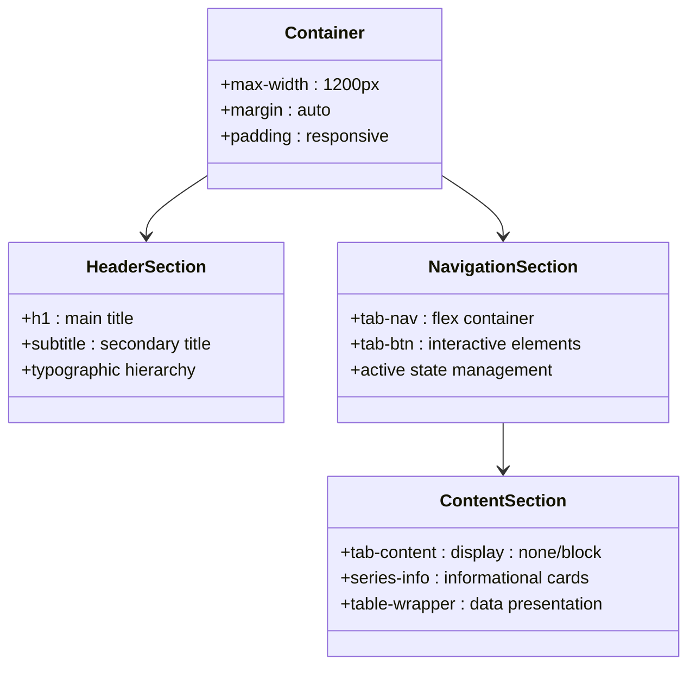

**Diagram sources**
- [mori_complete_works.html:344-361](file://mori_complete_works.html#L344-L361)
- [mori_system_overview.html:279-288](file://mori_system_overview.html#L279-L288)

#### Data Presentation Tables
The table implementations demonstrate sophisticated semantic markup:

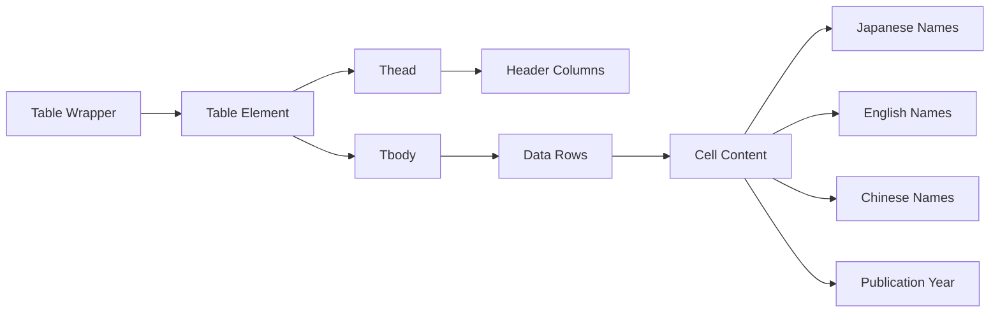

**Diagram sources**
- [mori_complete_works.html:173-222](file://mori_complete_works.html#L173-L222)

The table structure includes:
- **Sticky Headers**: Top-positioned headers remain visible during scrolling
- **Responsive Design**: Horizontal scrolling for smaller screens
- **Color-coded Series**: Visual differentiation through CSS classes
- **Typography Hierarchy**: Clear distinction between different text types

### CSS Custom Properties Implementation

The CSS custom properties system provides a robust theming foundation:

#### Variable Definition Pattern
The root-level variable definitions establish the color palette:

| Variable Category | Purpose | Example Values |
|-------------------|---------|----------------|
| Background Colors | Page backgrounds | `#0a0e17`, `#111827` |
| Text Colors | Typography hierarchy | `#e2e8f0`, `#94a3b8` |
| Border Colors | Element boundaries | `#1e293b`, `rgba(148,163,184,0.3)` |
| Series Colors | Content identification | `#38bdf8` (S&M), `#2dd4bf` (V) |

#### Dynamic Styling Application
The CSS system applies variables throughout the stylesheet:

```css
/* Example of variable usage patterns */
.tab-btn {
    background: var(--card);
    border: 1px solid var(--border);
    color: var(--text-dim);
}

.series-info {
    background: var(--card);
    border: 1px solid var(--border);
}

.table-wrapper {
    border: 1px solid var(--border);
    box-shadow: 0 0 40px rgba(0,0,0,0.3);
}
```

### JavaScript Event Handling System

The JavaScript implementation demonstrates clean separation of concerns:

#### Tab Switching Logic
The event handling system manages tab visibility through DOM manipulation:

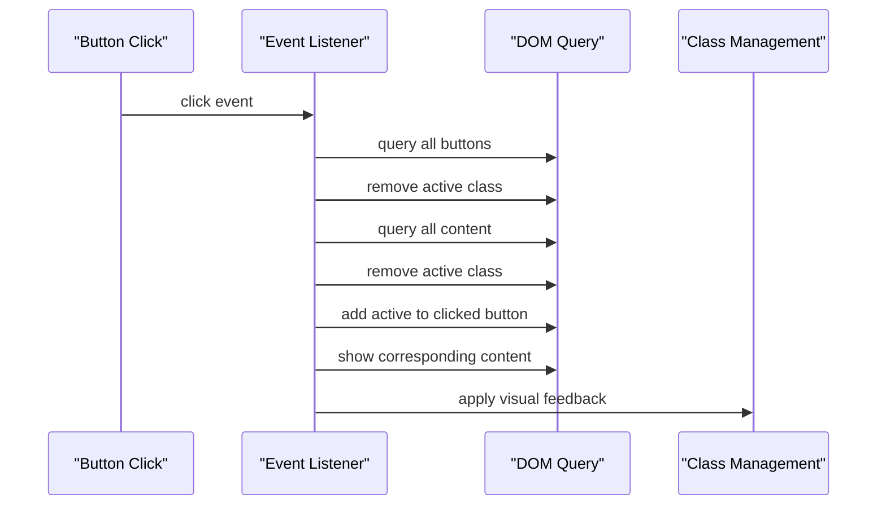

**Diagram sources**
- [mori_complete_works.html:675-686](file://mori_complete_works.html#L675-L686)

#### Screenshot Functionality
The html2canvas integration provides advanced image capture capabilities:

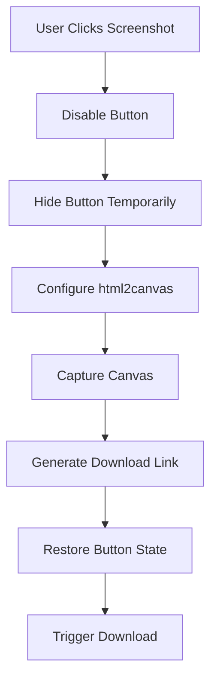

**Diagram sources**
- [mori_complete_works.html:690-720](file://mori_complete_works.html#L690-L720)

**Section sources**
- [mori_complete_works.html:342-722](file://mori_complete_works.html#L342-L722)
- [mori_system_overview.html:277-701](file://mori_system_overview.html#L277-L701)

### Responsive Design Implementation

The responsive design system adapts to various screen sizes:

#### Breakpoint Strategy
The implementation uses a single breakpoint at 768px for mobile optimization:

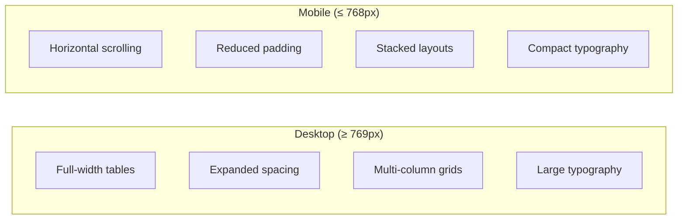

**Diagram sources**
- [mori_complete_works.html:301-310](file://mori_complete_works.html#L301-L310)
- [mori_system_overview.html:238-245](file://mori_system_overview.html#L238-L245)

#### Adaptive Components
Different components adapt uniquely to screen size changes:

| Component | Desktop Behavior | Mobile Behavior |
|-----------|------------------|-----------------|
| Body Padding | 2rem 1.5rem | 1rem 0.8rem |
| Tab Buttons | 0.6rem 1rem | 0.5rem 0.7rem |
| Stats Grid | 4 columns | 2 columns |
| Typography | Large headings | Compact headings |

**Section sources**
- [mori_complete_works.html:301-310](file://mori_complete_works.html#L301-L310)
- [mori_system_overview.html:238-245](file://mori_system_overview.html#L238-L245)

## Dependency Analysis

The project maintains a lightweight architecture with minimal external dependencies:

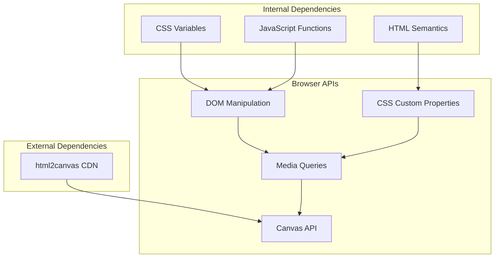

**Diagram sources**
- [mori_complete_works.html:688](file://mori_complete_works.html#L688)
- [mori_system_overview.html:667](file://mori_system_overview.html#L667)

### External Library Integration

The project integrates html2canvas through CDN for screenshot functionality:

| Feature | Implementation Method | Benefits |
|---------|----------------------|----------|
| Screenshot Capture | CDN-hosted html2canvas | Reliable cross-browser support |
| No Local Dependencies | Single script inclusion | Reduced bundle size |
| Automatic Loading | Browser-managed caching | Improved performance |

### Internal Component Dependencies

The components depend on shared CSS variables and JavaScript patterns:

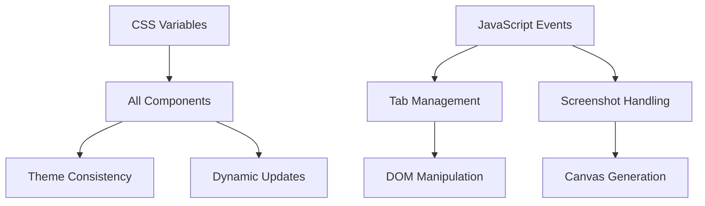

**Section sources**
- [mori_complete_works.html:688-720](file://mori_complete_works.html#L688-L720)
- [mori_system_overview.html:667-699](file://mori_system_overview.html#L667-L699)

## Performance Considerations

The project implements several performance optimization strategies:

### Lightweight Architecture
- **Minimal Dependencies**: Only one external library (html2canvas) loaded via CDN
- **Native Browser APIs**: Extensive use of built-in DOM and CSS capabilities
- **Efficient CSS**: Custom properties minimize redundant style declarations

### Optimization Strategies

#### CSS Performance
- **Variable-Based Theming**: Reduces CSS duplication and improves maintainability
- **Efficient Selectors**: Targeted class selectors minimize rendering overhead
- **Hardware Acceleration**: Strategic use of transforms and opacity for smooth animations

#### JavaScript Efficiency
- **Event Delegation**: Single event listeners manage multiple interactive elements
- **DOM Caching**: Query selectors executed once and reused
- **Minimal DOM Manipulation**: Efficient class addition/removal patterns

#### Image and Media Handling
- **Canvas Optimization**: Configurable scale factors balance quality and performance
- **Lazy Loading**: External resources loaded only when needed
- **Memory Management**: Proper cleanup of event listeners and temporary elements

### Scalability Considerations

The modular architecture supports future expansion:

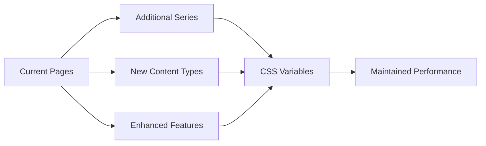

## Troubleshooting Guide

### Common Implementation Issues

#### Tab Switching Problems
**Issue**: Tabs don't switch content
**Solution**: Verify `data-tab` attributes match target element IDs and event listeners are properly attached

#### Screenshot Functionality Issues
**Issue**: Screenshot fails to download
**Solution**: Check console for html2canvas errors, verify CORS settings, and ensure proper cleanup of button states

#### Responsive Design Problems
**Issue**: Tables overflow on mobile devices
**Solution**: Confirm `overflow-x: auto` is applied and viewport meta tag is correctly configured

#### Color Theme Inconsistencies
**Issue**: Colors appear incorrect across pages
**Solution**: Verify all pages include the same CSS variable definitions and custom property usage

### Browser Compatibility Considerations

#### Modern Browser Support
- **CSS Custom Properties**: Supported in all modern browsers with fallbacks
- **Flexbox Layout**: Comprehensive browser support with vendor prefixes
- **Canvas API**: Universal support for screenshot functionality
- **Media Queries**: Standard implementation across all modern browsers

#### Progressive Enhancement
The implementation gracefully degrades for older browsers:
- **Fallback Colors**: CSS variables with hex color fallbacks
- **Graceful Degradation**: Essential functionality works without JavaScript
- **Accessible Markup**: Semantic HTML ensures content remains readable without styles

### Performance Monitoring
Recommended diagnostic steps:
1. **Console Inspection**: Monitor for JavaScript errors and warnings
2. **Network Analysis**: Verify external resource loading completion
3. **Performance Profiling**: Use browser developer tools to identify bottlenecks
4. **Memory Usage**: Monitor for memory leaks in long sessions

**Section sources**
- [mori_complete_works.html:690-720](file://mori_complete_works.html#L690-L720)
- [mori_system_overview.html:669-699](file://mori_system_overview.html#L669-L699)

## Conclusion

The Mori-universe project exemplifies modern front-end development practices through its implementation of semantic HTML structure, CSS custom properties system, and JavaScript event handling. The project successfully demonstrates how to create interactive, visually appealing web applications with minimal external dependencies while maintaining excellent performance characteristics.

Key achievements include:
- **Consistent Theming**: Robust CSS variable system enabling dynamic color management
- **Interactive Navigation**: Sophisticated tab switching with smooth transitions
- **Responsive Design**: Adaptive layouts that work across all device sizes
- **Performance Optimization**: Lightweight architecture with efficient resource utilization
- **Modular Architecture**: Clean separation of concerns across multiple content files

The project serves as an excellent example of how modern web technologies can be combined to create engaging, accessible, and performant user experiences. The implementation patterns demonstrated here can serve as a foundation for similar projects requiring interactive data presentation and dynamic theming capabilities.