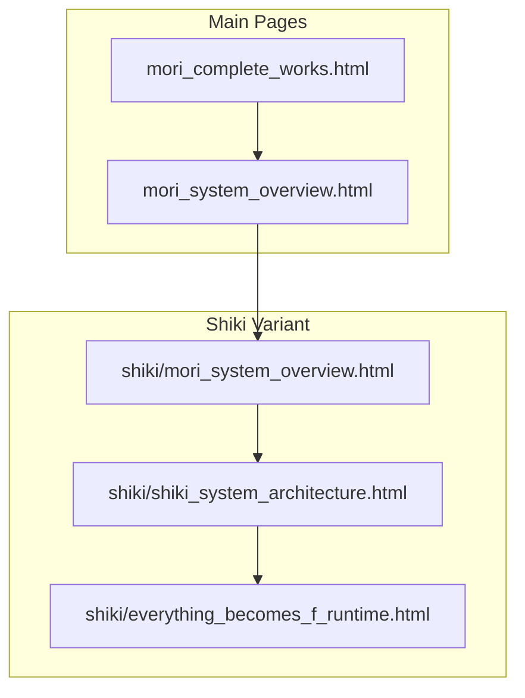
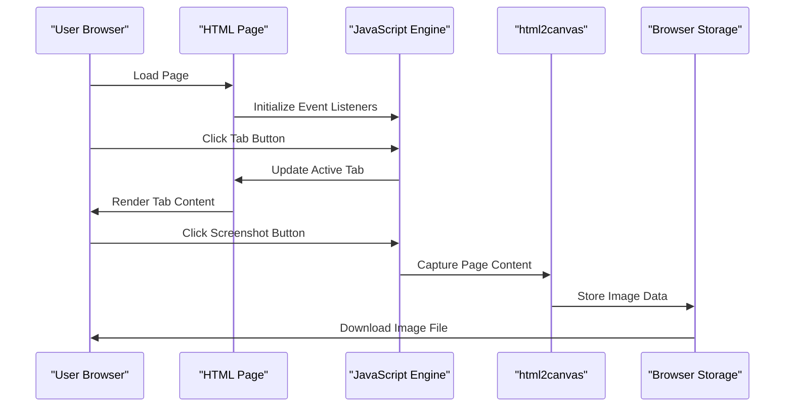
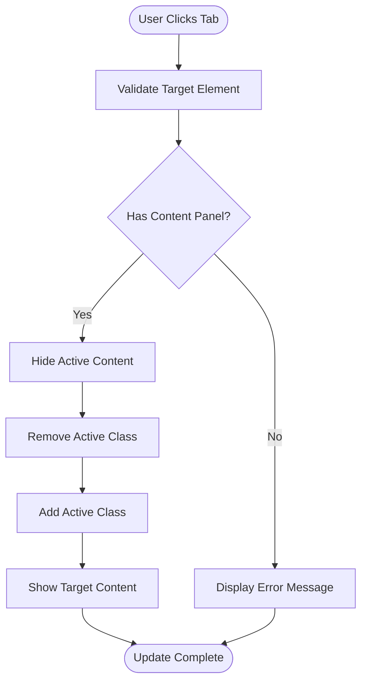
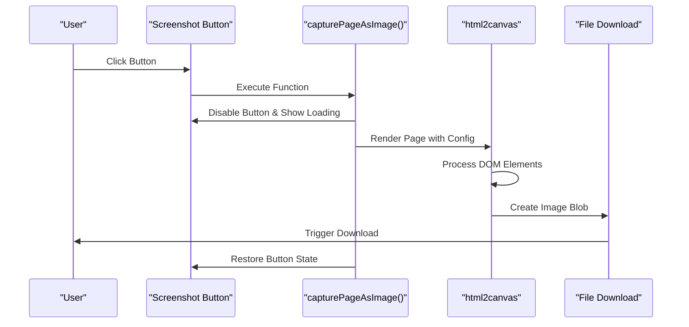
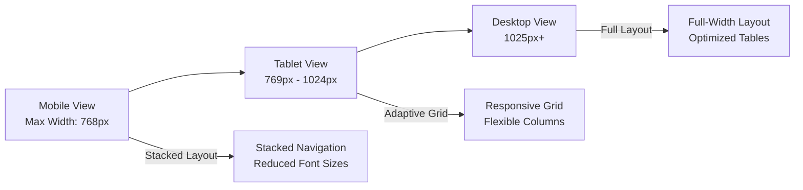
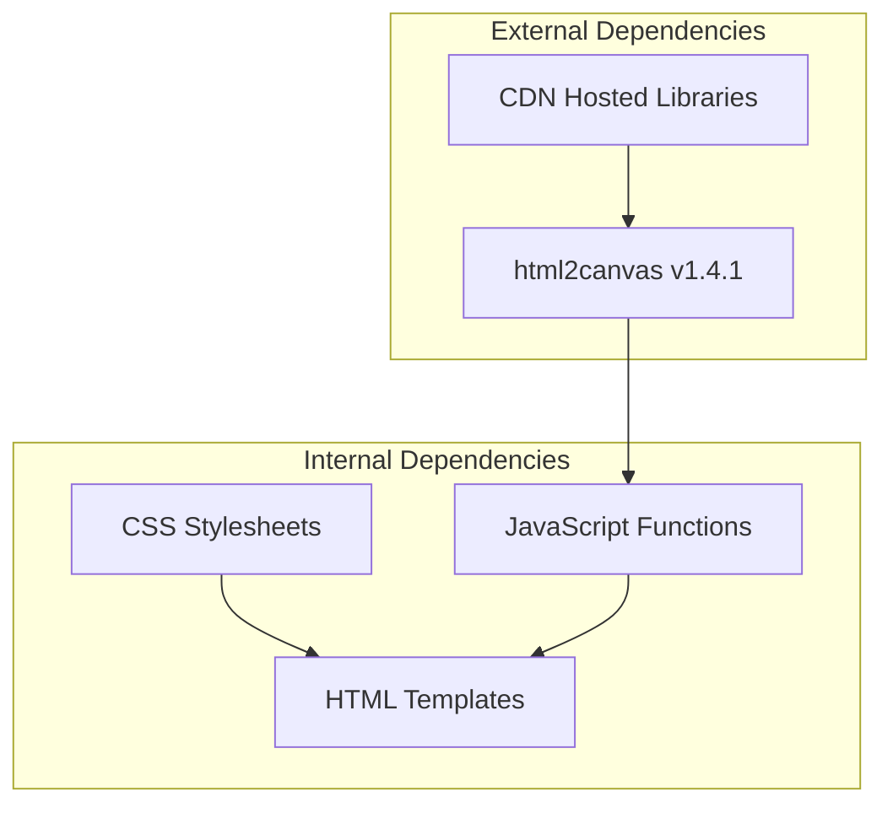

# Troubleshooting and FAQ

<cite>
**Referenced Files in This Document**
- [mori_complete_works.html](file://mori_complete_works.html)
- [mori_system_overview.html](file://mori_system_overview.html)
- [shiki/mori_system_overview.html](file://shiki/mori_system_overview.html)
- [shiki/shiki_system_architecture.html](file://shiki/shiki_system_architecture.html)
- [shiki/everything_becomes_f_runtime.html](file://shiki/everything_becomes_f_runtime.html)
</cite>

## Table of Contents
1. [Introduction](#introduction)
2. [Project Structure](#project-structure)
3. [Core Components](#core-components)
4. [Architecture Overview](#architecture-overview)
5. [Detailed Component Analysis](#detailed-component-analysis)
6. [Dependency Analysis](#dependency-analysis)
7. [Performance Considerations](#performance-considerations)
8. [Troubleshooting Guide](#troubleshooting-guide)
9. [Conclusion](#conclusion)
10. [Appendices](#appendices)

## Introduction
This document provides comprehensive troubleshooting and frequently asked questions for the Mori-universe project. It focuses on common issues encountered when using the interactive web applications that visualize Mori Hiroshi's literary works and their system architecture metaphors. The guide covers browser compatibility, performance optimization, responsive design, tab switching problems, screenshot functionality, cross-reference systems, and practical solutions for mobile devices, offline access, and content loading issues.

## Project Structure
The Mori-universe project consists of multiple standalone HTML pages, each serving a specific purpose:
- Complete Works Catalog: A comprehensive catalog of Mori Hiroshi's works with tabbed navigation and screenshot functionality
- System Overview: A thematic presentation of the universe's architecture with dark/light theme variants
- Series-Specific Pages: Specialized views for individual series and runtime logs
- Cross-referencing: Internal links between pages for seamless navigation

**Diagram sources**
- [mori_complete_works.html](file://mori_complete_works.html)
- [mori_system_overview.html](file://mori_system_overview.html)
- [shiki/mori_system_overview.html](file://shiki/mori_system_overview.html)
- [shiki/shiki_system_architecture.html](file://shiki/shiki_system_architecture.html)
- [shiki/everything_becomes_f_runtime.html](file://shiki/everything_becomes_f_runtime.html)

**Section sources**
- [mori_complete_works.html](file://mori_complete_works.html)
- [mori_system_overview.html](file://mori_system_overview.html)
- [shiki/mori_system_overview.html](file://shiki/mori_system_overview.html)

## Core Components
The project relies on several key components that require attention during troubleshooting:

### Tab Navigation System
The tab system provides interactive navigation between different content sections. Each tab button contains metadata including series identifiers and counts, enabling users to quickly locate specific content.

### Screenshot Functionality
All pages include a screenshot button that captures the current page content using html2canvas. This functionality requires proper CORS configuration and adequate memory allocation.

### Responsive Design
The pages implement responsive design patterns with media queries targeting different screen sizes, particularly optimized for mobile devices.

### Cross-Reference System
Internal linking between pages enables seamless navigation between related content, with consistent URL patterns and navigation semantics.

**Section sources**
- [mori_complete_works.html](file://mori_complete_works.html)
- [mori_system_overview.html](file://mori_system_overview.html)
- [shiki/mori_system_overview.html](file://shiki/mori_system_overview.html)

## Architecture Overview
The Mori-universe project follows a pure HTML/CSS/JavaScript architecture with minimal external dependencies. The system is designed around three primary interaction patterns:

**Diagram sources**
- [mori_system_overview.html](file://mori_system_overview.html)
- [shiki/mori_system_overview.html](file://shiki/mori_system_overview.html)

## Detailed Component Analysis

### Tab Switching Mechanism
The tab switching system operates through JavaScript event handlers that manage the active state of tab buttons and corresponding content panels.

**Diagram sources**
- [mori_system_overview.html](file://mori_system_overview.html)
- [shiki/mori_system_overview.html](file://shiki/mori_system_overview.html)

### Screenshot Capture Process
The screenshot functionality uses html2canvas to render the current page as an image, with specific configurations for different themes and environments.

**Diagram sources**
- [mori_system_overview.html](file://mori_system_overview.html)
- [shiki/mori_system_overview.html](file://shiki/mori_system_overview.html)

**Section sources**
- [mori_system_overview.html](file://mori_system_overview.html)
- [shiki/mori_system_overview.html](file://shiki/mori_system_overview.html)

### Responsive Layout System
The responsive design adapts to different screen sizes through media queries and flexible layout patterns.

**Diagram sources**
- [mori_complete_works.html](file://mori_complete_works.html)
- [mori_system_overview.html](file://mori_system_overview.html)

**Section sources**
- [mori_complete_works.html](file://mori_complete_works.html)
- [mori_system_overview.html](file://mori_system_overview.html)

## Dependency Analysis
The project maintains minimal external dependencies, relying primarily on CDN-hosted libraries for advanced functionality.

**Diagram sources**
- [mori_system_overview.html](file://mori_system_overview.html)
- [shiki/mori_system_overview.html](file://shiki/mori_system_overview.html)

**Section sources**
- [mori_system_overview.html](file://mori_system_overview.html)
- [shiki/mori_system_overview.html](file://shiki/mori_system_overview.html)

## Performance Considerations
The Mori-universe project employs several performance optimization strategies:

### Memory Management
- Efficient DOM manipulation through targeted element selection
- Minimal event listener overhead through delegation patterns
- Optimized CSS animations using hardware acceleration

### Rendering Performance
- CSS transforms for smooth animations instead of layout-affecting properties
- Media query optimization for responsive layouts
- Lazy loading patterns for large content tables

### Network Optimization
- CDN-hosted libraries for reduced latency
- Minimal external resources to reduce blocking requests
- Efficient image rendering with appropriate scaling factors

## Troubleshooting Guide

### Browser Compatibility Issues

#### Issue: Tab switching not working in older browsers
**Symptoms:** Clicking tab buttons has no effect
**Causes:** 
- Missing modern JavaScript features
- Unsupported CSS selectors
- Incompatible event handling APIs

**Solutions:**
1. Ensure modern browser support for ES6+ features
2. Verify CSS Flexbox compatibility
3. Check for console errors in developer tools
4. Test with latest versions of Chrome, Firefox, Safari, and Edge

#### Issue: Screenshot functionality fails in certain browsers
**Symptoms:** Screenshot button appears but download doesn't start
**Causes:**
- CORS restrictions blocking image rendering
- Insufficient memory for large page captures
- Browser security policies preventing downloads

**Solutions:**
1. Verify CORS headers for external resources
2. Reduce page complexity before capturing
3. Try different browsers or update current browser
4. Check browser console for specific error messages

#### Issue: Responsive design problems on mobile devices
**Symptoms:** Content overlaps, scroll issues, or touch interaction problems
**Causes:**
- Insufficient viewport meta tag configuration
- CSS media query conflicts
- Touch event handling issues

**Solutions:**
1. Ensure proper viewport meta tag: `<meta name="viewport" content="width=device-width, initial-scale=1.0">`
2. Test on multiple device sizes and orientations
3. Verify touch-friendly button sizing (minimum 44px)
4. Check for conflicting CSS properties affecting layout

### Performance Optimization Tips

#### Issue: Slow page loading with large datasets
**Symptoms:** Long load times, sluggish interactions
**Solutions:**
1. Implement virtual scrolling for large tables
2. Use pagination for extensive content lists
3. Optimize CSS delivery with critical path optimization
4. Minimize DOM depth for complex layouts

#### Issue: High memory usage during screenshot capture
**Symptoms:** Browser crashes or memory warnings
**Solutions:**
1. Reduce page complexity before capture
2. Use lower resolution scaling factors
3. Remove unnecessary elements from capture area
4. Implement timeout mechanisms for long operations

### Cross-Reference System Issues

#### Issue: Navigation between series not working
**Symptoms:** Links between series pages are broken
**Solutions:**
1. Verify file paths match actual project structure
2. Check relative path references for consistency
3. Ensure proper MIME type configuration for HTML files
4. Test navigation in different browsers

#### Issue: Color-coded identification system confusion
**Symptoms:** Difficulty distinguishing between series or states
**Solutions:**
1. Review color contrast ratios for accessibility compliance
2. Provide textual alternatives to color-only indicators
3. Implement hover tooltips for additional context
4. Consider adding legend or key for color meanings

### Mobile Device Compatibility

#### Issue: Touch interaction problems
**Symptoms:** Buttons not responding to touch, poor gesture handling
**Solutions:**
1. Ensure touch event listeners are properly configured
2. Test with different touch gestures (tap, hold, swipe)
3. Verify viewport settings for mobile devices
4. Check for CSS properties interfering with touch events

#### Issue: Print functionality issues
**Symptoms:** Printed content missing screenshots or formatting problems
**Solutions:**
1. Verify print-specific CSS rules are properly applied
2. Test print preview functionality
3. Ensure critical content is visible in print mode
4. Check for print-specific media query conflicts

### Offline Access Issues

#### Issue: Content not loading when offline
**Symptoms:** Blank pages or failed resource loading
**Solutions:**
1. Verify all resources are properly cached locally
2. Check for mixed content warnings in developer tools
3. Ensure HTTPS compliance for all resources
4. Implement service worker caching for improved offline support

### Content Loading Problems

#### Issue: Large tables not displaying properly
**Symptoms:** Horizontal scrolling issues, truncated content
**Solutions:**
1. Implement responsive table designs with horizontal scrolling
2. Use CSS overflow properties for controlled scrolling
3. Consider data pagination for extremely large datasets
4. Optimize table rendering performance

#### Issue: Animation performance issues
**Symptoms:** Choppy transitions, delayed interactions
**Solutions:**
1. Use CSS transforms instead of layout-affecting properties
2. Implement requestAnimationFrame for smooth animations
3. Reduce animation complexity on mobile devices
4. Consider prefers-reduced-motion media queries

### Frequently Asked Questions

#### Q: Why does the screenshot button sometimes fail?
**A:** The screenshot functionality depends on html2canvas library and may fail due to:
- CORS restrictions on external resources
- Insufficient memory for large page captures
- Browser security policies preventing downloads
- Complex CSS effects interfering with rendering

#### Q: How do I navigate between different series efficiently?
**A:** Use the tab navigation system at the top of each page. Each tab represents a different series with its own content and metadata. The navigation is designed to be intuitive and responsive across devices.

#### Q: What do the colored indicators mean?
**A:** The color-coded system represents different series and phases:
- Series colors indicate different literary works
- Phase colors represent different stages in the system evolution
- Hover states provide additional context and interaction feedback

#### Q: Can I access this offline?
**A:** Yes, since all files are static HTML with embedded CSS and JavaScript, you can save the entire project locally and access it offline. However, some advanced features may require network connectivity for optimal performance.

#### Q: Why does the layout change on mobile devices?
**A:** The responsive design automatically adapts to different screen sizes. On mobile devices, content is reorganized for better touch interaction and readability, with simplified navigation and adjusted typography.

#### Q: How do I report bugs or issues?
**A:** Check the browser console for error messages, verify your browser version, and test in different browsers. If issues persist, review the troubleshooting sections above or contact the project maintainer with detailed information about your environment and the specific problem encountered.

**Section sources**
- [mori_complete_works.html](file://mori_complete_works.html)
- [mori_system_overview.html](file://mori_system_overview.html)
- [shiki/mori_system_overview.html](file://shiki/mori_system_overview.html)
- [shiki/shiki_system_architecture.html](file://shiki/shiki_system_architecture.html)
- [shiki/everything_becomes_f_runtime.html](file://shiki/everything_becomes_f_runtime.html)

## Conclusion
The Mori-universe project demonstrates a sophisticated approach to presenting complex literary and architectural concepts through interactive web technologies. While the pure HTML/CSS/JavaScript architecture provides excellent portability and performance, it requires careful attention to browser compatibility, responsive design, and performance optimization.

Key troubleshooting areas include:
- Ensuring modern browser support for all interactive features
- Managing external dependencies and CORS configurations
- Optimizing performance for large datasets and complex layouts
- Maintaining responsive design across all device types
- Providing fallbacks for advanced features when unsupported

By following the guidelines and solutions outlined in this document, users can effectively troubleshoot common issues and maintain optimal performance across different environments and devices.

## Appendices

### Best Practices for Maintenance
- Regular browser testing across supported platforms
- Performance monitoring for large content loads
- Accessibility compliance verification
- Security audit of external dependencies
- Progressive enhancement for graceful degradation

### Quick Reference Checklist
- [ ] Verify browser compatibility before deployment
- [ ] Test responsive design on multiple devices
- [ ] Monitor performance metrics regularly
- [ ] Validate accessibility compliance
- [ ] Check CORS configurations for external resources
- [ ] Test offline functionality when applicable